# Arquitetura Macro: Back-Office Multi-Tenant da Holding v2.0

**Documento ID:** ARCH-MACRO-v2.0  
**Sistema:** Back-Office Multi-Tenant da Holding  
**Data de Criação:** 2025-12-16  
**Última Atualização:** 2025-12-16  
**Metodologia:** Modular Domain Layered Architecture  
**Status:** Draft  

---

## Índice

1. [Visão Geral](#visão-geral)
2. [Princípios Fundamentais](#princípios-fundamentais)
3. [Metodologia Arquitetural](#metodologia-arquitetural)
4. [C4 Model - Context Level](#c4-model---context-level)
5. [C4 Model - Container Level](#c4-model---container-level)
6. [Catálogo de Serviços](#catálogo-de-serviços)
7. [Modelo de Dados](#modelo-de-dados)
8. [Comunicação entre Serviços](#comunicação-entre-serviços)
9. [Fluxos de Dados Principais](#fluxos-de-dados-principais)
10. [Segurança e Multi-Tenancy](#segurança-e-multi-tenancy)
11. [Padrões e Guidelines](#padrões-e-guidelines)
12. [Checklist de Conformidade](#checklist-de-conformidade)
13. [Índice de Documentos Micro](#índice-de-documentos-micro)

---

## Visão Geral

### Propósito do Sistema

O **Back-Office Multi-Tenant da Holding** é uma plataforma centralizada que permite ao dono de uma holding gerenciar múltiplas empresas através de um único painel administrativo. O sistema resolve o problema de fragmentação operacional onde cada empresa operaria com sistemas separados, bancos de dados isolados e processos desconexos.

A arquitetura é composta por **6 serviços especializados** que trabalham em conjunto para entregar:

- **Gestão centralizada** de múltiplas empresas (tenants)
- **Qualificação automatizada de leads** por IAs (Centurions) - SDR 100% IA
- **Comunicação multi-canal** (WhatsApp, Instagram, Telegram)
- **Contratos digitais** com assinatura eletrônica
- **Tracking de marketing** com eventos de conversão
- **Visão consolidada** de métricas de toda a holding

### Stakeholders Principais

| Stakeholder | Papel | Sistema que Usa |
|-------------|-------|-----------------|
| **Dono da Holding** | Administrador estratégico | Backoffice Web |
| **Centurions (IAs)** | Qualificação automatizada | Agent Runtime |
| **Time de Vendas** | Fechamento de negócios | Front Operacional (externo) |
| **Sistemas Externos** | WhatsApp, Autentique, Facebook | Integrações |

---

## Princípios Fundamentais

### SDR é 100% IA

> 🤖 **Princípio Core**: Todo o processo de qualificação de leads é feito por IAs (Centurions). **Não existem SDRs humanos no sistema.**

**Roles que NÃO existem:**
- ~~`sdr_operator`~~ - SDR é feito por IAs
- ~~`sdr_manager`~~ - SDR é feito por IAs

**Roles que existem para supervisão:**
- `ai_supervisor` - Monitora e ajusta configurações de Centurions
- `backoffice_admin` - Acesso total ao back-office
- `super_admin` - Dono da holding com visão global

### Leads SEMPRE Nascem no CORE

> 📍 **Todos os leads vivem em `core.leads`**. Leads NUNCA são criados diretamente em schemas de empresa.

```
Captação (WhatsApp/Pixel) → core.leads (CORE)
    → Qualificação por IA (Centurion)
    → Handoff (core.lead_handoffs)
    → <empresa>.deals (schema da empresa)
```

### Isolamento Multi-Tenant

> 🔒 Cada empresa enxerga **apenas** seus dados via políticas de RLS (Row Level Security).

- Banco de dados único com múltiplos schemas
- `company_id` obrigatório em todas as tabelas operacionais
- JWT Claims com `company_id` e `role` para controle de acesso

---

## Metodologia Arquitetural

Este sistema segue a **Modular Domain Layered Architecture** combinada com uma **arquitetura de microserviços distribuídos**.

### Organização de Alto Nível

```
┌─────────────────────────────────────────────────────────────────────┐
│                        CAMADA DE APRESENTAÇÃO                        │
│  ┌─────────────────────────────────────────────────────────────┐    │
│  │              Backoffice Web (Next.js + React)               │    │
│  └─────────────────────────────────────────────────────────────┘    │
└─────────────────────────────────────────────────────────────────────┘
                                    │
                                    ▼
┌─────────────────────────────────────────────────────────────────────┐
│                        CAMADA DE ORQUESTRAÇÃO                        │
│  ┌─────────────────────┐  ┌─────────────────────┐                   │
│  │   Backoffice API    │  │  Evolution Manager  │                   │
│  │     (Nest.js)       │  │     (Nest.js)       │                   │
│  └─────────────────────┘  └─────────────────────┘                   │
│  ┌─────────────────────┐  ┌─────────────────────┐                   │
│  │ Autentique Service  │  │  Facebook CAPI     │                   │
│  │     (Nest.js)       │  │    (Nest.js)       │                   │
│  └─────────────────────┘  └─────────────────────┘                   │
└─────────────────────────────────────────────────────────────────────┘
                                    │
                                    ▼
┌─────────────────────────────────────────────────────────────────────┐
│                    CAMADA DE PROCESSAMENTO IA                        │
│  ┌─────────────────────────────────────────────────────────────┐    │
│  │           Agent Runtime (Agno Framework + Python)            │    │
│  │        Motor de Orquestração de IAs (Centurions)            │    │
│  └─────────────────────────────────────────────────────────────┘    │
└─────────────────────────────────────────────────────────────────────┘
                                    │
                                    ▼
┌─────────────────────────────────────────────────────────────────────┐
│                        CAMADA DE DADOS                               │
│  ┌─────────────────────┐  ┌─────────────────────┐                   │
│  │  PostgreSQL (Supa)  │  │       Redis         │                   │
│  │   Multi-Schema      │  │   Cache/Sessions    │                   │
│  └─────────────────────┘  └─────────────────────┘                   │
└─────────────────────────────────────────────────────────────────────┘
```

### Princípios Aplicados

- ✅ **SOLID Principles** em todos os módulos
- ✅ **Clean Architecture** (dependências para o centro)
- ✅ **Domain-Driven Design** (bounded contexts isolados)
- ✅ **Separation of Concerns** (serviços especializados)
- ✅ **Dependency Inversion** (interfaces/ports)
- ✅ **Event-Driven Architecture** (comunicação assíncrona)

### Stack Tecnológico

| Componente | Tecnologia | Justificativa |
|------------|------------|---------------|
| **Backoffice Web** | Next.js 14 + React 18 | SSR, App Router, performance |
| **Backoffice API** | Nest.js + TypeScript | Enterprise patterns, DI nativo |
| **Agent Runtime** | Python + Agno Framework | Orquestração de IA, async |
| **Evolution Manager** | Nest.js + TypeScript | Consistência com outros serviços |
| **Autentique Service** | Nest.js + TypeScript | Consistência com outros serviços |
| **Facebook CAPI** | Nest.js + TypeScript | Consistência com outros serviços |
| **Banco de Dados** | PostgreSQL (Supabase) | RLS nativo, Auth integrado |
| **Cache/Sessions** | Redis | Memória de conversas, pub/sub |
| **Message Broker** | Redis Pub/Sub | Comunicação entre serviços |

---

## C4 Model - Context Level

### Diagrama de Contexto

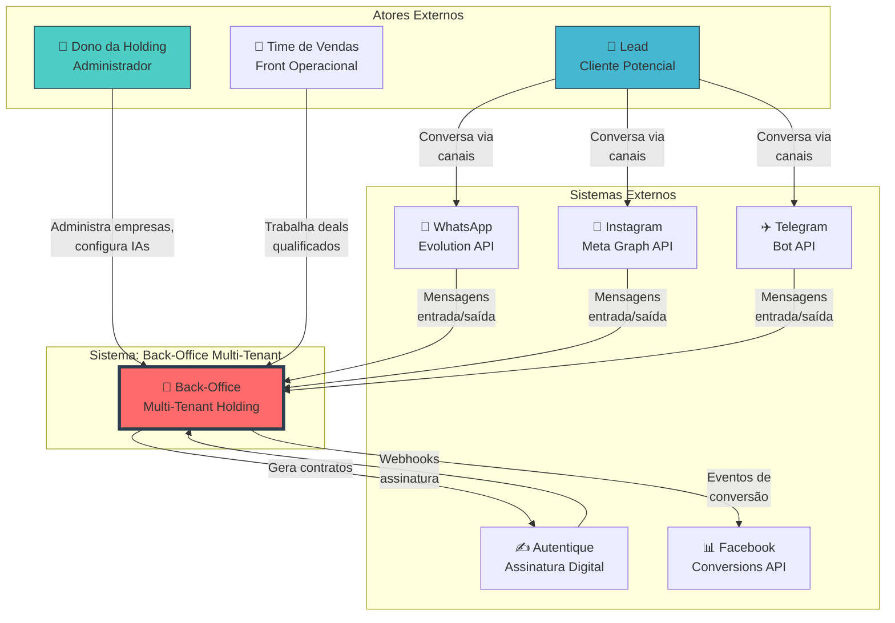

### Descrição das Interações

| Ator/Sistema | Direção | Descrição |
|--------------|---------|-----------|
| **Dono da Holding** | → Sistema | Cria empresas, configura Centurions, monitora métricas |
| **Lead** | → WhatsApp/IG/TG | Inicia conversas, responde qualificação |
| **WhatsApp** | ↔ Sistema | Recebe/envia mensagens via Evolution API |
| **Instagram** | ↔ Sistema | Recebe/envia DMs via Meta Graph API |
| **Telegram** | ↔ Sistema | Recebe/envia mensagens via Bot API |
| **Autentique** | ↔ Sistema | Gera contratos, notifica assinaturas |
| **Facebook CAPI** | ← Sistema | Recebe eventos de conversão |
| **Time de Vendas** | → Sistema | Acessa deals via Front Operacional |

---

## C4 Model - Container Level

### Diagrama de Containers

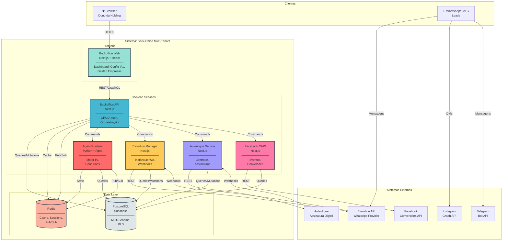

### Responsabilidades por Container

| Container | Responsabilidade | Porta | Protocolo |
|-----------|------------------|-------|-----------|
| **Backoffice Web** | UI administrativa | 3000 | HTTPS |
| **Backoffice API** | CRUD, Auth, Orquestração | 4000 | REST/GraphQL |
| **Agent Runtime** | Motor IA, Centurions | 5000 | gRPC/REST |
| **Evolution Manager** | Instâncias WhatsApp | 4001 | REST/Webhooks |
| **Autentique Service** | Contratos digitais | 4002 | REST/Webhooks |
| **Facebook CAPI** | Eventos de conversão | 4003 | REST |
| **PostgreSQL** | Persistência | 5432 | TCP |
| **Redis** | Cache, Pub/Sub | 6379 | TCP |

---

## Catálogo de Serviços

### SVC-001: Backoffice Web

**Bounded Context:** Interface Administrativa

**Responsabilidade (SRP):**  
Fornecer interface web para o dono da holding administrar empresas, configurar Centurions, monitorar métricas e gerenciar todo o ecossistema multi-tenant.

**Tecnologia:** Next.js 14 + React 18 + TypeScript + TailwindCSS + ShadcnUI

#### Estrutura Interna

```
backoffice-web/
├── src/
│   ├── app/                      # App Router (Next.js 14)
│   │   ├── (auth)/              # Rotas de autenticação
│   │   │   ├── login/
│   │   │   └── forgot-password/
│   │   ├── (dashboard)/         # Rotas protegidas
│   │   │   ├── empresas/
│   │   │   ├── centurions/
│   │   │   ├── instancias/
│   │   │   ├── contratos/
│   │   │   ├── marketing/
│   │   │   └── metricas/
│   │   ├── api/                 # API Routes (BFF)
│   │   └── layout.tsx
│   │
│   ├── modules/                  # Feature Modules
│   │   ├── empresas/
│   │   │   ├── components/
│   │   │   ├── hooks/
│   │   │   ├── services/
│   │   │   └── types/
│   │   ├── centurions/
│   │   ├── instancias/
│   │   ├── contratos/
│   │   └── marketing/
│   │
│   ├── lib/                      # Shared Libraries
│   │   ├── api/                 # API client (fetch/axios)
│   │   ├── auth/                # Auth utilities
│   │   ├── supabase/            # Supabase client
│   │   └── utils/
│   │
│   └── components/               # Shared UI Components
│       ├── ui/                  # ShadcnUI components
│       ├── layout/
│       └── forms/
│
├── public/
└── package.json
```

#### Diagrama de Módulos Frontend

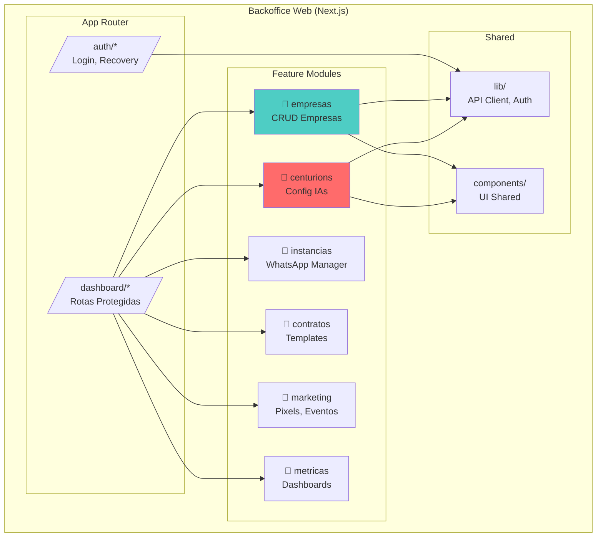

#### Capacidades

| Capacidade | Descrição | Endpoint Backend |
|------------|-----------|------------------|
| Gestão de Empresas | CRUD de empresas/tenants | `POST/GET/PATCH /api/companies` |
| Config Centurions | Configurar IAs de qualificação | `POST/GET/PATCH /api/centurions` |
| Instâncias WhatsApp | Conectar/desconectar números | `POST/GET /api/instances` |
| Templates Contrato | Gerenciar templates | `POST/GET /api/contracts/templates` |
| Pixels Marketing | Configurar FB/Google Pixel | `POST/GET /api/pixels` |
| Dashboard Métricas | Visualizar KPIs | `GET /api/metrics/*` |

---

### SVC-002: Backoffice API

**Bounded Context:** Orquestração & CRUD Backend

**Responsabilidade (SRP):**  
Servir como API principal para o frontend, orquestrar chamadas entre serviços, gerenciar autenticação/autorização e executar operações CRUD no banco de dados.

**Tecnologia:** Nest.js + TypeScript + Prisma/Supabase Client

#### Estrutura Interna

```
backoffice-api/
├── src/
│   ├── common/                   # Cross-Cutting Concerns
│   │   ├── decorators/
│   │   ├── filters/
│   │   ├── guards/
│   │   │   ├── jwt-auth.guard.ts
│   │   │   └── roles.guard.ts
│   │   ├── interceptors/
│   │   ├── middleware/
│   │   └── pipes/
│   │
│   ├── config/                   # Configuration
│   │   ├── database.config.ts
│   │   ├── redis.config.ts
│   │   └── supabase.config.ts
│   │
│   ├── modules/                  # Feature Modules
│   │   ├── auth/
│   │   │   ├── controllers/
│   │   │   ├── services/
│   │   │   ├── strategies/
│   │   │   ├── guards/
│   │   │   └── dto/
│   │   │
│   │   ├── companies/
│   │   │   ├── controllers/
│   │   │   │   └── companies.controller.ts
│   │   │   ├── services/
│   │   │   │   └── companies.service.ts
│   │   │   ├── repository/
│   │   │   │   └── companies.repository.ts
│   │   │   ├── domain/
│   │   │   │   └── company.entity.ts
│   │   │   ├── dto/
│   │   │   │   ├── create-company.dto.ts
│   │   │   │   └── update-company.dto.ts
│   │   │   └── interfaces/
│   │   │       └── company.repository.interface.ts
│   │   │
│   │   ├── centurions/
│   │   │   ├── controllers/
│   │   │   ├── services/
│   │   │   ├── repository/
│   │   │   ├── domain/
│   │   │   ├── dto/
│   │   │   └── interfaces/
│   │   │
│   │   ├── leads/
│   │   │   ├── controllers/
│   │   │   ├── services/
│   │   │   ├── repository/
│   │   │   ├── domain/
│   │   │   ├── events/
│   │   │   ├── dto/
│   │   │   └── interfaces/
│   │   │
│   │   ├── instances/
│   │   │   ├── controllers/
│   │   │   ├── services/
│   │   │   └── dto/
│   │   │
│   │   ├── contracts/
│   │   │   ├── controllers/
│   │   │   ├── services/
│   │   │   └── dto/
│   │   │
│   │   ├── marketing/
│   │   │   ├── controllers/
│   │   │   ├── services/
│   │   │   └── dto/
│   │   │
│   │   └── metrics/
│   │       ├── controllers/
│   │       ├── services/
│   │       └── dto/
│   │
│   ├── infrastructure/           # External Integrations
│   │   ├── supabase/
│   │   │   ├── supabase.module.ts
│   │   │   └── supabase.service.ts
│   │   ├── redis/
│   │   │   ├── redis.module.ts
│   │   │   └── redis.service.ts
│   │   └── messaging/
│   │       └── event-bus.service.ts
│   │
│   ├── app.module.ts
│   └── main.ts
│
├── prisma/                       # Se usar Prisma
│   └── schema.prisma
│
└── package.json
```

#### Diagrama de Camadas

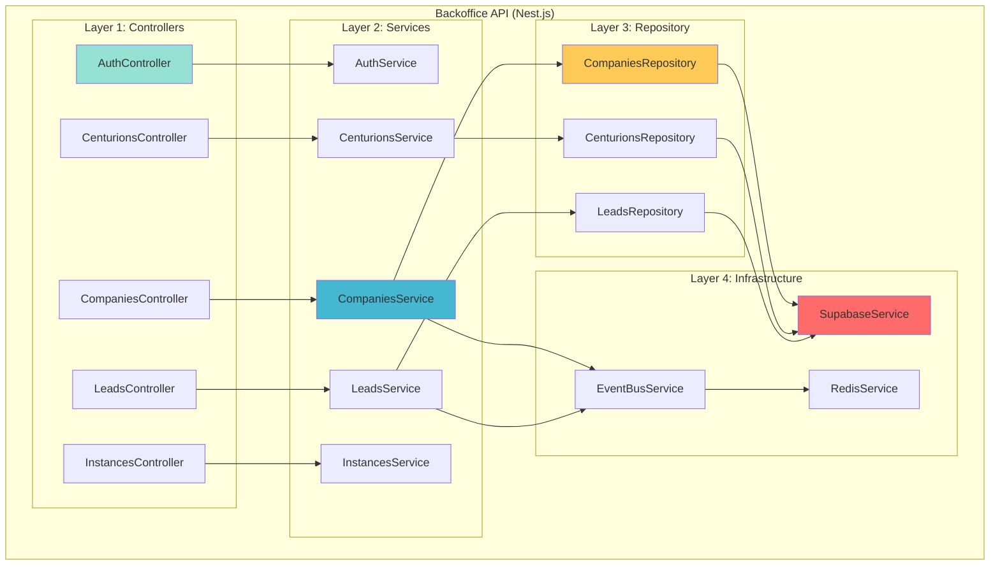

#### Endpoints Principais

| Módulo | Método | Endpoint | Descrição |
|--------|--------|----------|-----------|
| **Auth** | POST | `/auth/login` | Login com JWT |
| **Auth** | POST | `/auth/refresh` | Refresh token |
| **Companies** | GET | `/companies` | Listar empresas |
| **Companies** | POST | `/companies` | Criar empresa |
| **Companies** | GET | `/companies/:id` | Detalhes empresa |
| **Companies** | PATCH | `/companies/:id` | Atualizar empresa |
| **Centurions** | GET | `/centurions` | Listar Centurions |
| **Centurions** | POST | `/centurions` | Criar Centurion |
| **Centurions** | PATCH | `/centurions/:id` | Atualizar config |
| **Leads** | GET | `/leads` | Listar leads |
| **Leads** | GET | `/leads/:id` | Detalhes lead |
| **Instances** | GET | `/instances` | Listar instâncias |
| **Instances** | POST | `/instances/:id/connect` | Conectar WhatsApp |
| **Instances** | POST | `/instances/:id/disconnect` | Desconectar |

---

### SVC-003: Agent Runtime

**Bounded Context:** Motor de Orquestração de IA

**Responsabilidade (SRP):**  
Executar e orquestrar os Centurions (IAs de qualificação), processando mensagens, gerenciando memória de conversas, executando tools/MCP e determinando qualificação de leads.

**Tecnologia:** Python + Agno Framework + Redis + FastAPI

#### Estrutura Interna

```
agent-runtime/
├── src/
│   ├── common/                   # Cross-Cutting
│   │   ├── config/
│   │   │   ├── settings.py
│   │   │   └── logging.py
│   │   ├── infrastructure/
│   │   │   ├── database/
│   │   │   │   └── supabase_client.py
│   │   │   ├── cache/
│   │   │   │   └── redis_client.py
│   │   │   └── messaging/
│   │   │       └── pubsub.py
│   │   └── utils/
│   │
│   ├── modules/                  # Feature Modules
│   │   ├── centurion/
│   │   │   ├── handlers/
│   │   │   │   ├── message_handler.py
│   │   │   │   └── webhook_handler.py
│   │   │   ├── services/
│   │   │   │   ├── centurion_service.py
│   │   │   │   ├── conversation_service.py
│   │   │   │   └── qualification_service.py
│   │   │   ├── domain/
│   │   │   │   ├── centurion.py
│   │   │   │   ├── conversation.py
│   │   │   │   ├── message.py
│   │   │   │   └── qualification.py
│   │   │   ├── repository/
│   │   │   │   ├── centurion_repository.py
│   │   │   │   ├── conversation_repository.py
│   │   │   │   └── message_repository.py
│   │   │   └── dto/
│   │   │
│   │   ├── memory/
│   │   │   ├── services/
│   │   │   │   ├── short_term_memory.py
│   │   │   │   ├── long_term_memory.py
│   │   │   │   └── graph_memory.py
│   │   │   ├── adapters/
│   │   │   │   ├── rag_adapter.py
│   │   │   │   └── graph_adapter.py
│   │   │   └── interfaces/
│   │   │
│   │   ├── tools/
│   │   │   ├── services/
│   │   │   │   ├── tool_executor.py
│   │   │   │   └── mcp_client.py
│   │   │   ├── domain/
│   │   │   │   └── tool.py
│   │   │   └── adapters/
│   │   │       ├── calendar_tool.py
│   │   │       ├── crm_tool.py
│   │   │       └── search_tool.py
│   │   │
│   │   ├── channels/
│   │   │   ├── adapters/
│   │   │   │   ├── whatsapp_adapter.py
│   │   │   │   ├── instagram_adapter.py
│   │   │   │   └── telegram_adapter.py
│   │   │   └── interfaces/
│   │   │       └── channel_interface.py
│   │   │
│   │   └── handoff/
│   │       ├── services/
│   │       │   └── handoff_service.py
│   │       └── events/
│   │           └── lead_qualified_event.py
│   │
│   ├── api/                      # FastAPI Routes
│   │   ├── routes/
│   │   │   ├── health.py
│   │   │   ├── webhooks.py
│   │   │   └── centurions.py
│   │   └── dependencies.py
│   │
│   └── main.py
│
├── agents/                       # Agno Agent Definitions
│   ├── base_centurion.py
│   ├── qualifier_agent.py
│   └── prompts/
│       └── qualification_prompt.py
│
├── tests/
├── requirements.txt
└── Dockerfile
```

#### Diagrama de Fluxo do Agent

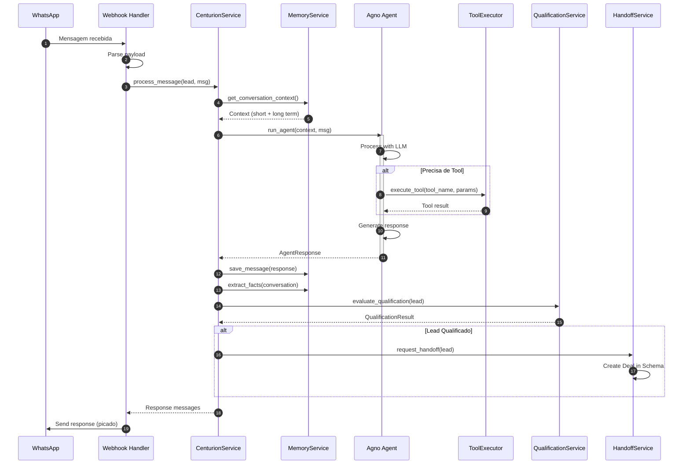

#### Capacidades do Centurion

| Capacidade | Descrição | Implementação |
|------------|-----------|---------------|
| **Processamento Multi-Modal** | Texto, áudio (STT), imagem (vision) | `channels/adapters/*` |
| **Memória Curta** | Histórico da conversa atual | `memory/short_term_memory.py` |
| **Memória Longa (RAG)** | Fatos sobre o lead | `memory/long_term_memory.py` |
| **Memória de Grafo** | Relacionamentos estruturados | `memory/graph_memory.py` |
| **Tools/MCP** | Ferramentas externas configuráveis | `tools/services/*` |
| **Qualificação** | Score e critérios configuráveis | `centurion/services/qualification_service.py` |
| **Mensagens Picadas** | Humanização da resposta | `centurion/services/centurion_service.py` |
| **Debounce** | Aguarda lead terminar de digitar | `centurion/handlers/message_handler.py` |
| **Follow-up** | Mensagens proativas agendadas | `handoff/services/handoff_service.py` |

---

### SVC-004: Evolution Manager

**Bounded Context:** Gerenciamento de Instâncias WhatsApp

**Responsabilidade (SRP):**  
Gerenciar o ciclo de vida de instâncias WhatsApp (Evolution API), processando webhooks de mensagens, status de conexão e QR codes.

**Tecnologia:** Nest.js + TypeScript

#### Estrutura Interna

```
evolution-manager/
├── src/
│   ├── common/
│   │   ├── guards/
│   │   ├── interceptors/
│   │   └── filters/
│   │
│   ├── config/
│   │
│   ├── modules/
│   │   ├── instances/
│   │   │   ├── controllers/
│   │   │   │   ├── instances.controller.ts
│   │   │   │   └── webhooks.controller.ts
│   │   │   ├── services/
│   │   │   │   ├── instances.service.ts
│   │   │   │   └── webhook-processor.service.ts
│   │   │   ├── repository/
│   │   │   │   └── instances.repository.ts
│   │   │   ├── domain/
│   │   │   │   └── instance.entity.ts
│   │   │   ├── dto/
│   │   │   │   ├── create-instance.dto.ts
│   │   │   │   └── webhook-payload.dto.ts
│   │   │   └── events/
│   │   │       ├── message-received.event.ts
│   │   │       └── instance-status.event.ts
│   │   │
│   │   └── messages/
│   │       ├── controllers/
│   │       │   └── messages.controller.ts
│   │       ├── services/
│   │       │   └── messages.service.ts
│   │       └── dto/
│   │
│   ├── infrastructure/
│   │   ├── evolution/
│   │   │   ├── evolution.module.ts
│   │   │   └── evolution.client.ts
│   │   ├── supabase/
│   │   └── redis/
│   │
│   ├── app.module.ts
│   └── main.ts
│
└── package.json
```

#### Diagrama de Fluxo

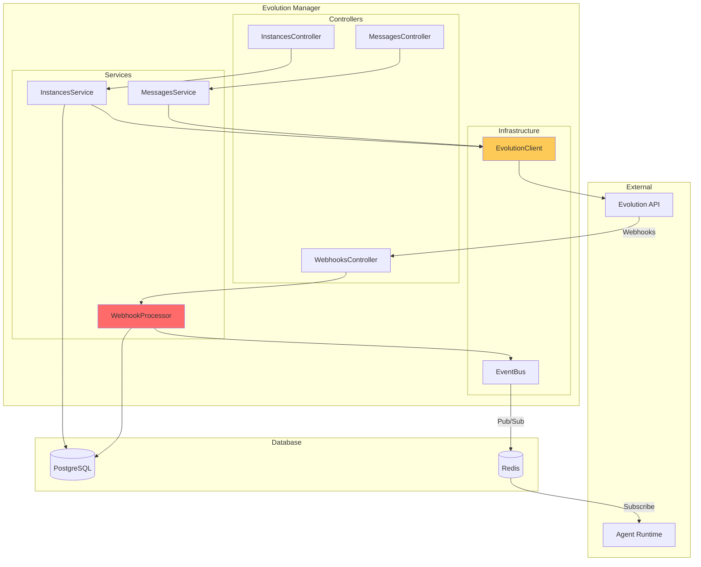

#### Webhooks Processados

| Webhook | Descrição | Ação |
|---------|-----------|------|
| `message.received` | Nova mensagem | Publica para Agent Runtime |
| `instance.connected` | Instância conectou | Atualiza status |
| `instance.disconnected` | Instância desconectou | Atualiza status, notifica |
| `qrcode.ready` | QR code disponível | Armazena para UI |
| `message.sent` | Confirmação envio | Atualiza status mensagem |

---

### SVC-005: Autentique Service

**Bounded Context:** Contratos Digitais & Assinatura Eletrônica

**Responsabilidade (SRP):**  
Gerenciar integração com Autentique para geração de contratos digitais, envio para assinatura e processamento de webhooks de status.

**Tecnologia:** Nest.js + TypeScript

#### Estrutura Interna

```
autentique-service/
├── src/
│   ├── common/
│   │
│   ├── config/
│   │
│   ├── modules/
│   │   ├── contracts/
│   │   │   ├── controllers/
│   │   │   │   ├── contracts.controller.ts
│   │   │   │   └── webhooks.controller.ts
│   │   │   ├── services/
│   │   │   │   ├── contracts.service.ts
│   │   │   │   ├── template.service.ts
│   │   │   │   └── webhook-processor.service.ts
│   │   │   ├── repository/
│   │   │   │   ├── contracts.repository.ts
│   │   │   │   └── templates.repository.ts
│   │   │   ├── domain/
│   │   │   │   ├── contract.entity.ts
│   │   │   │   └── template.entity.ts
│   │   │   ├── dto/
│   │   │   └── events/
│   │   │       ├── contract-created.event.ts
│   │   │       └── contract-signed.event.ts
│   │   │
│   │   └── signers/
│   │       ├── services/
│   │       │   └── signers.service.ts
│   │       └── dto/
│   │
│   ├── infrastructure/
│   │   ├── autentique/
│   │   │   ├── autentique.module.ts
│   │   │   └── autentique.client.ts
│   │   ├── supabase/
│   │   └── redis/
│   │
│   └── main.ts
│
└── package.json
```

#### Diagrama de Fluxo

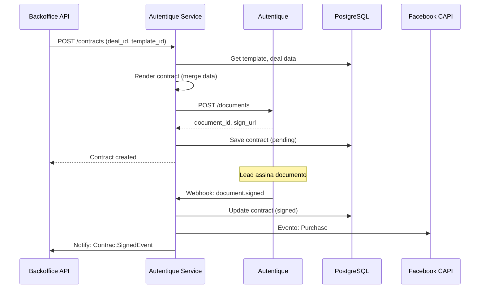

#### Operações

| Operação | Método | Endpoint | Descrição |
|----------|--------|----------|-----------|
| Criar contrato | POST | `/contracts` | Gera e envia para assinatura |
| Listar contratos | GET | `/contracts` | Lista por empresa/deal |
| Detalhes | GET | `/contracts/:id` | Status e URLs |
| Cancelar | POST | `/contracts/:id/cancel` | Cancela documento |
| Webhook | POST | `/webhooks/autentique` | Recebe eventos |

---

### SVC-006: Facebook CAPI Service

**Bounded Context:** Marketing & Tracking de Conversões

**Responsabilidade (SRP):**  
Enviar eventos de conversão para a Conversions API do Facebook, gerenciar configurações de pixels e processar fila de eventos.

**Tecnologia:** Nest.js + TypeScript

#### Estrutura Interna

```
facebook-capi/
├── src/
│   ├── common/
│   │
│   ├── config/
│   │
│   ├── modules/
│   │   ├── events/
│   │   │   ├── controllers/
│   │   │   │   └── events.controller.ts
│   │   │   ├── services/
│   │   │   │   ├── events.service.ts
│   │   │   │   └── queue-processor.service.ts
│   │   │   ├── repository/
│   │   │   │   └── events.repository.ts
│   │   │   ├── domain/
│   │   │   │   └── conversion-event.entity.ts
│   │   │   └── dto/
│   │   │       ├── lead-event.dto.ts
│   │   │       ├── purchase-event.dto.ts
│   │   │       └── custom-event.dto.ts
│   │   │
│   │   └── pixels/
│   │       ├── controllers/
│   │       │   └── pixels.controller.ts
│   │       ├── services/
│   │       │   └── pixels.service.ts
│   │       ├── repository/
│   │       │   └── pixels.repository.ts
│   │       └── dto/
│   │
│   ├── infrastructure/
│   │   ├── facebook/
│   │   │   ├── facebook.module.ts
│   │   │   └── facebook.client.ts
│   │   ├── supabase/
│   │   └── redis/
│   │       └── queue.service.ts
│   │
│   └── main.ts
│
└── package.json
```

#### Diagrama de Fluxo

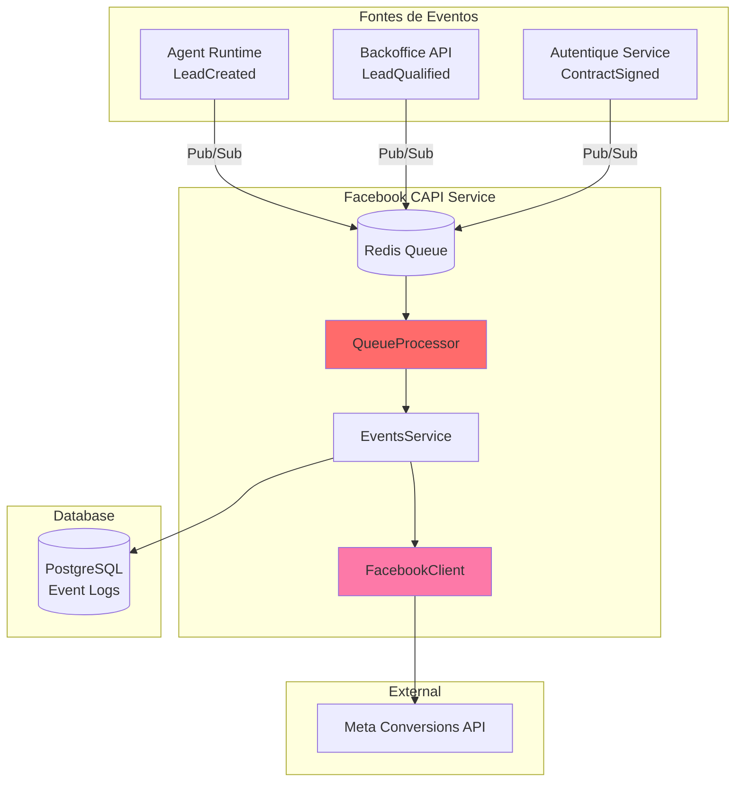

#### Eventos Suportados

| Evento | Trigger | Dados |
|--------|---------|-------|
| `Lead` | Lead criado | email_hash, phone_hash, utm_* |
| `CompleteRegistration` | Lead qualificado | user_data, custom_data |
| `Purchase` | Contrato assinado | value, currency, content_ids |
| `ViewContent` | Página visitada | content_name, content_category |
| `Custom` | Configurável | custom_data |

---

## Modelo de Dados

### Visão Geral dos Schemas

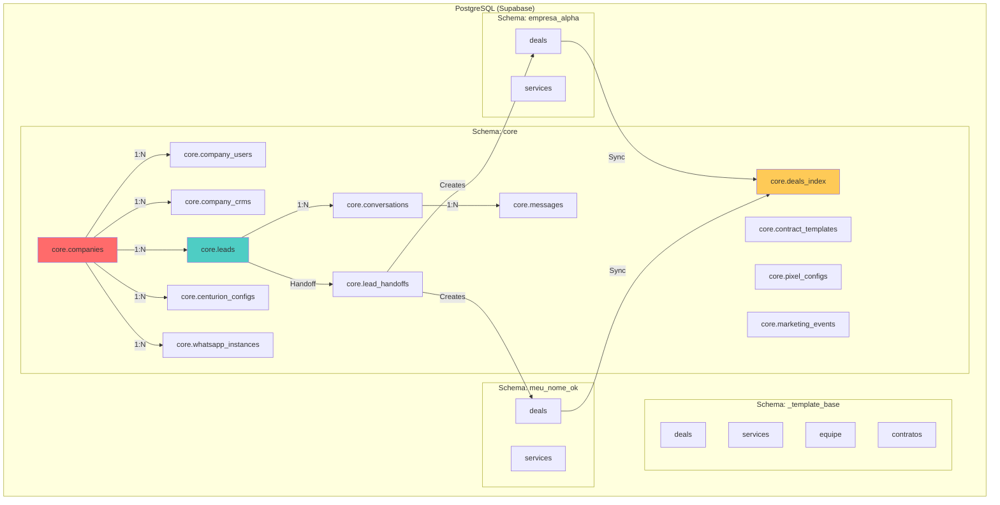

### Tabelas Principais do CORE

#### `core.companies`

```sql
CREATE TABLE core.companies (
  id uuid PRIMARY KEY DEFAULT gen_random_uuid(),
  name text NOT NULL,
  slug text UNIQUE NOT NULL,
  document text,  -- CNPJ/CPF
  status text NOT NULL DEFAULT 'active',  -- active, suspended, archived
  owner_user_id uuid REFERENCES auth.users(id),
  settings jsonb NOT NULL DEFAULT '{}'::jsonb,
  created_at timestamptz NOT NULL DEFAULT now(),
  updated_at timestamptz NOT NULL DEFAULT now()
);
```

#### `core.leads`

```sql
CREATE TABLE core.leads (
  id uuid PRIMARY KEY DEFAULT gen_random_uuid(),
  company_id uuid NOT NULL REFERENCES core.companies(id),
  
  -- Dados do Lead
  name text,
  phone text NOT NULL,
  email text,
  cpf text,
  
  -- Ciclo de Vida
  lifecycle_stage text NOT NULL DEFAULT 'new',
  is_qualified boolean DEFAULT false,
  qualification_score int DEFAULT 0,
  qualification_data jsonb DEFAULT '{}'::jsonb,
  
  -- Tracking
  pixel_config_id uuid REFERENCES core.pixel_configs(id),
  contact_fingerprint text,
  utm_campaign text,
  utm_source text,
  utm_medium text,
  utm_term text,
  utm_content text,
  
  -- Metadata
  centurion_id uuid REFERENCES core.centurion_configs(id),
  channel text,  -- whatsapp, instagram, telegram
  external_id text,  -- ID no canal externo
  
  created_at timestamptz NOT NULL DEFAULT now(),
  updated_at timestamptz NOT NULL DEFAULT now(),
  
  UNIQUE(company_id, phone)
);
```

#### `core.centurion_configs`

```sql
CREATE TABLE core.centurion_configs (
  id uuid PRIMARY KEY DEFAULT gen_random_uuid(),
  company_id uuid NOT NULL REFERENCES core.companies(id),
  
  -- Identificação
  name text NOT NULL,
  slug text NOT NULL,
  avatar_url text,
  
  -- Configuração do Agente
  system_prompt text NOT NULL,
  personality jsonb DEFAULT '{}'::jsonb,
  qualification_criteria jsonb NOT NULL DEFAULT '{}'::jsonb,
  qualification_threshold int DEFAULT 70,
  
  -- Ferramentas
  tools_enabled text[] DEFAULT '{}',
  mcp_servers jsonb DEFAULT '[]'::jsonb,
  knowledge_base_id uuid,
  
  -- Comportamento
  response_style text DEFAULT 'conversational',  -- formal, conversational, friendly
  message_chunking boolean DEFAULT true,
  debounce_seconds int DEFAULT 3,
  
  -- Follow-up
  follow_up_enabled boolean DEFAULT true,
  follow_up_rules jsonb DEFAULT '[]'::jsonb,
  
  -- Status
  is_active boolean DEFAULT true,
  
  created_at timestamptz NOT NULL DEFAULT now(),
  updated_at timestamptz NOT NULL DEFAULT now(),
  
  UNIQUE(company_id, slug)
);
```

### Modelo de Memória do Centurion

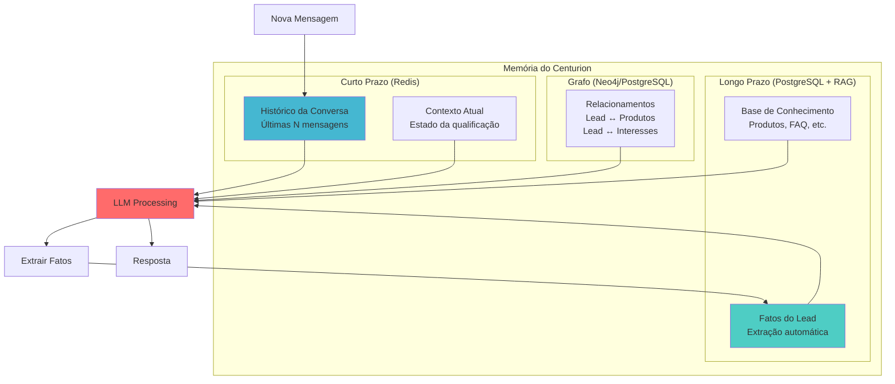

---

## Comunicação entre Serviços

### Padrões de Integração

#### 1. Event-Driven via Redis Pub/Sub (PREFERIDO)

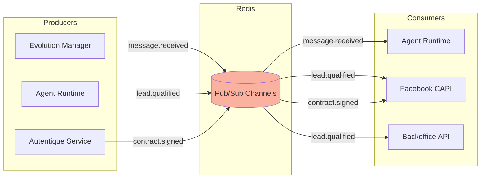

**Canais de Eventos:**

| Canal | Producer | Consumers | Payload |
|-------|----------|-----------|---------|
| `message.received` | Evolution Manager | Agent Runtime | `{instance_id, from, body, media}` |
| `message.sent` | Agent Runtime | Evolution Manager | `{instance_id, to, messages[]}` |
| `lead.created` | Agent Runtime | Facebook CAPI | `{lead_id, company_id, utm_*}` |
| `lead.qualified` | Agent Runtime | Backoffice API, CAPI | `{lead_id, score, criteria}` |
| `contract.created` | Autentique Service | - | `{contract_id, deal_id}` |
| `contract.signed` | Autentique Service | Facebook CAPI | `{contract_id, value}` |

#### 2. REST (Síncrono)

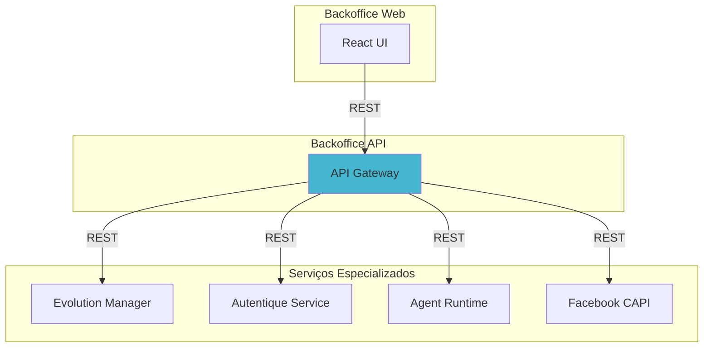

**Quando usar REST:**

- Operações CRUD síncronas
- Queries de dados
- Comandos que precisam de resposta imediata
- Health checks

#### 3. Webhooks (Externos)

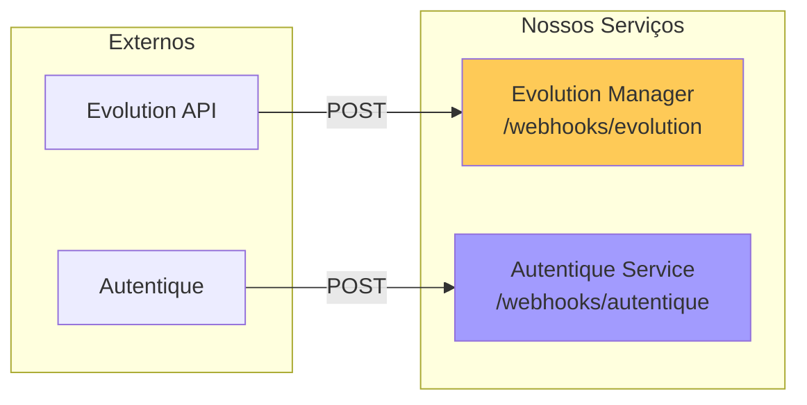

### Matriz de Comunicação

| De → Para | Backoffice API | Agent Runtime | Evo Manager | Autentique | CAPI |
|-----------|----------------|---------------|-------------|------------|------|
| **Backoffice API** | - | REST/Events | REST | REST | REST |
| **Agent Runtime** | Events | - | Events | Events | Events |
| **Evo Manager** | Events | Events | - | - | - |
| **Autentique** | Events | - | - | - | Events |
| **CAPI** | - | - | - | - | - |

---

## Fluxos de Dados Principais

### Fluxo 1: Qualificação de Lead via WhatsApp

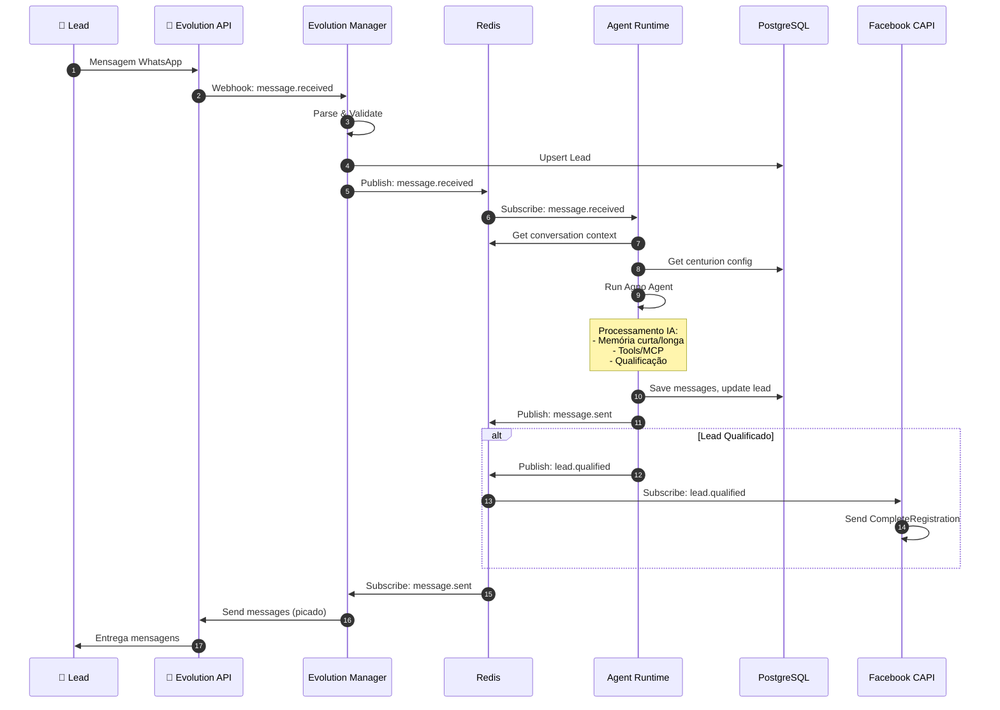

### Fluxo 2: Handoff para CRM da Empresa

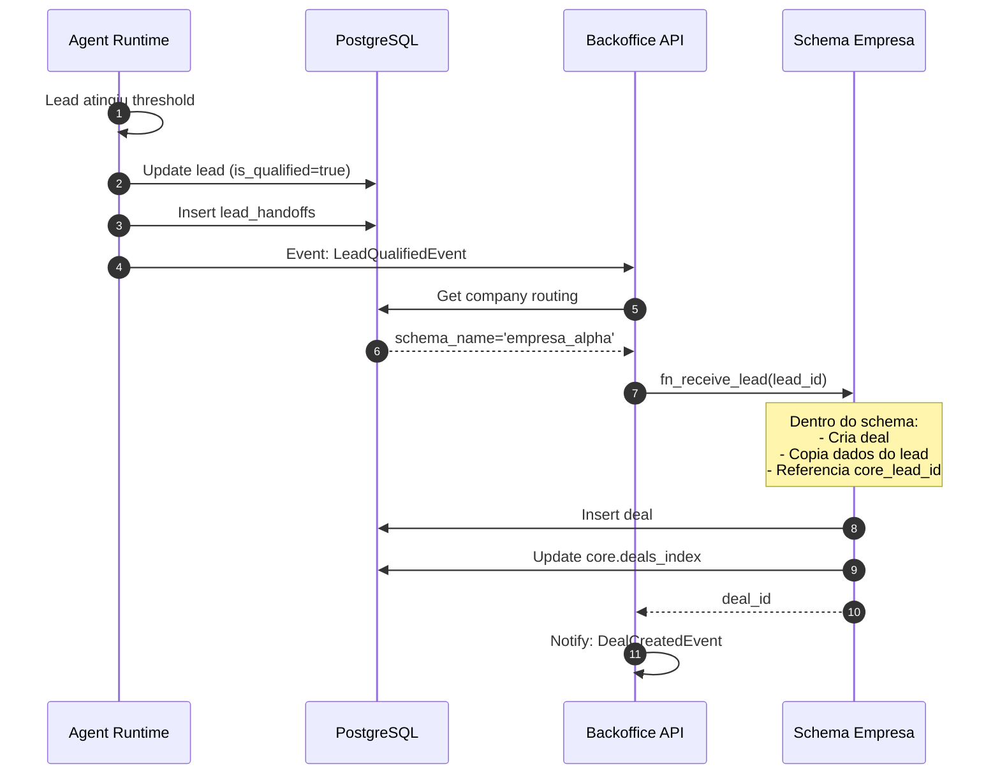

### Fluxo 3: Geração e Assinatura de Contrato

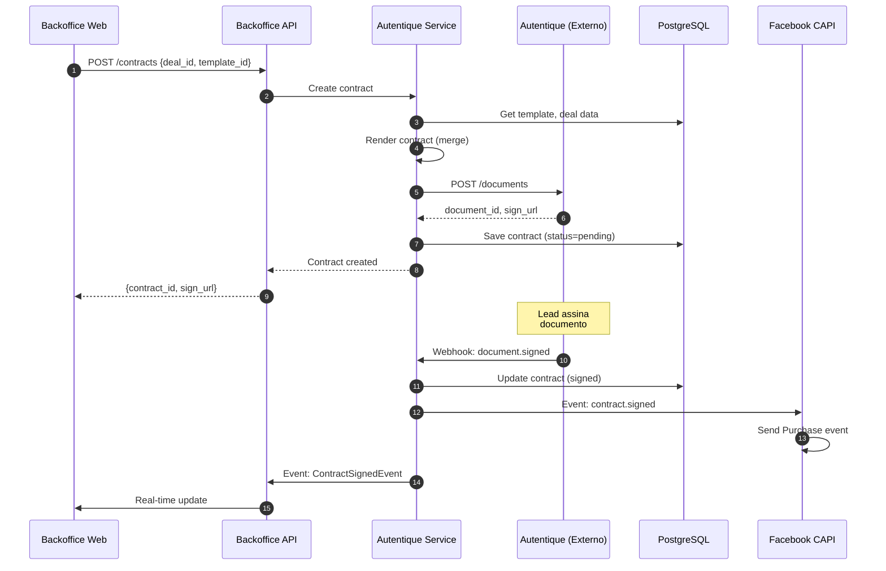

---

## Segurança e Multi-Tenancy

### Modelo de Claims JWT

```jsonc
{
  "sub": "uuid-do-auth-users",
  "role": "crm_user",  // backoffice_admin, ai_supervisor, marketing_admin, etc.
  "company_id": "uuid-da-empresa",
  "permissions": ["deals:read", "deals:write", "contracts:read"],
  "schema_name": "empresa_alpha",
  "exp": 1731600000
}
```

### Hierarquia de Roles

```
super_admin (máximo)
    └── backoffice_admin
            ├── ai_supervisor (por empresa)
            └── marketing_admin (por empresa)
                    └── crm_manager (Front Operacional)
                            └── crm_user (Front Operacional)
```

### RLS por Schema

```sql
-- Padrão para tabelas multi-tenant
ALTER TABLE core.leads ENABLE ROW LEVEL SECURITY;

-- Policy: Usuários veem apenas sua empresa
CREATE POLICY "leads_tenant_scope"
ON core.leads
FOR ALL
USING (company_id = (auth.jwt()->>'company_id')::uuid)
WITH CHECK (company_id = (auth.jwt()->>'company_id')::uuid);

-- Policy: Backoffice admin vê tudo
CREATE POLICY "leads_backoffice_all"
ON core.leads
FOR ALL
USING (auth.jwt()->>'role' IN ('backoffice_admin', 'super_admin'));
```

### Storage Security

```sql
-- Bucket: arquivos_deals
-- Path pattern: {company_id}/{deal_id}/filename

CREATE POLICY "deal_files_company_scope"
ON storage.objects
FOR ALL
USING (
  bucket_id = 'arquivos_deals'
  AND (split_part(name, '/', 1))::uuid = (auth.jwt()->>'company_id')::uuid
);
```

---

## Padrões e Guidelines

### Naming Conventions

**Serviços:**
- `kebab-case` para nomes de serviços: `evolution-manager`, `facebook-capi`
- Sufixo descritivo: `-service`, `-manager`, `-api`

**Módulos/Diretórios:**
- `snake_case` ou `kebab-case`
- Substantivos no singular

**Arquivos:**
```
[entidade].[camada].[extensão]

Exemplos:
- company.entity.ts
- leads.service.ts
- contracts.repository.ts
- create-company.dto.ts
- lead-qualified.event.ts
```

**Classes:**
```typescript
// Entity
class CompanyEntity {}

// Service
class LeadsService {}

// Repository
class ContractsRepository {}

// DTO
class CreateCompanyDto {}

// Event
class LeadQualifiedEvent {}
```

### Estratégia de Testes

```
service/
├── src/
│   └── modules/
│       └── leads/
│           ├── services/
│           │   └── leads.service.ts
│           └── __tests__/
│               ├── unit/
│               │   └── leads.service.spec.ts
│               ├── integration/
│               │   └── leads.repository.spec.ts
│               └── e2e/
│                   └── leads.e2e-spec.ts
```

**Pirâmide de Testes:**
- **Unit (70%)**: Domain, Services com mocks
- **Integration (20%)**: Repository com DB, Events com Redis
- **E2E (10%)**: Fluxos completos entre serviços

### Logging Pattern

```typescript
// Estruturado, com contexto
logger.info('Lead created', {
  service: 'agent-runtime',
  module: 'centurion',
  company_id: lead.company_id,
  lead_id: lead.id,
  channel: 'whatsapp',
  centurion_id: centurion.id,
  duration_ms: 150
});
```

### Error Handling

```typescript
// Hierarquia de erros
class DomainError extends Error {}
class ValidationError extends DomainError {}
class NotFoundError extends DomainError {}
class UnauthorizedError extends DomainError {}

// Handler global (Nest.js)
@Catch()
export class GlobalExceptionFilter implements ExceptionFilter {
  catch(exception: unknown, host: ArgumentsHost) {
    // Log estruturado
    // Resposta padronizada
    // Métricas de erro
  }
}
```

---

## Checklist de Conformidade

### Organização de Serviços

- [ ] Cada serviço tem responsabilidade única (SRP)
- [ ] Serviços se comunicam via eventos (preferencial) ou REST
- [ ] Nenhum serviço acessa diretamente o banco de outro
- [ ] Configurações via environment variables

### Multi-Tenancy

- [ ] Toda tabela operacional tem `company_id`
- [ ] RLS habilitado em todas tabelas multi-tenant
- [ ] JWT contém `company_id` e `role`
- [ ] Queries sempre filtram por `company_id`

### Segurança

- [ ] Webhooks externos validam assinatura/secret
- [ ] Tokens JWT com expiração curta
- [ ] Secrets em environment variables (não no código)
- [ ] Logs não expõem dados sensíveis

### Agent Runtime

- [ ] Centurions vinculados a `company_id`
- [ ] Memória isolada por lead/empresa
- [ ] Debounce implementado
- [ ] Mensagens picadas (humanização)

### Observabilidade

- [ ] Health checks em todos serviços
- [ ] Logs estruturados (JSON)
- [ ] Métricas de negócio expostas
- [ ] Tracing distribuído (correlation_id)

---

## Índice de Documentos Micro

| ID | Módulo | Documento | Status |
|----|--------|-----------|--------|
| ARCH-001 | Governance & Companies | `arch-micro-governance-companies.md` | ✅ Existente |
| ARCH-002 | SDR & Leads | `arch-micro-sdr-leads.md` | ✅ Existente |
| ARCH-003 | RLS & Security | `arch-micro-rls-security.md` | ✅ Existente |
| ARCH-004 | Schema de Empresa | `arch-micro-schema-empresa.md` | ✅ Existente |
| ARCH-005 | Integrations & Contracts | `arch-micro-integrations-contracts.md` | ✅ Existente |
| ARCH-006 | Marketing & Tracking | `arch-micro-marketing-tracking.md` | ✅ Existente |
| ARCH-007 | Agent Runtime | `arch-micro-agent-runtime.md` | 📝 A criar |
| ARCH-008 | Evolution Manager | `arch-micro-evolution-manager.md` | 📝 A criar |
| ARCH-009 | Facebook CAPI | `arch-micro-facebook-capi.md` | 📝 A criar |
| ARCH-010 | Backoffice API | `arch-micro-backoffice-api.md` | 📝 A criar |
| ARCH-011 | Backoffice Web | `arch-micro-backoffice-web.md` | 📝 A criar |

---

## Apêndice A: Variáveis de Ambiente

### Backoffice API

```env
# Database
SUPABASE_URL=https://xxx.supabase.co
SUPABASE_ANON_KEY=eyJ...
SUPABASE_SERVICE_ROLE_KEY=eyJ...
DATABASE_URL=postgres://...

# Redis
REDIS_URL=redis://localhost:6379

# JWT
JWT_SECRET=your-secret-key
JWT_EXPIRATION=1h

# Services URLs
AGENT_RUNTIME_URL=http://agent-runtime:5000
EVOLUTION_MANAGER_URL=http://evolution-manager:4001
AUTENTIQUE_SERVICE_URL=http://autentique-service:4002
FACEBOOK_CAPI_URL=http://facebook-capi:4003
```

### Agent Runtime

```env
# Database
SUPABASE_URL=https://xxx.supabase.co
SUPABASE_SERVICE_ROLE_KEY=eyJ...

# Redis
REDIS_URL=redis://localhost:6379

# LLM
OPENAI_API_KEY=sk-...
ANTHROPIC_API_KEY=sk-ant-...

# Agno
AGNO_LOG_LEVEL=INFO
```

### Evolution Manager

```env
# Evolution API
EVOLUTION_API_URL=http://evolution:8080
EVOLUTION_API_KEY=your-key

# Webhook Secret
WEBHOOK_SECRET=your-webhook-secret
```

---

## Apêndice B: Docker Compose (Development)

```yaml
version: '3.8'

services:
  # Frontend
  backoffice-web:
    build: ./backoffice-web
    ports:
      - "3000:3000"
    environment:
      - NEXT_PUBLIC_API_URL=http://localhost:4000
    depends_on:
      - backoffice-api

  # Backend Principal
  backoffice-api:
    build: ./backoffice-api
    ports:
      - "4000:4000"
    environment:
      - SUPABASE_URL=${SUPABASE_URL}
      - REDIS_URL=redis://redis:6379
    depends_on:
      - redis

  # Agent Runtime
  agent-runtime:
    build: ./agent-runtime
    ports:
      - "5000:5000"
    environment:
      - SUPABASE_URL=${SUPABASE_URL}
      - REDIS_URL=redis://redis:6379
      - OPENAI_API_KEY=${OPENAI_API_KEY}
    depends_on:
      - redis

  # Evolution Manager
  evolution-manager:
    build: ./evolution-manager
    ports:
      - "4001:4001"
    environment:
      - EVOLUTION_API_URL=${EVOLUTION_API_URL}
      - REDIS_URL=redis://redis:6379
    depends_on:
      - redis

  # Autentique Service
  autentique-service:
    build: ./autentique-service
    ports:
      - "4002:4002"
    environment:
      - AUTENTIQUE_API_KEY=${AUTENTIQUE_API_KEY}
      - REDIS_URL=redis://redis:6379
    depends_on:
      - redis

  # Facebook CAPI
  facebook-capi:
    build: ./facebook-capi
    ports:
      - "4003:4003"
    environment:
      - REDIS_URL=redis://redis:6379
    depends_on:
      - redis

  # Infrastructure
  redis:
    image: redis:7-alpine
    ports:
      - "6379:6379"
    volumes:
      - redis_data:/data

volumes:
  redis_data:
```

---

**FIM DO DOCUMENTO**

---

*Arquitetura Macro: Back-Office Multi-Tenant da Holding v2.0*  
*Metodologia: Modular Domain Layered Architecture*  
*Gerado em: 2025-12-16*
