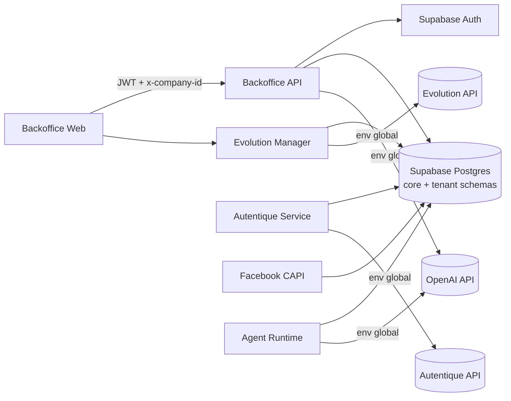

# Design de Solução vNext (Holístico): Integrações, Credenciais Globais/Por-Empresa, Acessos e Multi-Tenancy

**Sistema:** Wolfgang Backoffice (Holding)  
**Status:** Proposed (vNext)  
**Data:** 2025-12-18  
**Escopo:** Este repositório (Backoffice Web + Backoffice API + serviços satélites) e Supabase (DB único multi-schema)  

---

## 1) Executive Summary (3 parágrafos)

Hoje o sistema já opera com um modelo multi-tenant por schema (um schema por empresa) e um schema `core` canônico, porém existe um conjunto de falhas estruturais que impedem operação consistente em produção: schemas de tenant nem sempre ficam “expostos” para o PostgREST; integrações externas (Autentique/Evolution/OpenAI) estão acopladas a variáveis de ambiente globais; alguns segredos estão armazenados em plaintext no banco; e alguns serviços internos (ex.: Autentique Service) expõem endpoints sem autenticação efetiva.

A solução vNext propõe um **modelo unificado de credenciais** com dois níveis: **Credenciais Globais (Credential Sets)** definidas pelo dono da holding e **Overrides por empresa** selecionáveis durante a criação da empresa via um wizard. Todos os serviços passam a resolver credenciais por `company_id` (ou por “credential_set_id” derivado), com **criptografia padronizada** e rotação de chaves. Em paralelo, endurecemos o boundary de segurança: este backoffice vira **holding-only** (somente `super_admin/backoffice_admin`), e microserviços “internos” passam a exigir **auth de serviço-para-serviço**.

O resultado é um sistema coeso: criação de empresa provisiona schema + expõe automaticamente no PostgREST; o admin escolhe credenciais globais ou configura específicas; jobs e webhooks usam credenciais corretas por empresa; e o conjunto todo fica observável (correlation_id) e operável (runbook), eliminando patches isolados.

---

## 1.1) Contexto e Objetivo (PLACEHOLDERS preenchidos)

**[SISTEMA/PROJETO]** → "Wolfgang Backoffice da Holding (este repo) + microserviços satélites + Supabase (DB único multi-schema)"  

**[ESTADO_ATUAL]** → "Funciona no happy-path, mas quebra com frequência em produção por drift de configuração (schemas não expostos no PostgREST), integrações globais por env sem override por empresa, segredos em plaintext, e fronteiras de auth internas frágeis."  

**[ESTADO_DESEJADO]** → "Robusto em produção, multi-tenant por schema sem erros de exposição, integrações gerenciadas pelo backoffice via credenciais globais + override por empresa (wizard), segredos sempre criptografados com rotação, serviços internos autenticados, observabilidade end-to-end e runbook claro."  

**Não-escopo (explícito)**
- Reescrever a arquitetura multi-tenant (ex.: migrar tudo para single-schema) — mantemos `core + <empresa> + _template_base`.
- Transformar este repo em CRM operacional — fronts operacionais continuam em repositórios separados.
- Migrar para outra stack de Auth/DB — mantemos Supabase.

---

## 2) Arquitetura Antes/Depois (alto nível)

### Antes (hoje)



Problemas principais:
- PostgREST rejeita `.schema(<tenant>)` quando o schema não está em `pgrst.db_schemas`.
- Credenciais de integração são globais por env, sem override por empresa.
- Segredos em plaintext em algumas tabelas.
- Serviços internos sem auth consistente (ex.: Autentique Service).

### Depois (vNext)

```mermaid
flowchart LR
  BO_WEB[Backoffice Web (holding-only)] -->|JWT holding| BO_API[Backoffice API (holding-only)]
  BO_API --> AUTHQ[Supabase Auth Admin]
  BO_API --> DB[(Supabase Postgres\ncore + tenant schemas)]

  subgraph Integrations[Credenciais Unificadas]
    DB --> ICS[core.integration_credential_sets (globais)]
    DB --> CIB[core.company_integration_bindings (por empresa)]
  end

  BO_WEB --> EVO_MGR[Evolution Manager]
  EVO_MGR --> DB
  EVO_MGR -->|resolve por company_id| EVO_API[(Evolution API)]

  BO_API -->|internal auth| AUT[Autentique Service]
  AUT --> DB
  AUT -->|resolve por company_id/credential_set| AUT_API[(Autentique API)]
  AUT_API -->|webhooks| AUT

  AG[Agent Runtime] --> DB
  AG -->|resolve por company_id| OAI[(OpenAI API)]

  FB[Facebook CAPI] --> DB
  FB -->|pixel por company_id| META[(Meta Graph API)]
```

---

## 3) Problemas Identificados (lista completa)

✗ Schemas de tenant não expostos no PostgREST → “Invalid schema”  
✗ Integrações Autentique/Evolution/OpenAI acopladas a env global (sem override por empresa)  
✗ Necessidade de credenciais “globais” + wizard de override por empresa na criação  
✗ Autentique Service expõe `/contracts` sem guard efetivo (risco de abuso)  
✗ Segredos em plaintext no banco (`telegram_bot_token`, `tool_configs.auth_config`, `mcp_servers.auth_config`, etc.)  
✗ Ausência de um modelo central de “integrações” (estado, validação, teste, rotação)  
✗ Gestão de usuários por empresa precisa existir no backoffice (criar/invitar, papéis, revogar)  
✗ Observabilidade parcial: correlation_id existe em alguns pontos, mas falta padronização end-to-end  
✗ `APP_ENCRYPTION_KEY` ausente/inconsistente entre serviços (quebra Pixel/CAPI e futura criptografia unificada)  
✗ Criação de empresa não é transacional (risco de schema órfão / binds parciais em falha/retry)  
✗ WebSocket instável/intermitente em produção (`/ws` com `net::ERR_FAILED` em alguns cenários)  
✗ Ruído operacional: `GET /favicon.ico` 404 (baixa prioridade, mas polui logs e replays)

---

## 4) Constraints Técnicos (do projeto)

- Manter stack atual: Supabase (Postgres + Auth + Storage) + NestJS (serviços) + Next.js (web) + Python (agent-runtime).
- Manter estratégia multi-tenant por schema: `core` + `<empresa>` + `_template_base`.
- Backoffice é **exclusivo da holding** (somente `super_admin/backoffice_admin`).
- “Regra de ouro”: sem `company_id` = sem recurso (para recursos operacionais).
- Solução holística (todas as peças funcionando juntas).

---

## 4.1) Questões para Resolver no Design (decisões arquiteturais críticas)

A. **Modelo de credenciais (globais + override por empresa)**
- Um set global pode ser usado por quantas empresas? (sim; N empresas → 1 set)
- Uma empresa pode escolher sets diferentes por provider? (sim; por provider)
- Como tratar “disabled” por empresa (sem quebrar jobs)? (estado + mensagens de erro previsíveis)
- Como versionar/configurar providers novos sem migrations disruptivas? (enum + fallback + compat)

B. **Criptografia e rotação**
- Uma chave única (`APP_ENCRYPTION_KEY`) para todos os serviços? (sim, com rotação e janela compatível)
- Como fazer TS + Python decrypt compatível? (AES-256-GCM + `v1:` + vetores de teste)
- Como lidar com legado plaintext durante migração? (decrypt tolerante + backfill + cutover)

C. **Autenticação entre serviços (internal boundary)**
- Token estático vs JWT interno assinado? (começar com token estático; evoluir para JWT se necessário)
- Como evitar vazamento do token (headers não logados; allowlist de rotas; secret manager)
- Como garantir que webhooks públicos não dependam de “rede interna”? (assinatura sempre)

D. **Roteamento e validação de webhooks**
- Como mapear webhook → `credential_set_id`/`company_id` sem brute force? (path param preferível)
- Como lidar com múltiplos Autentique accounts (sets globais)? (webhook por set)

E. **Multi-tenancy e PostgREST**
- Como lidar com crescimento do `pgrst.db_schemas` (muitos tenants)? (tradeoff documentado; monitoramento)
- Como garantir idempotência no provisionamento e exposição? (advisory lock + backfill)

F. **UX do Backoffice (holding-only)**
- Onde editar credenciais globais? Onde editar override por empresa? (telas separadas + wizard na criação)
- Como o admin testa integrações sem “salvar às cegas”? (botões “Test connection” por provider)

G. **Observabilidade e operação**
- Quais métricas e alertas mínimos para integrações? (RED por provider + filas + webhooks)
- Como depurar ponta-a-ponta com `correlation_id`? (propagação obrigatória)

---

## 5) Soluções Detalhadas (por problema)

### Problema 1: “Invalid schema” (schemas de tenant não expostos)

**SOLUÇÃO TÉCNICA**  
Automatizar a exposição do schema no PostgREST ao provisionar um tenant, garantindo que `pgrst.db_schemas` inclua o schema recém-criado e forçando reload do PostgREST (via `NOTIFY pgrst`).

No Supabase Cloud, **não é confiável** tentar alterar `pgrst.db_schemas` via PostgREST/supabase-js durante a criação da empresa, pois isso pode falhar com `42501 permission denied to set parameter "pgrst.db_schemas"`. A abordagem vNext separa:
- **provisionamento do schema** (DB)
- **exposição no PostgREST** (job/serviço com conexão Postgres direta)

**IMPLEMENTAÇÃO (estado atual no repo)**  
Implementação atual usa uma **fila de exposição** + um serviço no backend:
- `supabase/migrations/00078_defer_postgrest_exposure_and_fix_tenant_grants.sql`
  - `core.postgrest_schema_exposure_queue` + `core.fn_enqueue_postgrest_schema_exposure(schema_name)`
  - `core.fn_provision_company_schema(p_slug)` enfileira o schema (não tenta alterar `pgrst.db_schemas` diretamente)
  - backfill aplica `GRANT/DEFAULT PRIVILEGES` em schemas existentes e também enfileira para exposição
- `backoffice-api/src/modules/companies/services/postgrest-exposure.service.ts`
  - usa `SUPABASE_DB_URL` (conexão Postgres direta) para executar `core.fn_postgrest_expose_schema(schema)`
  - drena a fila no startup (best-effort) e após criar empresa (idempotente)

**INTEGRAÇÃO**
- Backoffice API chama `rpc('fn_provision_company_schema')` na criação de empresa: `backoffice-api/src/modules/companies/services/schema-provisioner.service.ts`.
- Backoffice API e UI usam supabase-js `.schema(schemaName)` para acessar dados por empresa; com isso, PostgREST precisa expor o schema.

**TRADEOFFS**
- ✅ Resolve raiz do problema no DB (não em “if/else” no backend).
- ✅ Suporta concorrência (advisory lock).
- ⚠️ Depende de permissão para `ALTER ROLE authenticator SET ...` (executado via conexão Postgres direta `SUPABASE_DB_URL`, não via PostgREST).

**TESTES**
- Criar empresa e garantir:
  - `core.company_crms.schema_name` preenchido
  - chamadas `.schema(<tenant>).from('deals')` funcionam via PostgREST

---

### Problema 2: Integrações externas globais vs por-empresa (Wizard + Credential Sets)

**SOLUÇÃO TÉCNICA**  
Criar um modelo central para credenciais com:
1) **Credential Sets Globais** (definidas pelo admin no backoffice)  
2) **Binding por empresa** apontando para um set global **ou** contendo override específico  

No fluxo “Criar Empresa”, o admin escolhe:
- “Usar credenciais globais” (seleciona set padrão por provider)  
ou
- “Configurar credenciais específicas” (wizard multi-step)  

**Modelo de dados (proposto)**

```sql
-- Providers suportados (extensível)
do $$
begin
  if not exists (select 1 from pg_type where typname = 'integration_provider') then
    create type core.integration_provider as enum ('autentique', 'evolution', 'openai');
  end if;
end $$;

-- Conjuntos globais de credenciais (reutilizáveis por várias empresas)
create table if not exists core.integration_credential_sets (
  id uuid primary key default gen_random_uuid(),
  provider core.integration_provider not null,
  name text not null,
  is_default boolean not null default false,

  -- Config NÃO-secreta (urls, modelos, flags, etc.)
  config jsonb not null default '{}'::jsonb,

  -- Segredos criptografados (formato v1:...)
  secrets_enc text not null default '',

  created_by uuid references auth.users(id),
  created_at timestamptz not null default now(),
  updated_at timestamptz not null default now(),
  unique (provider, name)
);

create index if not exists idx_integration_sets_provider on core.integration_credential_sets(provider);

-- Binding por empresa: aponta para global OU override custom (por provider)
create table if not exists core.company_integration_bindings (
  id uuid primary key default gen_random_uuid(),
  company_id uuid not null references core.companies(id) on delete cascade,
  provider core.integration_provider not null,

  mode text not null check (mode in ('global', 'custom', 'disabled')),
  credential_set_id uuid references core.integration_credential_sets(id),

  -- override NÃO-secreto e segredos (quando mode='custom')
  config_override jsonb not null default '{}'::jsonb,
  secrets_override_enc text not null default '',

  status text not null default 'active' check (status in ('active', 'invalid', 'testing')),
  last_validated_at timestamptz,
  last_error text,

  created_at timestamptz not null default now(),
  updated_at timestamptz not null default now(),
  unique (company_id, provider)
);

create index if not exists idx_company_integrations_company on core.company_integration_bindings(company_id);
```

**Crypto (padronização)**
- Reusar o formato já existente nos pixels: `v1:<iv_b64>:<tag_b64>:<cipher_b64>` (AES-256-GCM, key = SHA-256(APP_ENCRYPTION_KEY)).
- Criar uma lib única e compartilhada:
  - Node: `packages/crypto/src/secret.ts` (encrypt/decrypt)
  - Python: `agent-runtime/src/common/crypto/secrets.py` (compatível)

**Regras de resolução (determinísticas)**

```ts
type Provider = "autentique" | "evolution" | "openai";

type ResolvedIntegration = {
  provider: Provider;
  source: "global" | "custom";
  config: Record<string, unknown>;
  secrets: Record<string, string>;
};

// Algoritmo:
// 1) Load company_integration_bindings(company_id, provider)
// 2) Se mode='disabled' => throw / return null
// 3) Se mode='custom' => config = config_override; secrets = decrypt(secrets_override_enc)
// 4) Se mode='global' => load integration_credential_sets(credential_set_id) (ou default do provider)
//    config = set.config; secrets = decrypt(set.secrets_enc)
```

**UI/UX: Wizard de criação de empresa (proposto)**
- Step 1: Dados da empresa (nome, documento, etc.)
- Step 2: “Credenciais” (radio):
  - (A) Usar credenciais globais (combo por provider com defaults pré-selecionados)
  - (B) Configurar específicas (abre wizard):
    - Autentique: `api_key`, `base_url`, `webhook_secret`
    - Evolution: `api_url`, `api_key`, `webhook_secret` (se aplicável)
    - OpenAI: `api_key`, `base_url`, `chat_model`, `embedding_model`, limites
  - Test buttons (por provider) antes de concluir
- Step 3: Review + Create

**INTEGRAÇÃO**
- Backoffice API recebe payload “company + integrations”, provisiona schema, cria binds.
- Evolution/Autentique/Agent Runtime resolvem credenciais por `company_id` consultando o core (service_role).

**TRADEOFFS**
- ✅ Admin define padrões globais e replica rápido para novas empresas.
- ✅ Mantém flexibilidade total por empresa via override.
- ⚠️ Aumenta modelagem e validação (mas elimina acoplamento a env).

**TESTES**
- Unit: `resolveIntegration(company_id, provider)` cobre 3 modos.
- E2E: criar empresa usando (A) global e (B) custom; validar endpoints que dependem de cada provider.

---

### Problema 3: Autentique Service sem autenticação efetiva (internal boundary)

**SOLUÇÃO TÉCNICA**  
Autentique Service deve ser **internal-only** para endpoints de comando (`/contracts`) e **public-only** para webhooks (assinados). Ou seja:
- `/contracts/*`: exige **Service-to-Service Auth** (header `x-internal-token` ou JWT interno)
- `/webhooks/*`: valida assinatura (e nunca depende de “estar na rede interna”)

**IMPLEMENTAÇÃO (proposta)**
- Criar `InternalAuthGuard` no `autentique-service` e aplicar globalmente no controller `/contracts`.
- Backoffice API, ao chamar Autentique Service, envia `x-internal-token`.
- Token gerenciado via env (`INTERNAL_API_TOKEN`) ou JWT assinado (`INTERNAL_JWT_SECRET`), com rotação.

**Webhooks por Credential Set (alinhado com “globais + override”)**
- Quando um Credential Set (Autentique) é criado/atualizado, o admin pode registrar webhook no Autentique apontando para:
  - `/webhooks/autentique/:credential_set_id` (preferível)  
  - ou `/webhooks/autentique` (fallback, exige lookup por `autentique_document_id`)
- Assim o serviço identifica o set de credenciais sem brute force.

**TRADEOFFS**
- ✅ Fecha uma superfície de ataque grande.
- ✅ Webhook continua público, mas com assinatura + roteamento claro.
- ⚠️ Requer secret interno compartilhado entre serviços.

**TESTES**
- Requests para `/contracts` sem token interno devem falhar com 401.
- Webhook inválido deve falhar sem atualizar `core.contracts`.

---

### Problema 4: OpenAI global por env (KB + Agent Runtime)

**SOLUÇÃO TÉCNICA**  
OpenAI passa a ser uma integração gerenciada pelo modelo “Credential Sets + Binding por empresa”. A Knowledge Base e o Agent Runtime buscam:
- `openai` por `company_id`
- com fallback para set global default

**IMPLEMENTAÇÃO (proposta)**
- Backoffice API:
  - `DocumentProcessorService` deixa de ler `process.env.OPENAI_API_KEY` diretamente e usa `IntegrationsResolver`.
- Agent Runtime (Python):
  - Carrega credenciais resolvidas (api_key/base_url/models) antes de embeddings/vision/stt.

**TRADEOFFS**
- ✅ Permite empresas diferentes com modelos/keys diferentes.
- ✅ Elimina deploy “por empresa” só para trocar key.
- ⚠️ Precisamos de crypto compatível TS/Python.

**TESTES**
- KB: embeddings funcionam com override por empresa e com fallback global.
- Agent: embeddings/vision/stt falham com erro claro quando integração está `disabled`.

---

### Problema 5: Evolution API global por env + erro 503 (“not configured”)

**SOLUÇÃO TÉCNICA**  
Evolution Manager resolve credenciais `evolution` por `company_id` (binding), com fallback para set global default.

**IMPLEMENTAÇÃO (proposta)**
- Alterar `EvolutionApiService` para aceitar `company_id` em cada call (ou injetar por request scope).
- Criar um `IntegrationsClient` (Supabase service_role) dentro do `evolution-manager` para buscar credenciais.
- Adicionar cache (em Redis) por `(company_id, provider)` com TTL curto para reduzir consultas.

**TESTES**
- Unit: create instance falha com “disabled” e funciona com global/custom.

---

### Problema 6: Segredos em plaintext (telegram/tool/mcp/etc.)

**SOLUÇÃO TÉCNICA**  
Padronizar armazenamento de segredos no banco:
- nunca guardar segredo em `text/jsonb` sem criptografia
- separar “config” (jsonb) de “secrets_enc” (text criptografado)

**Targets imediatos**
- `core.channel_instances.telegram_bot_token` → migrar para `telegram_bot_token_enc` + decrypt no runtime
- `core.tool_configs.auth_config` → mover para `auth_secrets_enc` (e manter somente metadados não secretos em `auth_config`)
- `core.mcp_servers.auth_config` → idem

**Mecanismo de rotação**
- Manter `APP_ENCRYPTION_KEY_CURRENT` e opcional `APP_ENCRYPTION_KEY_PREVIOUS` para decrypt durante janela de rotação.
- Re-encrypt em background (worker) e depois remover previous.
- Fail-fast em produção: serviços que precisam criptografar/decriptar devem **não subir** sem a chave (evita “meia operação”).

**TESTES**
- Backfill migration: dados antigos continuam legíveis.
- `decryptSecret()` suporta formatos v1 e plaintext legado durante transição (depois remove).

---

### Problema 7: Gestão de usuários por empresa (backoffice)

**SOLUÇÃO TÉCNICA**  
Backoffice (holding) gerencia:
- criação/invite de usuários no Supabase Auth (Admin API)
- vínculo com empresa em `core.company_users` (role/scopes)
- revogação (remover vínculo e/ou desabilitar usuário)

**Padrão recomendado**
- **Operacional**: usuário pode pertencer a N empresas (via `core.company_users`).
- JWT não precisa carregar `company_id` fixo; o acesso é controlado por RLS via membership.
- “Sem company_id = sem recurso” continua válido para APIs que usam header `x-company-id` (serviços internos).

**Endpoints (propostos)**
- `POST /companies/:id/users/invite` (email, role, scopes)
- `GET /companies/:id/users`
- `DELETE /companies/:id/users/:user_id`
- `POST /users/:id/reset-password` (opcional, usando Supabase Admin)

**Segurança**
- Todas essas rotas são holding-only (`super_admin/backoffice_admin`).

---

### Problema 8: Criação de empresa não transacional (schema órfão / binds parciais)

**SOLUÇÃO TÉCNICA:**  
Tornar o fluxo “Criar Empresa” **idempotente e atômico** do ponto de vista do sistema, mesmo que internamente passe por várias etapas (company row, schema, binds, configs). A regra é: ou termina com empresa `active` e tudo provisionado, ou faz rollback completo (incluindo schema).

**IMPLEMENTAÇÃO (proposta)**

Opção A (recomendada): Função SQL orquestradora no `core` (transação única):
```sql
-- core.fn_create_company_full(p_name, p_document, p_owner_user_id, p_integrations jsonb)
-- 1) insert core.companies status='provisioning'
-- 2) schema_name := core.fn_provision_company_schema(slug)
-- 3) upsert core.company_crms
-- 4) ensure default centurion config
-- 5) insert core.company_integration_bindings (global/custom/disabled)
-- 6) update core.companies status='active'
-- on exception: drop schema cascade + delete company
```

Opção B: “Saga” no Backoffice API (mais fácil de iterar, menos SQL), mas com rollback explícito:
- criar `core.fn_drop_company_schema(p_schema text)` (security definer, service_role only)
- se qualquer etapa falhar após criar schema: chamar drop schema + deletar company

**INTEGRAÇÃO**
- `backoffice-api/src/modules/companies/services/companies.service.ts` passa a chamar a função orquestradora (A) ou fazer rollback completo (B).
- Wizard de integrações (Problema 2) vira parte do payload do create.

**TRADEOFFS**
- ✅ Evita “lixo” operacional (schemas órfãos, binds faltando).
- ✅ Torna retries seguros (ex.: falha de rede na resposta).
- ⚠️ Opção A aumenta complexidade SQL; Opção B aumenta complexidade no backend.

**TESTES**
- Simular falha na etapa N (ex.: binds) e validar rollback: company não existe e schema não existe.
- Simular retry do mesmo request (idempotency key) e validar que não duplica empresa/binds.

---

### Problema 9: WebSocket instável/intermitente em produção

**SOLUÇÃO TÉCNICA:**  
Padronizar handshake, timeouts e reconexão; garantir compatibilidade com o ambiente (Railway) e reduzir erro `net::ERR_FAILED`.

**IMPLEMENTAÇÃO (proposta)**
- Backoffice API (`socket.io`):
  - configurar `pingInterval`/`pingTimeout` e logs de `disconnect_reason`
  - opcional: habilitar sticky sessions no deploy (se houver múltiplas réplicas)
  - aceitar `x-company-id` somente se holding role (já faz), mas exigir company para features que dependem de rooms
- Backoffice Web:
  - estratégia de reconexão exponencial + fallback para polling quando websocket falhar
  - propagar `x-correlation-id` no handshake para rastreio

**INTEGRAÇÃO**
- `backoffice-api/src/infrastructure/ws/ws.gateway.ts`
- `backoffice-web` client socket (onde estiver implementado)

**TRADEOFFS**
- ✅ Menos flakiness em UX (Leads/tempo real).
- ⚠️ Em infra sem sticky sessions, socket.io pode ter instabilidade sob scale-out.

**TESTES**
- E2E: conectar, navegar entre páginas, reconectar, validar que eventos continuam chegando.
- Chaos: derrubar pod/restart e validar reconexão automática.

---

### Problema 10: Ruído operacional (favicon 404)

**SOLUÇÃO TÉCNICA:**  
Adicionar `favicon.ico` no `backoffice-web/public` e/ou atualizar config do Next para servir o asset corretamente.

**TESTES**
- `GET /favicon.ico` retorna 200 em produção.

---

## 6) Plano de Implementação Integrado (ordem lógica, sem “sprints”)

### Ordem (dependências explícitas)

1) **DB & RLS**
- Criar `core.integration_credential_sets` e `core.company_integration_bindings` (+ índices, triggers updated_at, policies).
- Garantir constraint “1 default por provider” (índice único parcial).

2) **Crypto compartilhado**
- Implementar libs compatíveis TS/Python (AES-256-GCM `v1:`) e publicar como pacote interno.
- Definir rotação: `APP_ENCRYPTION_KEY_CURRENT` + `..._PREVIOUS`.

3) **Backoffice API (holding-only)**
- Criar módulo `integrations`:
  - CRUD de credential sets globais
  - CRUD de bindings por empresa (global/custom/disabled)
  - endpoints “Test connection” por provider
- Ajustar `POST /companies` para suportar wizard + binds e tornar o fluxo atômico (Problema 8).
- Refatorar KB (OpenAI) para resolver credenciais por company (Problema 4).

4) **Evolution Manager**
- Refatorar para resolver credenciais por `company_id` (Problema 5).
- Cache de resolução (Redis) + métricas (hit/miss, erros por company/provider).

5) **Autentique Service**
- Aplicar internal auth em `/contracts` (Problema 3).
- Resolver credenciais por `credential_set_id`/`company_id`.
- Implementar webhooks roteados por set (Problema 3 + Questões C/D).

6) **Secret hygiene & migrações de dados**
- Migrar plaintext → `_enc` em tabelas-alvo (Problema 6), com compat temporária.
- Remover leitura de legado após janela de rollout.

7) **Observabilidade & Runbooks**
- Propagação de `x-correlation-id`/`x-request-id` em todos os hops.
- Dashboards + alertas + runbooks (Seções 7/8).

### Pontos de integração críticos
- Crypto compat TS↔Python (se quebrar, OpenAI/Agent Runtime quebra).
- Autentique webhooks: roteamento correto por set (evita assinatura inválida).
- Rollback seguro na criação de empresa (evita “sujeira” de schema).

### Riscos (e mitigação)
- **Crescimento de `pgrst.db_schemas`**: monitorar tamanho/tempo de reload; alertar quando exceder threshold.
- **Chave de criptografia errada entre serviços**: startup check + endpoint de self-test `GET /health/crypto`.
- **Deploy sem sticky sessions**: ajustar WebSocket (fallback + config) ou habilitar sticky.

---

## 7) Observabilidade Unificada (logs, métricas, tracing)

**Padrão de headers**
- Entrada HTTP: gerar `x-request-id` e propagar `x-correlation-id` (já existe em parte do sistema).
- Sempre logar: `service`, `route`, `company_id` (quando aplicável), `user_id` (quando aplicável), `correlation_id`, `duration_ms`, `status`.

**Métricas (RED)**
- Rate: requests por rota + provider calls (Autentique/Evolution/OpenAI)
- Errors: por rota + por provider + por company_id
- Duration: p50/p95/p99 por rota e por integração

**Dash único**
- “Integrations Health”: cards por provider com % success e top failing companies
- “Tenant Health”: schemas provisionados vs expostos vs com trigger `trg_deals_index_sync`

---

## 8) Runbook (operação)

**Quando “Invalid schema” reaparecer**
1) Verificar `pgrst.db_schemas` no role `authenticator`  
2) Executar `select core.fn_postgrest_expose_schema('<schema>');` via conexão Postgres direta (admin / `SUPABASE_DB_URL`)  
3) Checar `NOTIFY pgrst` e logs do PostgREST

**Quando integração falhar para uma empresa**
1) Consultar `core.company_integration_bindings` (status/last_error)  
2) Rodar endpoint “Test connection” no backoffice  
3) Verificar decrypt (APP_ENCRYPTION_KEY) e rotação

**Quando webhook falhar**
1) Validar assinatura e roteamento por `credential_set_id`  
2) Verificar mapping do evento → `company_id` (ex.: contrato/autentique_document_id)

---

## 9) Apêndice: Exemplo de código (funções críticas)

### A) Crypto compartilhado (TypeScript – implementação completa)

```ts
// packages/crypto/src/secrets.ts
import { createCipheriv, createDecipheriv, createHash, randomBytes } from "crypto";

export type SecretEnvelopeVersion = "v1";
export type SecretKeyring = { current: string; previous?: string };

function sha256(raw: string): Buffer {
  return createHash("sha256").update(raw).digest();
}

export function loadKeyringFromEnv(): SecretKeyring {
  const current = (process.env.APP_ENCRYPTION_KEY_CURRENT ?? process.env.APP_ENCRYPTION_KEY ?? "").trim();
  const previous = (process.env.APP_ENCRYPTION_KEY_PREVIOUS ?? "").trim();
  if (!current) throw new Error("APP_ENCRYPTION_KEY_CURRENT (or APP_ENCRYPTION_KEY) is required");
  return { current, previous: previous || undefined };
}

export function encryptV1(plaintext: string, keyring: SecretKeyring = loadKeyringFromEnv()): string {
  const key = sha256(keyring.current);
  const iv = randomBytes(12);
  const cipher = createCipheriv("aes-256-gcm", key, iv);
  const ciphertext = Buffer.concat([cipher.update(plaintext, "utf8"), cipher.final()]);
  const tag = cipher.getAuthTag();
  return `v1:${iv.toString("base64")}:${tag.toString("base64")}:${ciphertext.toString("base64")}`;
}

function tryDecryptWithKey(rawKey: string, ivB64: string, tagB64: string, dataB64: string): string {
  const key = sha256(rawKey);
  const iv = Buffer.from(ivB64, "base64");
  const tag = Buffer.from(tagB64, "base64");
  const data = Buffer.from(dataB64, "base64");
  const decipher = createDecipheriv("aes-256-gcm", key, iv);
  decipher.setAuthTag(tag);
  return Buffer.concat([decipher.update(data), decipher.final()]).toString("utf8");
}

export function decryptV1(encrypted: string, keyring: SecretKeyring = loadKeyringFromEnv()): string {
  if (!encrypted.startsWith("v1:")) return encrypted; // legado plaintext
  const [, ivB64, tagB64, dataB64] = encrypted.split(":");
  if (!ivB64 || !tagB64 || !dataB64) throw new Error("Invalid encrypted secret format");

  try {
    return tryDecryptWithKey(keyring.current, ivB64, tagB64, dataB64);
  } catch (err) {
    if (!keyring.previous) throw err;
    return tryDecryptWithKey(keyring.previous, ivB64, tagB64, dataB64);
  }
}

export function encryptJson(payload: Record<string, unknown>, keyring?: SecretKeyring): string {
  return encryptV1(JSON.stringify(payload), keyring ?? loadKeyringFromEnv());
}

export function decryptJson(encrypted: string, keyring?: SecretKeyring): Record<string, unknown> {
  const raw = decryptV1(encrypted, keyring ?? loadKeyringFromEnv());
  try {
    const parsed = JSON.parse(raw) as unknown;
    return parsed && typeof parsed === "object" && !Array.isArray(parsed) ? (parsed as Record<string, unknown>) : {};
  } catch {
    return {};
  }
}
```

### B) Crypto compatível (Python – implementação completa, requer `cryptography`)

```py
# agent-runtime/src/common/crypto/secrets.py
import base64
import hashlib
import json
import os
from dataclasses import dataclass
from typing import Any

from cryptography.hazmat.primitives.ciphers.aead import AESGCM


@dataclass(frozen=True)
class SecretKeyring:
    current: str
    previous: str | None = None


def load_keyring_from_env() -> SecretKeyring:
    current = (os.getenv("APP_ENCRYPTION_KEY_CURRENT") or os.getenv("APP_ENCRYPTION_KEY") or "").strip()
    previous = (os.getenv("APP_ENCRYPTION_KEY_PREVIOUS") or "").strip() or None
    if not current:
        raise RuntimeError("APP_ENCRYPTION_KEY_CURRENT (or APP_ENCRYPTION_KEY) is required")
    return SecretKeyring(current=current, previous=previous)


def _sha256(raw: str) -> bytes:
    return hashlib.sha256(raw.encode("utf-8")).digest()


def encrypt_v1(plaintext: str, keyring: SecretKeyring | None = None) -> str:
    kr = keyring or load_keyring_from_env()
    key = _sha256(kr.current)
    iv = os.urandom(12)
    aesgcm = AESGCM(key)
    ct_and_tag = aesgcm.encrypt(iv, plaintext.encode("utf-8"), None)  # ciphertext||tag (tag=16 bytes)
    ciphertext = ct_and_tag[:-16]
    tag = ct_and_tag[-16:]
    return "v1:{}:{}:{}".format(
        base64.b64encode(iv).decode("ascii"),
        base64.b64encode(tag).decode("ascii"),
        base64.b64encode(ciphertext).decode("ascii"),
    )


def _decrypt_with_key(raw_key: str, iv_b64: str, tag_b64: str, data_b64: str) -> str:
    key = _sha256(raw_key)
    iv = base64.b64decode(iv_b64)
    tag = base64.b64decode(tag_b64)
    data = base64.b64decode(data_b64)
    aesgcm = AESGCM(key)
    pt = aesgcm.decrypt(iv, data + tag, None)
    return pt.decode("utf-8")


def decrypt_v1(encrypted: str, keyring: SecretKeyring | None = None) -> str:
    if not encrypted.startswith("v1:"):
        return encrypted  # legado plaintext
    _, iv_b64, tag_b64, data_b64 = encrypted.split(":")
    kr = keyring or load_keyring_from_env()
    try:
        return _decrypt_with_key(kr.current, iv_b64, tag_b64, data_b64)
    except Exception:
        if not kr.previous:
            raise
        return _decrypt_with_key(kr.previous, iv_b64, tag_b64, data_b64)


def encrypt_json(payload: dict[str, Any], keyring: SecretKeyring | None = None) -> str:
    return encrypt_v1(json.dumps(payload, ensure_ascii=False), keyring)


def decrypt_json(encrypted: str, keyring: SecretKeyring | None = None) -> dict[str, Any]:
    raw = decrypt_v1(encrypted, keyring)
    try:
        parsed = json.loads(raw)
        return parsed if isinstance(parsed, dict) else {}
    except Exception:
        return {}
```

### C) Resolver integração (NestJS/TS – pseudocódigo detalhado, usando `decrypt_json`)

```ts
// packages/integrations/src/resolve.ts
import { decryptJson } from "@wolfgang/crypto";

export async function resolveCompanyIntegration({
  supabaseAdmin,
  companyId,
  provider,
}: {
  supabaseAdmin: any;
  companyId: string;
  provider: "autentique" | "evolution" | "openai";
}) {
  const binding = await supabaseAdmin
    .schema("core")
    .from("company_integration_bindings")
    .select("*")
    .eq("company_id", companyId)
    .eq("provider", provider)
    .maybeSingle();

  if (binding.error) throw binding.error;
  const row = binding.data;

  if (!row) {
    // fallback: default set
    const set = await supabaseAdmin
      .schema("core")
      .from("integration_credential_sets")
      .select("*")
      .eq("provider", provider)
      .eq("is_default", true)
      .maybeSingle();
    if (set.error || !set.data) throw new Error(`Missing default credential set for provider=${provider}`);
    return {
      provider,
      source: "global",
      config: set.data.config ?? {},
      secrets: decryptJson(set.data.secrets_enc),
    };
  }

  if (row.mode === "disabled") return null;

  if (row.mode === "custom") {
    return {
      provider,
      source: "custom",
      config: row.config_override ?? {},
      secrets: decryptJson(row.secrets_override_enc),
    };
  }

  // global
  const set = await supabaseAdmin
    .schema("core")
    .from("integration_credential_sets")
    .select("*")
    .eq("id", row.credential_set_id)
    .maybeSingle();
  if (set.error || !set.data) throw new Error(`Credential set not found: ${row.credential_set_id}`);

  return {
    provider,
    source: "global",
    config: set.data.config ?? {},
    secrets: decryptJson(set.data.secrets_enc),
  };
}
```

### D) Autentique: Internal Auth Guard (NestJS – implementação completa)

```ts
// autentique-service/src/common/guards/internal-auth.guard.ts
import { CanActivate, ExecutionContext, Injectable, UnauthorizedException } from "@nestjs/common";

@Injectable()
export class InternalAuthGuard implements CanActivate {
  canActivate(context: ExecutionContext): boolean {
    const req = context.switchToHttp().getRequest();
    const token = (req.headers["x-internal-token"] as string | undefined)?.trim() ?? "";
    const expected = (process.env.INTERNAL_API_TOKEN ?? "").trim();
    if (!expected) throw new UnauthorizedException("INTERNAL_API_TOKEN is not configured");
    if (!token || token !== expected) throw new UnauthorizedException("Invalid internal token");
    return true;
  }
}
```

### E) Autentique webhook roteado por credential set (padrão recomendado)

```ts
// autentique-service/src/modules/contracts/controllers/webhooks.controller.ts (ideia)
@Post("autentique/:credentialSetId")
async autentiqueWebhook(@Param("credentialSetId") credentialSetId: string, @Req() req: Request) {
  // 1) load secret for credentialSetId
  // 2) validate signature
  // 3) parse payload
  // 4) update core.contracts (service_role)
}
```

---

## 10) Strategy de Testing e Rollout (sem sprints, mas com segurança operacional)

**Testing (camadas)**
- Unit: resolver de integrações, crypto (TS/Python), guards internos, validações de DTO.
- Integração (local): subir serviços + Supabase local e validar:
  - criar empresa (wizard A/B)
  - criar instância (Evolution) usando credenciais resolvidas
  - criar contrato (Autentique) e receber webhook
  - KB embeddings por empresa (OpenAI)
- E2E (staging): simular jornada completa com 2 empresas (uma global, outra custom).

**Rollout (produção)**
- Deploy com compatibilidade “dual-read”:
  - serviços ainda aceitam env legado por um tempo **apenas como fallback** (opcional), enquanto integrações são cadastradas.
- Aplicar migrations primeiro (tabelas novas são aditivas).
- Popular credential sets globais e marcar defaults.
- Migrar empresas existentes criando `company_integration_bindings` apontando para defaults.
- Ativar enforcement: remover fallback legado e exigir bindings.

**Rollback**
- Se algo falhar, manter fallback legado temporariamente (se implementado) e desativar bindings com `mode='disabled'` para empresa específica.

---

## 11) Deliverables Técnicos (código/migrações/testes)

- Migração DB:
  - `supabase/migrations/00073_company_integrations.sql` (novo) — sets + bindings + índices + policies
  - `supabase/migrations/00074_encrypt_plaintext_secrets.sql` (novo) — backfill e novos campos `_enc`
- Pacotes:
  - `packages/crypto` (novo) — TS crypto compat com Pixel format
  - `packages/integrations` (novo) — resolver + tipos compartilhados
- Backoffice API:
  - `backoffice-api/src/modules/integrations/*` (novo) — CRUD + test endpoints
  - Refactor KB para usar resolver (OpenAI)
  - Endpoints de users por empresa (controllers + services)
- Autentique Service:
  - Internal auth guard + aplicação em `/contracts`
  - Webhooks por `credential_set_id`
- Evolution Manager:
  - Resolver por company_id + cache + métricas
- Agent Runtime:
  - Crypto lib python + resolver de OpenAI por empresa
- Testes:
  - Unit tests para crypto e resolver
  - Integração/E2E (onde já existir harness)

---

## 12) Critérios de Sucesso (mensuráveis)

✅ Criar empresa e acessar dados do tenant via PostgREST sem “Invalid schema” (0% erro, repetível)  
✅ 100% das integrações Autentique/Evolution/OpenAI funcionam com (A) global set e (B) override por empresa  
✅ Nenhum segredo persistido em plaintext nas tabelas-alvo (auditoria por consulta SQL)  
✅ Autentique Service rejeita chamadas em `/contracts` sem auth interno (401/403)  
✅ Observabilidade: todo request entre serviços carrega `x-correlation-id` e aparece nos logs com `company_id`  
✅ WebSocket reconecta automaticamente (taxa de sucesso > 99% em navegação normal)  
✅ Criação de empresa é idempotente: zero schemas órfãos em falhas/retries (auditável)
