# Arquitetura Micro: Agent Runtime (Motor de IA) v1.0

**Documento ID:** ARCH-agent-runtime-v1.0  
**Módulo:** Agent Runtime  
**Bounded Context:** Orquestração de IAs & Qualificação Automatizada  
**Data de Criação:** 2025-12-16  
**Última Atualização:** 2025-12-16  
**Baseado em:** ARCH-MACRO-v2.0  
**Status:** Draft  

---

## Visão Geral do Módulo

### Propósito e Responsabilidade

**Responsabilidade Única (SRP):**  
Executar e orquestrar os Centurions (IAs de qualificação), processando mensagens multi-canal, gerenciando memória de conversas, executando tools/MCP e determinando qualificação de leads.

**Bounded Context:**  
Este módulo é o **cérebro do sistema SDR automatizado**. Ele recebe mensagens de leads via múltiplos canais (WhatsApp, Instagram, Telegram), processa usando LLMs com contexto enriquecido (memória curta, longa, grafo), executa ferramentas externas quando necessário, e determina quando um lead está qualificado para handoff.

**Por que este módulo existe:**

- Centralizar toda a lógica de orquestração de IAs em um serviço especializado
- Isolar o processamento de IA do resto do sistema (alto consumo de recursos)
- Permitir escalabilidade horizontal independente dos outros serviços
- Gerenciar estado de conversas e memória de forma otimizada com Redis
- Garantir que a qualificação seja consistente e configurável por empresa

---

### Princípio Fundamental: SDR 100% IA

> 🤖 **SDR 100% IA**: Todo o processo de qualificação de leads é feito por IAs (Centurions). **Não existem SDRs humanos no sistema.**

O Agent Runtime é o único componente que executa a lógica de qualificação. Ele:

- Recebe mensagens de todos os canais
- Processa com contexto completo (memória, conhecimento)
- Responde de forma humanizada (mensagens picadas)
- Qualifica leads baseado em critérios configuráveis
- Dispara handoff quando threshold é atingido

---

### Localização na Arquitetura Macro

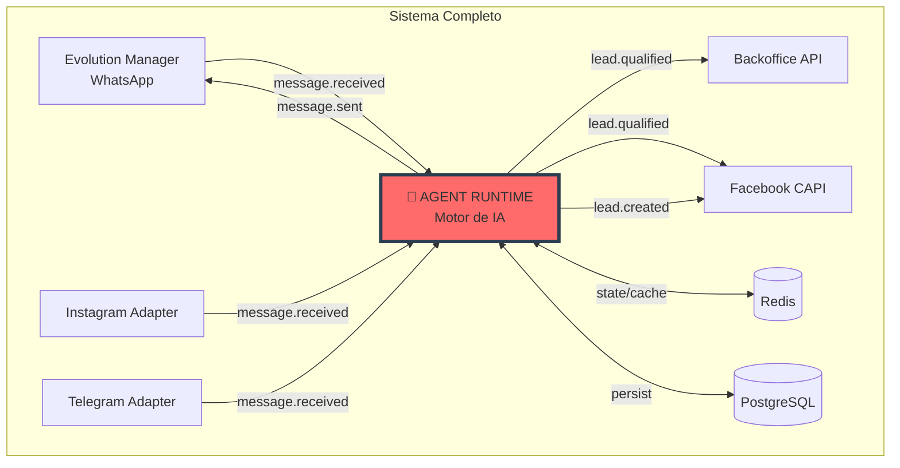

---

### Capacidades Principais

| Operação | Tipo | Descrição | Input | Output |
|----------|------|-----------|-------|--------|
| **ProcessMessage** | Command | Processa mensagem do lead | `InboundMessageDTO` | `OutboundMessagesDTO` |
| **EvaluateQualification** | Command | Avalia se lead atingiu threshold | `EvaluateQualificationDTO` | `QualificationResultDTO` |
| **RequestHandoff** | Command | Inicia handoff para CRM | `HandoffRequestDTO` | `HandoffResultDTO` |
| **GetConversation** | Query | Busca contexto de conversa | `GetConversationDTO` | `ConversationContextDTO` |
| **GetCenturionConfig** | Query | Busca config do Centurion | `CenturionIdDTO` | `CenturionConfigDTO` |
| **ScheduleFollowUp** | Command | Agenda follow-up proativo | `ScheduleFollowUpDTO` | `FollowUpScheduledDTO` |
| **ExecuteTool** | Command | Executa tool/MCP | `ToolExecutionDTO` | `ToolResultDTO` |

---

## Arquitetura Interna de Camadas

### Visão Geral das Camadas

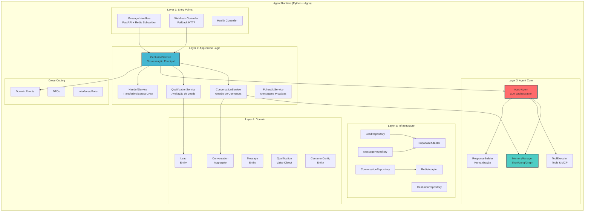

---

### Regra de Dependência

```
Entry Points (Handlers/Controllers)
         ↓
   Application (Services)
         ↓
   Agent Core (Agno/Memory/Tools)
         ↓
    Domain (Entities/VOs)
         ↓
  Infrastructure (Redis/Supabase)

Regra: Camadas superiores dependem de inferiores, NUNCA o contrário
AgnoAgent NÃO conhece FastAPI, Redis direto, Supabase direto
```

---

## Layer 1: Entry Points (Handlers)

### Responsabilidade da Camada

**O que faz:**

- Subscreve em canais Redis para mensagens de entrada
- Recebe webhooks HTTP como fallback
- Valida formato das mensagens
- Roteia para o serviço apropriado
- Publica eventos de saída

**O que NÃO faz:**

- ❌ Lógica de processamento de IA
- ❌ Acesso direto a banco de dados
- ❌ Decisões de qualificação

---

### Diagrama de Componentes

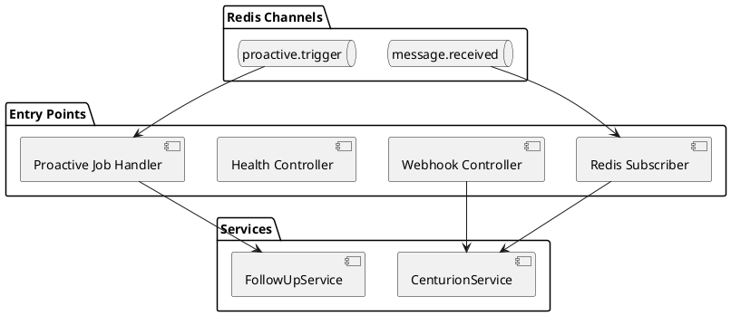

---

### Estrutura de Arquivos

```
src/
├── api/
│   ├── routes/
│   │   ├── __init__.py
│   │   ├── health.py              # Health check endpoints
│   │   ├── webhooks.py            # Webhook fallback
│   │   └── centurions.py          # Admin endpoints
│   ├── dependencies.py            # FastAPI dependencies
│   └── middleware/
│       ├── auth.py                # JWT validation
│       └── logging.py             # Request logging
│
├── handlers/
│   ├── __init__.py
│   ├── message_handler.py         # Redis subscriber principal
│   ├── proactive_handler.py       # Jobs de follow-up
│   └── debounce_handler.py        # Controle de debounce
```

---

### Padrões e Guidelines

#### Redis Subscriber Pattern

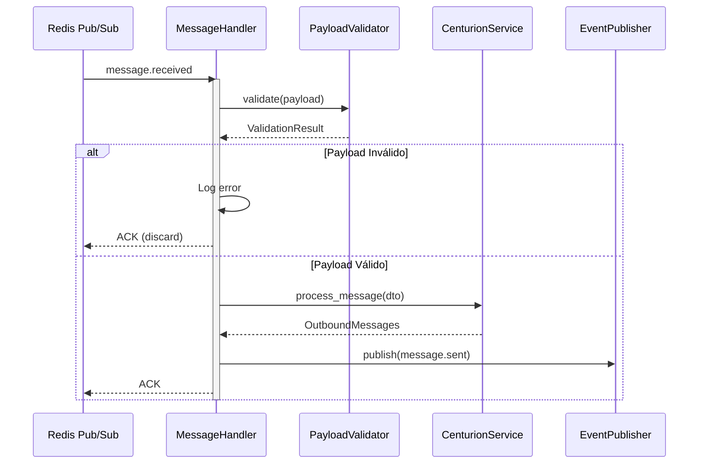

#### Debounce Pattern

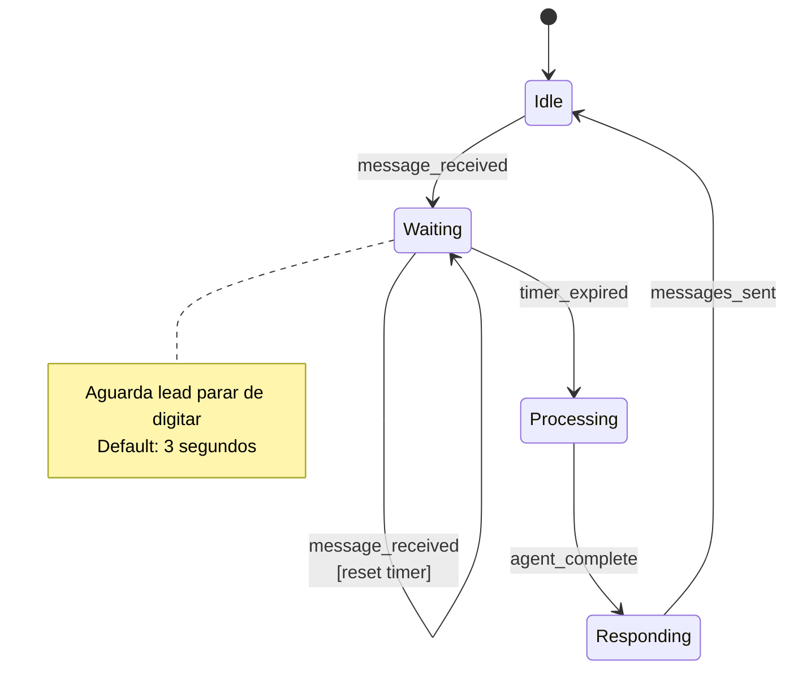

---

### Exemplo de Contrato (Interface)

```python
# handlers/message_handler.py

class MessageHandlerProtocol(Protocol):
    """
    Interface do Handler de Mensagens
    Define contrato para processamento de mensagens inbound
    """
    
    async def handle(self, payload: InboundMessagePayload) -> None:
        """Processa mensagem recebida via Redis"""
        ...
    
    async def handle_batch(self, payloads: list[InboundMessagePayload]) -> None:
        """Processa lote de mensagens (otimização)"""
        ...


# DTOs de entrada
@dataclass
class InboundMessagePayload:
    instance_id: str
    company_id: UUID
    channel: str  # whatsapp, instagram, telegram
    from_number: str
    message_type: str  # text, audio, image
    content: str | None
    media_url: str | None
    timestamp: datetime
    metadata: dict
```

---

## Layer 2: Services (Application Logic)

### Responsabilidade da Camada

**O que faz:**

- Orquestra o fluxo completo de processamento
- Coordena Agent, Memory, Tools
- Gerencia estado de conversas
- Avalia qualificação de leads
- Publica domain events

**O que NÃO faz:**

- ❌ Conhecer detalhes de Redis/HTTP
- ❌ Implementar lógica de LLM diretamente
- ❌ Acessar banco sem usar Repository

---

### Diagrama de Componentes

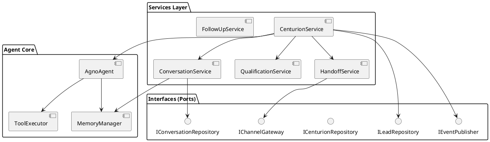

---

### Estrutura de Arquivos

```
src/
├── modules/
│   ├── centurion/
│   │   ├── __init__.py
│   │   ├── services/
│   │   │   ├── __init__.py
│   │   │   ├── centurion_service.py      # Orquestração principal
│   │   │   ├── conversation_service.py   # Gestão de conversas
│   │   │   ├── qualification_service.py  # Avaliação de leads
│   │   │   └── response_service.py       # Humanização de respostas
│   │   ├── dto/
│   │   │   ├── __init__.py
│   │   │   ├── inbound.py
│   │   │   ├── outbound.py
│   │   │   └── qualification.py
│   │   └── interfaces/
│   │       ├── __init__.py
│   │       └── centurion_repository.py
│   │
│   ├── handoff/
│   │   ├── __init__.py
│   │   ├── services/
│   │   │   └── handoff_service.py
│   │   └── events/
│   │       └── lead_qualified_event.py
│   │
│   └── followup/
│       ├── __init__.py
│       └── services/
│           └── followup_service.py
```

---

### CenturionService - Fluxo Principal

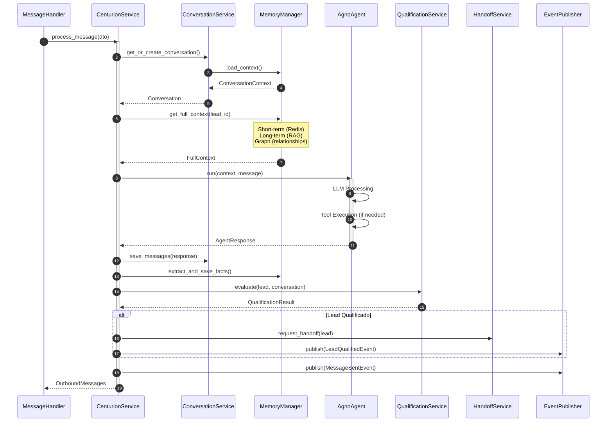

---

### ConversationService - Gestão de Estado

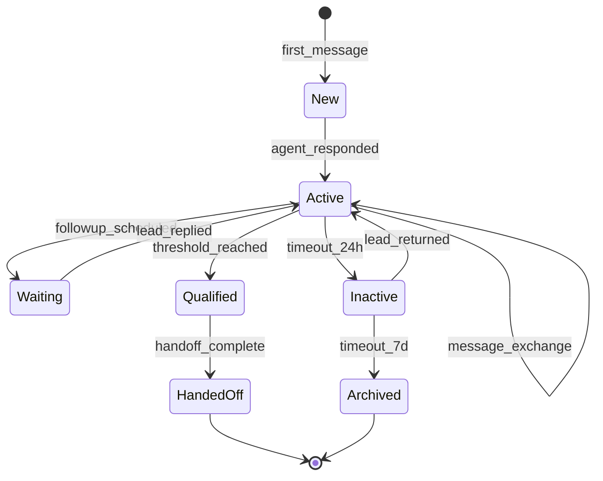

---

### QualificationService - Lógica de Avaliação

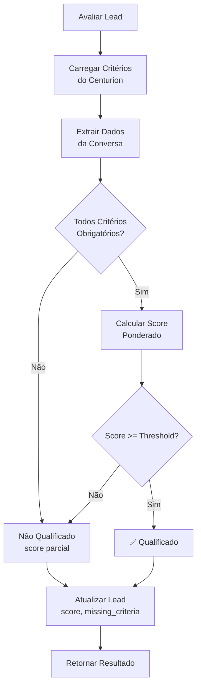

**Critérios Configuráveis:**

| Critério | Tipo | Peso | Exemplo |
|----------|------|------|---------|
| `has_name` | Boolean | 10 | Lead informou nome |
| `has_email` | Boolean | 15 | Lead informou email |
| `has_budget` | Boolean | 25 | Lead mencionou orçamento |
| `interest_level` | Score (0-100) | 20 | Calculado por IA |
| `decision_timeline` | Enum | 15 | imediato, 30d, 60d+ |
| `authority` | Boolean | 15 | É decisor? |

---

### Exemplo de Contrato (Interface)

```python
# services/centurion_service.py

class ICenturionService(Protocol):
    """
    Interface do CenturionService
    Define operações de orquestração de IA
    """
    
    async def process_message(
        self, 
        dto: InboundMessageDTO
    ) -> OutboundMessagesDTO:
        """Processa mensagem e retorna respostas"""
        ...
    
    async def evaluate_qualification(
        self,
        lead_id: UUID,
        company_id: UUID
    ) -> QualificationResultDTO:
        """Avalia se lead está qualificado"""
        ...
    
    async def request_handoff(
        self,
        lead_id: UUID,
        company_id: UUID
    ) -> HandoffResultDTO:
        """Solicita transferência para CRM"""
        ...


# DTOs
@dataclass
class OutboundMessagesDTO:
    messages: list[OutboundMessage]
    qualification_updated: bool
    handoff_triggered: bool
    
@dataclass
class OutboundMessage:
    content: str
    message_type: str  # text, audio, image
    media_url: str | None
    delay_ms: int  # Delay para humanização
```

---

## Layer 3: Agent Core (Agno Framework)

### Responsabilidade da Camada

**O que faz:**

- Executa o modelo de linguagem (LLM)
- Gerencia memória de curto/longo prazo
- Executa tools e chamadas MCP
- Constrói respostas humanizadas

**O que NÃO faz:**

- ❌ Conhecer HTTP, WebSocket, Redis
- ❌ Persistir diretamente no banco
- ❌ Tomar decisões de handoff (isso é do Service)

---

### Arquitetura do Agno Agent

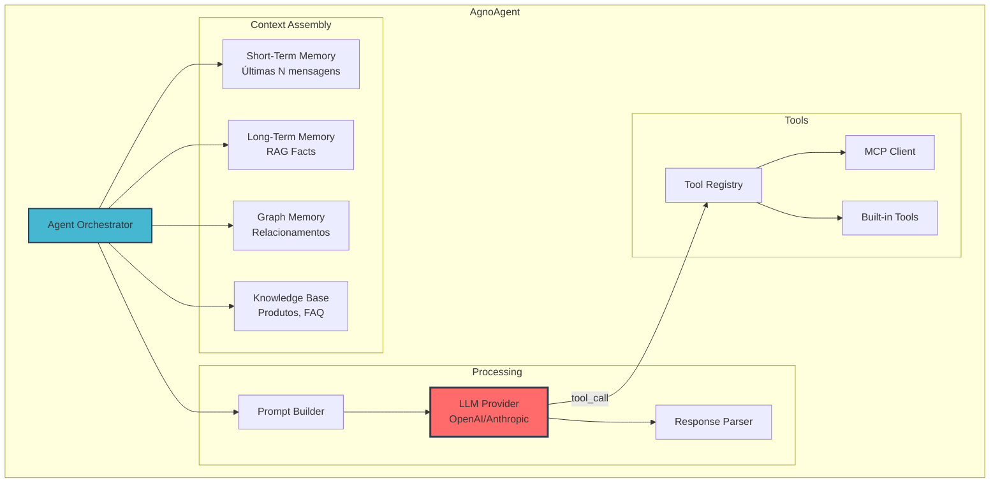

---

### Estrutura de Arquivos

```
src/
├── agents/
│   ├── __init__.py
│   ├── base_centurion.py          # Agent base com Agno
│   ├── qualifier_agent.py         # Especialização para qualificação
│   └── prompts/
│       ├── __init__.py
│       ├── system_prompt.py       # Prompt base
│       ├── qualification_prompt.py # Critérios de qualificação
│       └── personality_prompts.py  # Estilos de personalidade
│
├── modules/
│   ├── memory/
│   │   ├── __init__.py
│   │   ├── services/
│   │   │   ├── memory_manager.py      # Orquestrador de memórias
│   │   │   ├── short_term_memory.py   # Redis-based
│   │   │   ├── long_term_memory.py    # RAG-based
│   │   │   └── graph_memory.py        # Graph-based
│   │   ├── adapters/
│   │   │   ├── rag_adapter.py         # Conexão com vector store
│   │   │   └── graph_adapter.py       # Conexão com graph DB
│   │   └── interfaces/
│   │       └── memory_interface.py
│   │
│   └── tools/
│       ├── __init__.py
│       ├── services/
│       │   ├── tool_executor.py       # Execução de tools
│       │   └── mcp_client.py          # Cliente MCP
│       ├── domain/
│       │   └── tool.py                # Tool entity
│       └── adapters/
│           ├── calendar_tool.py       # Agendamento
│           ├── crm_tool.py            # Consulta CRM
│           ├── search_tool.py         # Busca web
│           └── calculator_tool.py     # Cálculos
```

---

### MemoryManager - Tipos de Memória

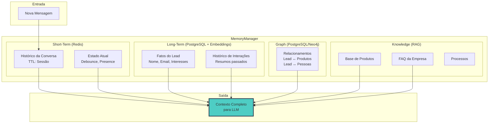

---

### ToolExecutor - Fluxo de Execução

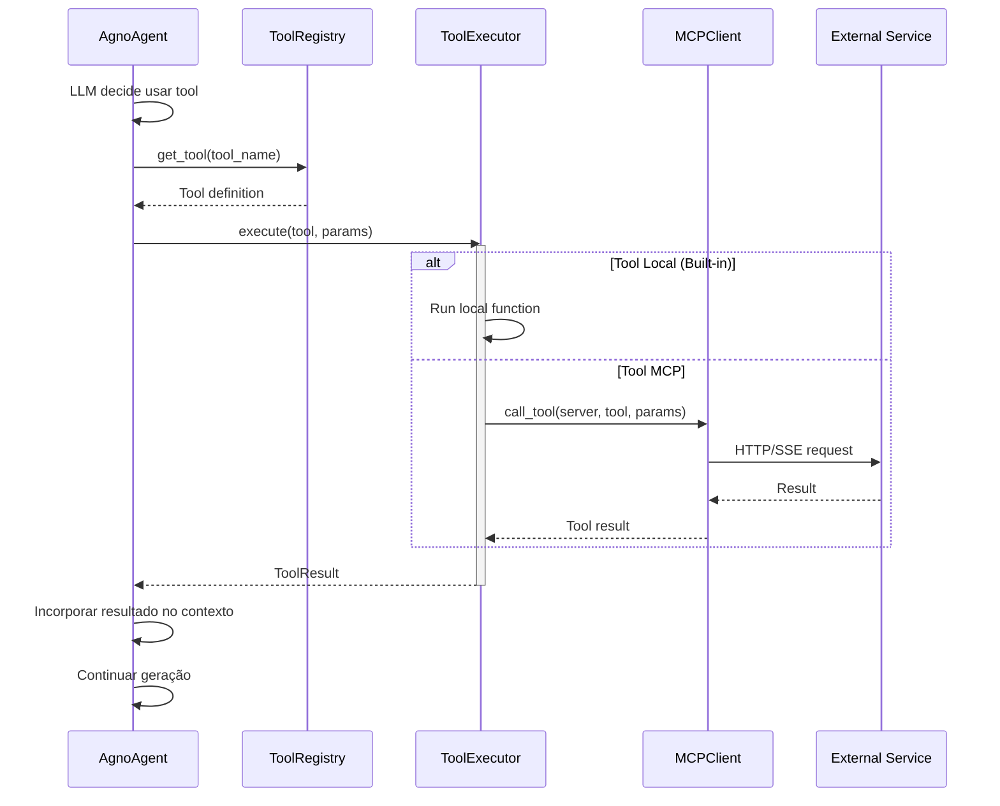

---

### Response Builder - Humanização

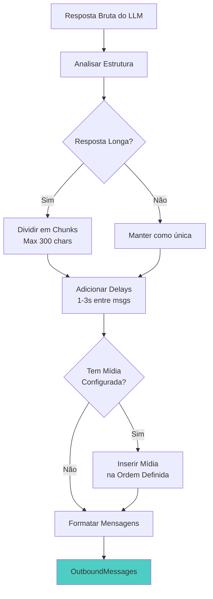

**Regras de Humanização:**

| Regra | Descrição | Configuração |
|-------|-----------|--------------|
| **Chunking** | Divide mensagens longas | max_chars: 300 |
| **Delay** | Intervalo entre mensagens | 1000-3000ms |
| **Typing** | Simula digitação | chars/segundo: 30 |
| **Media Order** | Ordem de envio de mídia | Configurável por Centurion |
| **Emoji** | Uso de emojis | Baseado em personality |

---

### Exemplo de Contrato (Interface)

```python
# agents/base_centurion.py

class IAgnoAgent(Protocol):
    """
    Interface do Agent Agno
    Define contrato para execução de IA
    """
    
    async def run(
        self,
        context: AgentContext,
        message: InboundMessage
    ) -> AgentResponse:
        """Executa o agente com contexto e mensagem"""
        ...
    
    async def run_with_tools(
        self,
        context: AgentContext,
        message: InboundMessage,
        available_tools: list[Tool]
    ) -> AgentResponse:
        """Executa com ferramentas disponíveis"""
        ...


@dataclass
class AgentContext:
    centurion_config: CenturionConfig
    conversation_history: list[Message]
    lead_facts: dict[str, Any]
    knowledge_chunks: list[str]
    graph_context: dict[str, Any]

@dataclass
class AgentResponse:
    content: str
    tool_calls: list[ToolCall]
    extracted_facts: dict[str, Any]
    qualification_signals: dict[str, float]
    confidence: float
```

---

## Layer 4: Domain (Entities & Value Objects)

### Responsabilidade da Camada

**O que faz:**

- Define entidades com comportamento de negócio
- Encapsula regras de qualificação
- Garante invariantes do domínio
- Publica domain events

**O que NÃO faz:**

- ❌ Conhecer frameworks, Redis, Supabase
- ❌ Fazer I/O de qualquer tipo
- ❌ Depender de Services ou Repositories

---

### Diagrama de Entidades

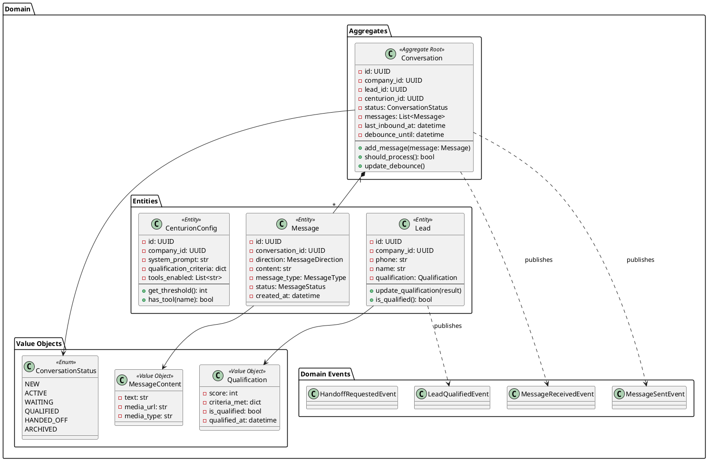

---

### Estrutura de Arquivos

```
src/
├── modules/
│   ├── centurion/
│   │   └── domain/
│   │       ├── __init__.py
│   │       ├── entities/
│   │       │   ├── conversation.py
│   │       │   ├── message.py
│   │       │   └── centurion_config.py
│   │       ├── value_objects/
│   │       │   ├── qualification.py
│   │       │   ├── message_content.py
│   │       │   └── conversation_status.py
│   │       ├── events/
│   │       │   ├── message_received.py
│   │       │   ├── message_sent.py
│   │       │   └── lead_qualified.py
│   │       └── exceptions/
│   │           ├── conversation_closed.py
│   │           └── invalid_qualification.py
│   │
│   └── leads/
│       └── domain/
│           └── entities/
│               └── lead.py
```

---

### Conversation Aggregate - Invariantes

```python
# domain/entities/conversation.py

"""
Aggregate: Conversation
Invariantes:
- Não pode adicionar mensagem se status == ARCHIVED
- Não pode processar se debounce_until > now
- Messages devem ser ordenadas por created_at
- Deve ter pelo menos 1 mensagem para estar ACTIVE
"""

class Conversation:
    def __init__(self, props: ConversationProps):
        self._validate_invariants(props)
        self._id = props.id
        self._messages = props.messages or []
        self._status = props.status or ConversationStatus.NEW
        self._debounce_until = props.debounce_until
    
    def add_message(self, message: Message) -> None:
        """Adiciona mensagem respeitando invariantes"""
        if self._status == ConversationStatus.ARCHIVED:
            raise ConversationClosedException()
        
        self._messages.append(message)
        self._messages.sort(key=lambda m: m.created_at)
        
        if self._status == ConversationStatus.NEW:
            self._status = ConversationStatus.ACTIVE
        
        # Domain event
        self._add_event(MessageReceivedEvent(
            conversation_id=self._id,
            message_id=message.id
        ))
    
    def should_process(self) -> bool:
        """Verifica se pode processar (debounce)"""
        return (
            self._debounce_until is None or
            datetime.utcnow() >= self._debounce_until
        )
    
    def update_debounce(self, seconds: int) -> None:
        """Atualiza debounce timer"""
        self._debounce_until = datetime.utcnow() + timedelta(seconds=seconds)
```

---

### Qualification Value Object

```python
# domain/value_objects/qualification.py

"""
Value Object: Qualification
Imutável - nova instância para cada mudança
Equality por valor, não por identidade
"""

@dataclass(frozen=True)
class Qualification:
    score: int
    criteria_met: frozendict[str, bool]
    threshold: int
    qualified_at: datetime | None
    
    @property
    def is_qualified(self) -> bool:
        return self.score >= self.threshold
    
    @property
    def missing_criteria(self) -> list[str]:
        return [k for k, v in self.criteria_met.items() if not v]
    
    @property
    def completion_percentage(self) -> float:
        met = sum(1 for v in self.criteria_met.values() if v)
        return (met / len(self.criteria_met)) * 100
    
    def with_updated_criteria(
        self, 
        criteria: str, 
        met: bool, 
        weight: int
    ) -> 'Qualification':
        """Retorna nova Qualification com critério atualizado"""
        new_criteria = dict(self.criteria_met)
        new_criteria[criteria] = met
        
        new_score = self._calculate_score(new_criteria)
        
        return Qualification(
            score=new_score,
            criteria_met=frozendict(new_criteria),
            threshold=self.threshold,
            qualified_at=datetime.utcnow() if new_score >= self.threshold else None
        )
```

---

## Layer 5: Infrastructure (Repositories & Adapters)

### Responsabilidade da Camada

**O que faz:**

- Implementa interfaces definidas nas camadas superiores
- Conecta com Redis, Supabase, APIs externas
- Converte entre Domain Models e Data Models
- Gerencia conexões e pools

**O que NÃO faz:**

- ❌ Lógica de negócio
- ❌ Decisões de qualificação
- ❌ Orquestração de operações

---

### Diagrama de Componentes

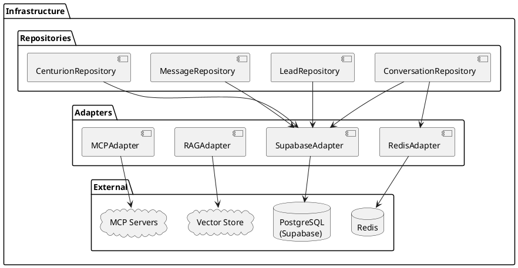

---

### Estrutura de Arquivos

```
src/
├── common/
│   └── infrastructure/
│       ├── __init__.py
│       ├── database/
│       │   ├── supabase_client.py
│       │   └── connection_pool.py
│       ├── cache/
│       │   ├── redis_client.py
│       │   └── redis_pubsub.py
│       └── messaging/
│           └── event_publisher.py
│
├── modules/
│   ├── centurion/
│   │   └── repository/
│   │       ├── __init__.py
│   │       ├── conversation_repository.py
│   │       ├── message_repository.py
│   │       ├── centurion_repository.py
│   │       └── mappers/
│   │           ├── conversation_mapper.py
│   │           └── message_mapper.py
│   │
│   ├── memory/
│   │   └── adapters/
│   │       ├── redis_short_term.py
│   │       ├── supabase_long_term.py
│   │       └── rag_adapter.py
│   │
│   └── tools/
│       └── adapters/
│           └── mcp_client_impl.py
```

---

### ConversationRepository - Implementação

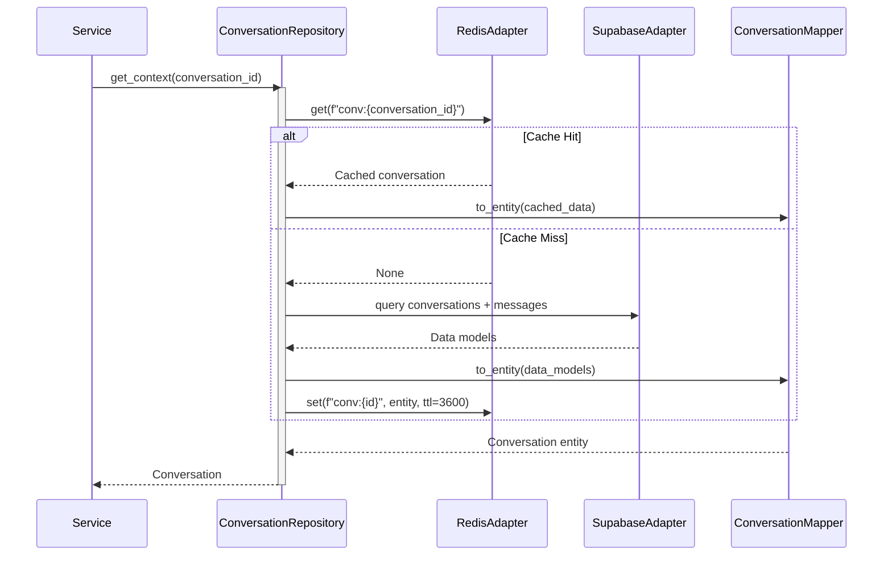

---

## Domain Events

### Eventos Publicados

| Evento | Quando | Payload | Consumidores |
|--------|--------|---------|--------------|
| `MessageReceivedEvent` | Mensagem inbound processada | `{lead_id, message_id, channel}` | Interno |
| `MessageSentEvent` | Resposta enviada | `{lead_id, messages[], channel}` | Evolution Manager |
| `LeadQualifiedEvent` | Lead atingiu threshold | `{lead_id, company_id, score, criteria}` | Backoffice API, Facebook CAPI |
| `HandoffRequestedEvent` | Handoff iniciado | `{lead_id, company_id, deal_id}` | Backoffice API |
| `FollowUpScheduledEvent` | Follow-up agendado | `{lead_id, scheduled_at, message}` | Interno |

### Eventos Consumidos

| Evento | Origem | Handler | Ação |
|--------|--------|---------|------|
| `message.received` | Evolution Manager | MessageHandler | Processa mensagem |
| `proactive.trigger` | Scheduler | ProactiveHandler | Envia follow-up |
| `centurion.config.updated` | Backoffice API | ConfigHandler | Recarrega config |

---

## Integração com Outros Serviços

### Diagrama de Integração

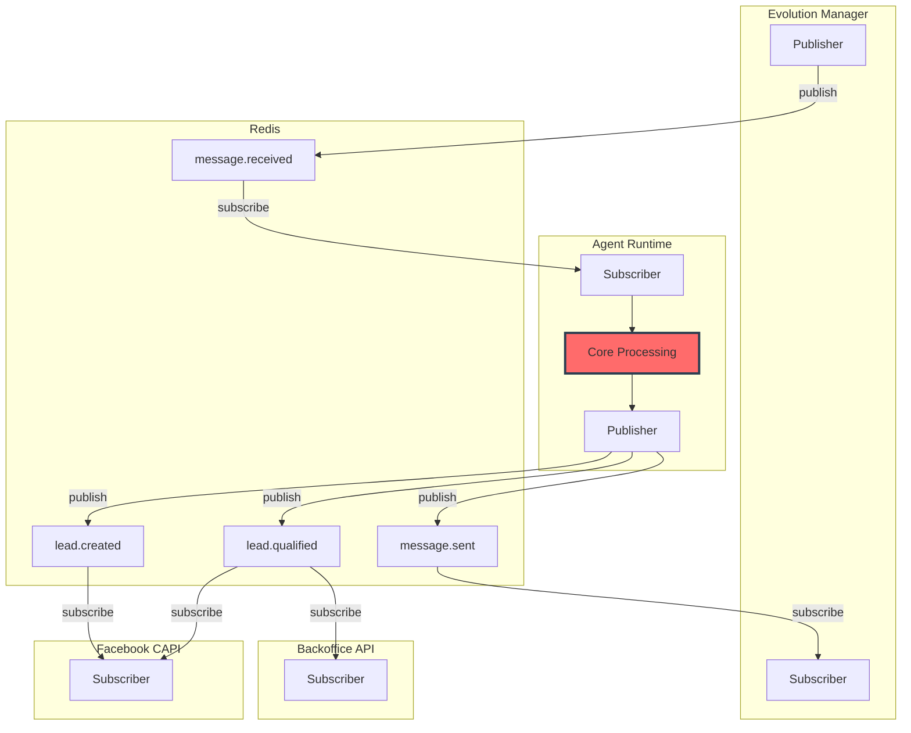

---

## Padrões Técnicos Específicos

### Error Handling

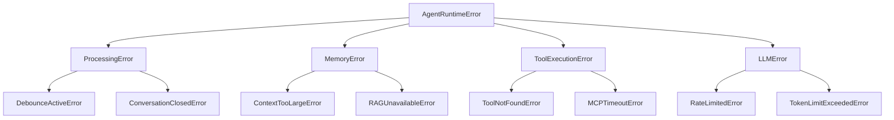

---

### Configuração do Centurion

```yaml
# Exemplo de configuração de um Centurion

centurion:
  id: "uuid"
  company_id: "uuid"
  name: "Consultora Maria"
  slug: "maria"
  
  # Personalidade
  personality:
    style: "conversational"  # formal, conversational, friendly
    tone: "empático"
    language: "pt-BR"
    use_emojis: true
    emoji_frequency: "moderate"
  
  # Qualificação
  qualification:
    threshold: 70
    criteria:
      - name: "has_name"
        weight: 10
        required: true
      - name: "has_budget"
        weight: 25
        required: true
      - name: "interest_level"
        weight: 20
        required: false
      - name: "decision_timeline"
        weight: 15
        required: false
      - name: "authority"
        weight: 15
        required: false
  
  # Comportamento
  behavior:
    debounce_seconds: 3
    message_chunking: true
    max_chunk_size: 300
    typing_simulation: true
    response_delay_ms: [1000, 3000]
  
  # Tools
  tools:
    enabled:
      - "search_products"
      - "check_availability"
      - "calculate_price"
    mcp_servers:
      - url: "http://crm-mcp:8080"
        name: "crm-tools"
  
  # Follow-up
  followup:
    enabled: true
    rules:
      - trigger: "no_response_24h"
        message: "Oi! Tudo bem? Ainda está interessado?"
      - trigger: "no_response_72h"
        message: "Posso ajudar com mais alguma dúvida?"
```

---

### Métricas e Observabilidade

```python
# Métricas expostas via Prometheus

# Counters
messages_received_total{company_id, channel, centurion_id}
messages_sent_total{company_id, channel, centurion_id}
leads_qualified_total{company_id, centurion_id}
handoffs_completed_total{company_id}
tool_executions_total{tool_name, status}

# Histograms
message_processing_duration_seconds{company_id}
llm_response_duration_seconds{provider, model}
tool_execution_duration_seconds{tool_name}
qualification_evaluation_duration_seconds{}

# Gauges
active_conversations{company_id}
pending_followups{company_id}
memory_context_size_bytes{memory_type}
```

---

## Implementação - Checklist

### Fase 1: Domain Layer ✅

- [ ] Definir Conversation aggregate
- [ ] Criar Message entity
- [ ] Criar Lead entity
- [ ] Implementar Qualification value object
- [ ] Definir domain events
- [ ] Escrever testes unitários

### Fase 2: Agent Core ✅

- [ ] Configurar Agno Framework
- [ ] Implementar MemoryManager
- [ ] Implementar ShortTermMemory (Redis)
- [ ] Implementar LongTermMemory (RAG)
- [ ] Implementar ToolExecutor
- [ ] Implementar ResponseBuilder
- [ ] Testes de integração com LLM

### Fase 3: Services Layer ✅

- [ ] Implementar CenturionService
- [ ] Implementar ConversationService
- [ ] Implementar QualificationService
- [ ] Implementar HandoffService
- [ ] Configurar event publishing
- [ ] Testes de integração

### Fase 4: Infrastructure ✅

- [ ] Implementar ConversationRepository
- [ ] Implementar MessageRepository
- [ ] Implementar Redis adapters
- [ ] Implementar Supabase adapters
- [ ] Configurar connection pools
- [ ] Testes de integração com DB

### Fase 5: Entry Points ✅

- [ ] Configurar Redis subscriber
- [ ] Implementar MessageHandler
- [ ] Implementar debounce logic
- [ ] Configurar FastAPI routes
- [ ] Health checks
- [ ] Testes E2E

---

## Referências

### Documentos Relacionados

| Documento | Seção | Link |
|-----------|-------|------|
| Arquitetura Macro | SVC-003 | ARCH-MACRO-v2.0 |
| SDR & Leads | Qualificação | arch-micro-sdr-leads.md |
| Governance | Centurion Configs | arch-micro-governance-companies.md |

### Tecnologias

- **Agno Framework**: https://docs.agno.dev
- **FastAPI**: https://fastapi.tiangolo.com
- **Redis Pub/Sub**: https://redis.io/docs/manual/pubsub/
- **Supabase Python**: https://supabase.com/docs/reference/python

---

**FIM DO DOCUMENTO**

---

*Arquitetura Micro: Agent Runtime v1.0*  
*Motor de Orquestração de IA - Centurions*  
*Gerado em: 2025-12-16*
