# Arquitetura Micro: Backoffice API v1.0

**Documento ID:** ARCH-backoffice-api-v1.0  
**Módulo:** Backoffice API  
**Bounded Context:** Orquestração & CRUD Backend  
**Data de Criação:** 2025-12-16  
**Última Atualização:** 2025-12-16  
**Baseado em:** ARCH-MACRO-v2.0  
**Status:** Draft  

---

## Visão Geral do Módulo

### Propósito e Responsabilidade

**Responsabilidade Única (SRP):**  
Servir como API principal para o frontend (Backoffice Web), orquestrando chamadas entre serviços, gerenciando autenticação/autorização, executando operações CRUD e provendo endpoints para gestão da holding.

**Bounded Context:**  
Este módulo é o **gateway de orquestração** do sistema. Ele centraliza todas as operações administrativas, validando permissões, coordenando com outros serviços especializados e garantindo consistência das operações. É a única entrada para o frontend web.

**Por que este módulo existe:**

- Centralizar autenticação e autorização (JWT + Supabase Auth)
- Prover API REST/GraphQL unificada para o frontend
- Orquestrar chamadas entre serviços especializados
- Implementar CRUD de empresas, usuários, Centurions
- Agregar dados para dashboards e métricas

---

### Localização na Arquitetura Macro

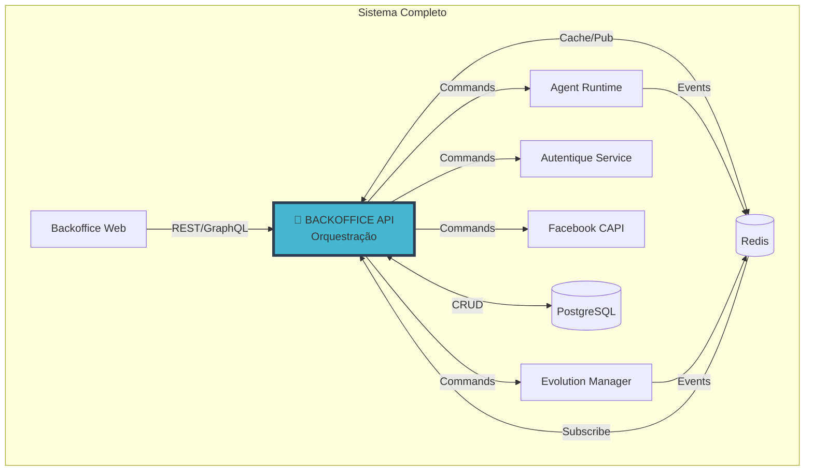

---

### Capacidades Principais

| Domínio | Operações | Descrição |
|---------|-----------|-----------|
| **Auth** | Login, Refresh, Logout | Autenticação via Supabase |
| **Companies** | CRUD | Gestão de empresas da holding |
| **Users** | CRUD, Invite | Usuários por empresa |
| **Centurions** | CRUD, Config | IAs de qualificação |
| **Instances** | Connect, Disconnect, Status | Instâncias WhatsApp |
| **Leads** | List, Details, Export | Leads do CORE |
| **Contracts** | Templates, Generate, Status | Contratos digitais |
| **Pixels** | Config, Events | Marketing tracking |
| **Metrics** | Dashboards, Reports | Métricas consolidadas |

---

## Arquitetura Interna de Camadas

### Visão Geral das Camadas

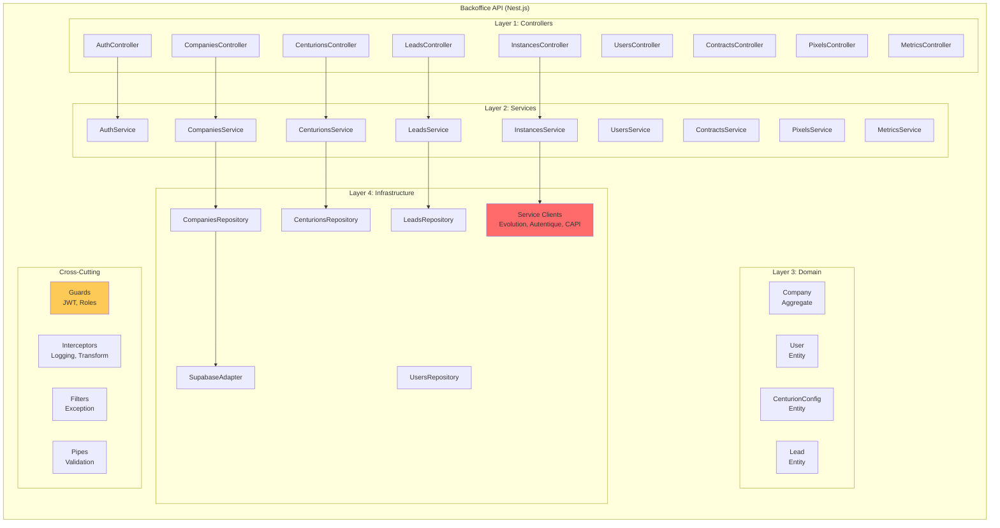

---

## Layer 1: Controllers

### Estrutura de Arquivos

```
src/
├── modules/
│   ├── auth/
│   │   └── controllers/
│   │       └── auth.controller.ts
│   │
│   ├── companies/
│   │   └── controllers/
│   │       ├── companies.controller.ts
│   │       └── company-users.controller.ts
│   │
│   ├── centurions/
│   │   └── controllers/
│   │       └── centurions.controller.ts
│   │
│   ├── instances/
│   │   └── controllers/
│   │       └── instances.controller.ts
│   │
│   ├── leads/
│   │   └── controllers/
│   │       └── leads.controller.ts
│   │
│   ├── contracts/
│   │   └── controllers/
│   │       ├── contracts.controller.ts
│   │       └── templates.controller.ts
│   │
│   ├── pixels/
│   │   └── controllers/
│   │       └── pixels.controller.ts
│   │
│   └── metrics/
│       └── controllers/
│           └── metrics.controller.ts
```

---

### Endpoints por Módulo

#### Auth Module

| Método | Endpoint | Descrição | Auth |
|--------|----------|-----------|------|
| POST | `/auth/login` | Login com email/senha | ❌ |
| POST | `/auth/refresh` | Refresh token | ❌ |
| POST | `/auth/logout` | Logout | ✅ |
| GET | `/auth/me` | Dados do usuário logado | ✅ |
| POST | `/auth/forgot-password` | Solicita reset de senha | ❌ |
| POST | `/auth/reset-password` | Reseta senha com token | ❌ |

#### Companies Module

| Método | Endpoint | Descrição | Roles |
|--------|----------|-----------|-------|
| GET | `/companies` | Lista empresas | backoffice_admin |
| POST | `/companies` | Cria empresa | backoffice_admin |
| GET | `/companies/:id` | Detalhes empresa | backoffice_admin |
| PATCH | `/companies/:id` | Atualiza empresa | backoffice_admin |
| DELETE | `/companies/:id` | Arquiva empresa | super_admin |
| GET | `/companies/:id/users` | Lista usuários | backoffice_admin |
| POST | `/companies/:id/users` | Adiciona usuário | backoffice_admin |
| DELETE | `/companies/:id/users/:userId` | Remove usuário | backoffice_admin |

#### Centurions Module

| Método | Endpoint | Descrição | Roles |
|--------|----------|-----------|-------|
| GET | `/centurions` | Lista Centurions | backoffice_admin, ai_supervisor |
| POST | `/centurions` | Cria Centurion | backoffice_admin |
| GET | `/centurions/:id` | Detalhes Centurion | backoffice_admin, ai_supervisor |
| PATCH | `/centurions/:id` | Atualiza config | backoffice_admin |
| DELETE | `/centurions/:id` | Remove Centurion | backoffice_admin |
| POST | `/centurions/:id/test` | Testa prompt | backoffice_admin |
| GET | `/centurions/:id/metrics` | Métricas do Centurion | backoffice_admin, ai_supervisor |

#### Instances Module

| Método | Endpoint | Descrição | Roles |
|--------|----------|-----------|-------|
| GET | `/instances` | Lista instâncias | backoffice_admin |
| POST | `/instances` | Cria instância | backoffice_admin |
| GET | `/instances/:id` | Detalhes | backoffice_admin |
| POST | `/instances/:id/connect` | Conecta (gera QR) | backoffice_admin |
| POST | `/instances/:id/disconnect` | Desconecta | backoffice_admin |
| GET | `/instances/:id/qrcode` | QR code atual | backoffice_admin |
| DELETE | `/instances/:id` | Remove instância | backoffice_admin |

#### Leads Module

| Método | Endpoint | Descrição | Roles |
|--------|----------|-----------|-------|
| GET | `/leads` | Lista leads | backoffice_admin, ai_supervisor |
| GET | `/leads/:id` | Detalhes lead | backoffice_admin, ai_supervisor |
| GET | `/leads/:id/conversations` | Histórico conversas | backoffice_admin, ai_supervisor |
| GET | `/leads/:id/timeline` | Timeline de eventos | backoffice_admin, ai_supervisor |
| POST | `/leads/export` | Exporta CSV/Excel | backoffice_admin |

#### Contracts Module

| Método | Endpoint | Descrição | Roles |
|--------|----------|-----------|-------|
| GET | `/contracts/templates` | Lista templates | backoffice_admin |
| POST | `/contracts/templates` | Cria template | backoffice_admin |
| PATCH | `/contracts/templates/:id` | Atualiza template | backoffice_admin |
| DELETE | `/contracts/templates/:id` | Remove template | backoffice_admin |
| GET | `/contracts` | Lista contratos | backoffice_admin |
| POST | `/contracts` | Gera contrato | backoffice_admin |
| GET | `/contracts/:id` | Detalhes contrato | backoffice_admin |

#### Pixels Module

| Método | Endpoint | Descrição | Roles |
|--------|----------|-----------|-------|
| GET | `/pixels` | Lista configs pixel | backoffice_admin, marketing_admin |
| POST | `/pixels` | Configura pixel | backoffice_admin, marketing_admin |
| PATCH | `/pixels/:id` | Atualiza config | backoffice_admin, marketing_admin |
| DELETE | `/pixels/:id` | Remove config | backoffice_admin |
| GET | `/pixels/:id/events` | Eventos enviados | backoffice_admin, marketing_admin |

#### Metrics Module

| Método | Endpoint | Descrição | Roles |
|--------|----------|-----------|-------|
| GET | `/metrics/overview` | Dashboard geral | backoffice_admin |
| GET | `/metrics/leads` | Métricas de leads | backoffice_admin |
| GET | `/metrics/conversions` | Métricas de conversão | backoffice_admin |
| GET | `/metrics/centurions` | Performance IAs | backoffice_admin |
| GET | `/metrics/companies/:id` | Métricas por empresa | backoffice_admin |

---

### Guards - Autenticação e Autorização

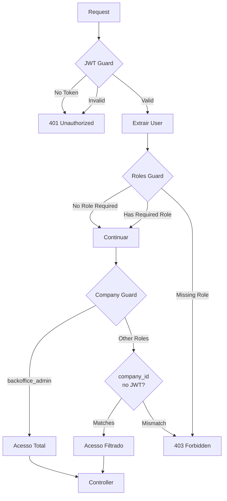

---

### Exemplo de Controller

```typescript
// controllers/companies.controller.ts

@Controller('companies')
@UseGuards(JwtAuthGuard, RolesGuard)
@ApiTags('Companies')
export class CompaniesController {
  constructor(private readonly companiesService: ICompaniesService) {}

  @Get()
  @Roles('backoffice_admin', 'super_admin')
  @ApiOperation({ summary: 'Lista todas as empresas' })
  async findAll(
    @Query() filters: ListCompaniesDTO,
    @CurrentUser() user: JwtPayload,
  ): Promise<PaginatedResponse<CompanyResponseDTO>> {
    return this.companiesService.findAll(filters);
  }

  @Post()
  @Roles('backoffice_admin', 'super_admin')
  @ApiOperation({ summary: 'Cria nova empresa' })
  async create(
    @Body() dto: CreateCompanyDTO,
    @CurrentUser() user: JwtPayload,
  ): Promise<CompanyResponseDTO> {
    return this.companiesService.create(dto, user.id);
  }

  @Get(':id')
  @Roles('backoffice_admin', 'super_admin')
  @ApiOperation({ summary: 'Detalhes da empresa' })
  async findOne(
    @Param('id', ParseUUIDPipe) id: string,
  ): Promise<CompanyDetailResponseDTO> {
    return this.companiesService.findById(id);
  }

  @Patch(':id')
  @Roles('backoffice_admin', 'super_admin')
  @ApiOperation({ summary: 'Atualiza empresa' })
  async update(
    @Param('id', ParseUUIDPipe) id: string,
    @Body() dto: UpdateCompanyDTO,
  ): Promise<CompanyResponseDTO> {
    return this.companiesService.update(id, dto);
  }
}
```

---

## Layer 2: Services

### Estrutura de Arquivos

```
src/
├── modules/
│   ├── auth/
│   │   ├── services/
│   │   │   └── auth.service.ts
│   │   ├── strategies/
│   │   │   ├── jwt.strategy.ts
│   │   │   └── supabase.strategy.ts
│   │   └── interfaces/
│   │       └── auth.service.interface.ts
│   │
│   ├── companies/
│   │   ├── services/
│   │   │   ├── companies.service.ts
│   │   │   └── company-users.service.ts
│   │   ├── dto/
│   │   │   ├── create-company.dto.ts
│   │   │   ├── update-company.dto.ts
│   │   │   └── company-response.dto.ts
│   │   └── interfaces/
│   │       └── companies.service.interface.ts
│   │
│   ├── centurions/
│   │   ├── services/
│   │   │   └── centurions.service.ts
│   │   ├── dto/
│   │   └── interfaces/
│   │
│   ├── instances/
│   │   ├── services/
│   │   │   └── instances.service.ts
│   │   ├── clients/
│   │   │   └── evolution.client.ts
│   │   └── dto/
│   │
│   ├── leads/
│   │   ├── services/
│   │   │   └── leads.service.ts
│   │   └── dto/
│   │
│   └── metrics/
│       ├── services/
│       │   ├── metrics.service.ts
│       │   └── aggregation.service.ts
│       └── dto/
```

---

### CompaniesService - Fluxo de Criação

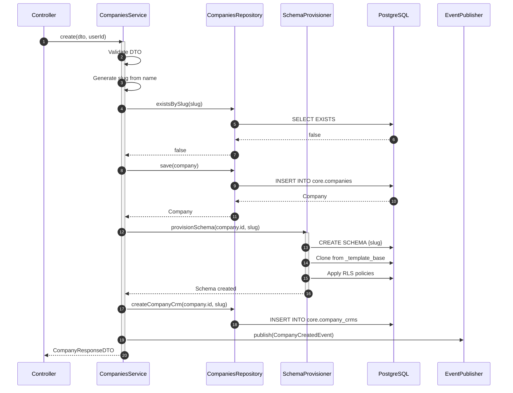

---

### CenturionsService - Gestão de Configuração

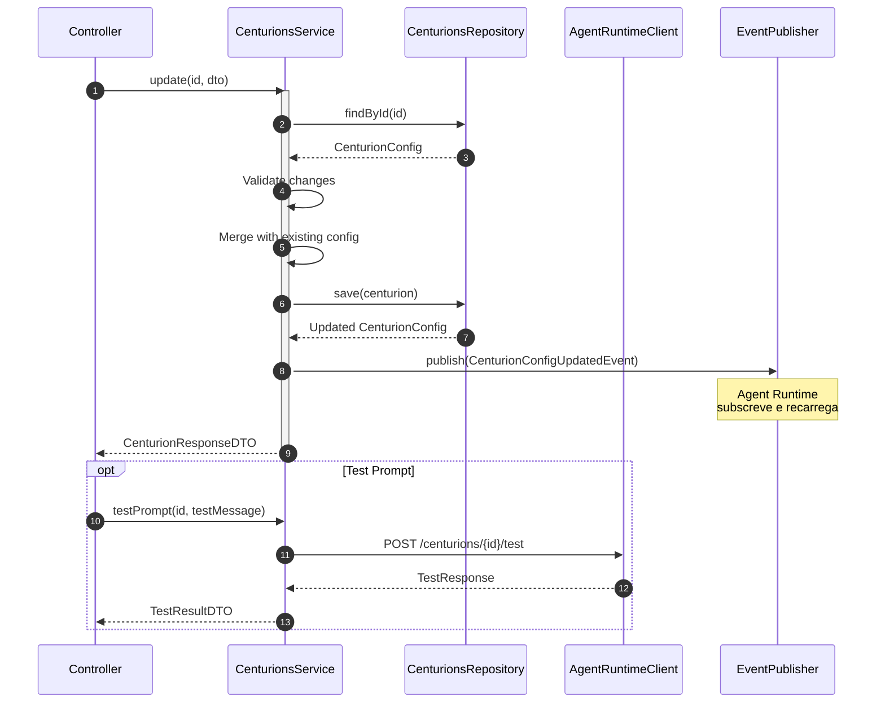

---

### InstancesService - Integração com Evolution Manager

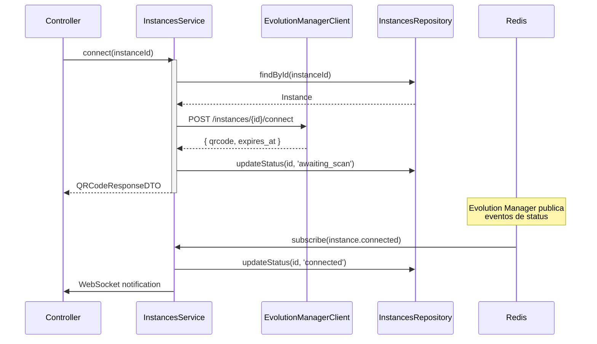

---

### MetricsService - Agregação de Dados

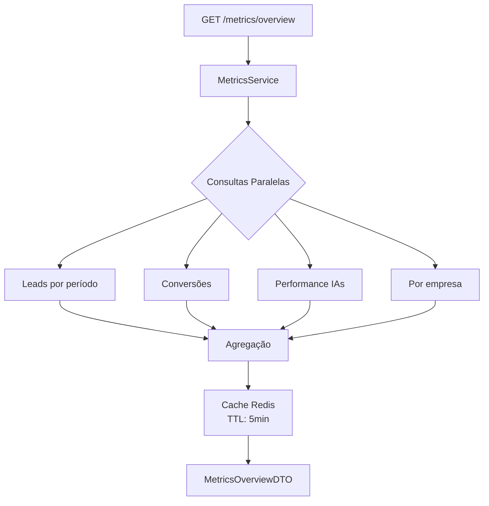

---

### Exemplo de Contrato (Interface)

```typescript
// services/interfaces/companies.service.interface.ts

export interface ICompaniesService {
  create(dto: CreateCompanyDTO, userId: string): Promise<CompanyResponseDTO>;
  findAll(filters: ListCompaniesDTO): Promise<PaginatedResponse<CompanyResponseDTO>>;
  findById(id: string): Promise<CompanyDetailResponseDTO>;
  update(id: string, dto: UpdateCompanyDTO): Promise<CompanyResponseDTO>;
  archive(id: string): Promise<void>;
  
  // Company Users
  addUser(companyId: string, dto: AddUserDTO): Promise<CompanyUserResponseDTO>;
  removeUser(companyId: string, userId: string): Promise<void>;
  listUsers(companyId: string): Promise<CompanyUserListDTO>;
}

// DTOs
export interface CreateCompanyDTO {
  name: string;
  document?: string;
  settings?: CompanySettingsDTO;
}

export interface CompanyResponseDTO {
  id: string;
  name: string;
  slug: string;
  document: string | null;
  status: CompanyStatus;
  schema_name: string;
  created_at: Date;
  updated_at: Date;
}

export interface CompanyDetailResponseDTO extends CompanyResponseDTO {
  users_count: number;
  leads_count: number;
  centurions_count: number;
  instances_count: number;
  settings: CompanySettingsDTO;
}
```

---

## Layer 3: Domain

### Diagrama de Entidades

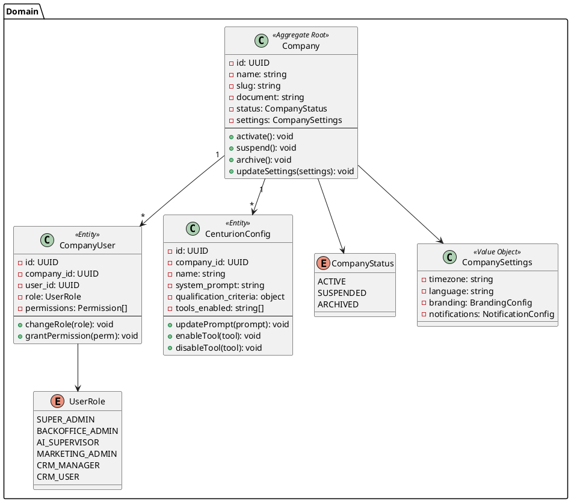

---

### Estrutura de Arquivos

```
src/
├── modules/
│   ├── companies/
│   │   └── domain/
│   │       ├── entities/
│   │       │   ├── company.entity.ts
│   │       │   └── company-user.entity.ts
│   │       ├── value-objects/
│   │       │   └── company-settings.vo.ts
│   │       ├── enums/
│   │       │   ├── company-status.enum.ts
│   │       │   └── user-role.enum.ts
│   │       └── events/
│   │           ├── company-created.event.ts
│   │           └── company-status-changed.event.ts
│   │
│   └── centurions/
│       └── domain/
│           ├── entities/
│           │   └── centurion-config.entity.ts
│           └── events/
│               └── centurion-config-updated.event.ts
```

---

### Company - Máquina de Estados

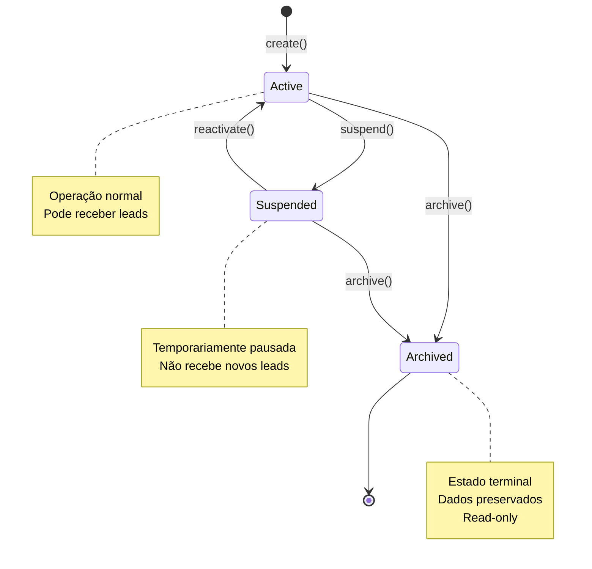

---

## Layer 4: Infrastructure

### Diagrama de Componentes

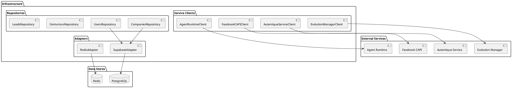

---

### Estrutura de Arquivos

```
src/
├── infrastructure/
│   ├── supabase/
│   │   ├── supabase.module.ts
│   │   ├── supabase.service.ts
│   │   └── supabase.config.ts
│   │
│   ├── redis/
│   │   ├── redis.module.ts
│   │   ├── redis.service.ts
│   │   └── redis-subscriber.service.ts
│   │
│   ├── clients/
│   │   ├── evolution-manager.client.ts
│   │   ├── autentique-service.client.ts
│   │   ├── facebook-capi.client.ts
│   │   └── agent-runtime.client.ts
│   │
│   └── repositories/
│       ├── companies.repository.ts
│       ├── users.repository.ts
│       ├── centurions.repository.ts
│       ├── leads.repository.ts
│       └── mappers/
│           ├── company.mapper.ts
│           └── centurion.mapper.ts
```

---

### Service Clients - Comunicação com Serviços

```typescript
// infrastructure/clients/evolution-manager.client.ts

@Injectable()
export class EvolutionManagerClient {
  constructor(
    private readonly httpService: HttpService,
    private readonly configService: ConfigService,
  ) {}

  private get baseUrl(): string {
    return this.configService.get('EVOLUTION_MANAGER_URL');
  }

  async createInstance(dto: CreateInstanceDTO): Promise<InstanceDTO> {
    const response = await this.httpService.axiosRef.post(
      `${this.baseUrl}/instances`,
      dto,
    );
    return response.data;
  }

  async connect(instanceId: string): Promise<QRCodeDTO> {
    const response = await this.httpService.axiosRef.post(
      `${this.baseUrl}/instances/${instanceId}/connect`,
    );
    return response.data;
  }

  async disconnect(instanceId: string): Promise<void> {
    await this.httpService.axiosRef.post(
      `${this.baseUrl}/instances/${instanceId}/disconnect`,
    );
  }

  async getStatus(instanceId: string): Promise<InstanceStatusDTO> {
    const response = await this.httpService.axiosRef.get(
      `${this.baseUrl}/instances/${instanceId}/status`,
    );
    return response.data;
  }
}
```

---

### Redis Subscriber - Eventos em Tempo Real

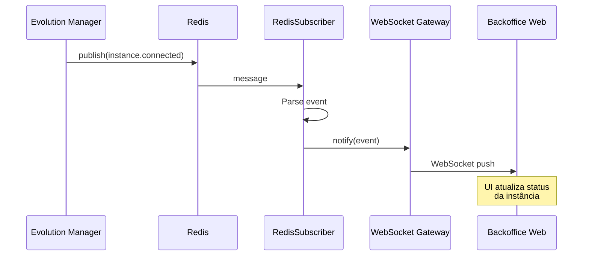

---

## Cross-Cutting Concerns

### Autenticação (JWT + Supabase)

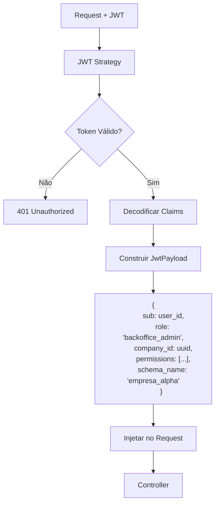

---

### Exception Handling

```typescript
// common/filters/global-exception.filter.ts

@Catch()
export class GlobalExceptionFilter implements ExceptionFilter {
  catch(exception: unknown, host: ArgumentsHost) {
    const ctx = host.switchToHttp();
    const response = ctx.getResponse<Response>();
    const request = ctx.getRequest<Request>();

    let status = HttpStatus.INTERNAL_SERVER_ERROR;
    let message = 'Internal server error';
    let code = 'INTERNAL_ERROR';

    if (exception instanceof HttpException) {
      status = exception.getStatus();
      const exceptionResponse = exception.getResponse();
      message = (exceptionResponse as any).message || exception.message;
      code = (exceptionResponse as any).code || 'HTTP_ERROR';
    }

    if (exception instanceof DomainException) {
      status = HttpStatus.UNPROCESSABLE_ENTITY;
      message = exception.message;
      code = exception.code;
    }

    // Log estruturado
    this.logger.error({
      path: request.url,
      method: request.method,
      status,
      code,
      message,
      user: request.user?.sub,
      company: request.user?.company_id,
    });

    response.status(status).json({
      statusCode: status,
      code,
      message,
      timestamp: new Date().toISOString(),
      path: request.url,
    });
  }
}
```

---

### Logging Interceptor

```typescript
// common/interceptors/logging.interceptor.ts

@Injectable()
export class LoggingInterceptor implements NestInterceptor {
  intercept(context: ExecutionContext, next: CallHandler): Observable<any> {
    const request = context.switchToHttp().getRequest();
    const { method, url, body, user } = request;
    const startTime = Date.now();

    return next.handle().pipe(
      tap(() => {
        const duration = Date.now() - startTime;
        
        this.logger.log({
          type: 'request',
          method,
          url,
          user_id: user?.sub,
          company_id: user?.company_id,
          duration_ms: duration,
          status: 'success',
        });
      }),
      catchError((error) => {
        const duration = Date.now() - startTime;
        
        this.logger.error({
          type: 'request',
          method,
          url,
          user_id: user?.sub,
          company_id: user?.company_id,
          duration_ms: duration,
          status: 'error',
          error: error.message,
        });
        
        throw error;
      }),
    );
  }
}
```

---

## Integração com Outros Serviços

### Diagrama de Integração

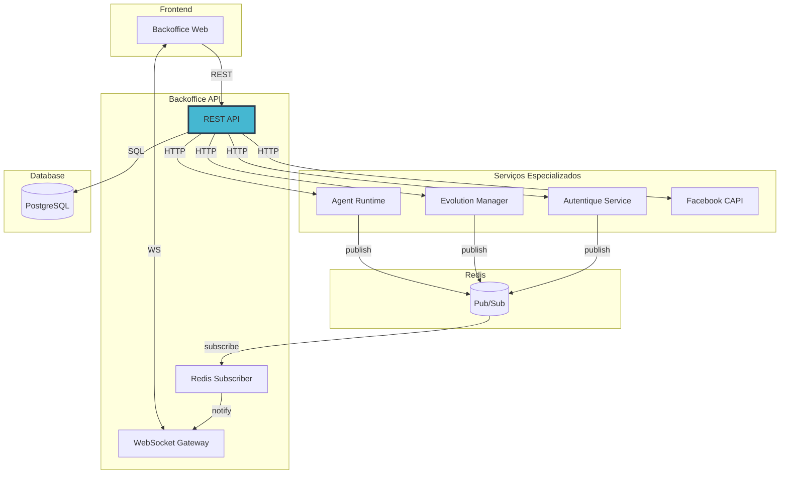

---

### Eventos Recebidos (Subscriber)

| Evento | Origem | Ação |
|--------|--------|------|
| `instance.connected` | Evolution Manager | Notificar frontend via WS |
| `instance.disconnected` | Evolution Manager | Notificar frontend via WS |
| `lead.qualified` | Agent Runtime | Atualizar dashboard |
| `contract.signed` | Autentique Service | Notificar frontend via WS |

---

## Padrões Técnicos

### Validação de DTOs

```typescript
// dto/create-company.dto.ts

export class CreateCompanyDTO {
  @IsString()
  @MinLength(3)
  @MaxLength(100)
  @ApiProperty({ example: 'Imobiliária ABC' })
  name: string;

  @IsOptional()
  @IsString()
  @Matches(/^\d{14}$/, { message: 'CNPJ deve ter 14 dígitos' })
  @ApiProperty({ example: '12345678000199', required: false })
  document?: string;

  @IsOptional()
  @ValidateNested()
  @Type(() => CompanySettingsDTO)
  settings?: CompanySettingsDTO;
}
```

---

### Paginação

```typescript
// common/dto/pagination.dto.ts

export class PaginationDTO {
  @IsOptional()
  @IsInt()
  @Min(1)
  @Max(100)
  @Type(() => Number)
  limit: number = 20;

  @IsOptional()
  @IsInt()
  @Min(0)
  @Type(() => Number)
  offset: number = 0;
}

export interface PaginatedResponse<T> {
  data: T[];
  meta: {
    total: number;
    limit: number;
    offset: number;
    has_more: boolean;
  };
}
```

---

### OpenAPI/Swagger

```typescript
// main.ts

const config = new DocumentBuilder()
  .setTitle('Backoffice API')
  .setDescription('API do Back-Office Multi-Tenant')
  .setVersion('1.0')
  .addBearerAuth()
  .addTag('Auth', 'Autenticação')
  .addTag('Companies', 'Gestão de Empresas')
  .addTag('Centurions', 'IAs de Qualificação')
  .addTag('Instances', 'Instâncias WhatsApp')
  .addTag('Leads', 'Leads do Sistema')
  .addTag('Metrics', 'Métricas e Dashboards')
  .build();

const document = SwaggerModule.createDocument(app, config);
SwaggerModule.setup('api/docs', app, document);
```

---

### Métricas

```typescript
// Métricas expostas via Prometheus

// Counters
http_requests_total{method, path, status}
auth_login_total{status}
company_created_total{}

// Histograms
http_request_duration_seconds{method, path}
database_query_duration_seconds{operation}

// Gauges
active_websocket_connections{}
```

---

## Implementação - Checklist

### Fase 1: Estrutura Base ✅

- [ ] Setup Nest.js com TypeScript
- [ ] Configurar Supabase client
- [ ] Configurar Redis client
- [ ] Configurar JWT auth
- [ ] Global exception filter
- [ ] Logging interceptor

### Fase 2: Auth Module ✅

- [ ] JWT strategy
- [ ] Auth controller
- [ ] Auth service
- [ ] Guards (JWT, Roles)

### Fase 3: Companies Module ✅

- [ ] Companies controller
- [ ] Companies service
- [ ] Company entity
- [ ] Company repository
- [ ] Schema provisioner

### Fase 4: Centurions Module ✅

- [ ] Centurions controller
- [ ] Centurions service
- [ ] CenturionConfig entity
- [ ] Integration com Agent Runtime

### Fase 5: Outros Módulos ✅

- [ ] Instances module
- [ ] Leads module
- [ ] Contracts module
- [ ] Pixels module
- [ ] Metrics module

### Fase 6: Integrations ✅

- [ ] Evolution Manager client
- [ ] Autentique Service client
- [ ] Facebook CAPI client
- [ ] Redis subscriber
- [ ] WebSocket gateway

---

## Referências

### Documentos Relacionados

| Documento | Seção | Link |
|-----------|-------|------|
| Arquitetura Macro | SVC-002 | ARCH-MACRO-v2.0 |
| Governance & Companies | Empresas | arch-micro-governance-companies.md |
| RLS & Security | Guards | arch-micro-rls-security.md |

### Tecnologias

- **Nest.js**: https://docs.nestjs.com
- **Supabase**: https://supabase.com/docs
- **Passport JWT**: https://docs.nestjs.com/security/authentication

---

**FIM DO DOCUMENTO**

---

*Arquitetura Micro: Backoffice API v1.0*  
*Orquestração & CRUD Backend*  
*Gerado em: 2025-12-16*
