# Arquitetura Micro: Backoffice Web v1.0

**Documento ID:** ARCH-backoffice-web-v1.0  
**Módulo:** Backoffice Web  
**Bounded Context:** Interface Administrativa da Holding  
**Data de Criação:** 2025-12-16  
**Última Atualização:** 2025-12-16  
**Baseado em:** ARCH-MACRO-v2.0  
**Status:** Draft  

---

## Visão Geral do Módulo

### Propósito e Responsabilidade

**Responsabilidade Única (SRP):**  
Prover interface administrativa para o dono da holding gerenciar empresas, configurar Centurions (IAs), monitorar instâncias WhatsApp, visualizar métricas consolidadas e gerenciar contratos digitais.

**Bounded Context:**  
Este módulo é a **interface visual principal** do sistema. Ele consome a Backoffice API para todas as operações, gerencia estado local da aplicação, e provê experiência de usuário responsiva com atualizações em tempo real via WebSocket.

**Por que este módulo existe:**

- Prover UI administrativa centralizada para gestão da holding
- Permitir configuração visual de Centurions (IAs de qualificação)
- Visualizar métricas consolidadas de todas as empresas
- Gerenciar instâncias WhatsApp (conexão via QR code)
- Acompanhar leads e conversas em tempo real
- Gerenciar contratos digitais

---

### Localização na Arquitetura Macro

```mermaid
graph TB
    subgraph "Sistema Completo"
        TARGET[🎯 BACKOFFICE WEB<br/>Frontend Admin]
        API[Backoffice API]
        WS[WebSocket Server]
        
        AGENT[Agent Runtime]
        EVO[Evolution Manager]
        AUTENT[Autentique Service]
    end

    TARGET -->|REST/GraphQL| API
    TARGET <-->|WS| WS
    
    API --> AGENT
    API --> EVO
    API --> AUTENT
    
    AGENT -->|events| WS
    EVO -->|events| WS

    style TARGET fill:#a29bfe,stroke:#2c3e50,stroke-width:4px
```



---

### Capacidades Principais (Features)

| Feature | Descrição | Componentes Principais |
|---------|-----------|------------------------|
| **Dashboard** | Visão consolidada da holding | Métricas, gráficos, alertas |
| **Empresas** | Gestão de empresas (tenants) | CRUD, configurações, usuários |
| **Centurions** | Configuração de IAs | Prompt editor, critérios, tools |
| **Instâncias** | WhatsApp management | QR code scanner, status, reconexão |
| **Leads** | Visualização de leads | Lista, detalhes, timeline, conversas |
| **Contratos** | Contratos digitais | Templates, geração, assinaturas |
| **Marketing** | Pixels e tracking | Configuração CAPI, eventos |
| **Relatórios** | Analytics avançado | Exportação, filtros, dashboards |

---

## Arquitetura Interna

### Visão Geral da Arquitetura Frontend

```mermaid
graph TB
    subgraph "Backoffice Web (Next.js 14)"
        direction TB
        
        subgraph "Layer 1: Pages & Routing"
            Pages[App Router<br/>Pages & Layouts]
            Middleware[Middleware<br/>Auth & Guards]
        end
        
        subgraph "Layer 2: Features"
            Dashboard[Dashboard Feature]
            Empresas[Empresas Feature]
            Centurions[Centurions Feature]
            Instancias[Instâncias Feature]
            Leads[Leads Feature]
            Contratos[Contratos Feature]
        end
        
        subgraph "Layer 3: Shared UI"
            Components[Componentes UI<br/>ShadcnUI]
            Layouts[Layouts<br/>Shell, Sidebar]
            Forms[Forms<br/>React Hook Form]
        end
        
        subgraph "Layer 4: State & Data"
            Store[State Management<br/>Zustand]
            Query[Server State<br/>TanStack Query]
            WS[WebSocket<br/>Real-time]
        end
        
        subgraph "Layer 5: Services"
            APIClient[API Client<br/>Axios/Fetch]
            AuthService[Auth Service<br/>Supabase]
            WSClient[WS Client]
        end
    end

    Pages --> Middleware
    Pages --> Dashboard
    Pages --> Empresas
    Pages --> Centurions
    
    Dashboard --> Components
    Empresas --> Components
    Centurions --> Components
    
    Components --> Store
    Components --> Query
    
    Query --> APIClient
    Store --> WS
    WS --> WSClient
    APIClient --> AuthService

    style Pages fill:#a29bfe,stroke:#2c3e50,stroke-width:3px
    style Query fill:#74b9ff,stroke:#2c3e50,stroke-width:2px
    style Store fill:#55efc4,stroke:#2c3e50,stroke-width:2px
```



---

### Stack Tecnológico

| Camada | Tecnologia | Propósito |
|--------|------------|-----------|
| **Framework** | Next.js 14 (App Router) | SSR, routing, API routes |
| **UI Library** | React 18 | Component library |
| **Styling** | Tailwind CSS | Utility-first CSS |
| **Components** | ShadcnUI | Design system |
| **State (Client)** | Zustand | Client state management |
| **State (Server)** | TanStack Query | Server state, caching |
| **Forms** | React Hook Form + Zod | Form handling, validation |
| **Auth** | Supabase Auth | Authentication |
| **Real-time** | WebSocket (native) | Real-time updates |
| **Icons** | Lucide React | Icon library |
| **Charts** | Recharts | Data visualization |

---

## Estrutura de Arquivos

### Organização Geral

```
src/
├── app/                           # Next.js App Router
│   ├── (auth)/                    # Auth routes (login, etc)
│   │   ├── login/
│   │   │   └── page.tsx
│   │   ├── forgot-password/
│   │   │   └── page.tsx
│   │   └── layout.tsx
│   │
│   ├── (dashboard)/               # Protected routes
│   │   ├── layout.tsx             # Dashboard shell
│   │   ├── page.tsx               # Dashboard home
│   │   │
│   │   ├── empresas/
│   │   │   ├── page.tsx           # Lista empresas
│   │   │   ├── [id]/
│   │   │   │   ├── page.tsx       # Detalhes empresa
│   │   │   │   └── configuracoes/
│   │   │   │       └── page.tsx
│   │   │   └── nova/
│   │   │       └── page.tsx
│   │   │
│   │   ├── centurions/
│   │   │   ├── page.tsx
│   │   │   ├── [id]/
│   │   │   │   ├── page.tsx
│   │   │   │   ├── prompt/
│   │   │   │   │   └── page.tsx
│   │   │   │   └── criterios/
│   │   │   │       └── page.tsx
│   │   │   └── novo/
│   │   │       └── page.tsx
│   │   │
│   │   ├── instancias/
│   │   │   ├── page.tsx
│   │   │   └── [id]/
│   │   │       └── page.tsx
│   │   │
│   │   ├── leads/
│   │   │   ├── page.tsx
│   │   │   └── [id]/
│   │   │       └── page.tsx
│   │   │
│   │   ├── contratos/
│   │   │   ├── page.tsx
│   │   │   ├── templates/
│   │   │   │   └── page.tsx
│   │   │   └── [id]/
│   │   │       └── page.tsx
│   │   │
│   │   ├── marketing/
│   │   │   └── page.tsx
│   │   │
│   │   └── relatorios/
│   │       └── page.tsx
│   │
│   ├── api/                       # API Routes (BFF)
│   │   └── [...]/
│   │
│   ├── layout.tsx                 # Root layout
│   └── globals.css
│
├── components/                    # Shared components
│   ├── ui/                        # ShadcnUI components
│   │   ├── button.tsx
│   │   ├── card.tsx
│   │   ├── dialog.tsx
│   │   ├── table.tsx
│   │   └── ...
│   │
│   ├── layouts/                   # Layout components
│   │   ├── dashboard-shell.tsx
│   │   ├── sidebar.tsx
│   │   ├── header.tsx
│   │   └── breadcrumbs.tsx
│   │
│   ├── forms/                     # Form components
│   │   ├── empresa-form.tsx
│   │   ├── centurion-form.tsx
│   │   └── ...
│   │
│   └── shared/                    # Shared components
│       ├── data-table.tsx
│       ├── status-badge.tsx
│       ├── loading-spinner.tsx
│       └── empty-state.tsx
│
├── features/                      # Feature modules
│   ├── dashboard/
│   │   ├── components/
│   │   │   ├── metrics-cards.tsx
│   │   │   ├── leads-chart.tsx
│   │   │   └── recent-activity.tsx
│   │   └── hooks/
│   │       └── use-dashboard-data.ts
│   │
│   ├── empresas/
│   │   ├── components/
│   │   │   ├── empresas-table.tsx
│   │   │   ├── empresa-card.tsx
│   │   │   └── empresa-users-list.tsx
│   │   ├── hooks/
│   │   │   ├── use-empresas.ts
│   │   │   └── use-empresa.ts
│   │   └── schemas/
│   │       └── empresa.schema.ts
│   │
│   ├── centurions/
│   │   ├── components/
│   │   │   ├── centurion-editor.tsx
│   │   │   ├── prompt-editor.tsx
│   │   │   ├── criteria-builder.tsx
│   │   │   ├── tools-selector.tsx
│   │   │   └── test-chat.tsx
│   │   ├── hooks/
│   │   │   ├── use-centurions.ts
│   │   │   └── use-centurion.ts
│   │   └── schemas/
│   │       └── centurion.schema.ts
│   │
│   ├── instancias/
│   │   ├── components/
│   │   │   ├── instancias-grid.tsx
│   │   │   ├── instancia-card.tsx
│   │   │   ├── qr-code-modal.tsx
│   │   │   └── status-indicator.tsx
│   │   └── hooks/
│   │       ├── use-instancias.ts
│   │       └── use-instancia-status.ts
│   │
│   ├── leads/
│   │   ├── components/
│   │   │   ├── leads-table.tsx
│   │   │   ├── lead-details.tsx
│   │   │   ├── lead-timeline.tsx
│   │   │   └── conversation-viewer.tsx
│   │   └── hooks/
│   │       ├── use-leads.ts
│   │       └── use-lead-conversation.ts
│   │
│   └── contratos/
│       ├── components/
│       │   ├── contratos-table.tsx
│       │   ├── template-editor.tsx
│       │   └── contrato-preview.tsx
│       └── hooks/
│           └── use-contratos.ts
│
├── lib/                           # Core utilities
│   ├── api/
│   │   ├── client.ts              # API client setup
│   │   ├── endpoints.ts           # API endpoints
│   │   └── types.ts               # API types
│   │
│   ├── auth/
│   │   ├── supabase-client.ts
│   │   ├── auth-context.tsx
│   │   └── use-auth.ts
│   │
│   ├── websocket/
│   │   ├── ws-client.ts
│   │   └── use-websocket.ts
│   │
│   └── utils/
│       ├── cn.ts                  # classnames utility
│       ├── format.ts              # formatters
│       └── constants.ts
│
├── stores/                        # Zustand stores
│   ├── auth.store.ts
│   ├── ui.store.ts
│   └── notifications.store.ts
│
├── hooks/                         # Global hooks
│   ├── use-debounce.ts
│   ├── use-local-storage.ts
│   └── use-media-query.ts
│
├── types/                         # TypeScript types
│   ├── api.types.ts
│   ├── empresa.types.ts
│   ├── centurion.types.ts
│   ├── lead.types.ts
│   └── index.ts
│
└── styles/                        # Global styles
    └── globals.css
```

---

## Layer 1: Pages & Routing

### App Router Structure


---

### Middleware - Auth Guard


---

### Layout Hierarchy


---

## Layer 2: Features

### Feature Module Pattern

Cada feature segue a mesma estrutura:

```
features/[feature-name]/
├── components/           # UI components específicos
├── hooks/               # Custom hooks (queries, mutations)
├── schemas/             # Zod schemas para validação
├── utils/               # Utilities específicos
└── types/               # Types específicos (se necessário)
```

---

### Feature: Empresas

```mermaid
graph TB
    subgraph "Empresas Feature"
        subgraph "Pages"
            List[Lista Empresas]
            Detail[Detalhe Empresa]
            Create[Criar Empresa]
            Settings[Configurações]
        end

        subgraph "Components"
            Table[EmpresasTable]
            Card[EmpresaCard]
            Form[EmpresaForm]
            Users[EmpresaUsersList]
        end

        subgraph "Hooks"
            useEmpresas[useEmpresas]
            useEmpresa[useEmpresa]
            useCreateEmpresa[useCreateEmpresa]
            useUpdateEmpresa[useUpdateEmpresa]
        end
    end

    List --> Table
    List --> useEmpresas
    Detail --> Card
    Detail --> Users
    Detail --> useEmpresa
    Create --> Form
    Create --> useCreateEmpresa

    style useEmpresas fill:#74b9ff
    style useEmpresa fill:#74b9ff
```



---

### Feature: Centurions

```mermaid
graph TB
    subgraph "Centurions Feature"
        subgraph "Pages"
            List[Lista Centurions]
            Detail[Detalhe Centurion]
            Prompt[Editor de Prompt]
            Criteria[Editor de Critérios]
            Test[Testar Centurion]
        end

        subgraph "Components"
            Editor[CenturionEditor]
            PromptEditor[PromptEditor<br/>Monaco Editor]
            CriteriaBuilder[CriteriaBuilder<br/>Drag & Drop]
            ToolsSelector[ToolsSelector]
            TestChat[TestChat<br/>Simulador]
        end

        subgraph "Hooks"
            useCenturions[useCenturions]
            useCenturion[useCenturion]
            useTestPrompt[useTestPrompt]
        end
    end

    List --> useCenturions
    Detail --> Editor
    Detail --> useCenturion
    Prompt --> PromptEditor
    Criteria --> CriteriaBuilder
    Test --> TestChat
    Test --> useTestPrompt

    style PromptEditor fill:#fd79a8
    style CriteriaBuilder fill:#fd79a8
    style TestChat fill:#fd79a8
```



---

### Feature: Instâncias WhatsApp

```mermaid
graph TB
    subgraph "Instâncias Feature"
        subgraph "Pages"
            List[Lista Instâncias]
            Detail[Detalhe Instância]
        end

        subgraph "Components"
            Grid[InstânciasGrid]
            Card[InstânciaCard]
            QRModal[QRCodeModal]
            Status[StatusIndicator]
        end

        subgraph "Hooks"
            useInstancias[useInstâncias]
            useInstanciaStatus[useInstânciaStatus<br/>WebSocket]
            useConnect[useConnectInstância]
        end

        subgraph "Real-time"
            WS[WebSocket Events]
        end
    end

    List --> Grid
    Grid --> Card
    Card --> Status
    Card --> QRModal
    
    useInstanciaStatus --> WS
    Card --> useInstanciaStatus

    style WS fill:#55efc4
    style useInstanciaStatus fill:#55efc4
```



---

### Feature: Leads


---

## Layer 3: Shared UI

### Design System (ShadcnUI)


---

### Components Compartilhados

| Componente | Descrição | Uso |
|------------|-----------|-----|
| `DataTable` | Tabela com sort, filter, pagination | Listas de dados |
| `StatusBadge` | Badge com cores por status | Status de leads, instâncias |
| `LoadingSpinner` | Spinner animado | Loading states |
| `EmptyState` | Estado vazio com ação | Quando não há dados |
| `ConfirmDialog` | Modal de confirmação | Ações destrutivas |
| `SearchInput` | Input com debounce | Buscas |
| `DateRangePicker` | Seletor de período | Filtros de data |
| `MetricCard` | Card de métrica | Dashboard |

---

### Dashboard Shell

```mermaid
graph TB
    subgraph "Dashboard Shell"
        subgraph "Header"
            Logo[Logo]
            Search[Search Global]
            Notifications[Notifications<br/>Badge + Dropdown]
            UserMenu[User Menu<br/>Profile, Logout]
        end

        subgraph "Sidebar"
            NavItems[Navigation Items]
            Collapse[Collapse Button]
            CompanySelector[Company Selector<br/>Se multi-empresa]
        end

        subgraph "Main"
            Breadcrumbs[Breadcrumbs]
            PageHeader[Page Header<br/>Título + Ações]
            Content[Page Content]
        end
    end

    Header --> Logo
    Header --> Search
    Header --> Notifications
    Header --> UserMenu

    Sidebar --> NavItems
    Sidebar --> Collapse
    Sidebar --> CompanySelector

    Main --> Breadcrumbs
    Main --> PageHeader
    Main --> Content
```



---

## Layer 4: State & Data

### State Management Strategy


---

### TanStack Query - Server State


---

### Query Keys Convention

```typescript
// lib/api/query-keys.ts

export const queryKeys = {
  // Empresas
  empresas: {
    all: ['empresas'] as const,
    lists: () => [...queryKeys.empresas.all, 'list'] as const,
    list: (filters: EmpresaFilters) => 
      [...queryKeys.empresas.lists(), filters] as const,
    details: () => [...queryKeys.empresas.all, 'detail'] as const,
    detail: (id: string) => 
      [...queryKeys.empresas.details(), id] as const,
  },
  
  // Centurions
  centurions: {
    all: ['centurions'] as const,
    byEmpresa: (empresaId: string) => 
      [...queryKeys.centurions.all, 'empresa', empresaId] as const,
    detail: (id: string) => 
      [...queryKeys.centurions.all, 'detail', id] as const,
  },
  
  // Leads
  leads: {
    all: ['leads'] as const,
    list: (filters: LeadFilters) => 
      [...queryKeys.leads.all, 'list', filters] as const,
    detail: (id: string) => 
      [...queryKeys.leads.all, 'detail', id] as const,
    conversation: (leadId: string) => 
      [...queryKeys.leads.all, 'conversation', leadId] as const,
  },
  
  // Instâncias
  instancias: {
    all: ['instancias'] as const,
    list: () => [...queryKeys.instancias.all, 'list'] as const,
    detail: (id: string) => 
      [...queryKeys.instancias.all, 'detail', id] as const,
    status: (id: string) => 
      [...queryKeys.instancias.all, 'status', id] as const,
  },
};
```

---

### Zustand Stores


---

### Auth Store

```typescript
// stores/auth.store.ts

interface AuthState {
  user: User | null;
  token: string | null;
  isAuthenticated: boolean;
  
  // Actions
  setUser: (user: User) => void;
  setToken: (token: string) => void;
  logout: () => void;
}

// Persistido no localStorage
```

---

### UI Store

```typescript
// stores/ui.store.ts

interface UIState {
  sidebarCollapsed: boolean;
  theme: 'light' | 'dark' | 'system';
  activeModals: string[];
  
  // Actions
  toggleSidebar: () => void;
  setTheme: (theme: Theme) => void;
  openModal: (modalId: string) => void;
  closeModal: (modalId: string) => void;
}
```

---

### WebSocket - Real-time Updates


---

## Layer 5: Services

### API Client

```mermaid
graph TB
    subgraph "API Client Layer"
        Client[API Client<br/>Axios Instance]
        Interceptors[Interceptors]
        ErrorHandler[Error Handler]
    end

    subgraph "Interceptors"
        AuthInterceptor[Auth Interceptor<br/>Add JWT]
        LogInterceptor[Log Interceptor]
        RefreshInterceptor[Refresh Interceptor<br/>401 → Refresh Token]
    end

    subgraph "Services"
        EmpresasAPI[Empresas API]
        CenturionsAPI[Centurions API]
        LeadsAPI[Leads API]
        InstanciasAPI[Instâncias API]
    end

    Client --> Interceptors
    Interceptors --> AuthInterceptor
    Interceptors --> LogInterceptor
    Interceptors --> RefreshInterceptor

    EmpresasAPI --> Client
    CenturionsAPI --> Client
    LeadsAPI --> Client
    InstanciasAPI --> Client
```



---

### API Client Setup

```typescript
// lib/api/client.ts

const apiClient = axios.create({
  baseURL: process.env.NEXT_PUBLIC_API_URL,
  timeout: 30000,
  headers: {
    'Content-Type': 'application/json',
  },
});

// Auth interceptor
apiClient.interceptors.request.use((config) => {
  const token = useAuthStore.getState().token;
  if (token) {
    config.headers.Authorization = `Bearer ${token}`;
  }
  return config;
});

// Refresh token interceptor
apiClient.interceptors.response.use(
  (response) => response,
  async (error) => {
    if (error.response?.status === 401) {
      // Try refresh token
      // If fails, logout
    }
    return Promise.reject(error);
  }
);
```

---

### API Endpoints

```typescript
// lib/api/endpoints.ts

export const api = {
  // Auth
  auth: {
    login: (data: LoginDTO) => 
      apiClient.post<AuthResponse>('/auth/login', data),
    refresh: () => 
      apiClient.post<AuthResponse>('/auth/refresh'),
    logout: () => 
      apiClient.post('/auth/logout'),
    me: () => 
      apiClient.get<User>('/auth/me'),
  },

  // Empresas
  empresas: {
    list: (params?: EmpresaFilters) => 
      apiClient.get<PaginatedResponse<Empresa>>('/empresas', { params }),
    get: (id: string) => 
      apiClient.get<EmpresaDetail>(`/empresas/${id}`),
    create: (data: CreateEmpresaDTO) => 
      apiClient.post<Empresa>('/empresas', data),
    update: (id: string, data: UpdateEmpresaDTO) => 
      apiClient.patch<Empresa>(`/empresas/${id}`, data),
    delete: (id: string) => 
      apiClient.delete(`/empresas/${id}`),
  },

  // Centurions
  centurions: {
    list: (params?: CenturionFilters) => 
      apiClient.get<PaginatedResponse<Centurion>>('/centurions', { params }),
    get: (id: string) => 
      apiClient.get<CenturionDetail>(`/centurions/${id}`),
    create: (data: CreateCenturionDTO) => 
      apiClient.post<Centurion>('/centurions', data),
    update: (id: string, data: UpdateCenturionDTO) => 
      apiClient.patch<Centurion>(`/centurions/${id}`, data),
    test: (id: string, message: string) => 
      apiClient.post<TestResponse>(`/centurions/${id}/test`, { message }),
  },

  // Instâncias
  instancias: {
    list: () => 
      apiClient.get<Instancia[]>('/instances'),
    get: (id: string) => 
      apiClient.get<InstanciaDetail>(`/instances/${id}`),
    create: (data: CreateInstanciaDTO) => 
      apiClient.post<Instancia>('/instances', data),
    connect: (id: string) => 
      apiClient.post<QRCodeResponse>(`/instances/${id}/connect`),
    disconnect: (id: string) => 
      apiClient.post(`/instances/${id}/disconnect`),
  },

  // Leads
  leads: {
    list: (params?: LeadFilters) => 
      apiClient.get<PaginatedResponse<Lead>>('/leads', { params }),
    get: (id: string) => 
      apiClient.get<LeadDetail>(`/leads/${id}`),
    getConversation: (id: string) => 
      apiClient.get<Conversation>(`/leads/${id}/conversations`),
    export: (params?: LeadFilters) => 
      apiClient.post<Blob>('/leads/export', params, { responseType: 'blob' }),
  },
};
```

---

## Fluxos Principais

### Fluxo: Conexão de Instância WhatsApp

```mermaid
sequenceDiagram
    actor User
    participant UI as InstânciaCard
    participant Modal as QRCodeModal
    participant Hook as useConnectInstância
    participant API as Backoffice API
    participant WS as WebSocket

    User->>UI: Click "Conectar"
    UI->>Modal: Open modal
    Modal->>Hook: connect(instanciaId)
    Hook->>API: POST /instances/:id/connect
    API-->>Hook: { qrcode, expires_at }
    Hook-->>Modal: Show QR Code
    
    Note over Modal: User scans QR with phone
    
    WS-->>Hook: Event: instance.connected
    Hook->>Hook: Invalidate queries
    Hook-->>Modal: Close modal
    Modal-->>UI: Update status: CONNECTED
    
    UI->>UI: Show success toast
```



---

### Fluxo: Configuração de Centurion


---

### Fluxo: Dashboard em Tempo Real


---

## Padrões de UI/UX

### Loading States


---

### Error Handling

```mermaid
flowchart TD
    Error[Error Occurred] --> Type{Error Type}
    
    Type -->|401 Unauthorized| Redirect[Redirect to Login]
    Type -->|403 Forbidden| ForbiddenPage[Show 403 Page]
    Type -->|404 Not Found| NotFoundPage[Show 404 Page]
    Type -->|422 Validation| FormError[Show Form Errors]
    Type -->|500 Server| Toast[Show Error Toast<br/>+ Retry Option]
    Type -->|Network| Offline[Show Offline Banner]
```

---

### Responsive Design

```mermaid
graph TB
    subgraph "Breakpoints"
        Mobile[Mobile<br/>< 640px]
        Tablet[Tablet<br/>640px - 1024px]
        Desktop[Desktop<br/>> 1024px]
    end

    subgraph "Layout Changes"
        MobileLayout[Sidebar: Hidden<br/>Nav: Bottom sheet<br/>Tables: Cards]
        TabletLayout[Sidebar: Collapsed<br/>Nav: Icons only<br/>Tables: Responsive]
        DesktopLayout[Sidebar: Expanded<br/>Nav: Full<br/>Tables: Full]
    end

    Mobile --> MobileLayout
    Tablet --> TabletLayout
    Desktop --> DesktopLayout
```

---

## Temas e Estilos

### Design Tokens

```typescript
// tailwind.config.ts

const config = {
  theme: {
    extend: {
      colors: {
        // Brand colors
        primary: {
          50: '#f0fdf4',
          500: '#22c55e',  // Verde Neon (Holding)
          600: '#16a34a',
          900: '#14532d',
        },
        // Status colors
        status: {
          connected: '#22c55e',
          disconnected: '#ef4444',
          pending: '#f59e0b',
          qualified: '#3b82f6',
        },
      },
      fontFamily: {
        sans: ['Inter', 'sans-serif'],
        mono: ['JetBrains Mono', 'monospace'],
      },
    },
  },
};
```

---

### Dark Mode

```mermaid
graph TB
    subgraph "Theme System"
        ThemeProvider[Theme Provider]
        SystemPref[System Preference]
        UserPref[User Preference]
        Toggle[Theme Toggle]
    end

    subgraph "Implementation"
        TailwindDark[Tailwind dark: classes]
        CSSVariables[CSS Variables]
    end

    ThemeProvider --> SystemPref
    ThemeProvider --> UserPref
    Toggle --> UserPref
    
    ThemeProvider --> TailwindDark
    ThemeProvider --> CSSVariables
```

---

## Performance

### Optimization Strategies

| Estratégia | Implementação | Benefício |
|------------|---------------|-----------|
| **Code Splitting** | Next.js dynamic imports | Menor bundle inicial |
| **Query Caching** | TanStack Query staleTime | Menos requests |
| **Prefetching** | Link prefetch, query prefetch | UX mais rápida |
| **Virtualization** | TanStack Virtual | Listas grandes |
| **Image Optimization** | Next/Image | Lazy loading, WebP |
| **Debounce** | Search inputs | Menos requests |

---

### Bundle Optimization

```mermaid
graph TB
    subgraph "Code Splitting"
        Initial[Initial Bundle<br/>~150KB]
        Dashboard[Dashboard Chunk]
        Empresas[Empresas Chunk]
        Centurions[Centurions Chunk<br/>+ Monaco Editor]
        Leads[Leads Chunk]
    end

    subgraph "Lazy Load"
        Monaco[Monaco Editor<br/>~500KB]
        Charts[Recharts<br/>~100KB]
        Table[TanStack Table<br/>~50KB]
    end

    Initial --> Dashboard
    Dashboard --> Charts
    
    Initial --> Empresas
    Initial --> Centurions
    Centurions --> Monaco
    
    Initial --> Leads
    Leads --> Table
```

---

## Implementação - Checklist

### Fase 1: Setup Base ✅

- [ ] Next.js 14 com App Router
- [ ] Tailwind CSS + ShadcnUI
- [ ] Zustand stores
- [ ] TanStack Query
- [ ] API client (Axios)
- [ ] Auth flow (Supabase)

### Fase 2: Layout & Navigation ✅

- [ ] Dashboard shell
- [ ] Sidebar navigation
- [ ] Header + user menu
- [ ] Breadcrumbs
- [ ] Responsive layout

### Fase 3: Core Features ✅

- [ ] Dashboard (métricas, charts)
- [ ] Empresas (CRUD)
- [ ] Centurions (config, prompt editor)
- [ ] Instâncias (QR code, status)
- [ ] Leads (lista, detalhes, conversas)

### Fase 4: Advanced Features ✅

- [ ] Contratos (templates, geração)
- [ ] Marketing (pixels)
- [ ] Relatórios
- [ ] Export CSV/Excel

### Fase 5: Real-time & Polish ✅

- [ ] WebSocket integration
- [ ] Notifications
- [ ] Dark mode
- [ ] Performance optimization
- [ ] Error boundaries

---

## Referências

### Documentos Relacionados

| Documento | Seção | Link |
|-----------|-------|------|
| Arquitetura Macro | SVC-001 | ARCH-MACRO-v2.0 |
| Backoffice API | Endpoints | arch-micro-backoffice-api.md |

### Tecnologias

- **Next.js**: https://nextjs.org/docs
- **ShadcnUI**: https://ui.shadcn.com
- **TanStack Query**: https://tanstack.com/query
- **Zustand**: https://zustand-demo.pmnd.rs
- **React Hook Form**: https://react-hook-form.com
- **Tailwind CSS**: https://tailwindcss.com

---

**FIM DO DOCUMENTO**

---

*Arquitetura Micro: Backoffice Web v1.0*  
*Frontend Administrativo da Holding*  
*Gerado em: 2025-12-16*
