# Arquitetura Micro: Evolution Manager v1.0

**Documento ID:** ARCH-evolution-manager-v1.0  
**Módulo:** Evolution Manager  
**Bounded Context:** Gerenciamento de Instâncias WhatsApp & Comunicação  
**Data de Criação:** 2025-12-16  
**Última Atualização:** 2025-12-16  
**Baseado em:** ARCH-MACRO-v2.0  
**Status:** Draft  

---

## Visão Geral do Módulo

### Propósito e Responsabilidade

**Responsabilidade Única (SRP):**  
Gerenciar o ciclo de vida completo de instâncias WhatsApp via Evolution API, processando webhooks de mensagens e status, e fornecendo interface unificada para envio de mensagens.

**Bounded Context:**  
Este módulo é o **gateway de comunicação WhatsApp** do sistema. Ele abstrai toda a complexidade da Evolution API, gerenciando conexões, QR codes, status de instâncias, recebimento e envio de mensagens. Outros serviços não precisam conhecer detalhes da Evolution API.

**Por que este módulo existe:**

- Abstrair a complexidade da Evolution API
- Centralizar gestão de múltiplas instâncias WhatsApp
- Garantir que mensagens sejam entregues de forma confiável
- Monitorar status de conexão e reagir a desconexões
- Transformar webhooks em eventos padronizados para o sistema

---

### Localização na Arquitetura Macro

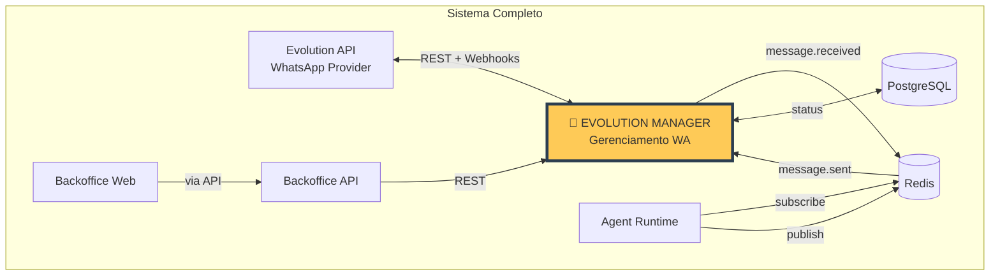

---

### Capacidades Principais

| Operação | Tipo | Descrição | Input | Output |
|----------|------|-----------|-------|--------|
| **CreateInstance** | Command | Cria nova instância WhatsApp | `CreateInstanceDTO` | `InstanceDTO` |
| **ConnectInstance** | Command | Inicia conexão (gera QR) | `InstanceIdDTO` | `QRCodeDTO` |
| **DisconnectInstance** | Command | Desconecta instância | `InstanceIdDTO` | `void` |
| **GetInstanceStatus** | Query | Status atual da instância | `InstanceIdDTO` | `InstanceStatusDTO` |
| **SendMessage** | Command | Envia mensagem de texto | `SendMessageDTO` | `MessageSentDTO` |
| **SendMedia** | Command | Envia mídia (áudio, imagem) | `SendMediaDTO` | `MessageSentDTO` |
| **ListInstances** | Query | Lista instâncias da empresa | `CompanyIdDTO` | `InstanceListDTO` |
| **ProcessWebhook** | Command | Processa webhook da Evolution | `WebhookPayloadDTO` | `void` |

---

## Arquitetura Interna de Camadas

### Visão Geral das Camadas

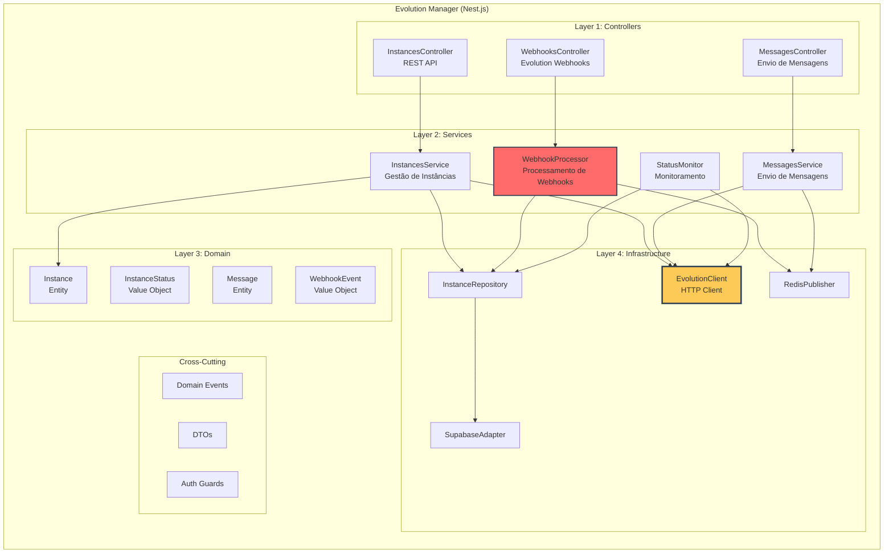

---

### Regra de Dependência

```
Controllers (Entry Points)
         ↓
    Services (Application)
         ↓
    Domain (Entities/VOs)
         ↓
  Infrastructure (Evolution/Redis/Supabase)

Regra: Domain não conhece Evolution API, Redis, Supabase
EvolutionClient é injetado via interface no Service
```

---

## Layer 1: Controllers

### Responsabilidade da Camada

**O que faz:**

- Expõe endpoints REST para gestão de instâncias
- Recebe webhooks da Evolution API
- Valida payloads de entrada
- Autentica requisições (JWT para REST, secret para webhooks)

**O que NÃO faz:**

- ❌ Lógica de processamento de webhooks
- ❌ Comunicação direta com Evolution API
- ❌ Acesso direto ao banco

---

### Estrutura de Arquivos

```
src/
├── modules/
│   ├── instances/
│   │   └── controllers/
│   │       ├── instances.controller.ts      # CRUD de instâncias
│   │       └── webhooks.controller.ts       # Recebe webhooks
│   │
│   └── messages/
│       └── controllers/
│           └── messages.controller.ts       # Envio de mensagens
```

---

### Endpoints REST

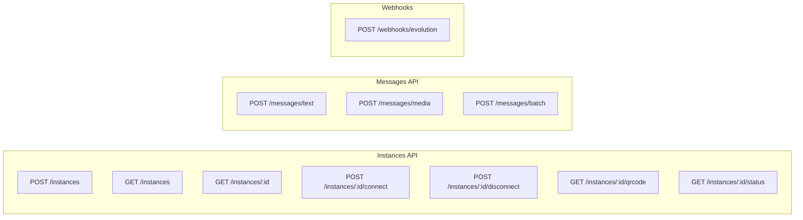

---

### Webhook Controller - Autenticação

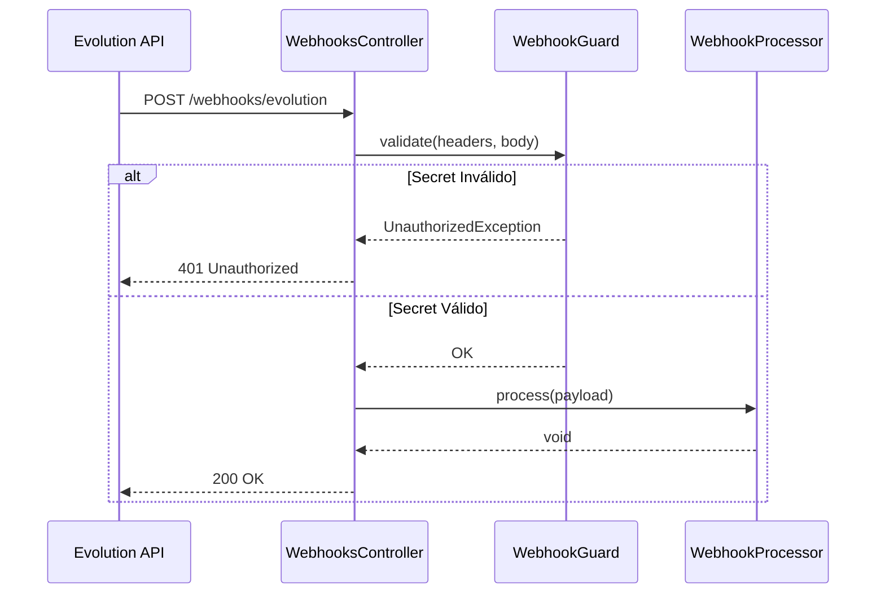

---

### Exemplo de Contrato

```typescript
// controllers/instances.controller.ts

@Controller('instances')
@UseGuards(JwtAuthGuard)
export class InstancesController {
  constructor(private readonly instancesService: IInstancesService) {}

  @Post()
  @HttpCode(HttpStatus.CREATED)
  async create(
    @Body() dto: CreateInstanceDTO,
    @CurrentUser() user: JwtPayload,
  ): Promise<InstanceResponseDTO> {
    return this.instancesService.create(dto, user.company_id);
  }

  @Post(':id/connect')
  async connect(
    @Param('id', ParseUUIDPipe) id: string,
    @CurrentUser() user: JwtPayload,
  ): Promise<QRCodeResponseDTO> {
    return this.instancesService.connect(id, user.company_id);
  }

  @Get(':id/status')
  async getStatus(
    @Param('id', ParseUUIDPipe) id: string,
    @CurrentUser() user: JwtPayload,
  ): Promise<InstanceStatusDTO> {
    return this.instancesService.getStatus(id, user.company_id);
  }
}
```

---

## Layer 2: Services

### Responsabilidade da Camada

**O que faz:**

- Orquestra operações de gestão de instâncias
- Processa webhooks e transforma em eventos
- Coordena envio de mensagens
- Monitora status de conexão

**O que NÃO faz:**

- ❌ Conhecer detalhes de HTTP/REST
- ❌ Implementar protocolo Evolution diretamente
- ❌ Conter regras de negócio de qualificação

---

### Diagrama de Componentes

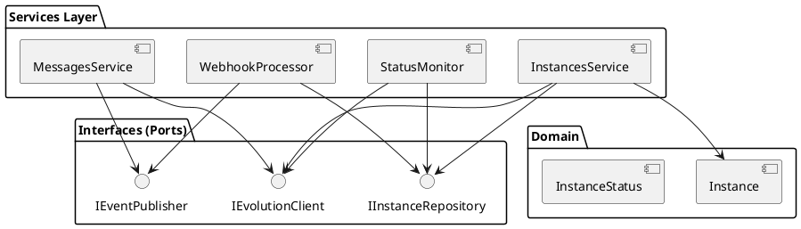

---

### InstancesService - Fluxo de Conexão

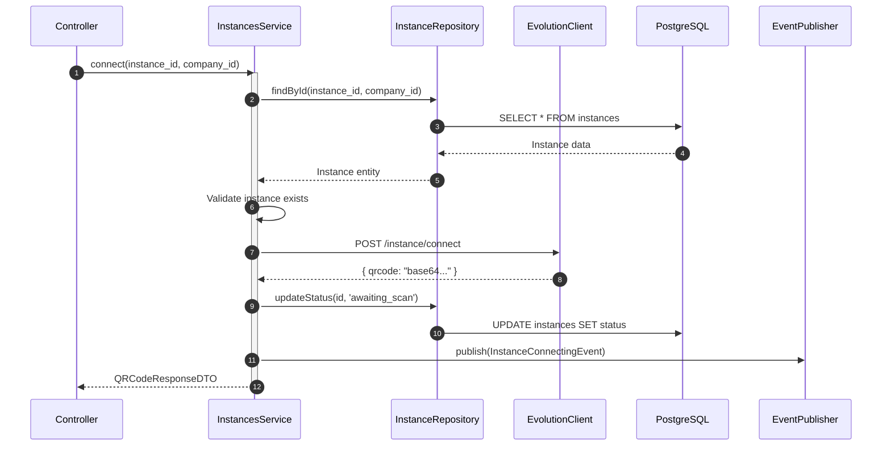

---

### WebhookProcessor - Processamento de Eventos

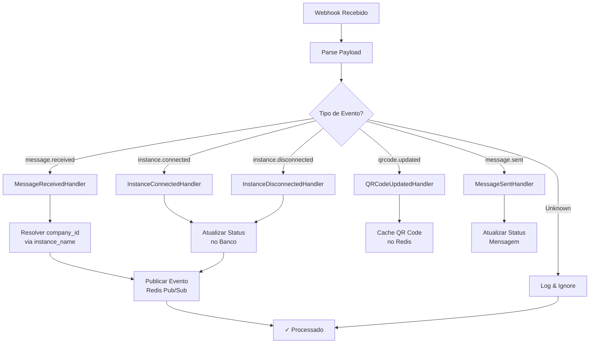

---

### MessagesService - Envio com Retry

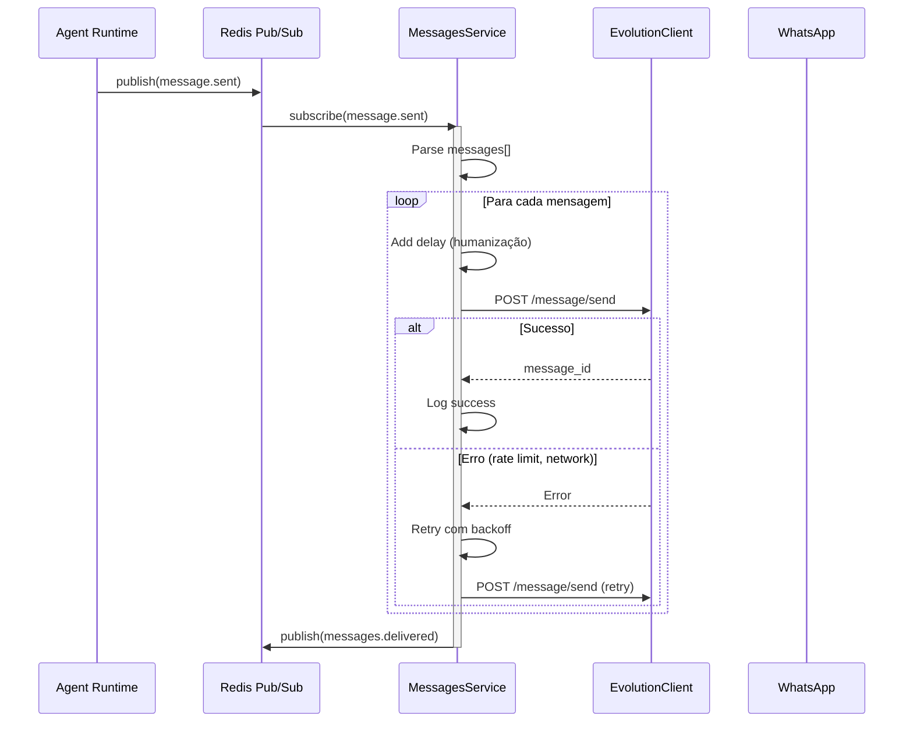

---

### StatusMonitor - Health Check

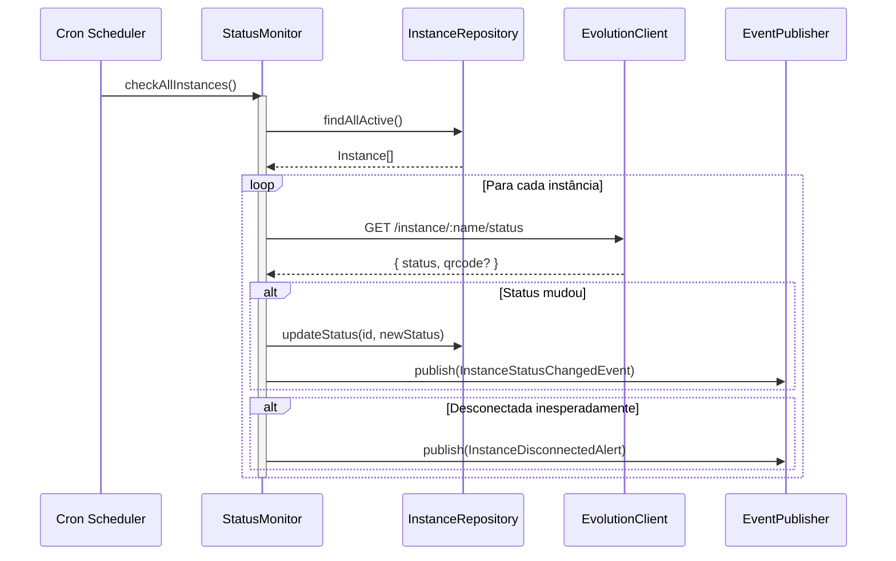

---

### Estrutura de Arquivos

```
src/
├── modules/
│   ├── instances/
│   │   ├── services/
│   │   │   ├── instances.service.ts
│   │   │   ├── status-monitor.service.ts
│   │   │   └── webhook-processor.service.ts
│   │   ├── dto/
│   │   │   ├── create-instance.dto.ts
│   │   │   ├── instance-response.dto.ts
│   │   │   ├── qrcode-response.dto.ts
│   │   │   └── webhook-payload.dto.ts
│   │   └── interfaces/
│   │       ├── instances.service.interface.ts
│   │       └── instance.repository.interface.ts
│   │
│   └── messages/
│       ├── services/
│       │   └── messages.service.ts
│       └── dto/
│           ├── send-message.dto.ts
│           └── send-media.dto.ts
```

---

### Exemplo de Contrato

```typescript
// services/interfaces/instances.service.interface.ts

export interface IInstancesService {
  create(dto: CreateInstanceDTO, companyId: string): Promise<InstanceResponseDTO>;
  connect(instanceId: string, companyId: string): Promise<QRCodeResponseDTO>;
  disconnect(instanceId: string, companyId: string): Promise<void>;
  getStatus(instanceId: string, companyId: string): Promise<InstanceStatusDTO>;
  listByCompany(companyId: string): Promise<InstanceListDTO>;
  delete(instanceId: string, companyId: string): Promise<void>;
}

// DTOs
export interface CreateInstanceDTO {
  name: string;
  centurion_id?: string;
  phone_number_hint?: string;
}

export interface QRCodeResponseDTO {
  instance_id: string;
  qrcode: string;  // base64
  expires_at: Date;
}

export interface InstanceStatusDTO {
  instance_id: string;
  status: 'disconnected' | 'connecting' | 'connected' | 'error';
  phone_number?: string;
  connected_at?: Date;
  last_activity?: Date;
}
```

---

## Layer 3: Domain

### Responsabilidade da Camada

**O que faz:**

- Define entidades com comportamento
- Encapsula regras de status de instância
- Garante invariantes

**O que NÃO faz:**

- ❌ Conhecer Evolution API
- ❌ Fazer chamadas HTTP
- ❌ Acessar banco diretamente

---

### Diagrama de Entidades

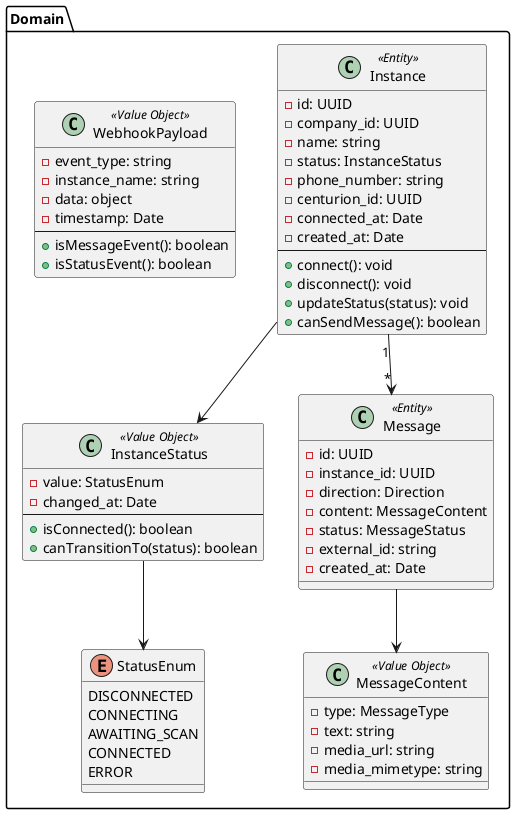

---

### Estrutura de Arquivos

```
src/
├── modules/
│   ├── instances/
│   │   └── domain/
│   │       ├── entities/
│   │       │   └── instance.entity.ts
│   │       ├── value-objects/
│   │       │   ├── instance-status.vo.ts
│   │       │   └── webhook-payload.vo.ts
│   │       └── events/
│   │           ├── instance-connected.event.ts
│   │           └── instance-disconnected.event.ts
│   │
│   └── messages/
│       └── domain/
│           ├── entities/
│           │   └── message.entity.ts
│           └── value-objects/
│               └── message-content.vo.ts
```

---

### Instance Entity - Estados

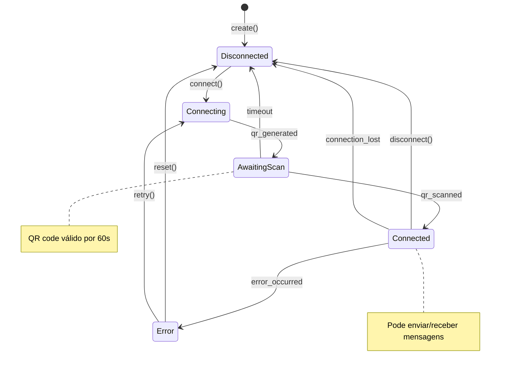

---

### Instance Entity - Invariantes

```typescript
// domain/entities/instance.entity.ts

/**
 * Entity: Instance
 * Invariantes:
 * - name deve ser único por company_id
 * - Só pode enviar mensagem se status == CONNECTED
 * - Transições de status devem seguir máquina de estados
 */
class Instance {
  private _id: UUID;
  private _companyId: UUID;
  private _name: string;
  private _status: InstanceStatus;
  private _phoneNumber: string | null;
  
  connect(): void {
    if (!this._status.canTransitionTo(StatusEnum.CONNECTING)) {
      throw new InvalidStatusTransitionError(
        this._status.value,
        StatusEnum.CONNECTING
      );
    }
    this._status = new InstanceStatus(StatusEnum.CONNECTING);
  }
  
  updateStatus(newStatus: StatusEnum): void {
    if (!this._status.canTransitionTo(newStatus)) {
      throw new InvalidStatusTransitionError(
        this._status.value,
        newStatus
      );
    }
    this._status = new InstanceStatus(newStatus);
    
    if (newStatus === StatusEnum.CONNECTED) {
      this._addEvent(new InstanceConnectedEvent(this._id));
    }
  }
  
  canSendMessage(): boolean {
    return this._status.isConnected();
  }
}
```

---

## Layer 4: Infrastructure

### Responsabilidade da Camada

**O que faz:**

- Implementa cliente HTTP para Evolution API
- Implementa repositório com Supabase
- Gerencia Pub/Sub com Redis
- Gerencia cache de QR codes

**O que NÃO faz:**

- ❌ Lógica de negócio
- ❌ Decisões de transição de status
- ❌ Orquestração de operações

---

### Diagrama de Componentes

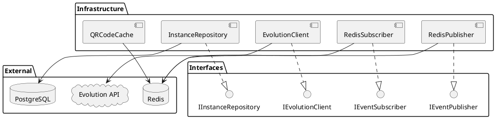

---

### Estrutura de Arquivos

```
src/
├── infrastructure/
│   ├── evolution/
│   │   ├── evolution.module.ts
│   │   ├── evolution.client.ts
│   │   └── evolution.config.ts
│   │
│   ├── supabase/
│   │   ├── supabase.module.ts
│   │   └── supabase.service.ts
│   │
│   ├── redis/
│   │   ├── redis.module.ts
│   │   ├── redis-publisher.service.ts
│   │   ├── redis-subscriber.service.ts
│   │   └── qrcode-cache.service.ts
│   │
│   └── repositories/
│       ├── instance.repository.ts
│       └── mappers/
│           └── instance.mapper.ts
```

---

### EvolutionClient - Interface com Evolution API

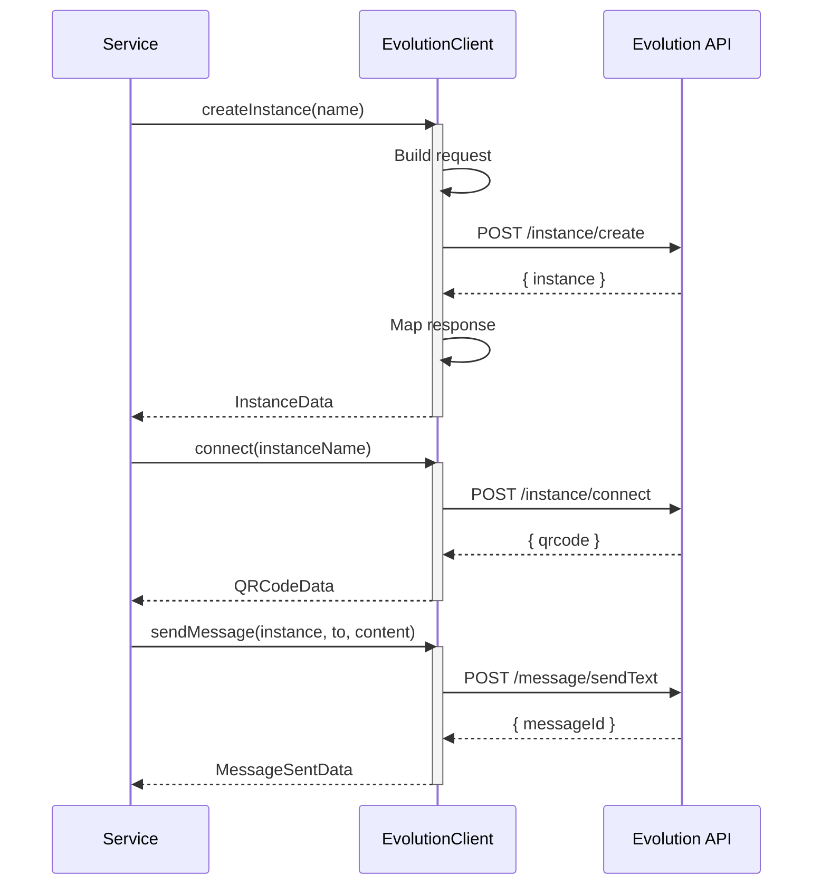

---

### EvolutionClient - Endpoints Mapeados

| Operação | Método | Endpoint Evolution | Descrição |
|----------|--------|-------------------|-----------|
| createInstance | POST | `/instance/create` | Cria instância |
| deleteInstance | DELETE | `/instance/delete/:name` | Remove instância |
| connect | POST | `/instance/connect/:name` | Inicia conexão |
| disconnect | DELETE | `/instance/logout/:name` | Desconecta |
| getStatus | GET | `/instance/connectionState/:name` | Status conexão |
| getQRCode | GET | `/instance/connect/:name` | Obtém QR code |
| sendText | POST | `/message/sendText/:name` | Envia texto |
| sendMedia | POST | `/message/sendMedia/:name` | Envia mídia |
| sendAudio | POST | `/message/sendWhatsAppAudio/:name` | Envia áudio |

---

### Redis Publisher - Eventos Publicados

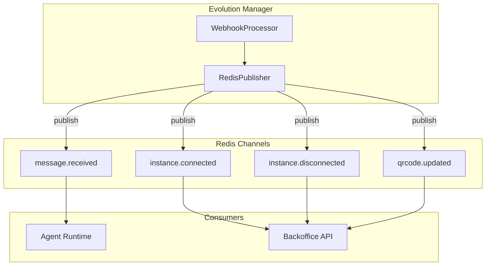

---

### Redis Subscriber - Mensagens para Envio

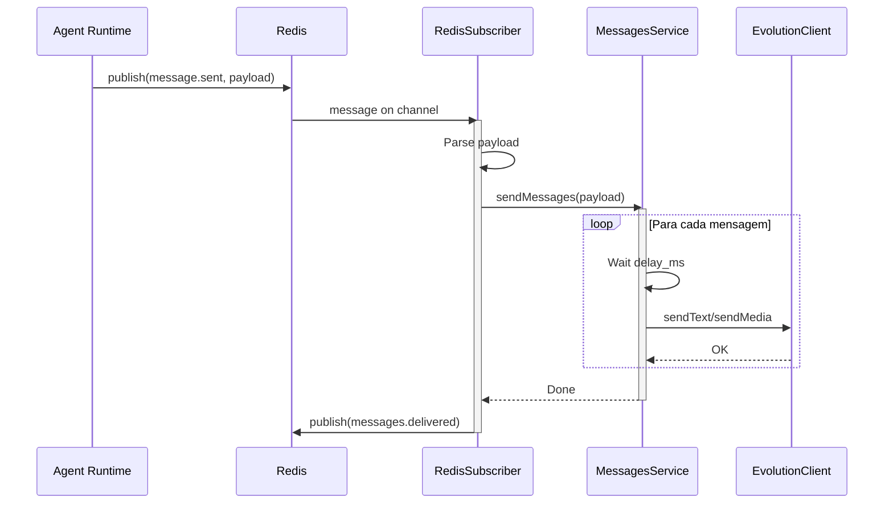

---

## Webhooks da Evolution API

### Tipos de Webhook Suportados

| Evento | Descrição | Payload Principal |
|--------|-----------|-------------------|
| `messages.upsert` | Mensagem recebida | `message, key, pushName` |
| `messages.update` | Status de mensagem | `messageId, status` |
| `connection.update` | Status de conexão | `state, qrcode` |
| `qrcode.updated` | QR code atualizado | `qrcode, instance` |
| `presence.update` | Presença do contato | `id, presence` |

---

### Payload de Mensagem Recebida

```typescript
// dto/webhook-payload.dto.ts

interface MessagesUpsertWebhook {
  event: 'messages.upsert';
  instance: string;
  data: {
    key: {
      remoteJid: string;  // telefone@s.whatsapp.net
      fromMe: boolean;
      id: string;
    };
    pushName: string;  // Nome do contato
    message: {
      conversation?: string;  // Texto
      imageMessage?: {
        url: string;
        mimetype: string;
        caption?: string;
      };
      audioMessage?: {
        url: string;
        mimetype: string;
        seconds: number;
      };
      documentMessage?: {
        url: string;
        mimetype: string;
        fileName: string;
      };
    };
    messageTimestamp: number;
  };
}
```

---

### Transformação Webhook → Evento Interno

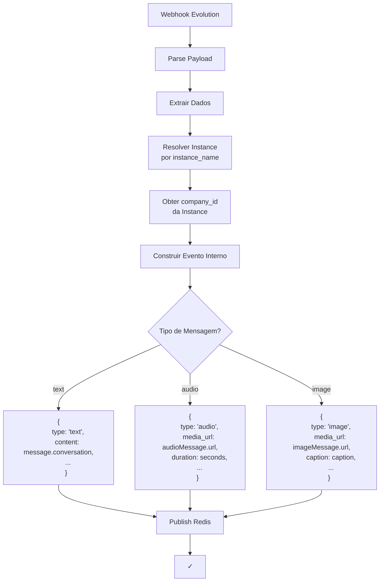

---

## Integração com Outros Serviços

### Eventos Publicados

| Evento | Channel Redis | Payload | Consumidores |
|--------|---------------|---------|--------------|
| `message.received` | `wa:message:received` | `InboundMessagePayload` | Agent Runtime |
| `instance.connected` | `wa:instance:connected` | `InstanceStatusPayload` | Backoffice API |
| `instance.disconnected` | `wa:instance:disconnected` | `InstanceStatusPayload` | Backoffice API |
| `qrcode.updated` | `wa:qrcode:updated` | `QRCodePayload` | Backoffice API |
| `messages.delivered` | `wa:messages:delivered` | `DeliveryConfirmPayload` | Agent Runtime |

### Eventos Consumidos

| Evento | Channel Redis | Producer | Ação |
|--------|---------------|----------|------|
| `message.sent` | `wa:message:sent` | Agent Runtime | Enviar mensagens |

---

### Diagrama de Integração Completa

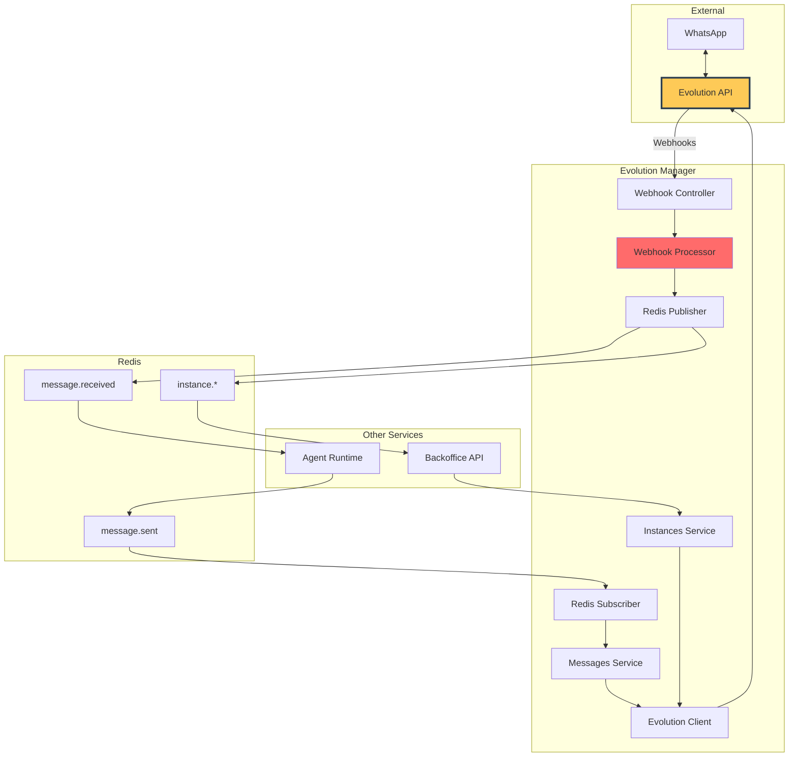

---

## Padrões Técnicos Específicos

### Retry Strategy

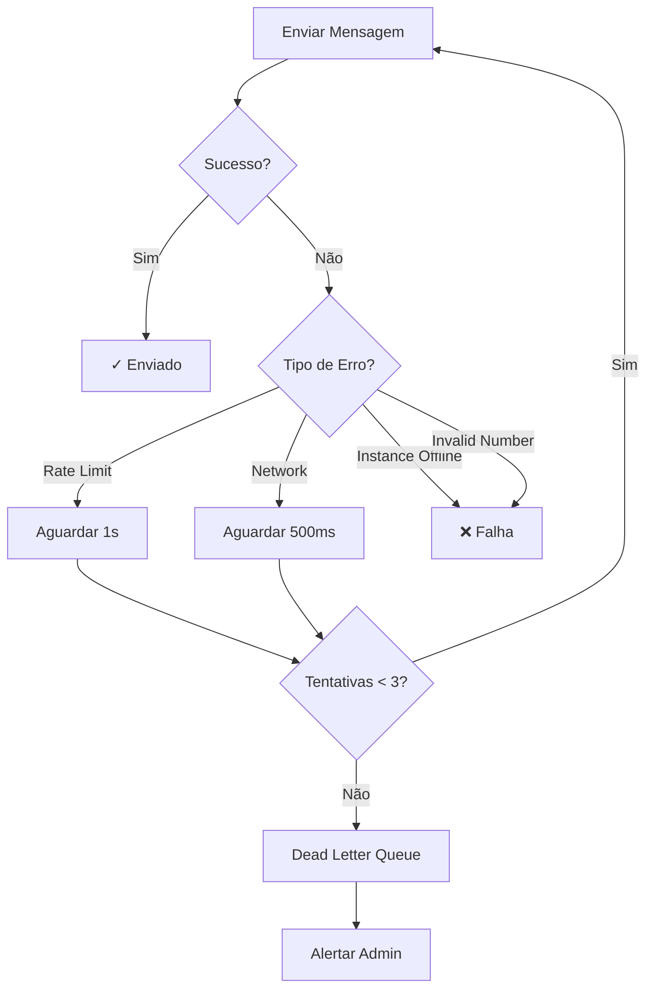

---

### Rate Limiting

```typescript
// Configuração de rate limit por instância
const RATE_LIMITS = {
  messagesPerMinute: 30,
  messagesPerHour: 1000,
  mediaPerMinute: 10,
};

// Implementação com sliding window
interface RateLimitConfig {
  instance_id: string;
  window_size_ms: number;
  max_requests: number;
}
```

---

### Health Check

```typescript
// health/evolution.health.ts

@Injectable()
export class EvolutionHealthIndicator extends HealthIndicator {
  async isHealthy(): Promise<HealthIndicatorResult> {
    // 1. Verificar conectividade com Evolution API
    // 2. Verificar instâncias ativas
    // 3. Verificar Redis connection
    
    return this.getStatus('evolution', isHealthy, {
      api_status: 'connected',
      active_instances: count,
      redis_status: 'connected',
    });
  }
}
```

---

### Métricas

```typescript
// Métricas expostas via Prometheus

// Counters
webhooks_received_total{event_type, instance}
messages_sent_total{instance, status}
messages_received_total{instance, message_type}

// Histograms
webhook_processing_duration_seconds{event_type}
message_send_duration_seconds{instance}

// Gauges
instances_connected{company_id}
instances_total{company_id, status}
pending_messages{instance}
```

---

## Implementação - Checklist

### Fase 1: Domain ✅

- [ ] Definir Instance entity
- [ ] Criar InstanceStatus value object
- [ ] Definir Message entity
- [ ] Implementar máquina de estados
- [ ] Testes unitários

### Fase 2: Infrastructure ✅

- [ ] Implementar EvolutionClient
- [ ] Implementar InstanceRepository
- [ ] Configurar Redis Pub/Sub
- [ ] Implementar QRCode cache
- [ ] Testes de integração

### Fase 3: Services ✅

- [ ] Implementar InstancesService
- [ ] Implementar WebhookProcessor
- [ ] Implementar MessagesService
- [ ] Implementar StatusMonitor
- [ ] Testes de integração

### Fase 4: Controllers ✅

- [ ] Implementar InstancesController
- [ ] Implementar WebhooksController
- [ ] Implementar MessagesController
- [ ] Configurar guards e validação
- [ ] Testes E2E

### Fase 5: Monitoring ✅

- [ ] Health checks
- [ ] Métricas Prometheus
- [ ] Alertas de desconexão
- [ ] Logs estruturados

---

## Referências

### Documentos Relacionados

| Documento | Seção | Link |
|-----------|-------|------|
| Arquitetura Macro | SVC-004 | ARCH-MACRO-v2.0 |
| Agent Runtime | Integração | arch-micro-agent-runtime.md |

### APIs Externas

- **Evolution API**: https://doc.evolution-api.com/
- **WhatsApp Business API**: https://developers.facebook.com/docs/whatsapp

---

**FIM DO DOCUMENTO**

---

*Arquitetura Micro: Evolution Manager v1.0*  
*Gerenciamento de Instâncias WhatsApp*  
*Gerado em: 2025-12-16*
