# Arquitetura Micro: Facebook CAPI Service v1.0

**Documento ID:** ARCH-facebook-capi-v1.0  
**Módulo:** Facebook CAPI Service  
**Bounded Context:** Marketing & Tracking de Conversões  
**Data de Criação:** 2025-12-16  
**Última Atualização:** 2025-12-16  
**Baseado em:** ARCH-MACRO-v2.0  
**Status:** Draft  

---

## Visão Geral do Módulo

### Propósito e Responsabilidade

**Responsabilidade Única (SRP):**  
Enviar eventos de conversão para a Meta Conversions API (CAPI), gerenciar configurações de pixels por empresa e processar fila de eventos de forma assíncrona e confiável.

**Bounded Context:**  
Este módulo é o **gateway de tracking de marketing** do sistema. Ele recebe eventos de conversão de outros serviços (lead criado, lead qualificado, contrato assinado) e os envia para o Facebook de forma otimizada, respeitando rate limits e garantindo entrega.

**Por que este módulo existe:**

- Centralizar toda comunicação com Meta Conversions API
- Garantir entrega confiável de eventos (retry, dead letter queue)
- Gerenciar múltiplos pixels (um por empresa)
- Isolar complexidade de hashing e formatação do CAPI
- Permitir tracking server-side para melhor atribuição

---

### Localização na Arquitetura Macro

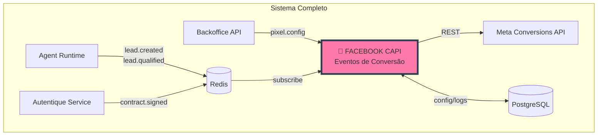

---

### Capacidades Principais

| Operação | Tipo | Descrição | Input | Output |
|----------|------|-----------|-------|--------|
| **SendLeadEvent** | Command | Envia evento Lead | `LeadEventDTO` | `EventResultDTO` |
| **SendPurchaseEvent** | Command | Envia evento Purchase | `PurchaseEventDTO` | `EventResultDTO` |
| **SendCompleteRegistration** | Command | Envia evento CompleteRegistration | `RegistrationEventDTO` | `EventResultDTO` |
| **SendCustomEvent** | Command | Envia evento customizado | `CustomEventDTO` | `EventResultDTO` |
| **ConfigurePixel** | Command | Configura pixel da empresa | `PixelConfigDTO` | `PixelDTO` |
| **GetPixelConfig** | Query | Busca config do pixel | `CompanyIdDTO` | `PixelConfigDTO` |
| **ListEventLogs** | Query | Lista logs de eventos | `EventLogsFilterDTO` | `EventLogListDTO` |
| **ProcessQueue** | Command | Processa fila de eventos | - | `ProcessResultDTO` |

---

## Arquitetura Interna de Camadas

### Visão Geral das Camadas

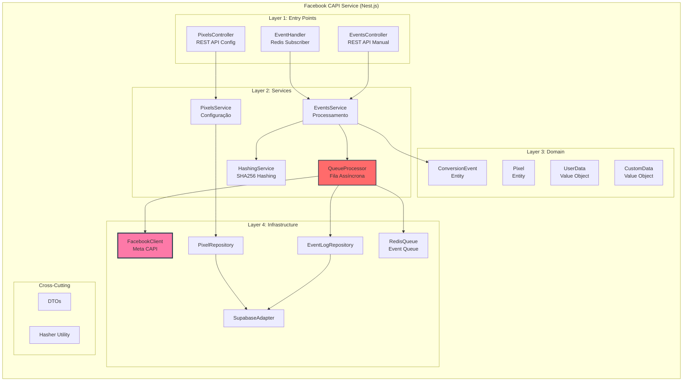

---

## Layer 1: Entry Points

### Responsabilidade da Camada

**O que faz:**

- Subscreve em eventos Redis (lead.created, lead.qualified, contract.signed)
- Expõe endpoints REST para configuração de pixels
- Permite envio manual de eventos via REST

**O que NÃO faz:**

- ❌ Processamento de eventos
- ❌ Comunicação com Meta API
- ❌ Hashing de dados

---

### Estrutura de Arquivos

```
src/
├── handlers/
│   └── event.handler.ts           # Redis subscriber
│
├── modules/
│   ├── events/
│   │   └── controllers/
│   │       └── events.controller.ts
│   │
│   └── pixels/
│       └── controllers/
│           └── pixels.controller.ts
```

---

### Redis Subscriber - Eventos Escutados

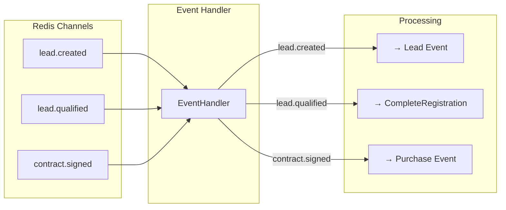

---

### Mapeamento Eventos → CAPI Events

| Evento Interno | CAPI Event | Descrição |
|---------------|------------|-----------|
| `lead.created` | `Lead` | Novo lead capturado |
| `lead.qualified` | `CompleteRegistration` | Lead qualificado pela IA |
| `contract.signed` | `Purchase` | Contrato assinado |
| `page.viewed` | `ViewContent` | Página visualizada |
| `custom.*` | Custom Event | Eventos customizados |

---

### Endpoints REST

```typescript
// controllers/pixels.controller.ts

@Controller('pixels')
@UseGuards(JwtAuthGuard)
export class PixelsController {
  @Post()
  async configure(
    @Body() dto: ConfigurePixelDTO,
    @CurrentUser() user: JwtPayload,
  ): Promise<PixelResponseDTO>;

  @Get()
  async getByCompany(
    @CurrentUser() user: JwtPayload,
  ): Promise<PixelResponseDTO>;

  @Patch(':id')
  async update(
    @Param('id') id: string,
    @Body() dto: UpdatePixelDTO,
    @CurrentUser() user: JwtPayload,
  ): Promise<PixelResponseDTO>;

  @Delete(':id')
  async delete(
    @Param('id') id: string,
    @CurrentUser() user: JwtPayload,
  ): Promise<void>;
}

// controllers/events.controller.ts

@Controller('events')
@UseGuards(JwtAuthGuard)
export class EventsController {
  @Post('send')
  async sendEvent(
    @Body() dto: SendEventDTO,
    @CurrentUser() user: JwtPayload,
  ): Promise<EventResultDTO>;

  @Get('logs')
  async getLogs(
    @Query() filter: EventLogsFilterDTO,
    @CurrentUser() user: JwtPayload,
  ): Promise<EventLogListDTO>;

  @Post('retry/:id')
  async retryEvent(
    @Param('id') id: string,
    @CurrentUser() user: JwtPayload,
  ): Promise<EventResultDTO>;
}
```

---

## Layer 2: Services

### Responsabilidade da Camada

**O que faz:**

- Processa eventos e prepara payload CAPI
- Aplica hashing em dados sensíveis
- Gerencia fila de eventos
- Coordena retry e dead letter queue

**O que NÃO faz:**

- ❌ Conhecer detalhes de Redis/HTTP
- ❌ Implementar protocolo CAPI diretamente

---

### Diagrama de Componentes

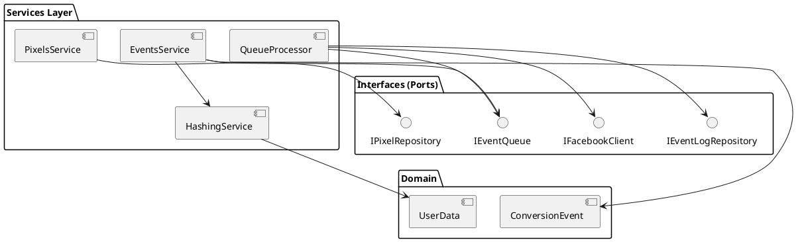

---

### EventsService - Fluxo de Processamento

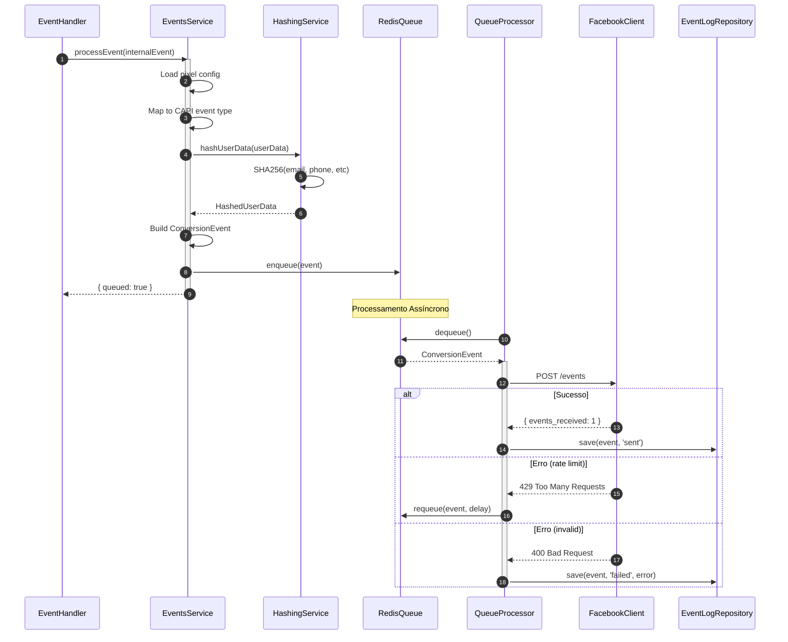

---

### HashingService - Normalização e Hashing

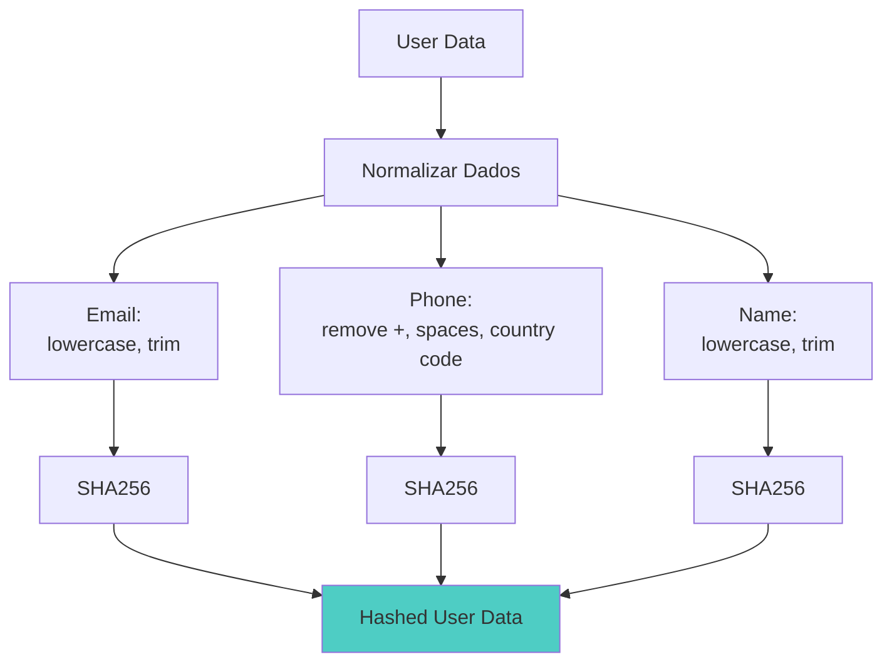

**Regras de Normalização (Meta Requirements):**

| Campo | Normalização | Exemplo |
|-------|-------------|---------|
| `email` | lowercase, trim | `joao@example.com` |
| `phone` | digits only, no country code | `11999887766` |
| `first_name` | lowercase, trim | `joao` |
| `last_name` | lowercase, trim | `silva` |
| `city` | lowercase, no accents | `sao paulo` |
| `state` | 2-letter code | `sp` |
| `country` | 2-letter ISO | `br` |
| `zip` | digits only | `01310100` |

---

### QueueProcessor - Retry com Backoff

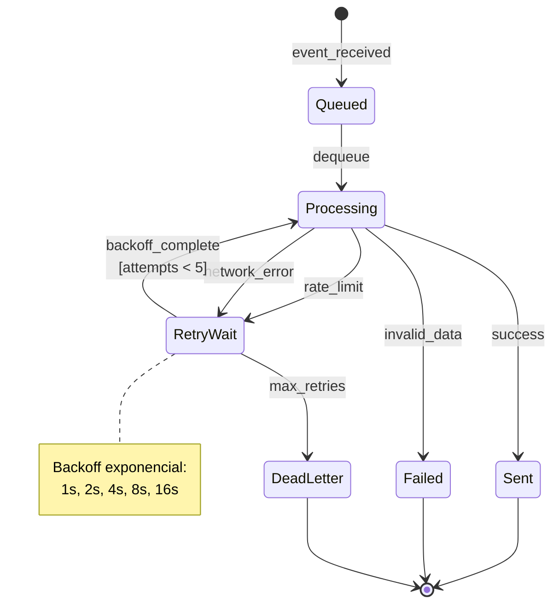

---

### PixelsService - Configuração

```typescript
// services/pixels.service.ts

export interface IPixelsService {
  configure(dto: ConfigurePixelDTO, companyId: string): Promise<PixelResponseDTO>;
  getByCompany(companyId: string): Promise<PixelResponseDTO | null>;
  update(pixelId: string, dto: UpdatePixelDTO, companyId: string): Promise<PixelResponseDTO>;
  delete(pixelId: string, companyId: string): Promise<void>;
  validateToken(pixelId: string, accessToken: string): Promise<boolean>;
}

// DTOs
export interface ConfigurePixelDTO {
  pixel_id: string;
  access_token: string;
  test_event_code?: string;  // Para testes
  enabled_events: EventType[];
}

export interface PixelResponseDTO {
  id: string;
  company_id: string;
  pixel_id: string;
  enabled_events: EventType[];
  is_active: boolean;
  last_event_at: Date | null;
  created_at: Date;
}
```

---

### Estrutura de Arquivos

```
src/
├── modules/
│   ├── events/
│   │   ├── services/
│   │   │   ├── events.service.ts
│   │   │   ├── queue-processor.service.ts
│   │   │   └── hashing.service.ts
│   │   ├── dto/
│   │   │   ├── send-event.dto.ts
│   │   │   ├── lead-event.dto.ts
│   │   │   ├── purchase-event.dto.ts
│   │   │   └── event-result.dto.ts
│   │   └── interfaces/
│   │       ├── events.service.interface.ts
│   │       └── event-log.repository.interface.ts
│   │
│   └── pixels/
│       ├── services/
│       │   └── pixels.service.ts
│       ├── dto/
│       │   ├── configure-pixel.dto.ts
│       │   └── pixel-response.dto.ts
│       └── interfaces/
│           └── pixel.repository.interface.ts
```

---

## Layer 3: Domain

### Responsabilidade da Camada

**O que faz:**

- Define estrutura de eventos de conversão
- Encapsula regras de validação
- Define value objects para dados do usuário

**O que NÃO faz:**

- ❌ Conhecer Facebook API
- ❌ Fazer hashing (isso é Service)
- ❌ Acessar banco

---

### Diagrama de Entidades

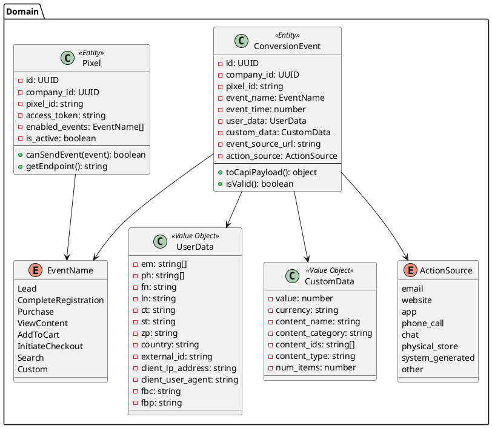

---

### Estrutura de Arquivos

```
src/
├── modules/
│   ├── events/
│   │   └── domain/
│   │       ├── entities/
│   │       │   └── conversion-event.entity.ts
│   │       ├── value-objects/
│   │       │   ├── user-data.vo.ts
│   │       │   └── custom-data.vo.ts
│   │       └── enums/
│   │           ├── event-name.enum.ts
│   │           └── action-source.enum.ts
│   │
│   └── pixels/
│       └── domain/
│           └── entities/
│               └── pixel.entity.ts
```

---

### ConversionEvent - Payload CAPI

```typescript
// domain/entities/conversion-event.entity.ts

class ConversionEvent {
  private _id: UUID;
  private _companyId: UUID;
  private _eventName: EventName;
  private _eventTime: number;
  private _userData: UserData;
  private _customData: CustomData;
  private _eventSourceUrl: string;
  private _actionSource: ActionSource;
  
  /**
   * Converte para payload CAPI
   * Formato esperado pela Meta Conversions API
   */
  toCapiPayload(): CapiEventPayload {
    return {
      event_name: this._eventName,
      event_time: this._eventTime,
      action_source: this._actionSource,
      event_source_url: this._eventSourceUrl,
      user_data: this._userData.toPayload(),
      custom_data: this._customData?.toPayload(),
    };
  }
  
  isValid(): boolean {
    // Validações obrigatórias
    return (
      this._eventName !== null &&
      this._eventTime > 0 &&
      this._userData.hasMinimumData() &&
      this._actionSource !== null
    );
  }
}
```

---

### UserData Value Object

```typescript
// domain/value-objects/user-data.vo.ts

/**
 * Value Object: UserData
 * Imutável - dados já hashados
 * 
 * Campos obrigatórios (pelo menos 1):
 * - em (email hash)
 * - ph (phone hash)
 * - external_id
 */
@dataclass(frozen=True)
class UserData {
  em: string[] | null;      // Email hashes (pode ter múltiplos)
  ph: string[] | null;      // Phone hashes
  fn: string | null;        // First name hash
  ln: string | null;        // Last name hash
  ct: string | null;        // City hash
  st: string | null;        // State hash
  zp: string | null;        // Zip hash
  country: string | null;   // Country hash
  external_id: string | null;
  client_ip_address: string | null;
  client_user_agent: string | null;
  fbc: string | null;       // Facebook click ID
  fbp: string | null;       // Facebook browser ID
  
  hasMinimumData(): boolean {
    return (
      (this.em && this.em.length > 0) ||
      (this.ph && this.ph.length > 0) ||
      this.external_id !== null
    );
  }
  
  toPayload(): object {
    // Remove campos null
    return Object.fromEntries(
      Object.entries(this).filter(([_, v]) => v !== null)
    );
  }
}
```

---

## Layer 4: Infrastructure

### Responsabilidade da Camada

**O que faz:**

- Implementa cliente HTTP para Meta CAPI
- Gerencia fila Redis
- Persiste logs de eventos
- Armazena configurações de pixel

---

### Diagrama de Componentes

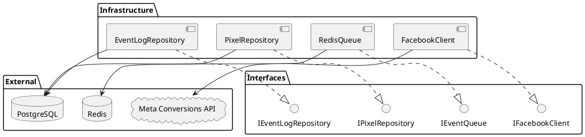

---

### Estrutura de Arquivos

```
src/
├── infrastructure/
│   ├── facebook/
│   │   ├── facebook.module.ts
│   │   ├── facebook.client.ts
│   │   └── facebook.config.ts
│   │
│   ├── redis/
│   │   ├── redis.module.ts
│   │   └── event-queue.service.ts
│   │
│   ├── supabase/
│   │   ├── supabase.module.ts
│   │   └── supabase.service.ts
│   │
│   └── repositories/
│       ├── pixel.repository.ts
│       ├── event-log.repository.ts
│       └── mappers/
│           ├── pixel.mapper.ts
│           └── event-log.mapper.ts
```

---

### FacebookClient - Comunicação com CAPI

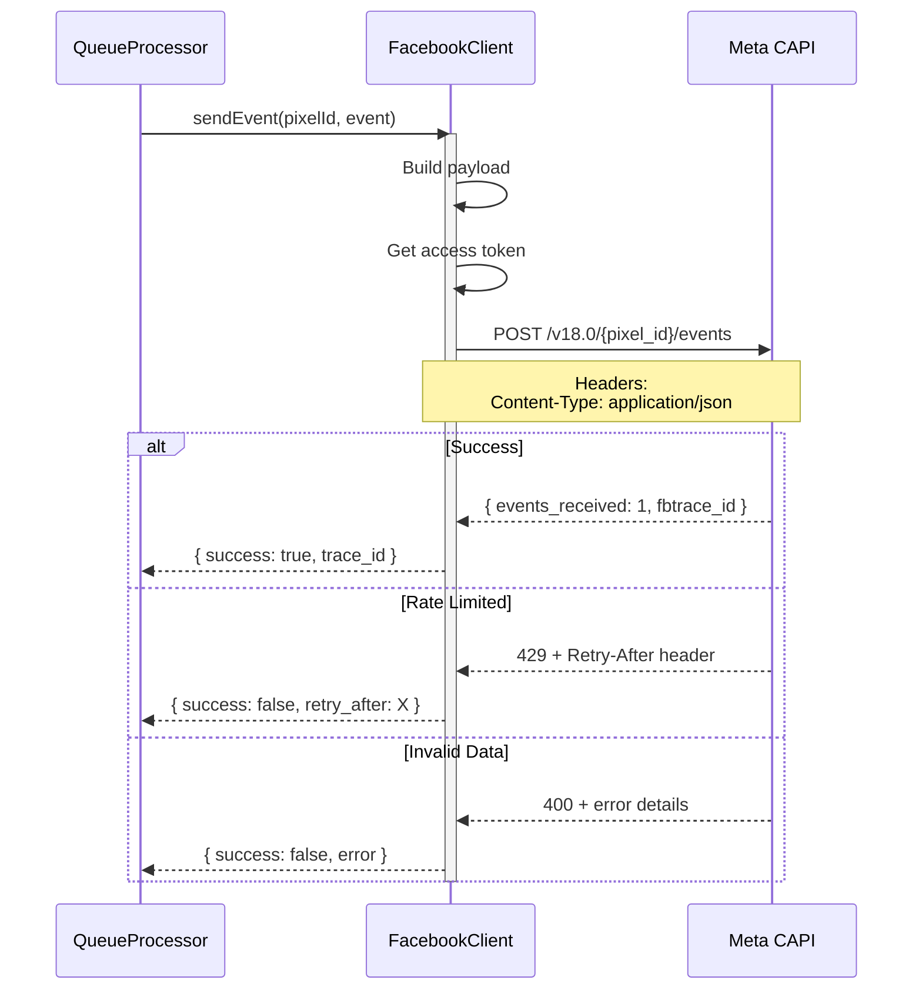

---

### Facebook CAPI - Endpoint e Payload

```typescript
// infrastructure/facebook/facebook.client.ts

const CAPI_BASE_URL = 'https://graph.facebook.com/v18.0';

interface CapiRequest {
  data: CapiEventPayload[];
  test_event_code?: string;
}

interface CapiEventPayload {
  event_name: string;
  event_time: number;
  action_source: string;
  event_source_url?: string;
  user_data: {
    em?: string[];
    ph?: string[];
    fn?: string;
    ln?: string;
    ct?: string;
    st?: string;
    zp?: string;
    country?: string;
    external_id?: string;
    client_ip_address?: string;
    client_user_agent?: string;
    fbc?: string;
    fbp?: string;
  };
  custom_data?: {
    value?: number;
    currency?: string;
    content_name?: string;
    content_category?: string;
    content_ids?: string[];
    content_type?: string;
    num_items?: number;
  };
}

// Endpoint
// POST /{pixel_id}/events?access_token={token}
```

---

### RedisQueue - Estrutura da Fila

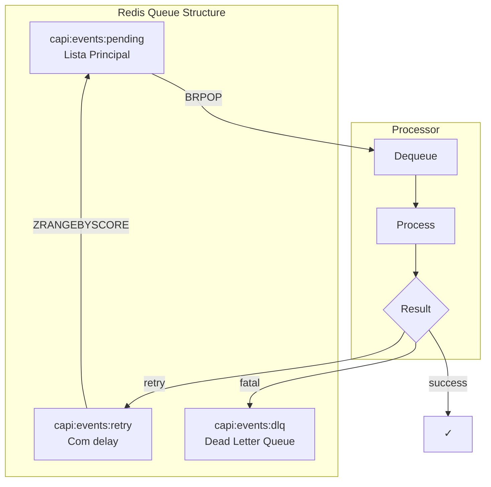

---

### EventLogRepository - Persistência

```sql
-- Tabela de logs de eventos CAPI
CREATE TABLE core.capi_event_logs (
  id uuid PRIMARY KEY DEFAULT gen_random_uuid(),
  company_id uuid NOT NULL REFERENCES core.companies(id),
  pixel_id text NOT NULL,
  
  -- Evento
  event_name text NOT NULL,
  event_time timestamptz NOT NULL,
  event_payload jsonb NOT NULL,
  
  -- Status
  status text NOT NULL DEFAULT 'pending',  -- pending, sent, failed, retrying
  attempts int DEFAULT 0,
  last_attempt_at timestamptz,
  
  -- Resposta
  fb_trace_id text,
  error_message text,
  error_code text,
  
  -- Metadata
  source_event text,  -- lead.created, contract.signed, etc.
  source_id uuid,     -- ID do lead, contrato, etc.
  
  created_at timestamptz NOT NULL DEFAULT now(),
  updated_at timestamptz NOT NULL DEFAULT now()
);

-- Índices
CREATE INDEX idx_capi_logs_company ON core.capi_event_logs(company_id);
CREATE INDEX idx_capi_logs_status ON core.capi_event_logs(status);
CREATE INDEX idx_capi_logs_pixel ON core.capi_event_logs(pixel_id);
CREATE INDEX idx_capi_logs_created ON core.capi_event_logs(created_at);
```

---

## Integração com Outros Serviços

### Eventos Consumidos

| Evento | Channel Redis | Producer | Ação |
|--------|---------------|----------|------|
| `lead.created` | `events:lead:created` | Agent Runtime | Enviar Lead event |
| `lead.qualified` | `events:lead:qualified` | Agent Runtime | Enviar CompleteRegistration |
| `contract.signed` | `events:contract:signed` | Autentique Service | Enviar Purchase event |

---

### Payload dos Eventos Internos

```typescript
// Evento lead.created
interface LeadCreatedPayload {
  lead_id: string;
  company_id: string;
  pixel_config_id: string;
  phone: string;
  email?: string;
  name?: string;
  utm_campaign?: string;
  utm_source?: string;
  utm_medium?: string;
  fbc?: string;  // Facebook click ID
  fbp?: string;  // Facebook browser ID
  source_url?: string;
  timestamp: number;
}

// Evento lead.qualified
interface LeadQualifiedPayload {
  lead_id: string;
  company_id: string;
  pixel_config_id: string;
  phone: string;
  email?: string;
  name?: string;
  qualification_score: number;
  timestamp: number;
}

// Evento contract.signed
interface ContractSignedPayload {
  contract_id: string;
  deal_id: string;
  lead_id: string;
  company_id: string;
  pixel_config_id: string;
  phone: string;
  email?: string;
  name?: string;
  value: number;
  currency: string;
  content_name?: string;  // Nome do serviço
  timestamp: number;
}
```

---

### Diagrama de Integração Completa

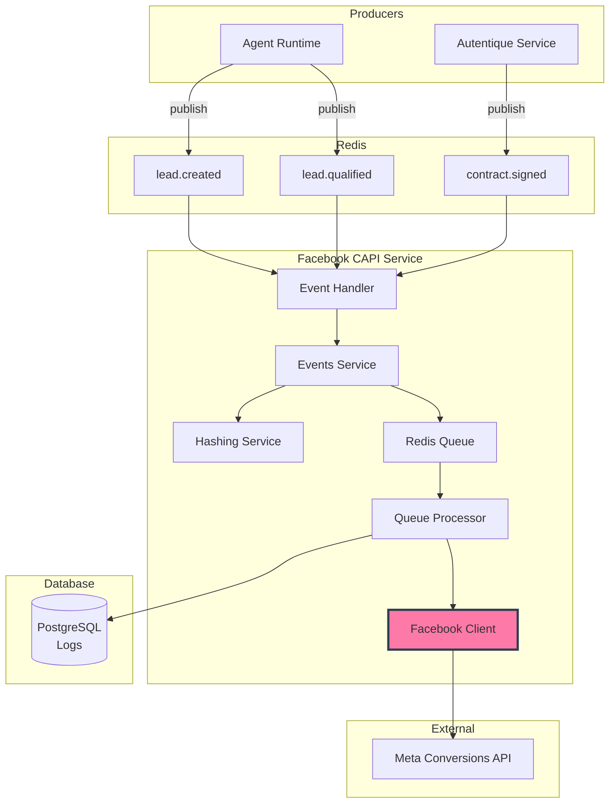

---

## Padrões Técnicos Específicos

### Deduplicação de Eventos

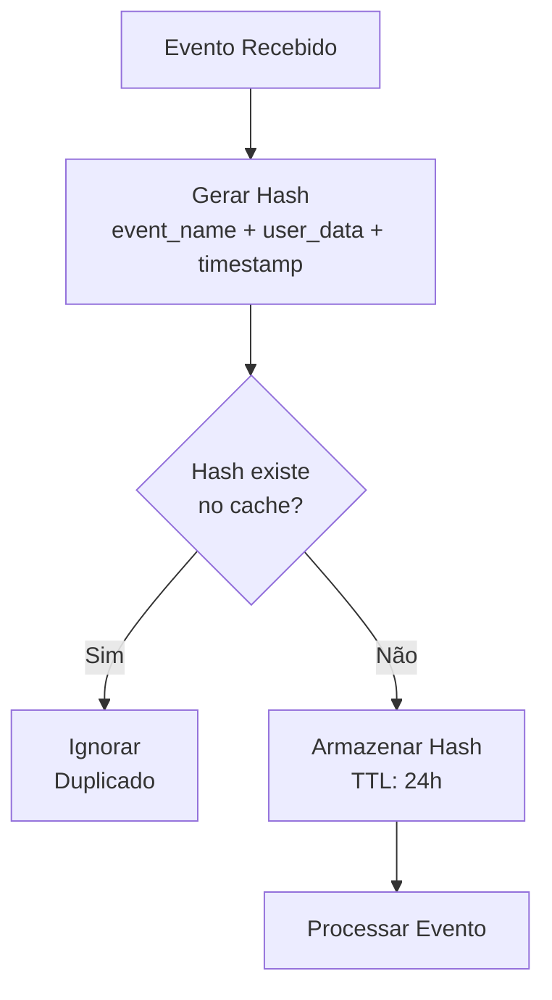

---

### Batching de Eventos

```typescript
// Meta CAPI suporta até 1000 eventos por request
// Otimização: agrupar eventos em batches

interface BatchConfig {
  maxBatchSize: 100;        // Eventos por batch
  maxWaitTimeMs: 5000;      // Tempo máximo para formar batch
  minBatchSize: 1;          // Mínimo para enviar
}
```

---

### Test Events

```typescript
// Para testar sem afetar dados de produção

interface TestEventConfig {
  test_event_code: string;  // Código do Events Manager
  enabled: boolean;
}

// Adicionar ao payload quando em modo teste
const payload = {
  data: [event],
  test_event_code: config.test_event_code,
};
```

---

### Métricas

```typescript
// Métricas expostas via Prometheus

// Counters
capi_events_sent_total{company_id, event_name, status}
capi_events_received_total{source_event}
capi_events_retried_total{company_id, event_name}
capi_events_failed_total{company_id, event_name, error_code}

// Histograms
capi_event_processing_duration_seconds{event_name}
capi_api_request_duration_seconds{status_code}

// Gauges
capi_queue_depth{queue_name}
capi_active_pixels{company_id}
```

---

## Implementação - Checklist

### Fase 1: Domain ✅

- [ ] Definir ConversionEvent entity
- [ ] Criar UserData value object
- [ ] Criar CustomData value object
- [ ] Definir enums (EventName, ActionSource)
- [ ] Testes unitários

### Fase 2: Infrastructure ✅

- [ ] Implementar FacebookClient
- [ ] Implementar RedisQueue
- [ ] Implementar PixelRepository
- [ ] Implementar EventLogRepository
- [ ] Testes de integração

### Fase 3: Services ✅

- [ ] Implementar EventsService
- [ ] Implementar HashingService
- [ ] Implementar QueueProcessor
- [ ] Implementar PixelsService
- [ ] Retry logic com backoff
- [ ] Testes de integração

### Fase 4: Entry Points ✅

- [ ] Implementar EventHandler (Redis subscriber)
- [ ] Implementar PixelsController
- [ ] Implementar EventsController
- [ ] Testes E2E

### Fase 5: Monitoring ✅

- [ ] Health checks
- [ ] Métricas Prometheus
- [ ] Dashboard de eventos
- [ ] Alertas de falha

---

## Referências

### Documentos Relacionados

| Documento | Seção | Link |
|-----------|-------|------|
| Arquitetura Macro | SVC-006 | ARCH-MACRO-v2.0 |
| Marketing & Tracking | Pixels | arch-micro-marketing-tracking.md |

### APIs Externas

- **Meta Conversions API**: https://developers.facebook.com/docs/marketing-api/conversions-api
- **Server Event Parameters**: https://developers.facebook.com/docs/marketing-api/conversions-api/parameters/server-event

---

**FIM DO DOCUMENTO**

---

*Arquitetura Micro: Facebook CAPI Service v1.0*  
*Marketing & Tracking de Conversões*  
*Gerado em: 2025-12-16*
