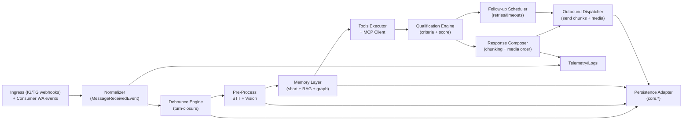
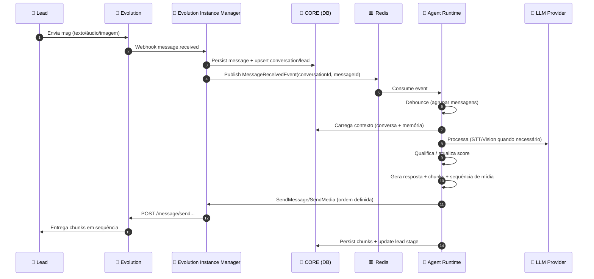
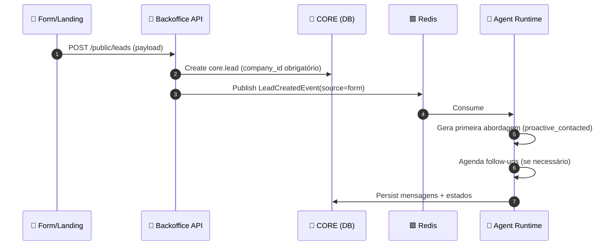
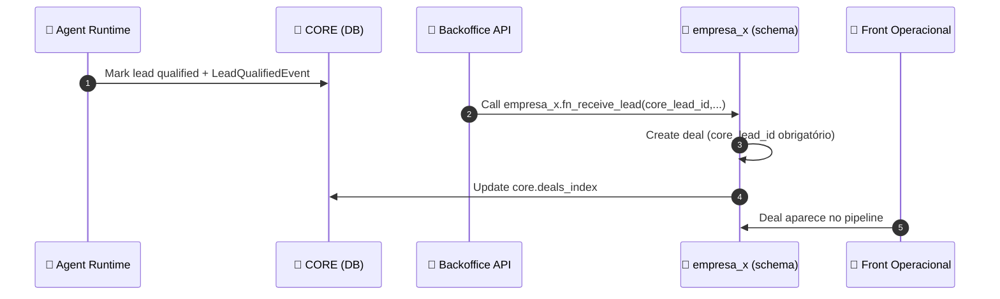
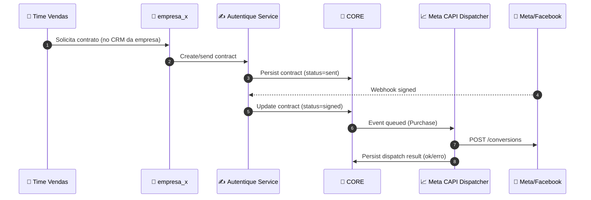

# Documento de Arquitetura Macro v2.0 — Backoffice Multi‑Tenant + Centurions Multi‑Canal

**Sistema:** Back‑Office Multi‑Tenant da Holding (SDR 100% IA, multi‑canal WhatsApp/Instagram/Telegram)  
**Versão:** 0.2 (macro consolidada + modularização por serviços)  
**Data:** 2025‑12‑16  
**Autor:** Ryuji Morimoto (Wakagashira / O Engenheiro do Clã)

---

## 0. Resultado esperado (ponta a ponta)

Quando isso estiver de pé, a V1 entrega:

- Dono/admin cria empresa → sistema provisiona schema da empresa (clone `_template_base`) e governa tudo pelo CORE.
- Lead entra por **WhatsApp/Instagram/Telegram** ou **form** → Centurion conversa com debounce + chunking + multimodal + tools/MCP + memória → qualifica.
- Lead qualificado dispara **handoff** → vira **deal no schema da empresa** e atualiza `core.deals_index`.
- Conversões (contrato assinado / deal ganho) geram **eventos de marketing** e vão para **Meta CAPI**.
- Backoffice mostra métricas e status de canais/instâncias.

---

## 1. Contexto invariável e limites do sistema

### 1.1 Leis do sistema (não negocia)

1) **Este sistema é Backoffice — não é CRM operacional.**  
2) **SDR é 100% IA (Centurions).**  
3) **Banco único + multi‑tenant por schema** (`core` + `_template_base` + `empresa_x`).  
4) **CORE é imutável** (não muda por demanda específica de empresa).  
5) **Sem `company_id` = sem recurso** (nada nasce órfão).  

### 1.2 O que este sistema é

- Painel do dono/admins para governança (empresas, acessos, IAs, integrações) e visão consolidada.
- Orquestrador central do SDR por IA + integrações globais + tracking consolidado.

### 1.3 O que este sistema não é

- CRM operacional do vendedor (pipeline/kanban/chat).
- Front por empresa (isso vive em repositórios separados e opera no schema `empresa_x`).

---

## 2. Requisitos “duros” do Centurion (motor conversacional)

O Centurion precisa:

- **Debounce / turn-closure**: responder só quando o lead terminou de enviar.  
- **Resposta picada (chunking)**: várias mensagens pequenas, com tracking por chunk e delay humanizado.
- **Multimodal inbound/outbound**:
  - entender áudio (STT),
  - interpretar imagem (vision),
  - enviar mídias (áudio/imagem/vídeo) na ordem configurada pelo dono.
- **Ferramentas e extensibilidade**:
  - tools internas e externas (HTTP),
  - **MCP servers**.
- **Memória em camadas**:
  - curto prazo (fila sequencial de mensagens),
  - longo prazo (RAG do lead),
  - grafo (relacionamentos e contexto estruturado).
- **Qualificação + follow‑up**:
  - critérios configuráveis,
  - marcar qualificado/não,
  - follow‑ups automáticos.

---

## 3. Visão de arquitetura: decomposição por serviços

### 3.1 Serviços obrigatórios (stack e propósito)

> Esses são os serviços “fixos” que vamos trabalhar (conforme sua diretriz).

1) **Agent Runtime Service** — *Python (Agno) + Redis*  
   Motor de orquestração dos agentes (Centurions).

2) **Meta CAPI Dispatcher Service** — *serviço dedicado*  
   Envio confiável de eventos para Facebook/Meta Conversions API.

3) **Backoffice Web** — *React + Next.js*  
   Frontend do backoffice.

4) **Backoffice API (BFF/CRUD)** — *Nest.js*  
   Backend do frontend (CRUD + orquestração de comandos).

5) **Evolution Instance Manager** — *Nest.js*  
   Gerenciamento e integração com instâncias Evolution (WhatsApp): QR, status, webhooks e envio.

6) **Autentique Integration Service** — *Nest.js*  
   Templates, geração de contratos e webhooks de assinatura.

### 3.2 Decisão pragmática para V1: Instagram e Telegram

- **WhatsApp**: entra via Evolution Instance Manager (por exigência do provedor e da sua decisão de separar o serviço).
- **Instagram + Telegram**: no V1, entram **direto no Agent Runtime** (webhooks/updates), para não multiplicar serviço antes da necessidade.
- **Contrato interno é único**: tudo vira `MessageReceivedEvent` normalizado. Se precisar escalar, você extrai IG/TG para gateways dedicados sem mexer no runtime.

---

## 4. C4 — Contexto

```mermaid
flowchart TB
  subgraph Pessoas
    Owner[👑 Dono / super_admin]
    BOA[🧩 backoffice_admin]
    AIS[🤖 ai_supervisor]
    MKT[📣 marketing_admin]
    Sales[🧑‍💼 crm_user (Front Operacional)]
    Lead[📱 Lead]
  end

  subgraph Backoffice["🔧 Backoffice (este sistema)"]
    BOW[Backoffice Web
Next.js]
    BOAPI[Backoffice API
Nest.js]
    AR[Agent Runtime
Python+Agno]
    EVO_MGR[Evolution Instance Manager
Nest.js]
    AUTHQ[Autentique Integration
Nest.js]
    META_CAPI[Meta CAPI Dispatcher
Service/Worker]
  end

  subgraph DB["🗄️ Banco Único (Supabase/Postgres)"]
    CORE[(core)]
    TPL[(_template_base)]
    TEN[(empresa_x)]
    AUTH[(auth)]
    STG[(storage)]
  end

  subgraph Externos
    EVO[💬 Evolution API (WhatsApp)]
    IG[📷 Instagram (Meta Graph + Webhooks)]
    TG[✈️ Telegram (Bot API + Webhooks)]
    MCP[🧰 MCP Servers]
    LLM[🧠 LLM Providers]
    META[📈 Meta / Facebook CAPI]
    Autentique[✍️ Autentique]
  end

  Owner --> BOW --> BOAPI
  BOA --> BOW
  AIS --> BOW
  MKT --> BOW

  BOAPI --> CORE
  BOAPI --> TEN
  CORE --> TPL
  BOAPI --> STG

  Lead --> EVO --> EVO_MGR
  Lead --> IG --> AR
  Lead --> TG --> AR

  EVO_MGR --> AR
  AR --> LLM
  AR --> MCP
  AR --> CORE

  BOAPI --> EVO_MGR
  BOAPI --> AUTHQ
  AUTHQ --> Autentique
  AUTHQ --> CORE

  BOAPI --> META_CAPI
  CORE --> META_CAPI
  META_CAPI --> META

  Sales --> TEN
```

---

## 5. C4 — Containers (serviços) e responsabilidades

### 5.1 Tabela de serviços (contratos + ownership)

| Serviço | Responsabilidade primária | Interfaces públicas | Dados “primários” que escreve | Dependências |
|---|---|---|---|---|
| **Backoffice Web** (Next.js) | UI do dono/admins | UI Web | N/A | Backoffice API |
| **Backoffice API** (Nest.js) | BFF + CRUD + orquestração | REST (privado), Webhook (form) | `core.companies`, `core.company_users`, configs de centurion/tools/kb/pixel, auditoria | Postgres, Storage, Evolution Mgr, Autentique, Meta CAPI |
| **Agent Runtime** (Python+Agno) | Conversa, IA, memória, follow‑ups, tool/MCP | Events/Jobs (Redis), Webhooks (IG/TG) | `core.conversations`, `core.messages`, `core.leads` (score/stage), memória do lead | Redis, Postgres, LLM, MCP, Evolution Mgr |
| **Evolution Instance Manager** (Nest.js) | Instâncias WA + webhooks WA + envio WA | Webhooks Evolution + REST interno | `core.channel_instances` (WA), `core.messages` (ids/status) | Evolution API, Postgres |
| **Autentique Integration** (Nest.js) | Templates/contratos + webhooks assinatura | REST interno + webhooks | `core.contract_templates`, `core.contracts` | Autentique API, Postgres |
| **Meta CAPI Dispatcher** | Dispatch confiável de conversões | Worker interno | `core.marketing_events` + logs de dispatch | Meta CAPI, Postgres, Redis (fila) |

---

## 6. Modularização por serviço (alto nível)

> Aqui é onde “microserviço” deixa de ser caixa preta e vira arquitetura que aguenta escala sem virar gambiarra.

### 6.1 Backoffice Web (Next.js) — módulos

- `modules/auth` (login/session)
- `modules/companies` (CRUD + status + visão)
- `modules/centurions` (config de prompt/personalidade)
- `modules/channels` (status de canais + instâncias WA)
- `modules/knowledge-base` (upload + status de indexação)
- `modules/tools-mcp` (tools, servidores MCP, permissões)
- `modules/marketing` (pixels, eventos, métricas)
- `modules/contracts` (templates + contratos + status)
- `modules/observability` (logs/auditoria, health)

### 6.2 Backoffice API (Nest.js) — módulos de domínio

- `modules/governance`
  - companies, company_users, roles/scopes, lifecycle de company
  - provisionamento de schema (clone `_template_base`) e mapeamento `company → schema`
- `modules/centurions`
  - centurion configs, critérios de qualificação, playbooks de conversa, sequência de mídia
- `modules/channels`
  - registro de instâncias/canais, mapping `instância → company_id → centurion_id`
  - visão de status por canal (WA/IG/TG)
- `modules/knowledge-base`
  - upload de documentos
  - jobs de embedding/indexação (disparar pro runtime)
- `modules/tools`
  - tools configuráveis por centurion
  - credenciais/segredos (referências, nunca plaintext no DB)
- `modules/mcp`
  - cadastro de MCP servers + catálogo de tools por server
- `modules/marketing`
  - pixels por empresa
  - registro de eventos (queue/outbox) para o dispatcher
- `modules/contracts`
  - templates globais/por empresa
  - vínculo com `core.deals_index` e ciclo de vida de contratos
- `modules/audit`
  - trilha de auditoria e logs operacionais (quem mudou o quê)

### 6.3 Agent Runtime (Python + Agno + Redis) — componentes internos

**Pipeline macro do runtime:**



**Módulos internos sugeridos (pasta):**

- `runtime/ingress` (webhooks IG/TG + consumer do Redis)
- `runtime/debounce`
- `runtime/preprocess/stt` e `runtime/preprocess/vision`
- `runtime/memory` (short, rag, graph)
- `runtime/tools` (tools internas) + `runtime/mcp` (client)
- `runtime/qualification`
- `runtime/followups`
- `runtime/response` (chunking + media sequencer)
- `runtime/outbound` (adapters por canal: WA via EvolutionMgr; IG/TG direto)
- `runtime/observability`

### 6.4 Evolution Instance Manager (Nest.js) — módulos

- `modules/instances`
  - criar/conectar/reiniciar/desconectar
  - QR code e estado (connected/qr_ready/disconnected/error)
- `modules/webhooks`
  - receber `message.received`, `instance.connected`, etc
  - idempotência por provider ids
- `modules/messages`
  - envio de texto e mídia (ordem garantida)
  - tracking de message ids/status
- `modules/mapping`
  - `instance_id ↔ company_id ↔ centurion_id`

### 6.5 Autentique Integration (Nest.js) — módulos

- `modules/templates` (CRUD templates)
- `modules/contracts`
  - criar contrato, enviar para assinatura, status
  - link com `core.deals_index`
- `modules/webhooks`
  - assinatura (signed/expired/canceled)
  - idempotência e atualização do CORE
- `modules/audit` (log de chamadas e payloads “sanitizados”)

### 6.6 Meta CAPI Dispatcher — módulos

- `modules/events`
  - ingestão (fila/outbox)
  - normalização e enrich (hash user_data, etc)
- `modules/dispatcher`
  - retry/backoff, circuit breaker, idempotência
- `modules/logging`
  - logs de request/response e status de entrega por evento

---

## 7. Fluxos principais (alto nível)

### 7.1 WhatsApp inbound → debounce → chunking → outbound



### 7.2 Lead via formulário → abordagem proativa → follow-up



### 7.3 Qualificação → handoff para schema empresa_x



### 7.4 Contrato assinado → evento Purchase → Meta CAPI



---

## 8. Comunicação entre serviços (padrão preferido)

### 8.1 Regra geral

- **Assíncrono é o padrão** para “processamento” (mensagem recebida, debounce ready, resposta gerada, follow‑up, dispatch CAPI).
- **Síncrono** só para comandos do backoffice (ex.: conectar instância, gerar contrato agora).

### 8.2 Barramento de eventos (V1 pragmático)

- Redis como:
  - Pub/Sub ou Streams para eventos principais
  - locks por conversa (garantir “não responde se já há resposta em andamento”)
- (Opcional, quando for necessário): outbox no Postgres para garantir publicação confiável.

---

## 9. Arquitetura de dados (macro)

### 9.1 Banco único + schemas

- `core`: governança + SDR IA + integrações globais + marketing/tracking + índices consolidados.
- `_template_base`: template clonado para criar `empresa_x`.
- `empresa_x`: CRM operacional isolado por empresa.
- `auth`, `storage`: infra Supabase.

### 9.2 RAG e Memória de Grafo

- Embeddings no Postgres (pgvector).
- Grafo no Postgres (nós/arestas) no V1; evolui para V2 se precisar.

---

## 10. Segurança e multi‑tenancy (macro)

### 10.1 JWT + RLS

- JWT claims: `role`, `company_id`, `schema_name` (quando aplicável), `permissions`.
- RLS por schema com policy padrão `company_id = (auth.jwt()->>'company_id')::uuid`.
- `backoffice_admin` com acesso global ao `core` por policy de role.

### 10.2 Service-to-service e webhooks

- Serviços internos autenticam entre si (JWT service account ou secret).
- Webhooks validam assinatura e são idempotentes.

---

## 11. Observabilidade e confiabilidade

- Logs estruturados com `trace_id`, `company_id`, `lead_id`, `conversation_id`.
- Idempotência para webhooks (dedupe por ids do provedor).
- Retry/backoff para tool calls externas, Autentique e Meta CAPI.
- Telemetria do runtime (tempo de debounce, taxa de qualificação, falhas por canal).

---

## 12. Checklist de saúde macro (antes de entrar no micro)

- [ ] Sem dependência circular entre serviços (só contratos + eventos)
- [ ] CORE permanece imutável (sem “campo específico de empresa”)
- [ ] Todos os recursos nascem com `company_id`
- [ ] Debounce e chunking são tratados como **regra de negócio do SDR IA**, não como “UX”
- [ ] Handoff sempre cria deal com `core_lead_id` e atualiza `core.deals_index`
- [ ] Instagram/Telegram seguem o mesmo contrato interno de mensagens que WhatsApp
- [ ] Eventos de conversão têm fila + logs + retry

---

## 13. Validação rápida

Me confirma só isso:

- Esse desenho de **Instagram + Telegram entrando direto no Agent Runtime no V1** está ok pra você?
- E o Evolution Instance Manager pode ser oficialmente o **WhatsApp Sender** (texto+mídia), ou você quer separar isso depois?

Se estiver alinhado, eu avanço e começo a gerar a **Arquitetura Micro por módulo** (um documento por serviço/módulo, no template completo).
