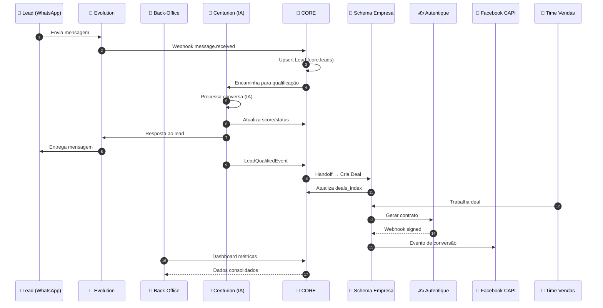

# Documento Individual: Mapa de Atores

> **Sistema:** Back-Office Multi-Tenant da Holding  
> **Elemento:** Mapa de Atores  
> **Versão:** 1.0

---

## 1. Classificação de Atores

### Tipos de Atores no Sistema

| Tipo | Descrição | Exemplos |
|------|-----------|----------|
| **Usuário Humano** | Pessoa que interage diretamente com o sistema | Dono da Holding |
| **Sistema Automatizado** | IA ou automação que opera sem intervenção humana | Centurions (IAs de SDR) |
| **Sistema Externo** | Serviço de terceiros que se integra via API/Webhook | WhatsApp, Autentique, Facebook |
| **Usuário Indireto** | Pessoa que não usa este sistema, mas é afetada | Time de Vendas (usa Front Operacional) |

---

## 2. Mapa Detalhado de Atores

### Ator Principal: Dono da Holding

| Atributo | Valor |
|----------|-------|
| **Tipo** | Usuário Humano |
| **Roles** | `super_admin`, `backoffice_admin` |
| **Frequência de Uso** | Diário |
| **Nível de Experiência** | Alto (decisor estratégico) |

**O que faz:**
- Cria e gerencia empresas da holding
- Configura IAs (Centurions) para qualificação
- Monitora métricas de todas as empresas
- Gerencia integrações (WhatsApp, Autentique, Pixels)
- Toma decisões estratégicas baseadas em dados consolidados

**O que precisa ver:**
- Dashboard com métricas globais (leads, conversões, receita)
- Lista de empresas e seus status
- Performance de cada Centurion/IA
- Status de instâncias WhatsApp
- Logs de integrações

**O que precisa fazer:**
- CRUD de empresas
- CRUD de Centurions com configuração de prompts
- Conectar/desconectar instâncias WhatsApp
- Configurar pixels de marketing
- Gerenciar templates de contrato
- Visualizar relatórios consolidados

---

### Ator Automatizado: Centurion (IA)

| Atributo | Valor |
|----------|-------|
| **Tipo** | Sistema Automatizado (IA Avançada) |
| **Identificador** | `centurion_id` |
| **Opera em** | Contexto de uma empresa (`company_id`) |
| **Canais** | WhatsApp, Instagram, Telegram |

**O que faz:**
- Recebe mensagens de leads via WhatsApp, Instagram ou Telegram
- Processa texto, **áudio (speech-to-text)** e **imagens (vision)**
- Usa **memória de curto prazo** (histórico da conversa)
- Usa **memória de longo prazo RAG** (fatos sobre o lead)
- Usa **memória de grafo** (relacionamentos e contexto estruturado)
- Executa **tools e chamadas externas** configuráveis
- Conecta a **servidores MCP** para ferramentas avançadas
- Consulta **base de conhecimento RAG** personalizada
- Envia **mídias na ordem configurada** pelo dono
- Envia mensagens **"picadas"** (humanização, não blocão)
- Aguarda lead **terminar de digitar** (debounce inteligente)
- Qualifica leads baseado em **critérios configuráveis**
- Atribui score de qualificação
- Dispara **follow-ups automáticos**
- Dispara handoff quando lead atinge critérios

**Inputs:**
- Mensagens de texto do lead
- Mensagens de áudio do lead (transcritas automaticamente)
- Imagens enviadas pelo lead (interpretadas via vision)
- Configuração de prompt, personalidade e ferramentas
- Regras de qualificação definidas pelo usuário
- Base de conhecimento RAG
- Histórico de conversas (memória curto prazo)
- Fatos do lead (memória longo prazo RAG)
- Grafo de contexto do lead (memória grafo)

**Outputs:**
- Mensagens de resposta ao lead (em múltiplas mensagens picadas)
- Mídias (áudio, imagem, vídeo) na sequência configurada
- Resultados de chamadas de tools/MCP
- Score de qualificação atualizado
- Fatos extraídos para memória longo prazo
- Atualizações no grafo de contexto
- Flag `is_qualified` quando atinge threshold
- Evento `LeadQualifiedEvent` para handoff
- Eventos de follow-up agendados

**Regras de Operação:**
- Sempre opera vinculado a `company_id`
- Respeita **debounce** para aguardar lead terminar de digitar
- Envia mensagens **picadas** (uma por vez, com delay humanizado)
- Registra todas as interações em `core.messages`
- Atualiza memória longo prazo após cada conversa
- Nunca responde se já há resposta em andamento

---

### Sistema Externo: WhatsApp (Evolution)

| Atributo | Valor |
|----------|-------|
| **Tipo** | Sistema Externo |
| **Integração** | Webhooks + REST API |
| **Provider** | Evolution API |

**O que faz:**
- Recebe e envia mensagens de WhatsApp (texto, áudio, imagem, vídeo)
- Reporta status de instâncias (conectado, QR code, erro)
- Gerencia sessões de conexão

**Webhooks Recebidos:**
- `message.received` → Nova mensagem de lead (texto, áudio, imagem)
- `instance.connected` → Instância conectou
- `instance.disconnected` → Instância desconectou
- `qrcode.ready` → QR code disponível para scan

**Ações Executadas:**
- `POST /message/send` → Enviar mensagem de texto
- `POST /message/sendMedia` → Enviar áudio, imagem, vídeo
- `POST /instance/connect` → Conectar instância
- `GET /instance/qr` → Obter QR code
- `POST /instance/restart` → Reiniciar instância

---

### Sistema Externo: Instagram

| Atributo | Valor |
|----------|-------|
| **Tipo** | Sistema Externo |
| **Integração** | Meta Graph API + Webhooks |
| **Provider** | Meta/Instagram |

**O que faz:**
- Recebe e envia mensagens DM do Instagram
- Processa mensagens de texto, áudio e imagens
- Gerencia conexão de contas business

**Webhooks Recebidos:**
- `messages` → Nova mensagem recebida
- `messaging_postbacks` → Interações com botões

**Ações Executadas:**
- `POST /messages` → Enviar mensagem
- `POST /messages` com attachment → Enviar mídia

---

### Sistema Externo: Telegram

| Atributo | Valor |
|----------|-------|
| **Tipo** | Sistema Externo |
| **Integração** | Bot API + Webhooks |
| **Provider** | Telegram |

**O que faz:**
- Recebe e envia mensagens via Bot
- Processa texto, áudio, imagens, documentos
- Gerencia comandos e interações

**Webhooks Recebidos:**
- `message` → Nova mensagem (texto, áudio, foto, documento)
- `callback_query` → Interações com botões inline

**Ações Executadas:**
- `sendMessage` → Enviar texto
- `sendAudio` → Enviar áudio
- `sendPhoto` → Enviar imagem
- `sendDocument` → Enviar documento

---

### Sistema Externo: Servidores MCP

| Atributo | Valor |
|----------|-------|
| **Tipo** | Sistema Externo |
| **Integração** | Model Context Protocol |
| **Provider** | Configurável por Centurion |

**O que faz:**
- Fornece ferramentas (tools) para os agentes de IA
- Permite extensibilidade sem alterar código do agente
- Executa ações em sistemas externos

**Operações:**
- `tools/list` → Listar ferramentas disponíveis
- `tools/call` → Executar uma ferramenta
- `resources/read` → Ler recursos do servidor

**Exemplos de Tools:**
- Consultar estoque de produtos
- Agendar visitas
- Consultar preços
- Verificar disponibilidade
- Integrar com CRMs externos

---

### Sistema Externo: Autentique

| Atributo | Valor |
|----------|-------|
| **Tipo** | Sistema Externo |
| **Integração** | Webhooks + REST API |
| **Propósito** | Contratos digitais com assinatura eletrônica |

**O que faz:**
- Gera documentos de contrato a partir de templates
- Envia para assinatura digital
- Notifica quando contrato é assinado

**Webhooks Recebidos:**
- `document.created` → Contrato criado
- `document.signed` → Contrato assinado
- `document.expired` → Contrato expirou sem assinatura
- `document.canceled` → Contrato cancelado

**Ações Executadas:**
- `POST /documents` → Criar documento
- `GET /documents/:id` → Consultar status
- `POST /documents/:id/cancel` → Cancelar documento

---

### Sistema Externo: Facebook/Meta CAPI

| Atributo | Valor |
|----------|-------|
| **Tipo** | Sistema Externo |
| **Integração** | REST API (Conversions API) |
| **Propósito** | Tracking de conversões para otimização de ads |

**O que faz:**
- Recebe eventos de conversão (Lead, Purchase, CompleteRegistration)
- Alimenta algoritmo de otimização do Facebook Ads

**Eventos Enviados:**
- `Lead` → Quando lead é capturado
- `CompleteRegistration` → Quando lead é qualificado
- `Purchase` → Quando contrato é assinado

**Dados Enviados:**
- `event_name`, `event_time`, `event_source_url`
- `user_data` (hashes de email, telefone, etc.)
- `custom_data` (valor, moeda, etc.)

---

### Ator Indireto: Time de Vendas

| Atributo | Valor |
|----------|-------|
| **Tipo** | Usuário Indireto |
| **Sistema que Usa** | Front Operacional (repositório separado) |
| **Roles** | `crm_user`, `sales_rep`, `crm_manager` |

**O que faz:**
- Trabalha leads já qualificados (deals)
- Gerencia pipeline de vendas
- Gera e acompanha contratos
- Fecha negócios

**Relação com Este Sistema:**
- **NÃO** acessa o Back-Office
- Recebe deals derivados do handoff
- Opera exclusivamente no schema da sua empresa
- Nunca vê dados de outras empresas (RLS)

---

## 3. Diagrama de Interação



---

## 4. Matriz de Responsabilidades (RACI)

| Ação | Dono Holding | Centurion | WhatsApp | Autentique | Time Vendas |
|------|:------------:|:---------:|:--------:|:----------:|:-----------:|
| Criar empresa | **R** | - | - | - | - |
| Configurar IA | **R** | - | - | - | - |
| Qualificar lead | I | **R** | C | - | - |
| Fazer handoff | I | **R** | - | - | - |
| Trabalhar deal | I | - | - | - | **R** |
| Gerar contrato | I | - | - | **C** | **R** |
| Assinar contrato | - | - | - | **R** | A |
| Monitorar métricas | **R** | - | - | - | - |

**Legenda:** R=Responsável, A=Aprovador, C=Consultado, I=Informado

---

## 5. Roles e Permissões Detalhadas

### Hierarquia de Roles

```
super_admin (máximo)
    └── backoffice_admin
            └── ai_supervisor (por empresa)
            └── marketing_admin (por empresa)
                    └── crm_manager (Front Operacional)
                            └── crm_user (Front Operacional)
```

### Matriz de Permissões

| Role | Empresas | Centurions | Instâncias | Pixels | Leads | Deals | Contratos |
|------|:--------:|:----------:|:----------:|:------:|:-----:|:-----:|:---------:|
| `super_admin` | CRUD | CRUD | CRUD | CRUD | Read | Read | Read |
| `backoffice_admin` | CRUD | CRUD | CRUD | CRUD | Read | Read | Read |
| `ai_supervisor` | Read(1) | RU(1) | Read(1) | - | Read(1) | - | - |
| `marketing_admin` | Read(1) | - | - | CRUD(1) | Read(1) | - | - |
| `crm_manager` | - | - | - | - | - | CRUD(1) | CRUD(1) |
| `crm_user` | - | - | - | - | - | RU(1) | Read(1) |

**(1)** = Apenas da própria empresa (filtrado por `company_id`)

---

## 6. Roles que NÃO EXISTEM

> ⚠️ **IMPORTANTE:** As seguintes roles foram explicitamente removidas do sistema:

| Role Removida | Motivo |
|---------------|--------|
| `sdr_operator` | SDR é 100% feito por IAs (Centurions) |
| `sdr_manager` | SDR é 100% feito por IAs (Centurions) |

Se encontrar referências a essas roles no código ou documentação, elas devem ser removidas.

---

## 7. Resumo

| Ator | Tipo | Sistema | Responsabilidade Principal |
|------|------|---------|---------------------------|
| Dono da Holding | Humano | Back-Office | Administrar toda a holding |
| Centurion (IA) | Automatizado | CORE | Qualificar leads |
| WhatsApp | Externo | - | Canal de comunicação |
| Autentique | Externo | - | Contratos digitais |
| Facebook | Externo | - | Marketing/Conversões |
| Time de Vendas | Indireto | Front Operacional | Fechar negócios |

---

*Documento Individual: Mapa de Atores*
