# Documento Individual: Modelo de Entidades

> **Sistema:** Back-Office Multi-Tenant da Holding  
> **Elemento:** Modelo de Entidades  
> **Versão:** 1.0

---

## 1. Visão Geral do Modelo

### Organização por Schema

O sistema utiliza **multi-tenancy por schema**. As entidades estão distribuídas assim:

| Schema | Propósito | Entidades |
|--------|-----------|-----------|
| `core` | Governança, SDR centralizado, integrações, memória | Company, Lead, Centurion, Channel Instance, Conversation, Lead Memory, Lead Graph, Knowledge Base, Tool Config, MCP Server, Media Sequence, Follow Up Config, Pixel, Contract Template |
| `_template_base` | Template clonado para novas empresas | Deal, Service, Contrato, Equipe |
| `<empresa>` | Dados operacionais isolados por empresa | Deal, Service, Contrato, Equipe (clonados do template) |

### Princípios do Modelo

1. **Company-centric**: Tudo tem `company_id`
2. **CORE imutável**: Nunca modificar para necessidades específicas
3. **Referência obrigatória**: Deals referenciam `core_lead_id`
4. **RLS em tudo**: Isolamento garantido por Row Level Security
5. **Multi-canal**: Instâncias de WhatsApp, Instagram, Telegram unificadas
6. **Memória em camadas**: Curto prazo (conversa), longo prazo (RAG), grafo (relacionamentos)

---

## 2. Entidades do Schema CORE

### Company (Empresa da Holding)

**Propósito:** Raiz de governança multi-tenant. Define uma empresa/tenant.

```sql
CREATE TABLE core.companies (
  id uuid PRIMARY KEY DEFAULT gen_random_uuid(),
  name text NOT NULL,
  slug text UNIQUE NOT NULL,
  document text NULL,           -- CNPJ/CPF
  status text NOT NULL DEFAULT 'active',  -- active, suspended, archived
  owner_user_id uuid NULL REFERENCES auth.users(id),
  settings jsonb NOT NULL DEFAULT '{}'::jsonb,
  created_at timestamptz NOT NULL DEFAULT now(),
  updated_at timestamptz NOT NULL DEFAULT now()
);
```

| Atributo | Tipo | Obrigatório | Descrição |
|----------|------|:-----------:|-----------|
| `id` | uuid | ✅ | Identificador único |
| `name` | text | ✅ | Nome da empresa |
| `slug` | text | ✅ | Identificador URL-safe (único) |
| `document` | text | ❌ | CNPJ ou CPF |
| `status` | text | ✅ | Estado atual da empresa |
| `owner_user_id` | uuid | ❌ | Usuário dono |
| `settings` | jsonb | ✅ | Configurações customizadas |

**Invariantes:**
- `slug` nunca muda após criação
- `document` é único entre empresas (se preenchido)
- Empresa `archived` não pode ser reativada

---

### Lead (Lead Centralizado)

**Propósito:** Todos os leads vivem aqui. É a entidade central do SDR.

```sql
CREATE TABLE core.leads (
  id uuid PRIMARY KEY DEFAULT gen_random_uuid(),
  company_id uuid NOT NULL REFERENCES core.companies(id),
  
  -- Dados pessoais
  name text,
  phone text NOT NULL,
  email text,
  cpf text,
  
  -- Ciclo de vida
  lifecycle_stage text NOT NULL DEFAULT 'new',
  is_qualified boolean NOT NULL DEFAULT false,
  qualification_score numeric,
  qualification_data jsonb DEFAULT '{}'::jsonb,
  
  -- Vinculação
  centurion_id uuid REFERENCES core.centurion_configs(id),
  pixel_config_id uuid REFERENCES core.pixel_configs(id),
  
  -- Tracking
  utm_campaign text,
  utm_source text,
  utm_medium text,
  utm_term text,
  utm_content text,
  contact_fingerprint text,
  fb_data jsonb DEFAULT '{}'::jsonb,
  
  -- Timestamps
  first_contact_at timestamptz,
  last_contact_at timestamptz,
  qualified_at timestamptz,
  created_at timestamptz NOT NULL DEFAULT now(),
  updated_at timestamptz NOT NULL DEFAULT now()
);

CREATE INDEX idx_leads_company_phone ON core.leads(company_id, phone);
CREATE INDEX idx_leads_company_lifecycle ON core.leads(company_id, lifecycle_stage);
```

| Atributo | Tipo | Obrigatório | Descrição |
|----------|------|:-----------:|-----------|
| `id` | uuid | ✅ | Identificador único |
| `company_id` | uuid | ✅ | Empresa dona do lead |
| `phone` | text | ✅ | Telefone (identificador principal) |
| `lifecycle_stage` | text | ✅ | Estado no funil de qualificação |
| `is_qualified` | boolean | ✅ | Flag de qualificação |
| `qualification_score` | numeric | ❌ | Score atribuído pela IA |
| `centurion_id` | uuid | ❌ | IA responsável pela qualificação |

**Invariantes:**
- Sempre pertence a uma empresa (`company_id NOT NULL`)
- `phone` é único por `company_id`
- Transições de `lifecycle_stage` seguem máquina de estados

---

### Centurion Config (Configuração de IA)

**Propósito:** Define uma IA de SDR avançada, seu comportamento, ferramentas e regras de qualificação.

```sql
CREATE TABLE core.centurion_configs (
  id uuid PRIMARY KEY DEFAULT gen_random_uuid(),
  company_id uuid NOT NULL REFERENCES core.companies(id),
  
  -- Identificação
  name text NOT NULL,
  slug text NOT NULL,
  
  -- Comportamento da IA
  prompt text NOT NULL,
  personality jsonb DEFAULT '{}'::jsonb,
  qualification_rules jsonb DEFAULT '{}'::jsonb,
  
  -- Capacidades de Mídia
  can_send_audio boolean DEFAULT true,
  can_send_image boolean DEFAULT true,
  can_send_video boolean DEFAULT true,
  can_process_audio boolean DEFAULT true,      -- Speech-to-text
  can_process_image boolean DEFAULT true,      -- Vision
  
  -- Humanização
  message_chunking_enabled boolean DEFAULT true,  -- Mensagens picadas
  chunk_delay_ms int DEFAULT 1500,                -- Delay entre chunks
  debounce_wait_ms int DEFAULT 3000,              -- Aguardar lead terminar
  
  -- Configurações operacionais
  is_active boolean NOT NULL DEFAULT true,
  max_retries int DEFAULT 3,
  
  -- Métricas
  total_conversations int DEFAULT 0,
  total_qualified int DEFAULT 0,
  
  created_at timestamptz NOT NULL DEFAULT now(),
  updated_at timestamptz NOT NULL DEFAULT now(),
  
  UNIQUE(company_id, slug)
);
```

| Atributo | Tipo | Obrigatório | Descrição |
|----------|------|:-----------:|-----------|
| `id` | uuid | ✅ | Identificador único |
| `company_id` | uuid | ✅ | Empresa dona do Centurion |
| `name` | text | ✅ | Nome amigável |
| `prompt` | text | ✅ | Prompt principal da IA |
| `personality` | jsonb | ❌ | Traços de personalidade |
| `qualification_rules` | jsonb | ❌ | Critérios de qualificação definidos pelo usuário |
| `can_process_audio` | boolean | ✅ | Se pode transcrever áudios |
| `can_process_image` | boolean | ✅ | Se pode interpretar imagens |
| `message_chunking_enabled` | boolean | ✅ | Mensagens picadas (humanização) |
| `debounce_wait_ms` | int | ✅ | Tempo para aguardar lead terminar |
| `is_active` | boolean | ✅ | Se está ativo para uso |

**Invariantes:**
- Sempre vinculado a uma empresa
- `slug` é único por empresa
- Só Centurions ativos processam mensagens

---

### Channel Instance (Instância de Canal Multi-Canal)

**Propósito:** Rastreia estado das instâncias de canais (WhatsApp, Instagram, Telegram).

```sql
CREATE TABLE core.channel_instances (
  id uuid PRIMARY KEY DEFAULT gen_random_uuid(),
  company_id uuid NOT NULL REFERENCES core.companies(id),
  
  channel_type text NOT NULL,  -- 'whatsapp', 'instagram', 'telegram'
  instance_name text UNIQUE NOT NULL,
  state text NOT NULL DEFAULT 'disconnected', -- connected, disconnected, qr_ready, error
  
  -- Dados específicos do canal
  phone_number text,           -- WhatsApp
  instagram_account_id text,   -- Instagram
  telegram_bot_token text,     -- Telegram
  
  profile_name text,
  credentials jsonb DEFAULT '{}'::jsonb,
  
  last_connected_at timestamptz,
  last_disconnected_at timestamptz,
  error_message text,
  metadata jsonb DEFAULT '{}'::jsonb,
  
  created_at timestamptz NOT NULL DEFAULT now(),
  updated_at timestamptz NOT NULL DEFAULT now()
);

CREATE INDEX idx_channel_instances_company ON core.channel_instances(company_id);
CREATE INDEX idx_channel_instances_type ON core.channel_instances(channel_type);
```

---

### Conversation (Memória de Curto Prazo)

**Propósito:** Armazena o histórico da conversa atual com o lead (mensagens enfileiradas sequencialmente).

```sql
CREATE TABLE core.conversations (
  id uuid PRIMARY KEY DEFAULT gen_random_uuid(),
  company_id uuid NOT NULL REFERENCES core.companies(id),
  lead_id uuid NOT NULL REFERENCES core.leads(id),
  centurion_id uuid NOT NULL REFERENCES core.centurion_configs(id),
  channel_instance_id uuid REFERENCES core.channel_instances(id),
  
  channel_type text NOT NULL,  -- 'whatsapp', 'instagram', 'telegram'
  
  -- Estado de debounce (aguardar lead terminar de digitar)
  debounce_state text DEFAULT 'idle',  -- idle, waiting, ready
  debounce_until timestamptz,
  pending_messages jsonb DEFAULT '[]'::jsonb,  -- Mensagens acumuladas aguardando
  
  -- Estado da conversa
  agent_state text DEFAULT 'idle',  -- idle, thinking, responding
  lead_state text DEFAULT 'active', -- active, waiting, inactive
  
  last_inbound_at timestamptz,
  last_outbound_at timestamptz,
  
  metadata jsonb DEFAULT '{}'::jsonb,
  
  created_at timestamptz NOT NULL DEFAULT now(),
  updated_at timestamptz NOT NULL DEFAULT now()
);

-- Histórico de mensagens da conversa
CREATE TABLE core.messages (
  id uuid PRIMARY KEY DEFAULT gen_random_uuid(),
  conversation_id uuid NOT NULL REFERENCES core.conversations(id),
  company_id uuid NOT NULL,
  lead_id uuid NOT NULL,
  
  direction text NOT NULL,  -- 'inbound', 'outbound'
  content_type text NOT NULL,  -- 'text', 'audio', 'image', 'video', 'document'
  content text,  -- Texto ou URL da mídia
  
  -- Para áudios transcritos
  audio_transcription text,
  
  -- Para imagens interpretadas
  image_description text,
  
  -- Metadados do canal
  channel_message_id text,
  metadata jsonb DEFAULT '{}'::jsonb,
  
  created_at timestamptz NOT NULL DEFAULT now()
);

CREATE INDEX idx_messages_conversation ON core.messages(conversation_id);
CREATE INDEX idx_messages_lead ON core.messages(lead_id);
```

---

### Lead Memory (Memória de Longo Prazo RAG)

**Propósito:** Armazena fatos, preferências e informações persistentes sobre o lead usando RAG.

```sql
CREATE TABLE core.lead_memories (
  id uuid PRIMARY KEY DEFAULT gen_random_uuid(),
  company_id uuid NOT NULL REFERENCES core.companies(id),
  lead_id uuid NOT NULL REFERENCES core.leads(id),
  
  -- Fatos extraídos das conversas
  facts jsonb DEFAULT '[]'::jsonb,  -- [{fact: "tem 2 filhos", confidence: 0.9, source: "msg_id"}]
  
  -- Preferências identificadas
  preferences jsonb DEFAULT '{}'::jsonb,  -- {budget: "alto", urgency: "média"}
  
  -- Embeddings para busca semântica
  embeddings vector(1536),  -- pgvector
  
  -- Resumo consolidado
  summary text,
  
  -- Contexto de qualificação
  qualification_context jsonb DEFAULT '{}'::jsonb,
  
  last_updated_at timestamptz DEFAULT now(),
  created_at timestamptz NOT NULL DEFAULT now()
);

CREATE INDEX idx_lead_memories_lead ON core.lead_memories(lead_id);
```

---

### Lead Graph (Memória de Grafo)

**Propósito:** Armazena relacionamentos e contexto estruturado do lead em formato de grafo.

```sql
CREATE TABLE core.lead_graphs (
  id uuid PRIMARY KEY DEFAULT gen_random_uuid(),
  company_id uuid NOT NULL REFERENCES core.companies(id),
  lead_id uuid NOT NULL REFERENCES core.leads(id),
  
  -- Nós do grafo (entidades mencionadas)
  nodes jsonb DEFAULT '[]'::jsonb,  
  -- [{id: "node1", type: "pessoa", name: "Maria", properties: {relacao: "esposa"}}]
  
  -- Relacionamentos entre nós
  relationships jsonb DEFAULT '[]'::jsonb,
  -- [{from: "lead", to: "node1", type: "casado_com", properties: {}}]
  
  -- Contexto estruturado
  context jsonb DEFAULT '{}'::jsonb,
  -- {situacao_atual: "buscando imóvel", motivacao: "família crescendo"}
  
  last_updated_at timestamptz DEFAULT now(),
  created_at timestamptz NOT NULL DEFAULT now()
);

CREATE INDEX idx_lead_graphs_lead ON core.lead_graphs(lead_id);
```

---

### Knowledge Base (Base de Conhecimento RAG)

**Propósito:** Base de conhecimento personalizada por empresa/agente com RAG retrieval.

```sql
CREATE TABLE core.knowledge_bases (
  id uuid PRIMARY KEY DEFAULT gen_random_uuid(),
  company_id uuid NOT NULL REFERENCES core.companies(id),
  centurion_id uuid REFERENCES core.centurion_configs(id),  -- NULL = global da empresa
  
  name text NOT NULL,
  description text,
  
  -- Configuração de chunking
  chunk_size int DEFAULT 500,
  chunk_overlap int DEFAULT 50,
  
  -- Status
  status text DEFAULT 'active',  -- active, processing, error
  document_count int DEFAULT 0,
  
  created_at timestamptz NOT NULL DEFAULT now(),
  updated_at timestamptz NOT NULL DEFAULT now()
);

-- Documentos da base de conhecimento
CREATE TABLE core.knowledge_documents (
  id uuid PRIMARY KEY DEFAULT gen_random_uuid(),
  knowledge_base_id uuid NOT NULL REFERENCES core.knowledge_bases(id),
  company_id uuid NOT NULL,
  
  filename text NOT NULL,
  content_type text,  -- 'pdf', 'txt', 'docx', 'md'
  file_url text,
  
  -- Status de processamento
  status text DEFAULT 'pending',  -- pending, processing, completed, error
  error_message text,
  
  created_at timestamptz NOT NULL DEFAULT now()
);

-- Chunks da base de conhecimento (para RAG)
CREATE TABLE core.knowledge_chunks (
  id uuid PRIMARY KEY DEFAULT gen_random_uuid(),
  knowledge_base_id uuid NOT NULL REFERENCES core.knowledge_bases(id),
  document_id uuid NOT NULL REFERENCES core.knowledge_documents(id),
  company_id uuid NOT NULL,
  
  content text NOT NULL,
  embedding vector(1536),  -- pgvector
  
  -- Metadados
  chunk_index int,
  metadata jsonb DEFAULT '{}'::jsonb,
  
  created_at timestamptz NOT NULL DEFAULT now()
);

CREATE INDEX idx_knowledge_chunks_embedding ON core.knowledge_chunks 
  USING ivfflat (embedding vector_cosine_ops);
```

---

### Tool Config (Configuração de Tools/Chamadas Externas)

**Propósito:** Define ferramentas que o agente pode executar durante a conversa.

```sql
CREATE TABLE core.tool_configs (
  id uuid PRIMARY KEY DEFAULT gen_random_uuid(),
  company_id uuid NOT NULL REFERENCES core.companies(id),
  centurion_id uuid NOT NULL REFERENCES core.centurion_configs(id),
  
  tool_name text NOT NULL,
  description text,
  
  -- Configuração da chamada
  endpoint text NOT NULL,
  method text DEFAULT 'POST',  -- GET, POST, PUT
  headers jsonb DEFAULT '{}'::jsonb,
  auth_type text,  -- 'bearer', 'api_key', 'basic', 'none'
  auth_config jsonb DEFAULT '{}'::jsonb,
  
  -- Schema de input/output (JSON Schema)
  input_schema jsonb NOT NULL,
  output_schema jsonb,
  
  -- Comportamento
  timeout_ms int DEFAULT 10000,
  retry_count int DEFAULT 1,
  is_active boolean DEFAULT true,
  
  created_at timestamptz NOT NULL DEFAULT now(),
  updated_at timestamptz NOT NULL DEFAULT now(),
  
  UNIQUE(centurion_id, tool_name)
);
```

---

### MCP Server (Servidor MCP)

**Propósito:** Configura servidores MCP que fornecem ferramentas para os agentes.

```sql
CREATE TABLE core.mcp_servers (
  id uuid PRIMARY KEY DEFAULT gen_random_uuid(),
  company_id uuid NOT NULL REFERENCES core.companies(id),
  centurion_id uuid NOT NULL REFERENCES core.centurion_configs(id),
  
  name text NOT NULL,
  server_url text NOT NULL,
  
  -- Autenticação
  auth_type text,  -- 'bearer', 'api_key', 'none'
  auth_config jsonb DEFAULT '{}'::jsonb,
  
  -- Tools disponíveis (cached do servidor)
  tools_available jsonb DEFAULT '[]'::jsonb,
  last_tools_sync_at timestamptz,
  
  -- Status
  is_active boolean DEFAULT true,
  connection_status text DEFAULT 'unknown',  -- connected, disconnected, error
  last_error text,
  
  created_at timestamptz NOT NULL DEFAULT now(),
  updated_at timestamptz NOT NULL DEFAULT now()
);
```

---

### Media Sequence (Sequência de Mídias)

**Propósito:** Define sequências de mídias que o agente envia em momentos específicos.

```sql
CREATE TABLE core.media_sequences (
  id uuid PRIMARY KEY DEFAULT gen_random_uuid(),
  company_id uuid NOT NULL REFERENCES core.companies(id),
  centurion_id uuid NOT NULL REFERENCES core.centurion_configs(id),
  
  name text NOT NULL,
  trigger_type text NOT NULL,  -- 'keyword', 'qualification_stage', 'manual', 'time_based'
  trigger_config jsonb NOT NULL,  -- {keywords: ["preço", "valor"]} ou {stage: "negotiation"}
  
  -- Itens de mídia em ordem
  media_items jsonb NOT NULL,
  -- [{type: "image", url: "...", delay_ms: 1000}, {type: "audio", url: "...", delay_ms: 2000}]
  
  -- Configuração
  is_active boolean DEFAULT true,
  priority int DEFAULT 0,  -- Para resolver conflitos
  
  created_at timestamptz NOT NULL DEFAULT now(),
  updated_at timestamptz NOT NULL DEFAULT now()
);
```

---

### Follow Up Config (Configuração de Follow-Ups)

**Propósito:** Define regras para follow-ups automáticos de leads.

```sql
CREATE TABLE core.follow_up_configs (
  id uuid PRIMARY KEY DEFAULT gen_random_uuid(),
  company_id uuid NOT NULL REFERENCES core.companies(id),
  centurion_id uuid NOT NULL REFERENCES core.centurion_configs(id),
  
  name text NOT NULL,
  
  -- Regras de ativação
  rules jsonb NOT NULL,
  -- {trigger: "no_response", conditions: {min_hours: 24, max_attempts: 3, stages: ["contacted", "negotiation"]}}
  
  -- Intervalos entre tentativas
  intervals jsonb NOT NULL,  -- [24, 48, 72] horas
  
  -- Templates de mensagem
  templates jsonb NOT NULL,
  -- [{attempt: 1, message: "Oi! Tudo bem? Vi que ficou alguma dúvida..."}, ...]
  
  -- Configuração
  is_active boolean DEFAULT true,
  max_attempts int DEFAULT 3,
  
  created_at timestamptz NOT NULL DEFAULT now(),
  updated_at timestamptz NOT NULL DEFAULT now()
);

-- Log de follow-ups executados
CREATE TABLE core.follow_up_logs (
  id uuid PRIMARY KEY DEFAULT gen_random_uuid(),
  company_id uuid NOT NULL,
  lead_id uuid NOT NULL REFERENCES core.leads(id),
  follow_up_config_id uuid NOT NULL REFERENCES core.follow_up_configs(id),
  
  attempt_number int NOT NULL,
  status text NOT NULL,  -- 'sent', 'failed', 'replied'
  message_sent text,
  
  scheduled_at timestamptz NOT NULL,
  executed_at timestamptz,
  replied_at timestamptz,
  
  created_at timestamptz NOT NULL DEFAULT now()
);
```

---

### Pixel Config (Configuração de Pixel de Marketing)

**Propósito:** Armazena configurações de pixels para tracking de conversão.

```sql
CREATE TABLE core.pixel_configs (
  id uuid PRIMARY KEY DEFAULT gen_random_uuid(),
  company_id uuid NOT NULL REFERENCES core.companies(id),
  
  pixel_id text NOT NULL,
  meta_access_token text NOT NULL,
  meta_test_event_code text,
  domain text,
  
  is_active boolean NOT NULL DEFAULT true,
  
  created_at timestamptz NOT NULL DEFAULT now(),
  updated_at timestamptz NOT NULL DEFAULT now()
);
```

---

### Contract Template (Template de Contrato)

**Propósito:** Templates globais ou por empresa para geração de contratos.

```sql
CREATE TABLE core.contract_templates (
  id uuid PRIMARY KEY DEFAULT gen_random_uuid(),
  company_id uuid NULL REFERENCES core.companies(id), -- NULL = global
  
  name text NOT NULL,
  description text,
  variables jsonb NOT NULL DEFAULT '[]'::jsonb,
  category text NOT NULL DEFAULT 'general',
  
  is_active boolean NOT NULL DEFAULT true,
  usage_count int NOT NULL DEFAULT 0,
  
  created_at timestamptz NOT NULL DEFAULT now(),
  updated_at timestamptz NOT NULL DEFAULT now()
);
```

**Regra:** Se `company_id IS NULL`, o template é global e disponível para todas as empresas.

---

### Contract (Instância de Contrato)

**Propósito:** Contrato gerado para um lead/deal específico.

```sql
CREATE TABLE core.contracts (
  id uuid PRIMARY KEY DEFAULT gen_random_uuid(),
  company_id uuid NOT NULL REFERENCES core.companies(id),
  
  lead_id uuid REFERENCES core.leads(id),
  deal_index_id uuid REFERENCES core.deals_index(id),
  template_id uuid NOT NULL REFERENCES core.contract_templates(id),
  
  status text NOT NULL DEFAULT 'draft', -- draft, sent, signed, canceled, expired
  contract_url text,
  autentique_id text,
  contract_data jsonb NOT NULL DEFAULT '{}'::jsonb,
  value numeric,
  
  signed_at timestamptz,
  first_payment_at timestamptz,
  
  created_at timestamptz NOT NULL DEFAULT now(),
  updated_at timestamptz NOT NULL DEFAULT now()
);
```

---

### Deals Index (Índice Global de Deals)

**Propósito:** Referência neutra a deals em qualquer schema de empresa.

```sql
CREATE TABLE core.deals_index (
  id uuid PRIMARY KEY DEFAULT gen_random_uuid(),
  company_id uuid NOT NULL REFERENCES core.companies(id),
  
  schema_name text NOT NULL,        -- ex: 'meu_nome_ok', 'empresa_alpha'
  local_deal_id uuid NOT NULL,      -- ID do deal no schema da empresa
  
  status text,
  value numeric,
  opened_at timestamptz,
  closed_at timestamptz,
  
  created_at timestamptz NOT NULL DEFAULT now(),
  updated_at timestamptz NOT NULL DEFAULT now()
);
```

**Regra:** Todo deal criado em `<empresa>.deals` deve ter entrada correspondente aqui.

---

## 3. Entidades do Schema de Empresa

### Deal (Negócio/Oportunidade)

**Propósito:** Representa um negócio no pipeline de vendas da empresa.

```sql
CREATE TABLE <empresa>.deals (
  id uuid PRIMARY KEY DEFAULT gen_random_uuid(),
  company_id uuid NOT NULL REFERENCES core.companies(id),
  
  -- REFERÊNCIA OBRIGATÓRIA AO CORE
  core_lead_id uuid NOT NULL REFERENCES core.leads(id),
  
  -- Dados do Lead (snapshot)
  deal_first_name text,
  deal_last_name text,
  deal_full_name text,
  deal_phone text,
  deal_email text,
  deal_cpf text,
  deal_rg text,
  
  -- Endereço
  deal_rua text,
  deal_numero text,
  deal_bairro text,
  deal_cidade text,
  deal_estado text,
  deal_cep text,
  
  -- Proposta
  deal_servico text,
  service_id uuid REFERENCES <empresa>.services(id),
  deal_valor_contrato numeric,
  deal_forma_pagamento text,
  deal_parcelas int,
  parcelas_datas jsonb,
  
  -- Documentação (paths no storage)
  deal_documento_frente text,
  deal_documento_verso text,
  deal_audio text,
  deal_comprovante_residencia text,
  deal_copia_contrato_assinado text,
  
  -- Workflow
  deal_status text NOT NULL DEFAULT 'negocio_novo',
  motivo_rejeicao text,
  vendedor_responsavel uuid REFERENCES <empresa>.equipe(id),
  
  -- Tracking (herdado do CORE)
  pixel_config_id uuid,
  contact_fingerprint text,
  utm_campaign text,
  utm_source text,
  utm_medium text,
  
  created_at timestamptz NOT NULL DEFAULT now(),
  updated_at timestamptz NOT NULL DEFAULT now()
);
```

**Invariantes:**
- `core_lead_id` é **OBRIGATÓRIO** (rastreabilidade)
- Cada deal atualiza `core.deals_index` via trigger
- Campos críticos são imutáveis após `contrato_assinado`

---

### Service (Serviço/Produto)

**Propósito:** Catálogo de serviços oferecidos pela empresa.

```sql
CREATE TABLE <empresa>.services (
  id uuid PRIMARY KEY DEFAULT gen_random_uuid(),
  company_id uuid NOT NULL REFERENCES core.companies(id),
  
  nome text NOT NULL,
  descricao text,
  valor_padrao numeric,
  max_parcelas int,
  formas_pagamento text[],
  contrato_template_id uuid REFERENCES core.contract_templates(id),
  
  is_active boolean DEFAULT true,
  
  created_at timestamptz NOT NULL DEFAULT now(),
  updated_at timestamptz NOT NULL DEFAULT now()
);
```

---

### Equipe (Time de Vendas)

**Propósito:** Membros da equipe comercial da empresa.

```sql
CREATE TABLE <empresa>.equipe (
  id uuid PRIMARY KEY DEFAULT gen_random_uuid(),
  company_id uuid NOT NULL REFERENCES core.companies(id),
  user_id uuid REFERENCES auth.users(id),
  
  user_email text NOT NULL,
  user_name text,
  role text NOT NULL,  -- 'closer', 'manager', 'admin' (NÃO existe 'sdr')
  status text DEFAULT 'active',
  last_activity timestamptz,
  
  created_at timestamptz NOT NULL DEFAULT now(),
  updated_at timestamptz NOT NULL DEFAULT now()
);
```

> ⚠️ **NOTA:** Role `sdr` não existe porque SDR é feito por IAs (Centurions).

---

## 4. Diagrama de Relacionamentos

```mermaid
erDiagram
    %% CORE ENTITIES
    COMPANY ||--o{ LEAD : "possui"
    COMPANY ||--o{ CENTURION_CONFIG : "configura"
    COMPANY ||--o{ INSTANCE_STATUS : "possui"
    COMPANY ||--o{ PIXEL_CONFIG : "possui"
    COMPANY ||--o{ COMPANY_CRM : "mapeia para"
    COMPANY ||--o{ CONTRACT_TEMPLATE : "pode ter específicos"
    
    LEAD ||--o| DEAL : "deriva para"
    LEAD }o--|| CENTURION_CONFIG : "qualificado por"
    LEAD }o--o| PIXEL_CONFIG : "capturado via"
    
    INSTANCE_STATUS ||--o| INSTANCE_CENTURION_MAPPING : "mapeado"
    INSTANCE_CENTURION_MAPPING }o--|| CENTURION_CONFIG : "atende"
    
    CONTRACT_TEMPLATE ||--o{ CONTRACT : "instancia"
    CONTRACT }o--|| LEAD : "referencia"
    CONTRACT }o--o| DEALS_INDEX : "referencia"
    
    COMPANY_CRM ||--|| SCHEMA_EMPRESA : "aponta para"
    
    DEALS_INDEX }o--|| DEAL : "indexa"
    
    %% EMPRESA ENTITIES
    DEAL }o--|| SERVICE : "usa"
    DEAL }o--o| EQUIPE : "responsável"
    
    %% Atributos principais
    COMPANY {
        uuid id PK
        text name
        text slug UK
        text status
    }
    
    LEAD {
        uuid id PK
        uuid company_id FK
        text phone
        text lifecycle_stage
        boolean is_qualified
    }
    
    CENTURION_CONFIG {
        uuid id PK
        uuid company_id FK
        text name
        text prompt
        boolean is_active
    }
    
    DEAL {
        uuid id PK
        uuid company_id FK
        uuid core_lead_id FK
        text deal_status
        numeric deal_valor_contrato
    }
```



---

## 5. Regras de Integridade

### Regras Globais

| Regra | Descrição | Aplicação |
|-------|-----------|-----------|
| **Company-centric** | Todo recurso tem `company_id NOT NULL` | Todas as tabelas operacionais |
| **Core Lead Reference** | Deals referenciam lead original | `<empresa>.deals.core_lead_id NOT NULL` |
| **RLS Obrigatório** | Isolamento por empresa | Policies em todas as tabelas |
| **CORE Imutável** | Nunca adicionar campos específicos | Schema `core` |

### Constraints de Integridade

```sql
-- Unicidade de slug por empresa
UNIQUE(company_id, slug)

-- Unicidade de instância
UNIQUE(instance_name)

-- Referência cruzada obrigatória
core_lead_id uuid NOT NULL REFERENCES core.leads(id)

-- Apenas um mapeamento por instância
UNIQUE(instance_name) em instance_centurion_mapping
```

---

## 6. Resumo

| Schema | Entidades | Propósito |
|--------|-----------|-----------|
| `core` | Company, Lead, Centurion, Instance, Pixel, Contract, Deals Index | Governança, SDR centralizado, integrações |
| `<empresa>` | Deal, Service, Equipe | Operação comercial isolada |

| Entidade Central | Descrição |
|------------------|-----------|
| `core.leads` | Todos os leads vivem aqui |
| `<empresa>.deals` | Leads qualificados viram deals aqui |
| `core_lead_id` | Referência que conecta tudo |

---

*Documento Individual: Modelo de Entidades*
