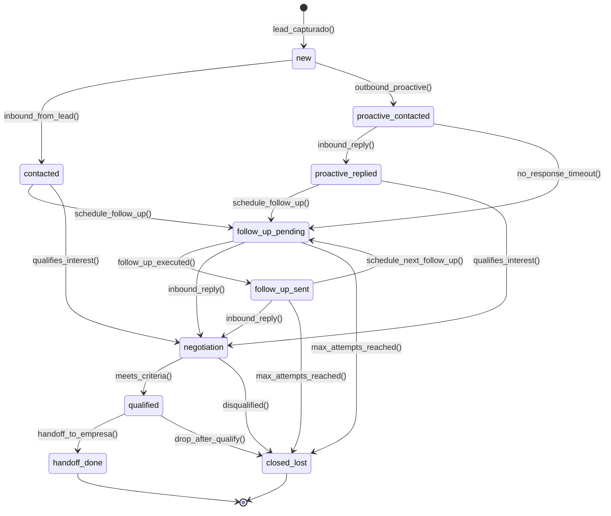
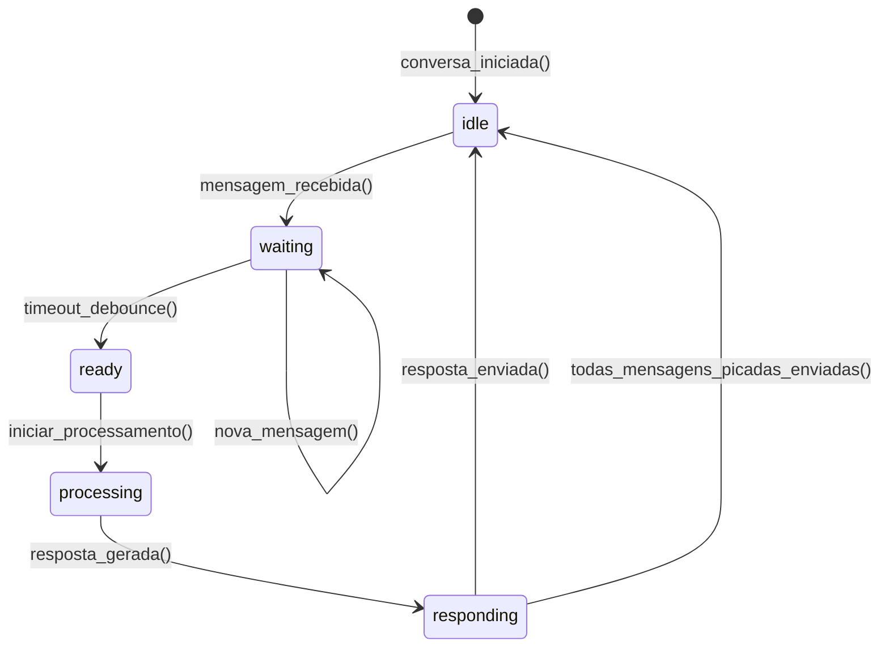
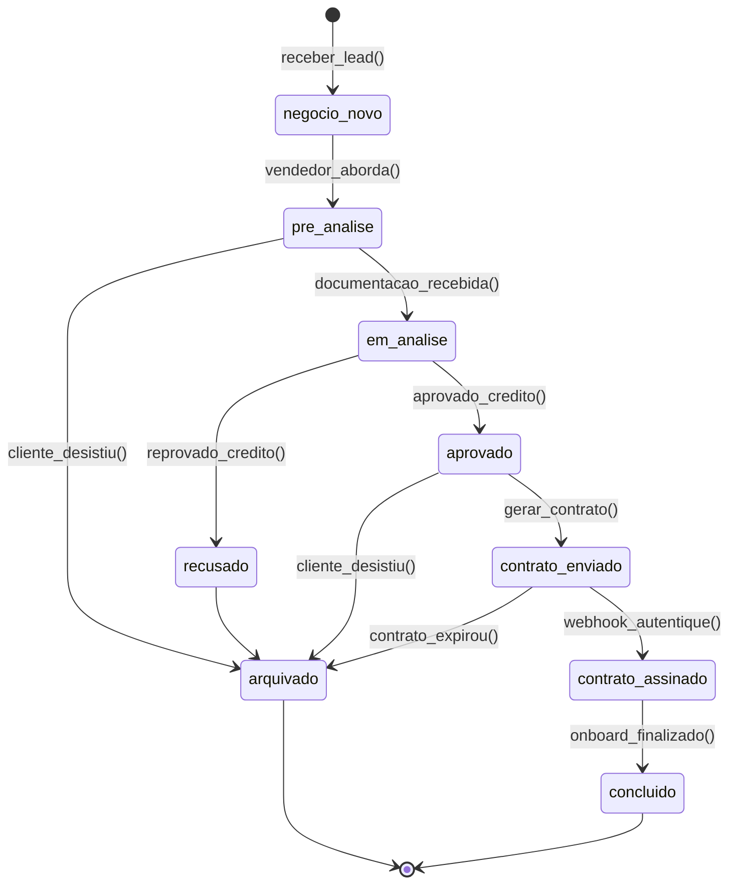
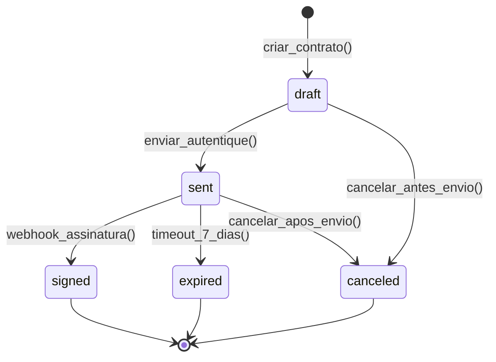
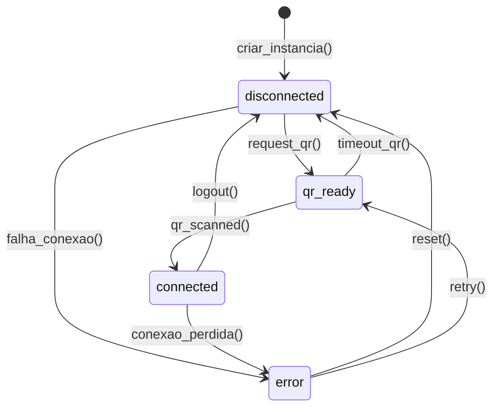
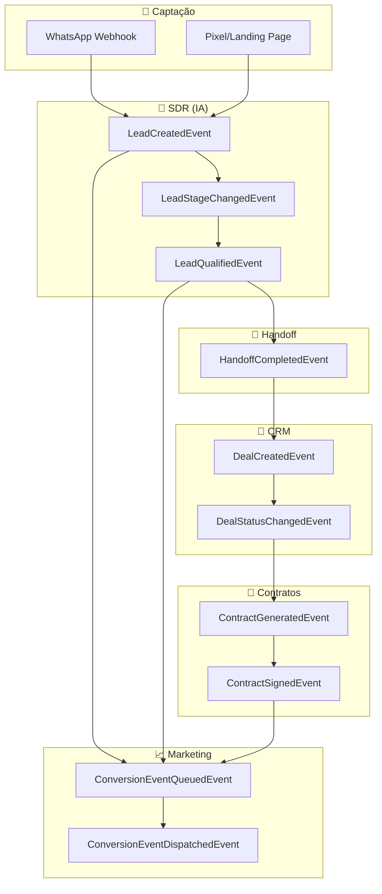
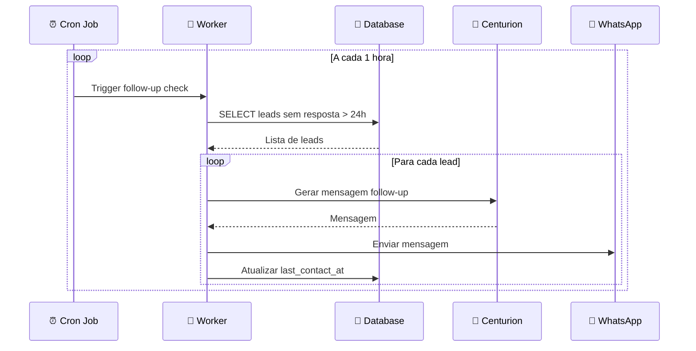
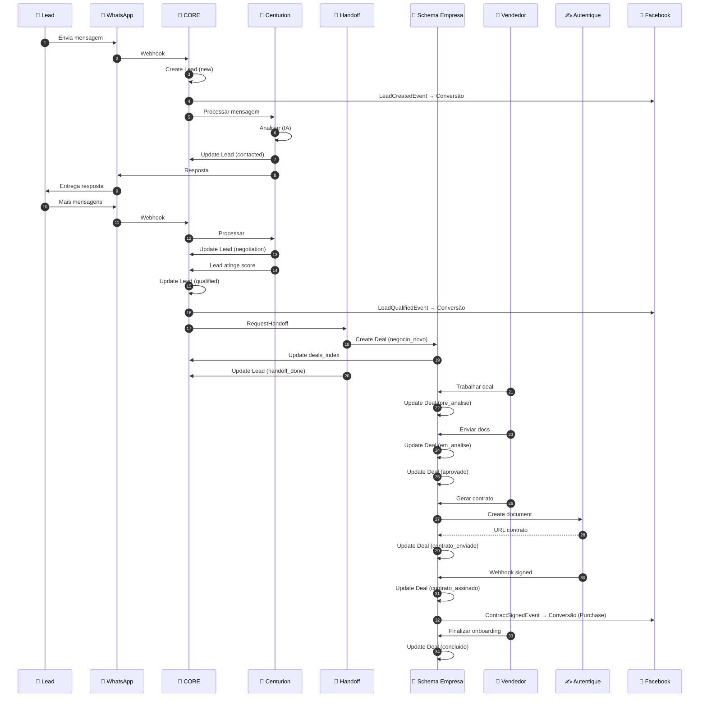

# Documento Individual: Ciclo de Vida

> **Sistema:** Back-Office Multi-Tenant da Holding  
> **Elemento:** Ciclo de Vida (Eventos e Estados)  
> **Versão:** 1.0

---

## 1. Entidade Central: Lead

O Lead é a entidade central do sistema de SDR. Todo o processo de qualificação gira em torno dele.

### Estados do Lead

| Estado | Descrição | Próximos Estados |
|--------|-----------|-----------------|
| `new` | Lead recém-capturado (WhatsApp/Instagram/Telegram/Formulário), sem interação | `contacted`, `proactive_contacted` |
| `proactive_contacted` | IA iniciou contato proativo | `proactive_replied`, `follow_up_pending` |
| `proactive_replied` | Lead respondeu ao contato proativo | `follow_up_pending`, `negotiation` |
| `contacted` | Lead iniciou contato | `follow_up_pending`, `negotiation` |
| `follow_up_pending` | Aguardando follow-up agendado | `follow_up_sent`, `negotiation`, `closed_lost` |
| `follow_up_sent` | Follow-up enviado, aguardando resposta | `negotiation`, `follow_up_pending`, `closed_lost` |
| `negotiation` | Em processo de qualificação ativa | `qualified`, `closed_lost` |
| `qualified` | Lead qualificado, pronto para handoff | `handoff_done`, `closed_lost` |
| `handoff_done` | Derivado para schema da empresa | (estado terminal) |
| `closed_lost` | Desqualificado/perdido | (estado terminal) |

### Máquina de Estados do Lead

### Transições e Gatilhos

| Transição | Gatilho | Ação Resultante |
|-----------|---------|-----------------|
| `new → contacted` | Lead envia primeira mensagem (texto/áudio/imagem) | Registrar `first_contact_at`, iniciar qualificação, processar mídia |
| `new → proactive_contacted` | IA envia mensagem proativa (lead de formulário) | Registrar tentativa, aguardar resposta |
| `* → follow_up_pending` | Sem resposta por tempo configurado | Agendar follow-up conforme `follow_up_configs` |
| `follow_up_pending → follow_up_sent` | Follow-up executado | Enviar mensagem, aguardar resposta |
| `* → negotiation` | IA detecta interesse | Aumentar score, continuar qualificação com memória |
| `negotiation → qualified` | Score atinge threshold (critérios do usuário) | Marcar `is_qualified = true`, `qualified_at = now()` |
| `qualified → handoff_done` | Handoff executado | Criar deal no schema da empresa |
| `* → closed_lost` | Desqualificação, timeout ou max follow-ups | Registrar motivo, arquivar |

### Invariantes do Lead

- Não é permitido voltar de `handoff_done` ou `closed_lost`
- `is_qualified` só pode ser `true` em estados `qualified` ou `handoff_done`
- `qualified_at` é imutável após ser preenchido
- Toda mudança de estado dispara `LeadStageChangedEvent`
- Memória longo prazo (RAG) é atualizada após cada conversa
- Memória de grafo é enriquecida com entidades extraídas

---

## 1.1. Estado de Debounce da Conversa

O sistema aguarda o lead terminar de enviar mensagens antes de responder.

### Estados de Debounce

| Estado | Descrição |
|--------|-----------|
| `idle` | Aguardando mensagem do lead |
| `waiting` | Mensagem(ns) recebida(s), aguardando mais (debounce) |
| `ready` | Timeout atingido, pronto para processar |
| `processing` | IA processando todas as mensagens acumuladas |
| `responding` | Enviando resposta(s) picada(s) |

**Regra:** Novas mensagens durante `waiting` resetam o timer de debounce.

---

## 2. Entidade: Deal

O Deal representa um negócio no pipeline da empresa, após o handoff.

### Estados do Deal

| Estado | Descrição | Próximos Estados |
|--------|-----------|-----------------|
| `negocio_novo` | Deal recém-criado do handoff | `pre_analise` |
| `pre_analise` | Vendedor fez primeiro contato | `em_analise` |
| `em_analise` | Documentação em análise | `aprovado`, `recusado` |
| `aprovado` | Aprovado para contrato | `contrato_enviado` |
| `recusado` | Reprovado na análise | `arquivado` |
| `contrato_enviado` | Contrato enviado para assinatura | `contrato_assinado` |
| `contrato_assinado` | Contrato assinado | `concluido` |
| `concluido` | Negócio finalizado com sucesso | (estado terminal) |
| `arquivado` | Negócio perdido/cancelado | (estado terminal) |

### Máquina de Estados do Deal

### Transições e Gatilhos

| Transição | Gatilho | Ação Resultante |
|-----------|---------|-----------------|
| `negocio_novo → pre_analise` | Vendedor inicia atendimento | Registrar `vendedor_responsavel` |
| `pre_analise → em_analise` | Docs recebidos | Validar documentos, iniciar análise |
| `em_analise → aprovado` | Análise aprovada | Liberar para contrato |
| `em_analise → recusado` | Análise reprovada | Registrar `motivo_rejeicao` |
| `aprovado → contrato_enviado` | Contrato gerado | Chamar Autentique, salvar URL |
| `contrato_enviado → contrato_assinado` | Webhook Autentique | Registrar `signed_at`, salvar cópia |
| `contrato_assinado → concluido` | Onboarding finalizado | Disparar evento de conversão |
| `* → arquivado` | Desistência ou expiração | Registrar motivo |

### Invariantes do Deal

- `core_lead_id` é obrigatório e imutável
- Não é permitido voltar de `concluido` ou `arquivado`
- Após `contrato_assinado`, campos críticos são imutáveis (valor, parcelas)
- Toda mudança de status atualiza `core.deals_index`

---

## 3. Entidade: Contract

Contratos têm seu próprio ciclo de vida independente.

### Estados do Contract

| Estado | Descrição |
|--------|-----------|
| `draft` | Contrato criado, não enviado |
| `sent` | Enviado para assinatura via Autentique |
| `signed` | Assinado com sucesso |
| `expired` | Expirou sem assinatura |
| `canceled` | Cancelado manualmente |

---

## 4. Entidade: Instance Status (WhatsApp)

### Estados da Instância

| Estado | Descrição |
|--------|-----------|
| `disconnected` | Instância desconectada |
| `qr_ready` | QR code disponível para scan |
| `connected` | Instância conectada e operacional |
| `error` | Erro de conexão |

---

## 5. Eventos do Sistema

### Catálogo de Eventos

| Evento | Origem | Payload | Consumidores |
|--------|--------|---------|--------------|
| `LeadCreatedEvent` | SDR | `{leadId, companyId, phone, source, channel}` | Marketing, Dashboard |
| `LeadStageChangedEvent` | SDR | `{leadId, companyId, oldStage, newStage}` | Dashboard |
| `LeadQualifiedEvent` | SDR | `{leadId, companyId, score, centurionId, qualificationData}` | Handoff Service, Marketing |
| `HandoffCompletedEvent` | Handoff | `{leadId, companyId, dealId, schemaName}` | Dashboard |
| `MessageReceivedEvent` | Channel | `{leadId, conversationId, contentType, content, channel}` | Centurion, Debounce |
| `AudioTranscribedEvent` | STT Service | `{messageId, transcription}` | Centurion |
| `ImageInterpretedEvent` | Vision Service | `{messageId, description, entities}` | Centurion |
| `DebounceReadyEvent` | Debounce | `{conversationId, pendingMessages[]}` | Centurion |
| `ResponseGeneratedEvent` | Centurion | `{conversationId, responseChunks[], mediaSequence}` | Message Sender |
| `ToolExecutedEvent` | Tool Service | `{centurionId, toolName, input, output}` | Centurion |
| `MCPToolCalledEvent` | MCP Client | `{serverId, toolName, result}` | Centurion |
| `MemoryUpdatedEvent` | Memory Service | `{leadId, memoryType, updates}` | - |
| `FollowUpScheduledEvent` | Follow-Up | `{leadId, scheduledAt, attemptNumber}` | Scheduler |
| `FollowUpExecutedEvent` | Follow-Up | `{leadId, attemptNumber, messageId}` | Dashboard |
| `KnowledgeBaseQueryEvent` | RAG | `{centurionId, query, results[]}` | Centurion |
| `MediaSequenceTriggeredEvent` | Media | `{centurionId, sequenceId, trigger}` | Message Sender |
| `DealCreatedEvent` | CRM | `{dealId, companyId, coreLeadId}` | Marketing, Dashboard |
| `DealStatusChangedEvent` | CRM | `{dealId, companyId, oldStatus, newStatus}` | Marketing, Dashboard |
| `ContractGeneratedEvent` | Contracts | `{contractId, dealId, companyId, autentiqueId}` | - |
| `ContractSignedEvent` | Contracts | `{contractId, dealId, companyId}` | Marketing, CRM |
| `ChannelInstanceStatusChangedEvent` | Channel | `{instanceId, channelType, oldState, newState}` | Dashboard |
| `ConversionEventQueuedEvent` | Marketing | `{eventId, companyId, eventName}` | Dispatcher |
| `ConversionEventDispatchedEvent` | Marketing | `{eventId, success, response}` | Logs |

### Diagrama de Fluxo de Eventos

---

## 6. Eventos Temporais (Automações)

### Eventos Baseados em Tempo

| Evento | Condição | Ação | Frequência |
|--------|----------|------|------------|
| **Follow-up Automático** | Lead sem resposta > 24h | IA envia mensagem de follow-up | Verificar a cada 1h |
| **Expiração de Contrato** | Contrato não assinado > 7 dias | Marcar como `expired`, notificar | Verificar diariamente |
| **Remarketing** | Lead qualificado sem conversão > 3 dias | Enfileirar para campanha | Verificar diariamente |
| **Reconexão WhatsApp** | Instância desconectada > 1h | Alertar no dashboard | Verificar a cada 15min |
| **Limpeza de Leads Inativos** | Lead `closed_lost` > 30 dias | Arquivar definitivamente | Verificar semanalmente |

### Implementação via Cron/Workers

---

## 7. Fluxo Completo: Lead → Handoff → Deal → Contrato

---

## 8. Resumo

| Entidade | Estados Principais | Evento Terminal |
|----------|-------------------|-----------------|
| **Lead** | new → contacted → negotiation → qualified → handoff_done | `HandoffCompletedEvent` |
| **Deal** | negocio_novo → em_analise → aprovado → contrato_assinado → concluido | `DealStatusChangedEvent(concluido)` |
| **Contract** | draft → sent → signed | `ContractSignedEvent` |
| **Instance** | disconnected → qr_ready → connected | `InstanceStatusChangedEvent(connected)` |

---

*Documento Individual: Ciclo de Vida*
