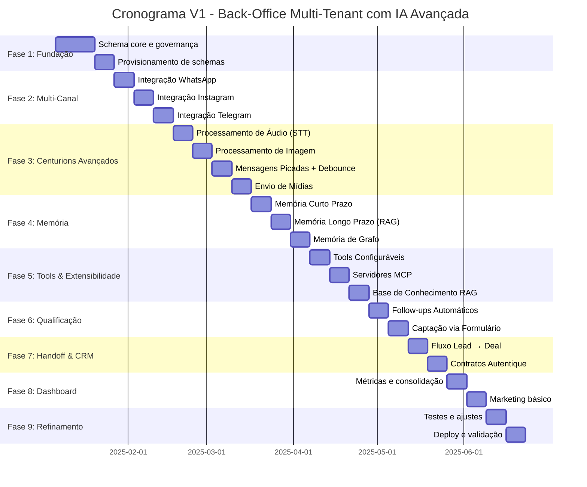

# Documento Individual: Escopo V1

> **Sistema:** Back-Office Multi-Tenant da Holding  
> **Elemento:** Escopo V1  
> **Versão:** 1.0

---

## 1. Filosofia do Escopo V1

> **V1 não é versão incompleta — é versão focada.**
>
> Menos features, mais estrutura. Cortamos agora para entregar rápido, validar com uso real, e depois decidir o que realmente precisa.

### Critério de Decisão

Para cada feature, perguntamos:

1. **"O sistema entrega valor sem isso?"**
   - Se SIM → pode esperar para V2+
   - Se NÃO → entra na V1

2. **"Qual o risco de não ter isso na V1?"**
   - Risco alto (sistema não funciona) → V1
   - Risco médio (funciona com limitações) → avaliar
   - Risco baixo (nice to have) → V2+

---

## 2. O Que Entra na V1 (Essencial)

### Módulo: Governança & Empresas

| Funcionalidade | Justificativa | Prioridade |
|----------------|---------------|:----------:|
| CRUD de Empresas | Base de tudo: sem empresa, nada funciona | P0 |
| Provisionamento automático de schema | Escala: criar empresa = clicar um botão | P0 |
| Gestão de usuários por empresa | Controle de acesso básico | P0 |
| Mapeamento empresa → schema | Handoff precisa saber onde entregar | P0 |

**Entregável:** Dono consegue criar uma empresa e o schema é provisionado automaticamente.

---

### Módulo: Canais de Comunicação (Multi-Canal)

| Funcionalidade | Justificativa | Prioridade |
|----------------|---------------|:----------:|
| Integração WhatsApp (Evolution) | Canal principal de captação | P0 |
| Integração Instagram | Captar leads de Instagram DM | P0 |
| Integração Telegram | Captar leads de Telegram | P0 |
| Status de instâncias por canal | Saber se canais estão operacionais | P0 |
| Mapeamento instância → Centurion | Definir qual IA atende qual canal | P0 |
| Reconexão via QR code (WhatsApp) | Manter operação funcionando | P0 |

**Entregável:** Leads entram por WhatsApp, Instagram e Telegram unificados.

---

### Módulo: Centurions (Agentes de IA Avançados)

| Funcionalidade | Justificativa | Prioridade |
|----------------|---------------|:----------:|
| CRUD de Centurions | Core do sistema: SDR é 100% IA | P0 |
| Configuração de prompt e personalidade | IA precisa saber como se comportar | P0 |
| **Processamento de Áudio (STT)** | Leads enviam áudio, IA precisa ouvir | P0 |
| **Processamento de Imagem (Vision)** | Leads enviam imagem, IA precisa interpretar | P0 |
| **Envio de Mídias (áudio, imagem, vídeo)** | Comunicação rica com o lead | P0 |
| **Sequência de Mídias Configurável** | Dono define ordem de materiais | P0 |
| **Mensagens Picadas (Humanização)** | Não enviar blocão de texto | P0 |
| **Debounce Inteligente** | Aguardar lead terminar de digitar | P0 |
| **Critérios de Qualificação Configuráveis** | Usuário define quando lead está qualificado | P0 |

**Entregável:** IA recebe texto/áudio/imagem, processa, responde de forma humanizada e qualifica.

---

### Módulo: Memória

| Funcionalidade | Justificativa | Prioridade |
|----------------|---------------|:----------:|
| **Memória de Curto Prazo** | Histórico da conversa atual (mensagens sequenciais) | P0 |
| **Memória de Longo Prazo (RAG)** | Lembrar informações do lead entre conversas | P0 |
| **Memória de Grafo** | Relacionamentos e contexto estruturado | P0 |
| Atualização automática de memória | Extrair fatos após cada conversa | P0 |

**Entregável:** IA lembra do lead mesmo dias depois, com contexto rico.

---

### Módulo: Tools & Extensibilidade

| Funcionalidade | Justificativa | Prioridade |
|----------------|---------------|:----------:|
| **Tools Configuráveis** | Agentes executam chamadas externas | P0 |
| **Servidores MCP** | Integração com Model Context Protocol | P0 |
| **Base de Conhecimento (RAG Upload)** | Conhecimento personalizado por agente | P0 |
| CRUD de Tools por Centurion | Dono configura ferramentas do agente | P0 |
| CRUD de Servidores MCP | Dono conecta MCPs externos | P0 |
| Upload de documentos para RAG | Dono sobe PDFs, docs, etc. | P0 |

**Entregável:** Agente consulta estoque, agenda visitas, acessa informações externas.

---

### Módulo: Follow-Ups

| Funcionalidade | Justificativa | Prioridade |
|----------------|---------------|:----------:|
| **Sistema de Follow-Ups Automáticos** | Reengajar leads sem resposta | P0 |
| Configuração de intervalos | Dono define quando enviar follow-ups | P0 |
| Templates de mensagem por tentativa | Mensagens diferentes para cada follow-up | P0 |
| Limite máximo de tentativas | Não importunar lead infinitamente | P0 |

**Entregável:** Lead sem resposta recebe follow-ups automáticos configuráveis.

---

### Módulo: Captação

| Funcionalidade | Justificativa | Prioridade |
|----------------|---------------|:----------:|
| **Captura via Formulário** | Leads de landing pages | P0 |
| **Abordagem Proativa** | IA inicia conversa com lead de formulário | P0 |
| Webhook de recebimento | Receber dados do formulário | P0 |

**Entregável:** Lead preenche formulário, IA aborda automaticamente.

---

### Módulo: Handoff & Deals

| Funcionalidade | Justificativa | Prioridade |
|----------------|---------------|:----------:|
| Lógica de handoff (core.leads → empresa.deals) | Entregar lead qualificado para vendas | P0 |
| Criação de Deal com referência a core_lead_id | Rastreabilidade obrigatória | P0 |
| Atualização de core.deals_index | Visão consolidada para o dono | P0 |
| Estados básicos do Deal | Pipeline mínimo viável | P0 |

**Entregável:** Lead qualificado vira Deal no schema da empresa.

---

### Módulo: Contratos

| Funcionalidade | Justificativa | Prioridade |
|----------------|---------------|:----------:|
| CRUD de templates de contrato | Padronizar geração | P1 |
| Integração básica com Autentique | Gerar e enviar contratos | P1 |
| Webhook de assinatura | Saber quando contrato foi assinado | P1 |

**Entregável:** Contrato pode ser gerado e assinatura é rastreada.

---

### Módulo: Marketing & Tracking

| Funcionalidade | Justificativa | Prioridade |
|----------------|---------------|:----------:|
| CRUD de pixels por empresa | Cada empresa tem seu pixel | P1 |
| Eventos básicos de conversão (Lead, Purchase) | Tracking essencial | P1 |
| Fila de dispatch para Facebook CAPI | Não perder eventos | P1 |

**Entregável:** Eventos de conversão chegam ao Facebook.

---

### Módulo: Dashboard & Métricas

| Funcionalidade | Justificativa | Prioridade |
|----------------|---------------|:----------:|
| Visão consolidada de leads por empresa | Dono precisa ver tudo | P0 |
| Status de Centurions (ativos, pausados) | Monitoramento básico | P0 |
| Status de canais (WhatsApp, Instagram, Telegram) | Saber se está operacional | P0 |
| Métricas de qualificação | Taxa de qualificação, conversão | P0 |
| Métricas de follow-up | Eficácia de reengajamento | P1 |

**Entregável:** Dono vê dashboard com métricas de toda a holding.

---

### Módulo: Segurança & RLS

| Funcionalidade | Justificativa | Prioridade |
|----------------|---------------|:----------:|
| RLS em todas as tabelas com company_id | Isolamento obrigatório | P0 |
| Policies para backoffice_admin | Acesso global controlado | P0 |
| Policies para crm_user | Acesso isolado por empresa | P0 |
| JWT com company_id e role | Autenticação e autorização | P0 |

**Entregável:** Empresa A nunca vê dados de Empresa B.

---

## 3. O Que Fica de Fora da V1 (Diferido)

### Para V2

| Funcionalidade | Motivo do Diferimento |
|----------------|----------------------|
| **Remarketing avançado** | V1 funciona sem isso, otimização posterior |
| **Múltiplos tipos de CRM** | V1 usa modelo único, suficiente para validar |
| **Relatórios customizados** | Dashboard básico é suficiente |
| **White-label para fronts** | Fronts funcionam sem branding customizado |
| **A/B testing de prompts** | Otimização posterior |
| **Integrações com CRMs externos** (Pipedrive, HubSpot) | Modelo próprio primeiro |
| **Email como canal** | WhatsApp/Instagram/Telegram cobrem V1 |
| **Agendamento de mensagens** | Follow-ups já resolvem reengajamento |

### Para V3+

| Funcionalidade | Motivo do Diferimento |
|----------------|----------------------|
| **App mobile para dono** | Web primeiro |
| **Marketplace de templates** | Criar base primeiro |
| **Multi-idioma** | Português primeiro |
| **Videoconferência integrada** | Foco em texto/áudio/imagem primeiro |

---

## 4. Critério de Pronto (Definition of Done)

A V1 está **pronta para produção** quando:

### Funcional - Governança

- [ ] Dono consegue **criar uma empresa** e o schema é provisionado automaticamente
- [ ] Dono consegue **configurar um Centurion** com prompt, tools e regras de qualificação

### Funcional - Multi-Canal

- [ ] Lead chega via **WhatsApp** e é processado pela IA
- [ ] Lead chega via **Instagram DM** e é processado pela IA
- [ ] Lead chega via **Telegram** e é processado pela IA
- [ ] Lead chega via **formulário** e IA aborda proativamente

### Funcional - Capacidades da IA

- [ ] IA **transcreve e entende áudios** enviados pelo lead
- [ ] IA **interpreta imagens** enviadas pelo lead
- [ ] IA **envia mídias** (áudio, imagem, vídeo) na sequência configurada
- [ ] IA responde com **mensagens picadas** (não blocão de texto)
- [ ] IA **aguarda lead terminar** de digitar antes de responder (debounce)
- [ ] IA executa **tools configuradas** durante a conversa
- [ ] IA conecta a **servidores MCP** e usa ferramentas externas
- [ ] IA consulta **base de conhecimento RAG** personalizada

### Funcional - Memória

- [ ] **Memória de curto prazo** funciona (histórico da conversa)
- [ ] **Memória de longo prazo RAG** funciona (lembrar do lead)
- [ ] **Memória de grafo** funciona (relacionamentos e contexto)

### Funcional - Qualificação e Follow-Up

- [ ] IA qualifica lead segundo **critérios definidos pelo usuário**
- [ ] IA marca lead como **qualificado ou não**
- [ ] **Follow-ups automáticos** são enviados para leads sem resposta
- [ ] Lead qualificado sofre **handoff** e vira **deal** no schema da empresa

### Funcional - Visibilidade

- [ ] Dono consegue **ver métricas consolidadas** de todas as empresas
- [ ] Dashboard mostra **status de todos os canais** (WhatsApp, Instagram, Telegram)

### Funcional - Contratos e Marketing

- [ ] **Contrato pode ser gerado** via Autentique e assinatura é rastreada
- [ ] **Eventos de conversão** são enviados para Facebook CAPI

### Técnico

- [ ] **RLS funciona**: empresa A não vê dados de empresa B
- [ ] **Todas as tabelas** têm `company_id NOT NULL`
- [ ] **Índices** criados para queries principais
- [ ] **Webhooks** de WhatsApp, Instagram, Telegram e Autentique funcionando
- [ ] **Logs** de auditoria capturando operações sensíveis
- [ ] **pgvector** configurado para RAG (embeddings)

### Operacional

- [ ] Front operacional de uma empresa consegue **trabalhar deals** do schema dela
- [ ] Instância WhatsApp **reconecta** via QR code quando necessário
- [ ] Dashboard mostra **dados em tempo real** (ou near real-time)

---

## 5. Riscos e Mitigações

| Risco | Probabilidade | Impacto | Mitigação |
|-------|:-------------:|:-------:|-----------|
| WhatsApp banir número | Média | Alto | Documentar boas práticas, múltiplas instâncias |
| IA qualificar mal | Média | Médio | Supervisão humana inicial, ajuste de prompts |
| RLS com falha | Baixa | Crítico | Testes automatizados de isolamento |
| Autentique fora do ar | Baixa | Médio | Retry com backoff, fallback manual |
| Sobrecarga no handoff | Baixa | Médio | Fila com rate limiting |
| Transcrição de áudio imprecisa | Média | Médio | Usar múltiplos providers STT, fallback manual |
| API de visão fora do ar | Baixa | Médio | Cache de interpretações, fallback para texto |
| RAG retornar contexto irrelevante | Média | Médio | Tuning de embeddings, rerank |
| Servidor MCP indisponível | Média | Médio | Timeout + fallback gracioso, retry |
| Instagram/Telegram rate limits | Média | Médio | Backoff exponencial, filas de envio |
| Base de conhecimento muito grande | Baixa | Médio | Chunking otimizado, índices vetoriais |

---

## 6. Cronograma Estimado

### Fases de Desenvolvimento

### Resumo por Fase

| Fase | Duração | Entregas |
|------|:-------:|----------|
| **Fase 1** | 3 semanas | Schema core, governança, provisionamento |
| **Fase 2** | 3 semanas | Multi-canal (WhatsApp, Instagram, Telegram) |
| **Fase 3** | 4 semanas | Centurions avançados (áudio, visão, mensagens picadas, debounce) |
| **Fase 4** | 3 semanas | Memória (curto prazo, RAG, grafo) |
| **Fase 5** | 3 semanas | Tools, MCP, Base de Conhecimento |
| **Fase 6** | 2 semanas | Follow-ups, Captação via formulário |
| **Fase 7** | 2 semanas | Handoff, deals, contratos |
| **Fase 8** | 2 semanas | Dashboard, métricas, marketing básico |
| **Fase 9** | 2 semanas | Testes, refinamentos, deploy |
| **Total** | **~24 semanas** | V1 completa |

---

## 7. Métricas de Sucesso da V1

### KPIs Técnicos

| Métrica | Meta |
|---------|------|
| Uptime do sistema | > 99% |
| Tempo de resposta da IA | < 5 segundos |
| Taxa de sucesso de webhooks | > 99.5% |
| Isolamento RLS | 100% (zero vazamentos) |
| Precisão de transcrição de áudio | > 90% |
| Latência do RAG retrieval | < 500ms |
| Tempo de processamento de imagem | < 3 segundos |

### KPIs de Negócio

| Métrica | Meta |
|---------|------|
| Tempo para criar nova empresa | < 5 minutos |
| Leads qualificados por IA | > 70% de acurácia |
| Taxa de handoff | > 80% dos qualificados |
| Contratos gerados sem erro | > 95% |
| Taxa de resposta a follow-ups | > 30% |
| Leads recuperados via follow-up | > 15% |
| Tempo médio de qualificação | < 48 horas |

---

## 8. Pós-V1: Roadmap

### V1.1 (2-4 semanas após V1)

- Melhorias de UX no dashboard
- Ajustes de prompts baseados em feedback
- Métricas adicionais (taxa de conversão por Centurion)

### V2 (2-3 meses após V1)

- Remarketing avançado
- Automações de follow-up configuráveis
- Relatórios customizados
- Múltiplos canais (além de WhatsApp)

### V3 (6+ meses)

- Múltiplos tipos de CRM por vertical
- IA com processamento de áudio
- Marketplace de templates
- App mobile

---

## 9. Resumo Executivo

| Aspecto | V1 |
|---------|-----|
| **Foco** | Ciclo completo: Captação multi-canal → Qualificação por IA avançada → Handoff → Deal |
| **Diferencial** | SDR 100% IA com memória (RAG/Grafo), tools, MCP, visão, áudio, multi-canal |
| **Canais V1** | WhatsApp, Instagram, Telegram, Formulário |
| **Capacidades IA** | Áudio (STT), Imagem (Vision), Tools, MCP, RAG, Memória Grafo, Mensagens Picadas, Debounce |
| **Módulos V1** | Governança, Multi-Canal, Centurions Avançados, Memória, Tools/MCP, Follow-Ups, Captação, Handoff, Contratos, Marketing, Dashboard |
| **Prazo** | ~24 semanas |
| **Critério de Pronto** | Dono gerencia holding com IAs avançadas operando em múltiplos canais |

---

*Documento Individual: Escopo V1*
