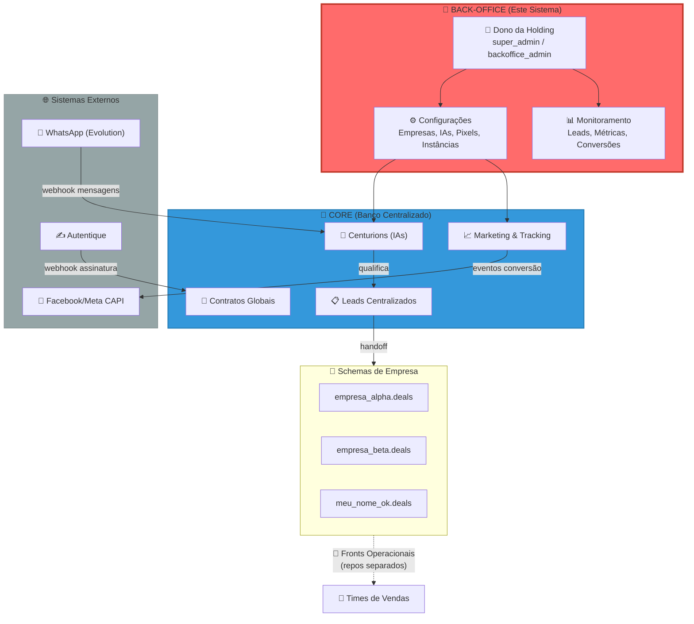
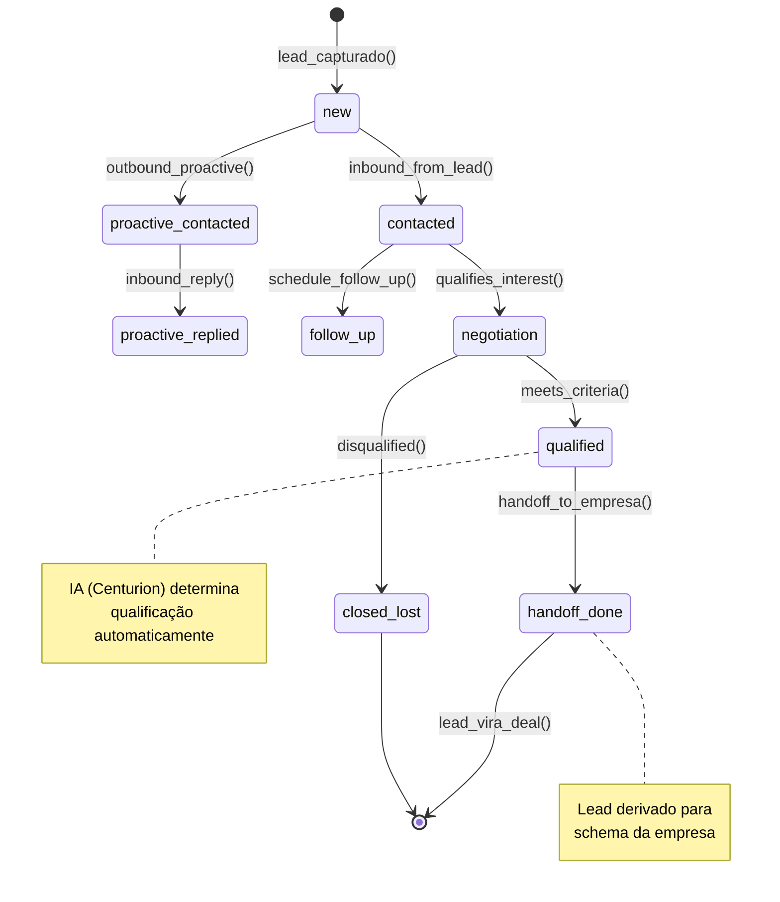
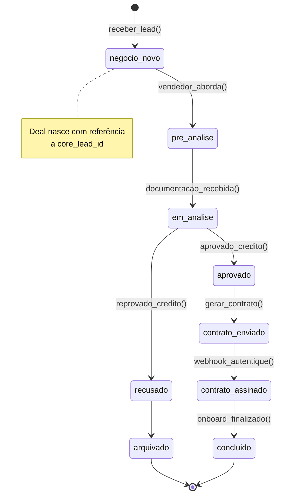

# Contexto de Negócio: Back-Office Multi-Tenant da Holding

> **Gerado em:** Dezembro 2025 — Versão 1.0  
> **Sistema:** Back-Office Multi-Tenant para Gestão de Holding  
> **Escopo:** Centro de comando do dono da holding para administração de múltiplas empresas

---

## 🎯 PROBLEMA

### Declaração Estruturada

> **O dono de uma holding com múltiplas empresas** tem o problema de **não conseguir gerenciar todas as operações de forma centralizada** porque **cada empresa operaria com sistemas separados, bancos de dados isolados e processos desconexos**.
>
> Isso resulta em:
> - **Caos operacional**: N sistemas diferentes para N empresas
> - **Visão fragmentada**: Impossível ter métricas consolidadas
> - **Retrabalho infinito**: Cada nova empresa = começar do zero
> - **Custo multiplicado**: Infraestrutura, integrações e manutenção replicadas
> - **Qualificação de leads ineficiente**: SDRs humanos caros e inconsistentes
> - **Canais fragmentados**: WhatsApp, Instagram, Telegram gerenciados separadamente
>
> **O sistema resolve isso** através de um **único back-office centralizado** onde o dono:
> - Cria e gerencia todas as empresas em um lugar só
> - Configura IAs (Centurions) que fazem 100% do trabalho de SDR
> - Tem visão consolidada de leads, métricas e operações de toda a holding
> - Escala empresas sem multiplicar complexidade (infraestrutura compartilhada)

### Contexto do Problema

| Aspecto | Situação Atual (Problema) | Situação Desejada (Solução) |
|---------|---------------------------|----------------------------|
| **Gestão de Empresas** | Cada empresa com sistema próprio | Uma interface para todas as empresas |
| **Qualificação de Leads** | SDRs humanos caros e inconsistentes | IAs (Centurions) 100% automatizadas |
| **Visibilidade** | Dados dispersos, sem consolidação | Dashboard unificado com métricas globais |
| **Escala** | Criar empresa = projeto novo | Criar empresa = clicar um botão |
| **Integrações** | Refazer WhatsApp, contratos, pixels para cada empresa | Configurar uma vez, usar em todas |

### Causa Raiz (5 Porquês aplicados)

1. **Por que** o dono não tem visão consolidada? → Porque cada empresa tem sistema separado
2. **Por que** cada empresa tem sistema separado? → Porque não existe infraestrutura compartilhada
3. **Por que** não existe infraestrutura compartilhada? → Porque nunca foi projetado um banco multi-tenant
4. **Por que** a qualificação é cara? → Porque depende de SDRs humanos
5. **Por que** depende de humanos? → Porque não havia IAs configuráveis para essa função

**Causa raiz identificada:** Ausência de arquitetura multi-tenant com SDR automatizado por IA.

---

## 👥 ATORES

### Mapa de Atores

| Ator | Tipo | O que faz | O que precisa ver/fazer |
|------|------|-----------|-------------------------|
| **Dono da Holding** | Usuário Principal | Administra toda a operação | Criar empresas, configurar IAs, ver métricas globais, gerenciar integrações |
| **Centurion (IA)** | Sistema Automatizado | Qualifica leads via WhatsApp/Instagram/Telegram | Receber mensagens (texto/áudio/imagem), processar com memória curta/longa/grafo, usar tools/MCP, enviar mídias, pontuar lead, disparar handoff |
| **WhatsApp (Evolution)** | Sistema Externo | Recebe/envia mensagens | Webhooks de mensagens, status de instâncias |
| **Instagram** | Sistema Externo | Recebe/envia mensagens DM | Webhooks de mensagens, status de conexão |
| **Telegram** | Sistema Externo | Recebe/envia mensagens | Webhooks de mensagens via Bot API |
| **Servidores MCP** | Sistema Externo | Fornece tools para os agentes | Chamadas de ferramentas configuráveis |
| **Autentique** | Sistema Externo | Gera e gerencia contratos digitais | Criar documentos, receber webhooks de assinatura |
| **Facebook/Meta** | Sistema Externo | Recebe eventos de conversão | Eventos de marketing (CAPI) |
| **Time de Vendas** | Usuário Secundário | Trabalha leads qualificados | *(Acessa via Front Operacional, não este sistema)* |

### Diagrama de Atores



### Roles e Permissões

| Role | Escopo | Acesso |
|------|--------|--------|
| `super_admin` | Global | Tudo: empresas, IAs, integrações, métricas |
| `backoffice_admin` | Global | Operações administrativas do back-office |
| `ai_supervisor` | Por Empresa | Monitora e ajusta Centurions |
| `marketing_admin` | Por Empresa | Configura pixels e campanhas |
| `crm_user` | Por Empresa | *(Não acessa este sistema - usa Front Operacional)* |

> ⚠️ **IMPORTANTE:** Não existem roles `sdr_operator` ou `sdr_manager`. O SDR é 100% feito por IAs (Centurions).

---

## 📦 ENTIDADES

### Modelo de Entidades Principal

| Entidade | Schema | Descrição | Atributos Essenciais |
|----------|--------|-----------|---------------------|
| **Company** | `core` | Empresa da holding (tenant) | `id`, `name`, `slug`, `document`, `status`, `owner_user_id`, `settings` |
| **Lead** | `core` | Lead capturado (centralizado) | `id`, `company_id`, `name`, `phone`, `email`, `lifecycle_stage`, `is_qualified`, `qualification_score` |
| **Centurion Config** | `core` | Configuração da IA de SDR | `id`, `company_id`, `name`, `prompt`, `personality`, `qualification_rules`, `tools_config`, `mcp_servers`, `media_sequence` |
| **Channel Instance** | `core` | Instância de canal (WhatsApp/Instagram/Telegram) | `id`, `company_id`, `channel_type`, `instance_name`, `state`, `credentials` |
| **Conversation** | `core` | Conversa com lead (memória curto prazo) | `id`, `lead_id`, `company_id`, `centurion_id`, `channel_type`, `messages[]`, `debounce_state` |
| **Lead Memory** | `core` | Memória longo prazo RAG do lead | `id`, `lead_id`, `company_id`, `embeddings`, `facts`, `preferences` |
| **Lead Graph** | `core` | Memória de grafo do lead | `id`, `lead_id`, `company_id`, `nodes`, `relationships`, `context` |
| **Knowledge Base** | `core` | Base de conhecimento com RAG | `id`, `company_id`, `centurion_id`, `documents`, `embeddings`, `chunks` |
| **Tool Config** | `core` | Configuração de tools/chamadas externas | `id`, `company_id`, `centurion_id`, `tool_name`, `endpoint`, `auth`, `schema` |
| **MCP Server** | `core` | Servidor MCP configurado | `id`, `company_id`, `centurion_id`, `server_url`, `tools_available`, `auth` |
| **Media Sequence** | `core` | Sequência de mídias configurada | `id`, `company_id`, `centurion_id`, `trigger`, `media_items[]`, `order` |
| **Follow Up Config** | `core` | Configuração de follow-ups | `id`, `company_id`, `centurion_id`, `rules`, `intervals`, `templates` |
| **Pixel Config** | `core` | Configuração de pixel de marketing | `id`, `company_id`, `pixel_id`, `meta_access_token`, `is_active` |
| **Contract Template** | `core` | Template global de contrato | `id`, `company_id` (null=global), `name`, `variables`, `category` |
| **Deal** | `<empresa>` | Negócio no pipeline da empresa | `id`, `company_id`, `core_lead_id`, `deal_status`, `deal_valor_contrato`, `vendedor_responsavel` |

### Relacionamentos

```mermaid
erDiagram
    COMPANY ||--o{ LEAD : "possui"
    COMPANY ||--o{ CENTURION_CONFIG : "configura"
    COMPANY ||--o{ CHANNEL_INSTANCE : "possui"
    COMPANY ||--o{ PIXEL_CONFIG : "possui"
    COMPANY ||--o{ COMPANY_CRM : "mapeia para"
    COMPANY ||--o{ KNOWLEDGE_BASE : "possui"
    
    LEAD ||--o| DEAL : "deriva para"
    LEAD ||--|| CONVERSATION : "tem"
    LEAD ||--|| LEAD_MEMORY : "memória RAG"
    LEAD ||--|| LEAD_GRAPH : "memória grafo"
    LEAD }o--|| CENTURION_CONFIG : "qualificado por"
    
    CENTURION_CONFIG ||--o{ TOOL_CONFIG : "usa"
    CENTURION_CONFIG ||--o{ MCP_SERVER : "conecta"
    CENTURION_CONFIG ||--o{ MEDIA_SEQUENCE : "configura"
    CENTURION_CONFIG ||--o{ FOLLOW_UP_CONFIG : "configura"
    CENTURION_CONFIG }o--o| KNOWLEDGE_BASE : "usa"
    
    CHANNEL_INSTANCE }o--|| CENTURION_CONFIG : "mapeada para"
    
    COMPANY_CRM ||--|| SCHEMA_EMPRESA : "aponta para"
    
    CONTRACT_TEMPLATE ||--o{ CONTRACT : "instancia"
    CONTRACT }o--|| LEAD : "referencia"
    
    COMPANY {
        uuid id PK
        text name
        text slug UK
        text status
    }
    
    LEAD {
        uuid id PK
        uuid company_id FK
        text phone
        text lifecycle_stage
        boolean is_qualified
        text source_channel
    }
    
    CENTURION_CONFIG {
        uuid id PK
        uuid company_id FK
        text name
        text prompt
        jsonb tools_config
        jsonb mcp_servers
        jsonb qualification_rules
    }
    
    CHANNEL_INSTANCE {
        uuid id PK
        uuid company_id FK
        text channel_type
        text instance_name UK
        text state
    }
    
    CONVERSATION {
        uuid id PK
        uuid lead_id FK
        uuid centurion_id FK
        jsonb messages
        text debounce_state
    }
    
    LEAD_MEMORY {
        uuid id PK
        uuid lead_id FK
        jsonb embeddings
        jsonb facts
    }
    
    LEAD_GRAPH {
        uuid id PK
        uuid lead_id FK
        jsonb nodes
        jsonb relationships
    }
    
    KNOWLEDGE_BASE {
        uuid id PK
        uuid company_id FK
        jsonb documents
        jsonb embeddings
    }
    
    TOOL_CONFIG {
        uuid id PK
        uuid centurion_id FK
        text tool_name
        text endpoint
        jsonb schema
    }
    
    MCP_SERVER {
        uuid id PK
        uuid centurion_id FK
        text server_url
        jsonb tools_available
    }
    
    MEDIA_SEQUENCE {
        uuid id PK
        uuid centurion_id FK
        text trigger
        jsonb media_items
        int order
    }
    
    FOLLOW_UP_CONFIG {
        uuid id PK
        uuid centurion_id FK
        jsonb rules
        jsonb intervals
    }
    }
    
    CONTRACT_TEMPLATE {
        uuid id PK
        uuid company_id FK
        text name
        jsonb variables
        text category
    }
    
    CONTRACT {
        uuid id PK
        uuid company_id FK
        uuid lead_id FK
        uuid template_id FK
        text status
        text autentique_id
    }
    
    DEAL {
        uuid id PK
        uuid company_id FK
        uuid core_lead_id FK
        text deal_status
        numeric deal_valor_contrato
        uuid vendedor_responsavel FK
    }
    
    SCHEMA_EMPRESA {
        text schema_name PK
    }
```

### Regras de Integridade

| Regra | Descrição |
|-------|-----------|
| **Company-centric** | Todo recurso operacional DEVE ter `company_id NOT NULL` |
| **Core Lead Reference** | `<empresa>.deals.core_lead_id` é obrigatório (rastreabilidade) |
| **Schema Isolation** | Cada empresa tem schema próprio, clonado de `_template_base` |
| **CORE Imutável** | Schema `core` nunca é modificado para necessidades específicas de uma empresa |
| **RLS em Tudo** | Todas as tabelas sensíveis têm Row Level Security por `company_id` |

---

## ⚡ EVENTOS E CICLO DE VIDA

### Ciclo de Vida do Lead (Entidade Central)



### Ciclo de Vida do Deal (Após Handoff)



### Eventos Principais do Sistema

| Evento | Gatilho | Ação Resultante |
|--------|---------|-----------------|
| `LeadCreatedEvent` | Webhook WhatsApp / Pixel | Criar lead em `core.leads`, associar ao Centurion |
| `LeadQualifiedEvent` | IA pontua lead acima do threshold | Registrar em `core.lead_handoffs`, disparar derivação |
| `HandoffCompletedEvent` | Lead derivado para schema empresa | Criar `<empresa>.deals` com `core_lead_id` |
| `DealStatusChangedEvent` | Vendedor move deal no pipeline | Atualizar `core.deals_index`, disparar evento marketing |
| `ContractGeneratedEvent` | Sistema gera contrato | Criar em `core.contracts`, chamar Autentique |
| `ContractSignedEvent` | Webhook Autentique | Atualizar status, disparar conversão marketing |
| `InstanceStatusChangedEvent` | Webhook Evolution | Atualizar `core.instance_status` |
| `ConversionEventQueuedEvent` | Evento de negócio relevante | Enfileirar para dispatch ao Facebook CAPI |

### Eventos Temporais (Automações)

| Evento | Condição | Ação |
|--------|----------|------|
| Follow-up Automático | Lead sem resposta > 24h | IA envia mensagem de follow-up |
| Expiração de Contrato | Contrato não assinado > 7 dias | Marcar como `expired`, notificar vendedor |
| Remarketing | Lead qualificado sem conversão > 3 dias | Enfileirar para campanha de remarketing |
| Reconexão WhatsApp | Instância desconectada > 1h | Alertar no dashboard, tentar reconectar |

---

## 🎯 ESCOPO V1

### O Que Entra na V1 (Essencial)

| Funcionalidade | Justificativa |
|----------------|---------------|
| **CRUD de Empresas** | Base de tudo: sem empresa, nada funciona |
| **Provisionamento de Schema** | Automático ao criar empresa (clone do template) |
| **Configuração de Centurions** | SDR é 100% IA - core do sistema |
| **Multi-Canal (WhatsApp, Instagram, Telegram)** | Captar leads de todos os canais relevantes |
| **Processamento de Áudio (Speech-to-Text)** | IA precisa ouvir áudios dos leads |
| **Processamento de Imagem (Vision)** | IA precisa interpretar imagens enviadas |
| **Envio de Mídias (Áudio, Imagem, Vídeo)** | Comunicação rica e humanizada |
| **Sequência de Mídias Configurável** | Dono define ordem de envio de materiais |
| **Mensagens Picadas (Humanização)** | Enviar texto em múltiplas mensagens, não blocão |
| **Debounce Inteligente** | Aguardar lead terminar de digitar antes de responder |
| **Memória Curto Prazo (Histórico)** | Contexto da conversa atual |
| **Memória Longo Prazo (RAG)** | Lembrar informações do lead entre conversas |
| **Memória de Grafo** | Relacionamentos e contexto estruturado do lead |
| **Tools & Chamadas Externas** | Agentes podem executar ações configuráveis |
| **Servidores MCP** | Integração com Model Context Protocol |
| **Base de Conhecimento (RAG Upload)** | Conhecimento personalizado por agente |
| **Qualificação Configurável** | Critérios definidos pelo usuário |
| **Sistema de Follow-Ups** | Reengajamento automático de leads |
| **Captura via Formulário** | Abordar leads de landing pages |
| **Fluxo Lead → Handoff → Deal** | Ciclo completo de qualificação |
| **Dashboard de Métricas Globais** | Visão consolidada para o dono |
| **Integração Autentique** | Contratos digitais são críticos para conversão |
| **Configuração de Pixels** | Tracking de marketing essencial |

### O Que Fica de Fora da V1 (Diferido)

| Funcionalidade | Motivo do Diferimento |
|----------------|----------------------|
| Remarketing Avançado | Funciona sem isso na V1, otimização posterior |
| Múltiplos tipos de CRM | V1 usa um único modelo de CRM para todas empresas |
| Relatórios customizados | Dashboard básico é suficiente para validar |
| White-label para fronts | Cada empresa pode ter front próprio, mas não é V1 |
| A/B Testing de Prompts | Otimização posterior |
| Integrações com CRMs externos (Pipedrive, HubSpot) | Modelo próprio primeiro |

### Critério de Pronto (Definition of Done)

A V1 está pronta quando:

- [ ] Dono consegue **criar uma empresa** e o schema é provisionado automaticamente
- [ ] Dono consegue **configurar um Centurion** com prompt e regras de qualificação
- [ ] Lead chega via **WhatsApp**, é qualificado pela **IA** e aparece no **dashboard**
- [ ] Lead qualificado sofre **handoff** e vira **deal** no schema da empresa
- [ ] Dono consegue **ver métricas consolidadas** de todas as empresas
- [ ] **Contrato pode ser gerado** via Autentique e assinatura é rastreada
- [ ] **RLS funciona**: empresa A não vê dados de empresa B
- [ ] Front operacional de uma empresa consegue **trabalhar deals** do schema dela

### Prazo Estimado

| Fase | Duração | Entregas |
|------|---------|----------|
| **Fase 1** | 3 semanas | Schema core, governança, provisionamento |
| **Fase 2** | 3 semanas | SDR (IA), WhatsApp, qualificação |
| **Fase 3** | 2 semanas | Handoff, deals, contratos |
| **Fase 4** | 2 semanas | Dashboard, métricas, refinamentos |
| **Total V1** | **~10 semanas** | Sistema completo funcionando |

---

## 📋 RESUMO EXECUTIVO

| Aspecto | Descrição |
|---------|-----------|
| **Sistema** | Back-Office Multi-Tenant da Holding |
| **Problema** | Dono de holding não consegue gerenciar múltiplas empresas de forma centralizada, com canais fragmentados |
| **Solução** | Um único back-office com banco multi-tenant e IAs avançadas operando em múltiplos canais |
| **Usuário Principal** | Dono da holding (super_admin / backoffice_admin) |
| **Canais** | WhatsApp, Instagram, Telegram, Formulário |
| **Entidades V1** | Company, Lead, Centurion, Channel Instance, Conversation, Lead Memory, Lead Graph, Knowledge Base, Tool Config, MCP Server, Media Sequence, Follow Up Config, Contract, Deal |
| **Capacidades IA** | Áudio (STT), Imagem (Vision), Tools, MCP, Memória RAG, Memória Grafo, Mensagens Picadas, Debounce |
| **Evento Central** | Lead capturado multi-canal → Qualificado por IA avançada → Handoff → Deal na empresa |
| **Diferencial** | IAs com memória persistente (RAG + Grafo), tools configuráveis, MCP, multi-canal unificado |

### Princípios Fundamentais

1. **🔐 CORE É IMUTÁVEL** — Nunca modificar para necessidades específicas de uma empresa
2. **🤖 SDR É 100% IA AVANÇADA** — Centurions com memória, tools, visão e áudio
3. **📤 DADOS DERIVAM DO CORE** — Leads nascem no CORE, são derivados para schemas de empresa
4. **🔒 ISOLAMENTO TOTAL** — Empresa A nunca vê dados de Empresa B (RLS)
5. **📍 COMPANY-CENTRIC** — Sem `company_id` = sem recurso
6. **🧠 MEMÓRIA EM CAMADAS** — Curto prazo (conversa), longo prazo (RAG), grafo (relacionamentos)
7. **🔧 EXTENSÍVEL** — Tools e MCP permitem integração com qualquer sistema externo

### Próximos Passos

1. [ ] Definir arquitetura de módulos (Controllers, Services, Repositories)
2. [ ] Desenhar estrutura de camadas (Entry Points, Application, Domain, Data)
3. [ ] Iniciar implementação do schema `core` e provisionamento
4. [ ] Configurar RLS em todas as tabelas críticas

---

**Para avançar para arquitetura de módulos, leve este documento para o Designer de Arquitetura:**  
https://chatgpt.com/g/g-69292f2732788191aeb480a61ede75cf-designer-de-arquitetura-bushido-academy

---

*Documento gerado pelo Arquiteto de Contexto*
