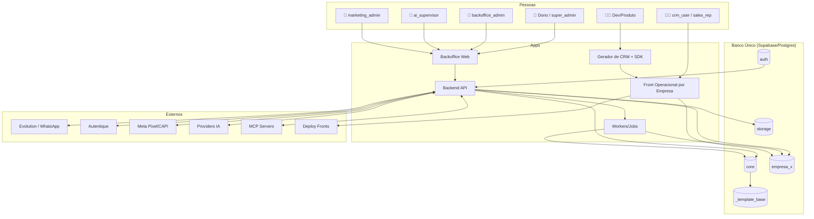
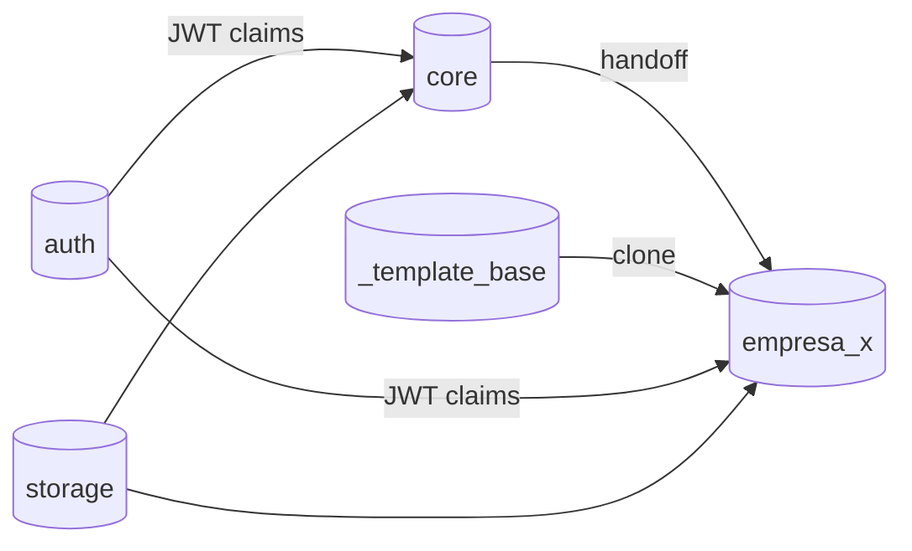
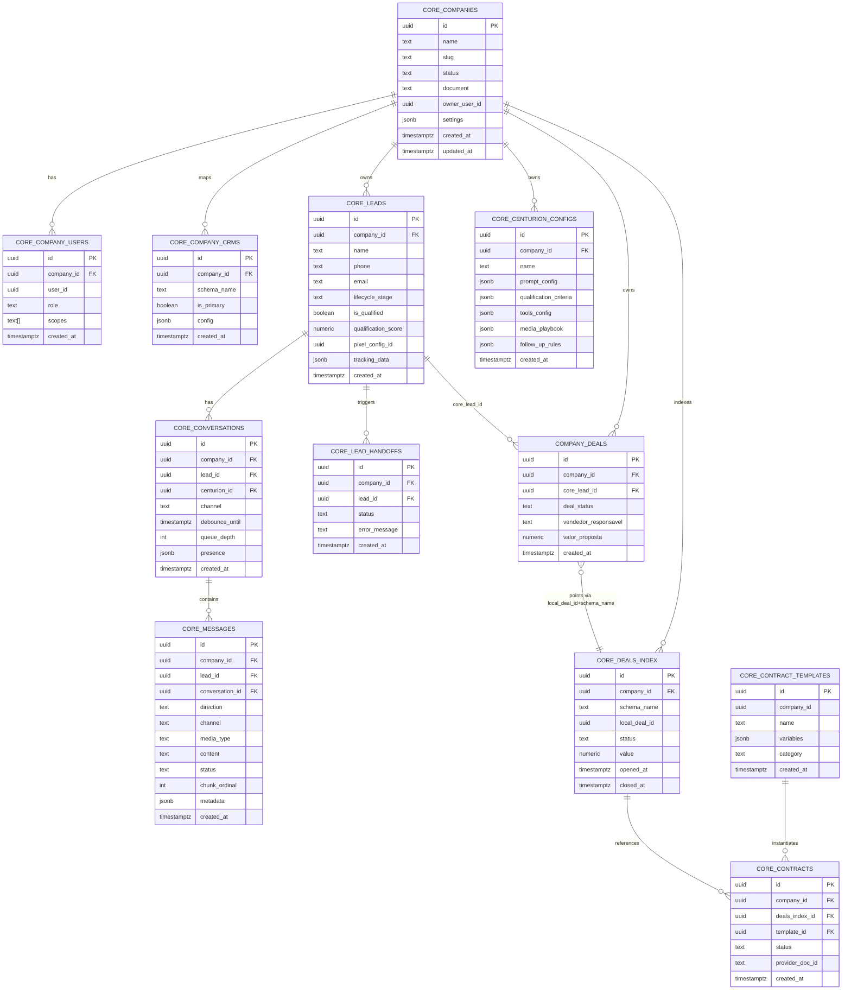
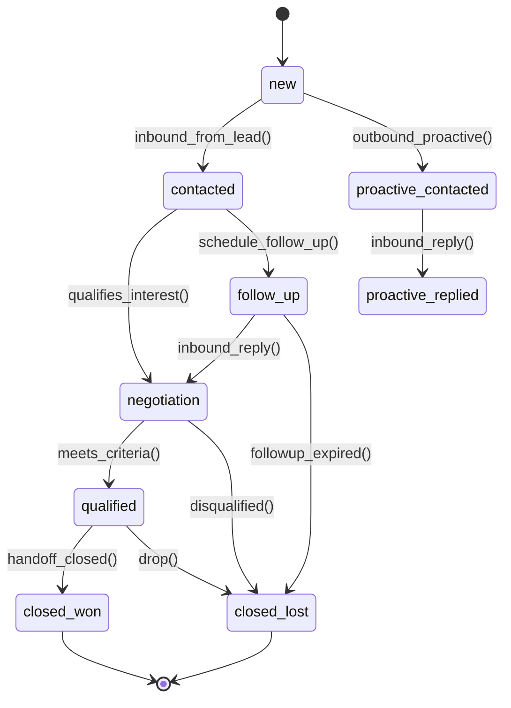
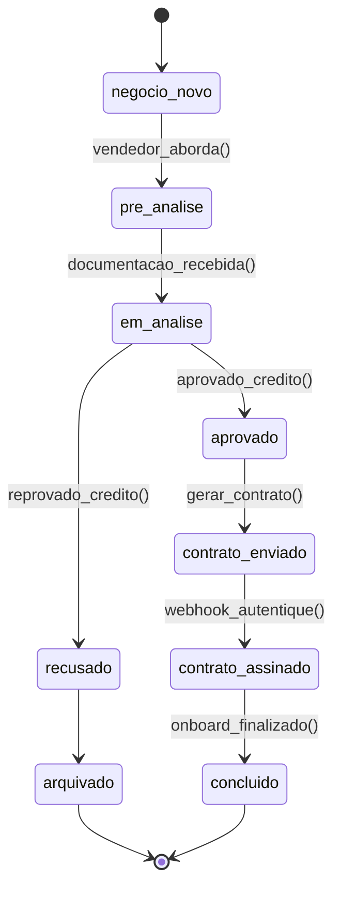
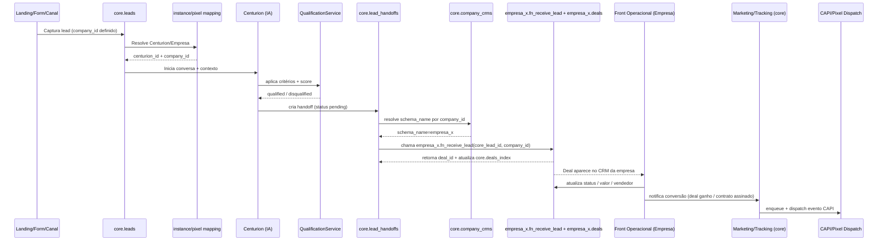

# Documento Final de Contexto de Negócio

## Back‑Office Multi‑Tenant da Holding (Banco Único + CORE + Schemas por Empresa)

**Versão:** 1.0 (canônico)
**Base:** nosso histórico + arquitetura aprovada (macro v2.2 + micro v1.2 + alinhamento implementação v1.1)
**Audiência:** dono da holding, produto/engenharia, operação (backoffice), squads que constroem fronts operacionais

> **Nota rápida de fonte:** alguns arquivos antigos enviados anteriormente expiraram neste ambiente. Eu usei integralmente o que está disponível agora (ARCH_INDEX + docs macro/micro) **e tudo do nosso histórico de conversa**. Se você quiser que eu incorpore algum documento específico que ficou de fora (playbooks, contratos de API, etc.), é só reenviar depois — mas **este documento aqui já está fechado e completo** como Contexto de Negócio principal.

---

## Resumo executivo

Este sistema existe para permitir que uma holding com múltiplas empresas opere de forma **centralizada, escalável e segura**, sem criar “N CRMs, N bancos, N integrações”.

A solução é um **Backoffice** (este repositório) usado pelo **dono da holding** e admins globais, que governa:

* criação e ciclo de vida de empresas (tenants)
* configuração de IAs SDR (“Centurions”) e critérios de qualificação
* integrações globais (WhatsApp/Evolution, Autentique, marketing/pixel/CAPI, provedores de IA)
* rastreio e métricas consolidadas no CORE

A operação comercial do dia a dia não acontece aqui. Ela acontece em **fronts operacionais por empresa**, em repositórios separados, cada um conectado ao **schema** da empresa no banco único.

A arquitetura é sustentada por 5 leis:

1. **Este repo é BACKOFFICE — não é CRM operacional**
2. **SDR é 100% IA (Centurions)**
3. **Banco único + multi‑tenant por schema** (`core` + `_template_base` + `empresa_x`)
4. **CORE é imutável** (não muda para atender caso específico de empresa)
5. **Sem `company_id` = sem recurso** (nenhum ativo nasce órfão)

---

## Contexto invariável e limites do sistema

### O que este sistema É

* **Backoffice da holding** (painel administrativo do dono e operadores globais)
* **Orquestrador central** de:

  * governança de empresas e acessos
  * SDR automatizado por IA
  * integrações globais
  * marketing/tracking e métricas consolidadas

### O que este sistema NÃO É

* ❌ CRM operacional de vendedor
* ❌ Frontend de empresa
* ❌ “um CRM com permissão maior”

> **Consequência prática:** qualquer UI para vendedores (pipeline, kanban, chats, etc.) deve viver em outro repositório e operar no schema da empresa.

---

# PROBLEMA

## 1) Problema estruturado (quem, situação, causa raiz, consequência)

### Quem sofre

* **Dono da holding / diretoria**

  * precisa controlar e enxergar tudo em uma visão unificada
  * quer escalar empresas sem duplicar custo/complexidade
* **Operação central (backoffice ops / growth / AI supervisor)**

  * precisa padronizar captação, SDR, integrações e métricas
* **Times comerciais de cada empresa**

  * precisam receber leads qualificados e operar pipeline/contratos/WhatsApp
* **Engenharia**

  * precisa evitar um ecossistema impossível de manter (N bancos + N CRMs + N integrações)

### Situação que dispara o problema

Uma holding cria múltiplas empresas (imobiliária, revenda, consultoria, etc.). Sem uma arquitetura central:

* cada empresa tende a virar “um sistema novo”
* integrações se multiplicam e divergirem
* não existe visão consolidada e comparável
* cada empresa implementa sua “verdade” de lead, funil, contrato, tracking

Mesmo com banco e provisionamento de schemas funcionando, existe uma dor operacional crítica:

* **o schema da empresa pode estar 100% provisionado**
* mas **os vendedores precisam de um front operacional** para operar o schema
  → se isso for artesanal por empresa, a escala trava.

### Causa raiz

* Ausência (ou perda) de uma fundação central única para:

  * governança de empresas
  * dados canônicos de leads
  * SDR 100% IA
  * integrações globais
  * métricas e tracking
* Falta de disciplina arquitetural:

  * permitir “exceções no CORE” destrói escalabilidade
  * permitir “recursos sem company_id” cria caos e vazamento multi-tenant
* Falta de mecanismo padronizado para o **front operacional por empresa** (geração/kit/sdk)

### Consequências (mensuráveis)

* **Tempo de ativação de uma nova empresa alto** (dias/semanas) em vez de minutos
* **Custo e divergência acumulada** (N integrações, N lógicas, N tabelas)
* **Risco de segurança** (vazamento entre empresas)
* **Sem governança real**: updates viram loteria e manutenção vira caos
* **Sem visão consolidada confiável** (impossível comparar IA/campanha/empresa)

## 2) Resultado desejado (o “alvo”)

* Criar nova empresa = **provisionar tudo que é comum automaticamente**
* Leads entram e são tratados por **SDR IA centralizado**
* Empresa recebe lead qualificado no seu schema e opera no seu front
* Dono vê métricas consolidadas de todas as empresas em um painel
* Customização por empresa acontece sem contaminar o CORE

## 3) Métricas de sucesso sugeridas

* **TTV (Time‑to‑Value) por empresa:** tempo de “criar empresa” → “primeiro deal operado”
* **Taxa de handoff com sucesso:** % leads qualificados que viram deal no schema correto
* **Conversão por Centurion:** qualificação → ganho
* **Incidentes de isolamento:** deve ser 0 (RLS/claims)
* **Tempo de recuperação de integrações:** MTTR Evolution/Autentique/CAPI

---

# ATORES

## 1) Pessoas e papéis (visão de negócio)

| Persona / Papel lógico                       | Onde atua         | O que faz                                                          | Escopo                              |
| -------------------------------------------- | ----------------- | ------------------------------------------------------------------ | ----------------------------------- |
| **`super_admin` (Dono)**                     | Backoffice        | Governa tudo, cria empresas, aprova decisões críticas              | Global                              |
| **`backoffice_admin`**                       | Backoffice        | Operação global do sistema (empresas, configs, integrações)        | Global                              |
| **`ai_supervisor`**                          | Backoffice        | Ajusta Centurions (prompt, ferramentas, KB, critérios, follow‑ups) | Global ou por empresa               |
| **`marketing_admin`**                        | Backoffice        | Pixels, eventos, remarketing, tracking                             | Por empresa (mas governado no CORE) |
| **`crm_user` / `sales_rep` / `crm_manager`** | Front operacional | Opera deals/pipeline/contratos/WhatsApp                            | **Sempre** por empresa              |

> Invariante do modelo: **não existe SDR humano no sistema.** (Não existem roles `sdr_operator` / `sdr_manager`).

## 2) Sistemas internos

* **Backoffice Web (UI do dono/admins)**
* **Backend API (FastAPI)**

  * governança e provisionamento
  * SDR & leads
  * integrações e contratos
  * marketing & tracking
* **Banco Supabase/Postgres (único)**

  * `core`
  * `_template_base`
  * `empresa_x` (um por empresa)
  * `auth`, `storage`, etc.
* **Workers/Jobs**

  * filas, dispatch, follow‑ups, retries, observabilidade

## 3) Sistemas externos

* **Evolution (WhatsApp provider)**
* **Autentique (contratos e assinatura + webhooks)**
* **Meta/Facebook (Pixel/CAPI via microserviço ou gateway)**
* **Providers de IA**
* **Servidores MCP (tools externas padronizadas para agentes)**
* **Plataformas de deploy** para fronts operacionais (Vercel/Railway/Docker)

## 4) Automações chave (o que acontece sem clique humano)

* Provisionamento de schema por empresa (clone `_template_base`)
* Aplicação de RLS e policies por schema
* Roteamento de lead por `company_id` e mapping de instância/pixel
* Debounce de mensagens do lead + envio “picado”
* Execução de tools (incluindo MCP) e chamadas externas
* Qualificação automática + marcação de lead qualificado/não qualificado
* Follow‑ups automáticos
* Handoff: `core → empresa_x.fn_receive_lead`
* Atualização do índice global `core.deals_index`
* Registro de eventos de marketing e dispatch para CAPI

## 5) Diagrama de atores e fluxos

---

# ENTIDADES

## 1) Arquitetura de dados: banco único + schemas

**Estrutura canônica:**

* `core`
  governança, SDR IA, integrações globais, marketing/tracking, índices consolidados
  ✅ **imutável** (não recebe “campo específico de empresa”)
* `_template_base`
  template neutro clonado para criar schemas por empresa
  ✅ nunca usado diretamente por aplicações
* `empresa_x` (ex.: `empresa_alpha`, `revenda_xyz`, `meu_nome_ok`)
  CRM operacional isolado por empresa
* `auth`, `storage`, `realtime`, `supabase_migrations`, `extensions`
  infra da plataforma

---

## 2) Entidades principais (núcleo do negócio)

Abaixo está o conjunto de entidades que forma o “motor” do sistema.

### 2.1 Company (Empresa/Tenant) — `core.companies`

**Responsabilidade:** raiz de governança. Define “quem é o dono do quê”.

Campos essenciais:

* `id`, `name`, `slug`, `status`
* `document` (CNPJ/CPF) quando existir, deve ser único
* `settings` (json)
* `owner_user_id`

Invariantes:

* `slug` não muda (ou muda com controle rígido)
* empresa `archived` não recebe novos usuários/CRMs (apenas leitura)
* deve existir ao menos 1 usuário `owner` por empresa

### 2.2 CompanyUser (Vínculo usuário ↔ empresa) — `core.company_users`

**Responsabilidade:** define acesso e papéis por empresa.

Campos essenciais:

* `company_id`, `user_id`
* `role` (owner/admin/operator/viewer/sales_rep etc.)
* `scopes`

### 2.3 CompanyCRM (Empresa → schema) — `core.company_crms`

**Responsabilidade:** roteamento multi-tenant por schema.

Campos essenciais:

* `company_id`
* `schema_name` (ex.: `empresa_alpha`)
* `is_primary` (máximo 1 por empresa)

Invariantes:

* no máximo 1 primário por empresa (`UNIQUE WHERE is_primary=true`)

### 2.4 Lead (Lead canônico) — `core.leads`

**Responsabilidade:** centraliza entrada, SDR e visão consolidada.

Campos essenciais:

* `id`, `company_id` (**sempre**)
* dados de contato
* tracking (pixel/utm/fb_data etc.)
* status/lifecycle, score e marcação qualificado/não

Regras:

* leads **nunca** são criados diretamente em schemas de empresa

### 2.5 Centurion (Agente SDR IA) — `core.centurion_configs` (conceitual)

**Responsabilidade:** atender, qualificar e fazer follow-up de leads de uma empresa.

Campos essenciais:

* `id`, `company_id`
* prompt/persona
* critérios de qualificação + scoring
* regras de follow-up
* configuração de ferramentas e mídias (ordem de envio)
* bindings de conhecimento (RAG)

### 2.6 Conversation/Message (Memória curta) — `core.conversations`, `core.messages`

**Responsabilidade:** trilha auditável e contexto operacional.

Campos essenciais:

* conversation: `company_id`, `lead_id`, `centurion_id`, `debounce_until`, `presence`, `queue_depth`
* message: `direction`, `channel`, `content`, `media_type`, `status`, `metadata`

Regras:

* respeita debounce: não responder se `debounce_until > now()`
* respeita presença: evitar concorrência/flood

### 2.7 Deal (Negócio operacional) — `<empresa>.deals`

**Responsabilidade:** operação comercial por empresa.

Campos essenciais (template):

* `id`, `company_id`
* `core_lead_id` (**obrigatório**) — rastreio
* snapshot (nome/telefone/email) no momento do handoff
* status/pipeline, vendedor, valor, etc.

Regra:

* empresa pode estender com campos próprios (ex.: `tipo_veiculo`, `tipo_seguro`) **no schema da empresa**.

### 2.8 DealsIndex (Índice global de deals) — `core.deals_index`

**Responsabilidade:** permitir que módulos globais (contratos/marketing) referenciem deals de qualquer schema.

Campos essenciais:

* `company_id`, `schema_name`, `local_deal_id`
* `status`, `opened_at`, `closed_at`, `value`

### 2.9 ContractTemplate/Contract (Contratos globais) — `core.contract_templates`, `core.contracts`

**Responsabilidade:** contratos são globais; deals são por empresa.

Regra fundamental:

* contratos referenciam deals via **`core.deals_index`**, não via FK direta em `<empresa>.deals`.

Estados típicos de contrato:

* `draft → sent → signed` (+ `canceled`, `expired`)

### 2.10 PixelConfig/MarketingEvent (Tracking) — `core.pixel_configs`, `core.marketing_events` (conceitual)

**Responsabilidade:** eventos de marketing padronizados por empresa e dispatch.

Campos essenciais (PixelConfig):

* `companyId`, `pixelId`, token seguro, `isActive`

---

## 3) Entidades satélites (suporte essencial)

* `core.instance_centurion_mapping` (instância WhatsApp → centurion → empresa)
* `core.lead_handoffs` (status do repasse core→tenant)
* `core.lead_follow_ups`, `core.lead_qualifications` (SDR)
* `core.environment_configurations` (segredos/config por categoria: ai/evolution/autentique/marketing)
* filas/logs de dispatch de eventos e retries

---

## 4) ERD (modelo relacional essencial)

---

# CICLO DE VIDA

A entidade central do sistema é o **Lead** (porque conecta marketing → SDR IA → handoff → CRM → conversão).

## 1) Ciclo de vida do Lead (CORE)

Base canônica (SDR 100% IA):

### Eventos e regras críticas do ciclo do Lead

* **Captura** (pixel, form, WhatsApp) cria lead em `core.leads` **já com `company_id`**
* **Conversa** acontece no CORE (mensagens e contexto auditáveis)
* **Qualificação** aplica critérios configurados pelo dono (por empresa/agente)
* **Handoff** cria deal no schema da empresa e atualiza `core.deals_index`
* **Conversão** (deal ganho/contrato assinado) gera eventos consolidados no CORE

---

## 2) Regras do motor conversacional do Centurion (obrigatórias)

Essas regras fazem parte do contexto de negócio do SDR IA (não são “detalhes técnicos opcionais”):

### 2.1 Debounce de input (“responder quando o lead termina”)

* O Centurion **não** deve responder cada mensagem isolada do lead.
* Deve existir uma janela de “turn closure” (ex.: debounce) que agrupa mensagens recebidas sequencialmente e só então dispara a resposta.

### 2.2 Resposta “picada” (chunking)

* O Centurion envia respostas em **múltiplas mensagens pequenas**, na ordem correta, para humanização.
* Cada chunk é persistido/trackeado (status + ids do provedor).

### 2.3 Multimodal inbound/outbound

* Deve conseguir:

  * **ouvir áudio** (STT) para transformar em texto/contexto
  * **interpretar imagem** (vision) e extrair informação útil
  * **enviar mídia** (áudio/imagem/etc.) conforme “playbook” configurado

### 2.4 Ferramentas e chamadas externas

* Centurion deve poder executar:

  * tools internas (ex.: buscar serviço, registrar dado, criar follow‑up)
  * tools externas/chamadas HTTP
  * **MCP servers** como fonte padronizada de ferramentas
* Tudo isso deve ser **configurável pelo dono da holding** por Centurion/empresa.

### 2.5 Memórias

* **Curto prazo:** histórico de conversa (fila sequencial de mensagens)
* **Longo prazo (RAG):** conhecimento sobre o lead e sobre a empresa/agente
* **Memória de grafo:** relações e fatos estruturados do lead (ideal para V2, mas o contexto já prevê)

---

## 3) Ciclo de vida do Deal (schema da empresa)

O lead qualificado vira um deal e entra na máquina operacional do CRM:

Invariantes importantes:

* não voltar de `arquivado`/`concluido`
* após `contrato_assinado`, campos críticos são imutáveis
* toda mudança de status gera evento (`DealStatusChangedEvent`) para métricas/tracking

---

## 4) Fluxo end‑to‑end (lead → deal → conversão → marketing)

---

# ESCOPO V1

A V1 aqui é definida como: **o sistema entrega valor real e escalável para a holding** com governança, SDR IA funcionando e operação comercial por empresa habilitada — sem “gambiarra no CORE”.

## 1) Essencial V1 (não negocia)

### 1.1 Governança & Empresas

* CRUD de empresas (`core.companies`) com `slug` e status
* vínculo usuário↔empresa (`core.company_users`)
* mapeamento empresa→schema (`core.company_crms`) com 1 primário
* provisionamento automático de schema por empresa clonando `_template_base`

### 1.2 Multi‑tenancy e Segurança (RLS + JWT)

* JWT claims canônicos:

  * `role`, `company_id`, `schema_name` (quando aplicável), `permissions`
* policies RLS padrão por schema:

  * `company_id = (auth.jwt()->>'company_id')::uuid`
* `backoffice_admin` com acesso global a `core` (policies por role)
* storage isolado por `company_id`

### 1.3 SDR 100% IA (Centurions)

* Leads sempre nascem no CORE (`core.leads`)
* Conversas/mensagens no CORE (`core.conversations`, `core.messages`)
* Debounce de input (“responder quando lead terminou”)
* Resposta “picada” (chunking)
* Critérios de qualificação configuráveis
* Marcar lead como qualificado/não
* Follow‑ups automáticos (com regrinhas por Centurion/empresa)
* Handoff automático `core → empresa_x.fn_receive_lead`
* Atualização de `core.deals_index` (obrigatório)

### 1.4 Integrações globais (mínimo operacional)

* WhatsApp (Evolution):

  * mapping instância↔empresa↔centurion
  * envio/recebimento + persistência + ids
* Autentique:

  * templates globais/por empresa (`core.contract_templates`)
  * instâncias de contrato (`core.contracts`) referenciando deals via `core.deals_index`
  * webhook de assinatura atualizando status
* Marketing/Tracking:

  * pixel config por empresa
  * fila/registro de eventos de conversão
  * dispatch para CAPI/Pixel com logs

### 1.5 Habilitar operação por empresa (front operacional)

Mesmo que o front esteja em outro repo, a V1 precisa garantir:

* schema de empresa tem as tabelas mínimas (deals/services/equipe/contratos)
* vendedores conseguem operar o schema com isolamento via RLS

E, para “escala real”:

* **Kit mínimo de provisionamento de front operacional**:

  * padrão de `.env` (`COMPANY_SCHEMA`, `COMPANY_ID`, Supabase URL/key, API URL)
  * SDK que abstrai multi-schema (ex.: `@siderhub/crm-sdk`)
  * gerador CLI (mínimo) para bootstrap do CRM por empresa

## 2) Diferido (V1.1 / V2)

* UI no backoffice para “Gerar Front Operacional” com deploy automático (V1.1)
* Memória de grafo completa + visualização e queries avançadas (V2)
* Marketplace de ferramentas via MCP (catálogo, permissões, billing, auditoria avançada) (V2)
* Multimodal avançado outbound (TTS/áudio humanizado) e pipelines mais complexos (V1.1/V2)
* Remarketing sofisticado por audiência dinâmica (V2)

## 3) Critério de pronto da V1 (Definition of Done)

A V1 está pronta quando, ponta a ponta:

1. **Criar empresa** no backoffice:

   * cria `core.companies`
   * clona `_template_base` → cria `schema empresa_x`
   * cria/atualiza `core.company_crms` com `schema_name`

2. **Lead entra** (WhatsApp ou pixel/form):

   * `core.leads` criado **com `company_id`**
   * conversa e mensagens persistidas no CORE

3. **Centurion opera com regras essenciais**:

   * debounce + chunking
   * ferramentas configuráveis (mínimo) + logs
   * qualifica e marca status

4. **Handoff acontece automaticamente**:

   * cria `core.lead_handoffs`
   * chama `empresa_x.fn_receive_lead`
   * cria `empresa_x.deals` com `core_lead_id` obrigatório
   * atualiza `core.deals_index`

5. **CRM da empresa opera isolado**

   * usuário `crm_user` da Empresa A não acessa Empresa B (RLS comprovado)

6. **Conversão gera tracking**

   * contrato gerado e webhook atualiza status
   * deal ganho/contrato assinado gera `marketing_event` e dispatch

---

## Guardrails (anti‑padrões proibidos)

* ❌ adicionar campo no `core.leads` para caso específico de empresa
* ❌ mudar `_template_base` para atender vertical específica
* ❌ permitir criação de ativo sem `company_id`
* ❌ permitir que schema de empresa “edite o CORE diretamente”
* ✅ extensão sempre no schema da empresa
* ✅ comunicação de volta ao CORE via evento/serviço padronizado

---

## Próximo passo natural

Com este Contexto de Negócio fechado, o próximo passo é transformar isso em:

* módulos/serviços e contratos de API
* desenho de componentes e boundaries
* backlog técnico V1 (com guardrails)
